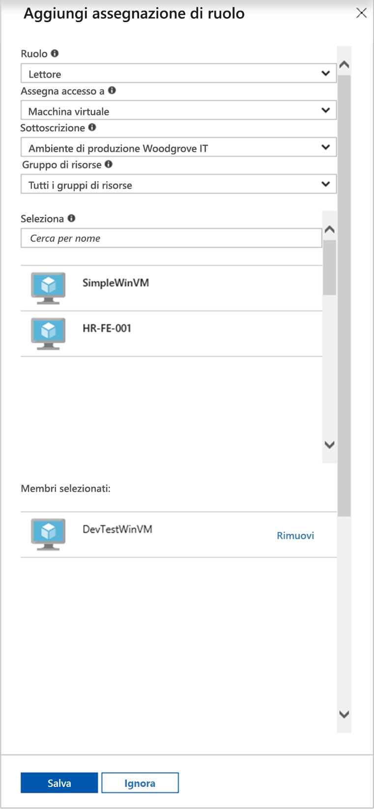

# <a name="use-a-windows-vm-system-assigned-managed-identity-to-access-resource-manager"></a>Usare un'identità gestita assegnata dal sistema per una macchina virtuale Windows per accedere a Resource Manager

[!INCLUDE [preview-notice](../../../includes/active-directory-msi-preview-notice.md)]

Questa guida introduttiva illustra come accedere all'API di Azure Resource Manager usando una macchina virtuale Windows con un'identità gestita assegnata dal sistema abilitata. Le identità gestite per le risorse di Azure vengono gestite automaticamente da Azure e consentono di eseguire l'autenticazione ai servizi che supportano l'autenticazione di Azure AD senza la necessità di inserire le credenziali nel codice. Si apprenderà come:

> [!div class="checklist"] 
> * Concedere alla macchina virtuale l'accesso a un gruppo di risorse in Azure Resource Manager 
> * Ottenere un token di accesso usando l'identità della macchina virtuale e usarlo per chiamare Azure Resource Manager

## <a name="prerequisites"></a>Prerequisiti

[!INCLUDE [msi-tut-prereqs](../../../includes/active-directory-msi-tut-prereqs.md)]

## <a name="grant-your-vm-access-to-a-resource-group-in-resource-manager"></a>Concedere alla macchina virtuale l'accesso a un gruppo di risorse in Gestione risorse
Usando le identità gestite per le risorse di Azure, il codice può ottenere i token di accesso per autenticarsi alle risorse che supportano l'autenticazione di Azure AD.  Azure Resource Manager supporta l'autenticazione di Azure AD.  In primo luogo, è necessario concedere all'identità gestita assegnata dal sistema della macchina virtuale l'accesso a una risorsa di Resource Manager, in questo caso al gruppo di risorse che contiene la macchina virtuale.  

1.  Passare alla scheda **Gruppo di risorse**. 
2.  Selezionare il **Gruppo di risorse** specifico creato per la **macchina virtuale Windows**. 
3.  Passare a **Controllo di accesso (IAM)** nel pannello a sinistra. 
4.  Fare quindi clic su **Aggiungi assegnazione di ruolo** per aggiungere una nuova assegnazione di ruolo per la **macchina virtuale Windows**.  Scegliere **Ruolo** come **Lettore**. 
5.  Dall'elenco a discesa successivo **Assegna accesso a** selezionare la risorsa **Macchina virtuale**. 
6.  Verificare quindi che nell'elenco a discesa **Sottoscrizione** sia elencata la sottoscrizione corretta. In **Gruppo di risorse** selezionare **Tutti i gruppi di risorse**. 
7.  Scegliere infine la macchina virtuale Windows nell'elenco a discesa **Seleziona** e fare clic su **Salva**.

    

## <a name="get-an-access-token-using-the-vms-system-assigned-managed-identity-and-use-it-to-call-azure-resource-manager"></a>Ottenere un token di accesso usando l'identità gestita assegnata dal sistema della macchina virtuale e usarlo per chiamare Azure Resource Manager 

In questa sezione è necessario usare **PowerShell**.  Se **PowerShell** non è installato, scaricarlo da [qui](https://docs.microsoft.com/powershell/azure/overview). 

1.  Nel portale passare a **Macchine virtuali**, selezionare la macchina virtuale Windows e in **Panoramica** fare clic su **Connetti**. 
2.  In **Nome utente** e **Password** immettere i valori specificati al momento della creazione della macchina virtuale Windows. 
3.  Ora che si è creata una **connessione Desktop remoto** con la macchina virtuale, aprire **PowerShell** nella sessione remota. 
4.  Usando il cmdlet Invoke-WebRequest, effettuare una richiesta all'endpoint locale dell'identità gestita per le risorse di Azure per ottenere un token di accesso per Azure Resource Manager.

    ```powershell
       $response = Invoke-WebRequest -Uri 'http://169.254.169.254/metadata/identity/oauth2/token?api-version=2018-02-01&resource=https://management.azure.com/' -Method GET -Headers @{Metadata="true"}
    ```
    
    > [!NOTE]
    > Il valore del parametro "risorsa" deve corrispondere esattamente a quello previsto da Azure AD. Quando si usa l'ID risorsa di Azure Resource Manager, è necessario includere la barra finale nell'URI.
    
    Estrarre la risposta completa, archiviata come stringa in formato JSON (JavaScript Object Notation) nell'oggetto $response. 
    
    ```powershell
    $content = $response.Content | ConvertFrom-Json
    ```
    Estrarre quindi il token di accesso dalla risposta.
    
    ```powershell
    $ArmToken = $content.access_token
    ```
    
    Chiamare infine Azure Resource Manager usando il token di accesso. In questo esempio il cmdlet Invoke-WebRequest viene usato anche per effettuare la chiamata ad Azure Resource Manager e includere il token di accesso nell'intestazione dell'autorizzazione.
    
    ```powershell
    (Invoke-WebRequest -Uri https://management.azure.com/subscriptions/<SUBSCRIPTION ID>/resourceGroups/<RESOURCE GROUP>?api-version=2016-06-01 -Method GET -ContentType "application/json" -Headers @{ Authorization ="Bearer $ArmToken"}).content
    ```
    > [!NOTE] 
    > L'URL fa distinzione tra maiuscole e minuscole. Accertarsi quindi di usare la stessa combinazione di maiuscole e minuscole usata in precedenza per il nome del gruppo di risorse, facendo attenzione alla maiuscola "G" in "resourceGroup".
        
    Il comando seguente restituisce le informazioni del gruppo di risorse:

    ```powershell
    {"id":"/subscriptions/98f51385-2edc-4b79-bed9-7718de4cb861/resourceGroups/DevTest","name":"DevTest","location":"westus","properties":{"provisioningState":"Succeeded"}}
    ```

## <a name="next-steps"></a>Passaggi successivi

In questa esercitazione si è appreso come usare un'identità gestita assegnata dal sistema per accedere all'API di Azure Resource Manager.  Per altre informazioni su Azure Resource Manager, vedere:

> [!div class="nextstepaction"]
>[Azure Resource Manager](/azure/azure-resource-manager/resource-group-overview)

