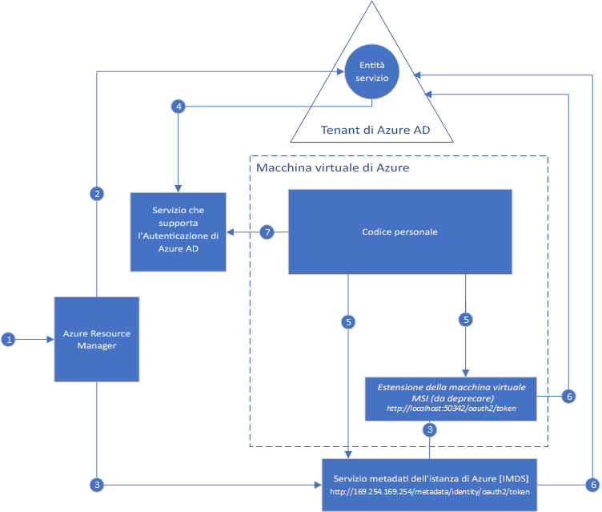

#  Informazioni sull'identità del servizio gestita per le risorse di Azure.

[!INCLUDE[preview-notice](../../../includes/active-directory-msi-preview-notice.md)]

Una difficoltà comune durante la creazione di applicazioni cloud è rappresentata dalla gestione delle credenziali che devono essere presenti nel codice per l'autenticazione ai servizi cloud. Proteggere le credenziali è un'attività importante. In teoria, non sono mai presenti nelle workstation di sviluppo oppure vengono verificate nel controllo del codice sorgente. Azure Key Vault consente di archiviare in modo sicuro le credenziali e altre chiavi e segreti, ma è necessario autenticare il codice in Key Vault per recuperarle. Identità del servizio gestito consente di risolvere il problema in maniera più semplice, assegnando ai servizi di Azure un'identità gestita automaticamente in Azure Active Directory, ovvero Azure AD. È possibile usare questa identità per l'autenticazione a qualsiasi servizio che supporti l'autenticazione di Azure AD, incluso Key Vault, senza inserire le credenziali nel codice.

La funzionalità identità del servizio gestita è inclusa gratuitamente in Azure Active Directory, ovvero il servizio predefinito per le sottoscrizioni di Azure. Non ci sono costi aggiuntivi per l'Identità del servizio gestito.

## Come funziona?

Ci sono due tipi di identità del servizio gestita: **assegnata dal sistema** e **assegnata dall'utente**.

- Un'**identità assegnata dal sistema** è abilitata direttamente in un'istanza del servizio di Azure. In caso di abilitazione, Azure crea un'identità per l'istanza del servizio nel tenant di Azure AD considerato attendibile dalla sottoscrizione dell'istanza del servizio. Una volta creata l'identità, ne viene effettuato il provisioning delle credenziali nell'istanza del servizio. Il ciclo di vita di un'identità assegnata dal sistema è direttamente associato all'istanza del servizio di Azure in cui l'identità è abilitata. Se l'istanza del servizio viene eliminata, Azure pulisce automaticamente le credenziali e l'identità in Azure AD.
- Un'**identità assegnata dall'utente** viene creata come risorsa di Azure autonoma. Tramite un processo di creazione, Azure crea un'identità nel tenant di Azure AD considerato attendibile dalla sottoscrizione in uso. Dopo la creazione, l'identità può essere assegnata a una o più istanze del servizio di Azure. Il ciclo di vita di un'identità assegnata dall'utente viene gestito separatamente dal ciclo di vita delle istanze del servizio di Azure a cui l'identità è assegnata.

Di conseguenza, il codice può usare un'identità assegnata dal sistema o dall'utente per richiedere i token di accesso per i servizi che supportano l'autenticazione di Azure AD. Azure si occupa della gestione delle credenziali usate dall'istanza del servizio.

Ecco un esempio del funzionamento delle identità assegnate dal sistema con Macchine virtuali di Azure:

1. Azure Resource Manager riceve una richiesta per abilitare l'identità assegnata dal sistema in una macchina virtuale.
2. Azure Resource Manager crea un'entità servizio in Azure AD per rappresentare l'identità della macchina virtuale. L'entità servizio viene creata nel tenant di Azure AD considerata attendibile da questa sottoscrizione.
3. Azure Resource Manager configura l'identità nella macchina virtuale:
    - Aggiorna l'endpoint dell'identità del servizio metadati dell'istanza di Azure con l'ID client e il certificato dell'entità servizio.
    - Effettua il provisioning dell'estensione della macchina virtuale dell'identità del servizio gestita e aggiunge l'ID client e il certificato dell'entità servizio. Questo elemento sarà deprecato.
4. Ora che la macchina virtuale ha un'identità, è possibile usare le informazioni della relativa entità servizio per concedere alla macchina virtuale l'accesso alle risorse di Azure. Ad esempio, se il codice deve chiamare Azure Resource Manager, è necessario assegnare all'entità servizio della macchina virtuale il ruolo appropriato usando il controllo degli accessi in base ai ruoli in Azure AD. Se il codice deve chiamare Key Vault, è necessario concedere al codice l'accesso alla chiave o al segreto specifico in Key Vault.
5. Il codice in esecuzione nella macchina virtuale può richiedere un token da due endpoint accessibili solo dalla macchina virtuale:

    - Endpoint dell'identità del servizio metadati dell'istanza di Azure: http://169.254.169.254/metadata/identity/oauth2/token (consigliato)
        - Il parametro della risorsa specifica il servizio a cui viene inviato il token. Ad esempio, se si desidera che il codice venga autenticato in Azure Resource Manager, si userà resource=https://management.azure.com/.
        - Il parametro della versione API specifica la versione del servizio metadati dell'istanza. Usare api-version=2018-02-01 o una versione successiva.
    - Endpoint dell'estensione della macchina virtuale per l'identità del servizio gestita: http://localhost:50342/oauth2/token (questo elemento sarà deprecato)
        - Il parametro della risorsa specifica il servizio a cui viene inviato il token. Ad esempio, se si desidera che il codice venga autenticato in Azure Resource Manager, si userà resource=https://management.azure.com/.

6. Viene effettuata una chiamata ad Azure AD per richiedere un token di accesso come specificato nel passaggio 5, usando l'ID client e il certificato di cui è stata eseguita la configurazione nel passaggio 3. Azure AD restituisce un token di accesso JSON Web.
7. Il codice invia il token di accesso in una chiamata a un servizio che supporta l'autenticazione di Azure AD.

Usando lo stesso diagramma, ecco un esempio del funzionamento di un'identità del servizio gestito assegnata dall'utente con Macchine virtuali di Azure.

1. Azure Resource Manager riceve una richiesta per creare un'identità assegnata dall'utente.
2. Azure Resource Manager crea un'entità servizio in Azure AD per rappresentare l'identità assegnata dall'utente. L'entità servizio viene creata nel tenant di Azure AD considerata attendibile da questa sottoscrizione.
3. Azure Resource Manager riceve una richiesta per configurare l'identità assegnata dall'utente in una macchina virtuale:
    - Aggiorna l'endpoint dell'identità del servizio metadati dell'istanza di Azure con l'ID client e il certificato dell'entità servizio dell'identità assegnata dall'utente.
    - Effettua il provisioning dell'estensione della macchina virtuale dell'identità del servizio gestita e aggiunge l'ID client e il certificato dell'entità servizio dell'identità assegnata dall'utente (questo elemento sarà deprecato).
4. Ora che l'identità assegnata dall'utente è stata creata, è possibile usare le informazioni della relativa entità servizio per concedere l'accesso alle risorse di Azure. Se, ad esempio, il codice deve chiamare Azure Resource Manager, è necessario assegnare all'entità servizio dell'identità assegnata dall'utente il ruolo appropriato usando il controllo degli accessi in base al ruolo in Azure AD. Se il codice deve chiamare Key Vault, è necessario concedere al codice l'accesso alla chiave o al segreto specifico in Key Vault. Nota: questo passaggio può essere eseguito anche prima del passaggio 3.
5. Il codice in esecuzione nella macchina virtuale può richiedere un token da due endpoint accessibili solo dalla macchina virtuale:

    - Endpoint dell'identità del servizio metadati dell'istanza di Azure: http://169.254.169.254/metadata/identity/oauth2/token (consigliato)
        - Il parametro della risorsa specifica il servizio a cui viene inviato il token. Ad esempio, se si desidera che il codice venga autenticato in Azure Resource Manager, si userà resource=https://management.azure.com/.
        - Il parametro dell'ID client specifica l'identità per cui viene richiesto il token. Tale parametro è necessario per evitare ambiguità quando in una singola macchina virtuale ci sono più identità assegnate dall'utente.
        - Il parametro della versione API specifica la versione del servizio metadati dell'istanza. Usare api-version=2018-02-01 o una versione successiva.

    - Endpoint dell'estensione della macchina virtuale per l'identità del servizio gestita: http://localhost:50342/oauth2/token (questo elemento sarà deprecato)
        - Il parametro della risorsa specifica il servizio a cui viene inviato il token. Ad esempio, se si desidera che il codice venga autenticato in Azure Resource Manager, si userà resource=https://management.azure.com/.
        - Il parametro dell'ID client specifica l'identità per cui viene richiesto il token. Tale parametro è necessario per evitare ambiguità quando in una singola macchina virtuale ci sono più identità assegnate dall'utente.
6. Viene effettuata una chiamata ad Azure AD per richiedere un token di accesso come specificato nel passaggio 5, usando l'ID client e il certificato di cui è stata eseguita la configurazione nel passaggio 3. Azure AD restituisce un token di accesso JSON Web.
7. Il codice invia il token di accesso in una chiamata a un servizio che supporta l'autenticazione di Azure AD.
     
## Provare l'Identità del servizio gestito

Eseguire un'esercitazione relativa a Identità del servizio gestito per informazioni sugli scenari end-to-end per l'accesso alle diverse risorse di Azure:
  
| Da risorse basate su Identità del servizio gestito | Scopri come |
| ------- | -------- |
| Macchina virtuale Azure (Windows) | [Usare un'identità del servizio gestito per una macchina virtuale Windows per accedere ad Azure Data Lake Store](tutorial-windows-vm-access-datalake.md) |
|                    | [Usare un'Identità del servizio gestito per una macchina virtuale Windows per accedere ad Azure Resource Manager](tutorial-windows-vm-access-arm.md) |
|                    | [Accedere ad Azure SQL con un'identità del servizio gestito di una macchina virtuale Windows](tutorial-windows-vm-access-sql.md) |
|                    | [Accedere ad Archiviazione di Azure tramite chiave di accesso con un'identità del servizio gestito di una macchina virtuale Windows](tutorial-windows-vm-access-storage.md) |
|                    | [Accedere ad Archiviazione di Azure tramite firma di accesso condiviso con un'identità del servizio gestito di una macchina virtuale Windows](tutorial-windows-vm-access-storage-sas.md) |
|                    | [Usare un'Identità del servizio gestito per una macchina virtuale Windows e Azure Key Vault per accedere a una risorsa diversa da Azure AD](tutorial-windows-vm-access-nonaad.md) |
| Macchina virtuale Azure (Linux)   | [Usare un'identità del servizio gestito per una macchina virtuale Linux per accedere ad Azure Data Lake Store](tutorial-linux-vm-access-datalake.md) |
|                    | [Usare un'Identità del servizio gestito per una macchina virtuale Linux per accedere ad Azure Resource Manager](tutorial-linux-vm-access-arm.md) |
|                    | [Accedere ad Archiviazione di Azure tramite chiave di accesso con un'identità del servizio gestito di una macchina virtuale Linux](tutorial-linux-vm-access-storage.md) |
|                    | [Accedere ad Archiviazione di Azure tramite firma di accesso condiviso con un'identità del servizio gestito di una macchina virtuale Linux](tutorial-linux-vm-access-storage-sas.md) |
|                    | [Accedere a una risorsa non Azure AD con l'identità del servizio gestito di una macchina virtuale Linux e con Azure Key Vault](tutorial-linux-vm-access-nonaad.md) |
| Servizio app di Azure  | [Usare Identità del servizio gestito con Funzioni di Azure o Servizio app di Azure](/azure/app-service/app-service-managed-service-identity) |
| Funzioni di Azure    | [Usare Identità del servizio gestito con Funzioni di Azure o Servizio app di Azure](/azure/app-service/app-service-managed-service-identity) |
| Bus di servizio di Azure  | [Usare l'identità del servizio gestito con il bus di servizio di Azure](../../service-bus-messaging/service-bus-managed-service-identity.md) |
| Hub eventi di Azure   | [Usare l'identità del servizio gestito con Hub eventi di Azure](../../event-hubs/event-hubs-managed-service-identity.md) |

## Quali servizi di Azure supportano l'Identità del servizio gestito?

Le identità gestite possono essere usate per eseguire l'autenticazione nei servizi che supportano l'autenticazione di Azure AD. Per un elenco dei servizi di Azure che supportano l'identità del servizio gestita, vedere l'articolo seguente:
- [Servizi che supportano Identità del servizio gestita](services-support-msi.md)

## Passaggi successivi

Per un'introduzione all'identità del servizio gestita di Azure, vedere le guide introduttive seguenti:

* [Usare un'identità del servizio gestita per una macchina virtuale Windows per accedere a Resource Manager - Macchina virtuale Windows](tutorial-windows-vm-access-arm.md)
* [Usare un'identità del servizio gestita per una macchina virtuale Linux per accedere ad Azure Resource Manager - Macchina virtuale Linux](tutorial-linux-vm-access-arm.md)
