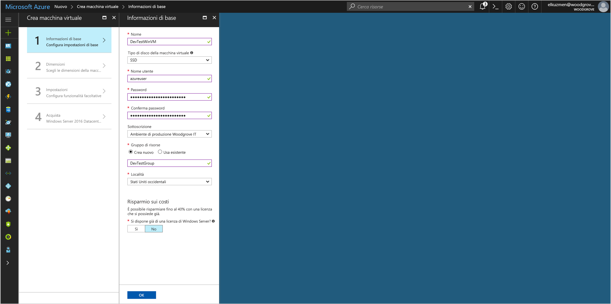
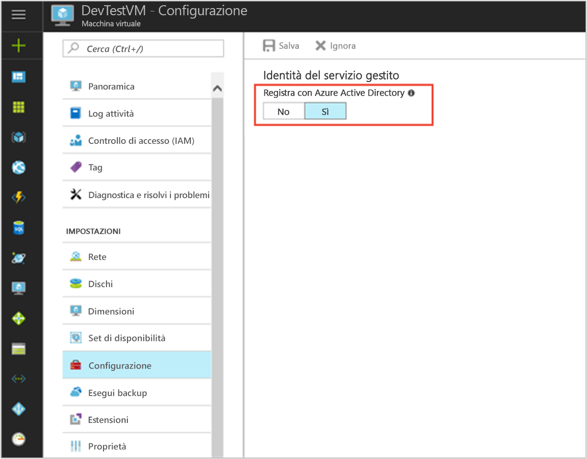

# <a name="tutorial-use-a-windows-vm-msi-to-access-azure-cosmos-db"></a>Esercitazione: Usare un'identità del servizio gestita per una macchina virtuale Windows per accedere ad Azure Cosmos DB

[!INCLUDE[preview-notice](../../../includes/active-directory-msi-preview-notice.md)]

Questa esercitazione illustra come creare e usare un'identità del servizio gestito per una macchina virtuale Windows per accedere a Cosmos DB. Si apprenderà come:

> [!div class="checklist"]
> * Creare una macchina virtuale Windows abilitata per l'identità del servizio gestito 
> * Creare un account Cosmos DB
> * Concedere all'identità del servizio gestito della macchina virtuale Windows l'accesso alle chiavi di accesso all'account Cosmos DB
> * Ottenere un token di accesso usando l'identità del servizio gestito della macchina virtuale Windows per chiamare Azure Resource Manager
> * Ottenere le chiavi di accesso da Azure Resource Manager per eseguire le chiamate a Cosmos DB

## <a name="prerequisites"></a>Prerequisiti

[!INCLUDE [msi-qs-configure-prereqs](../../../includes/active-directory-msi-qs-configure-prereqs.md)]

[!INCLUDE [msi-tut-prereqs](../../../includes/active-directory-msi-tut-prereqs.md)]


## <a name="sign-in-to-azure"></a>Accedere ad Azure

Accedere al portale di Azure all'indirizzo [https://portal.azure.com](https://portal.azure.com).

## <a name="create-a-windows-virtual-machine-in-a-new-resource-group"></a>Creare una macchina virtuale Windows in un nuovo gruppo di risorse

Per questa esercitazione si creerà una nuova macchina virtuale Windows,  ma è anche possibile abilitare l'identità del servizio gestito in una macchina virtuale esistente.

1. Fare clic sul pulsante **Crea una risorsa** visualizzato nell'angolo in alto a sinistra nel portale di Azure.
2. Selezionare **Calcolo** e quindi **Windows Server 2016 Datacenter**. 
3. Immettere le informazioni relative alla macchina virtuale. I valori di **Nome utente** e **Password** creati in questa schermata sono le credenziali usate per accedere alla macchina virtuale.
4. Dall'elenco a discesa **Sottoscrizione** selezionare la sottoscrizione corretta per la macchina virtuale.
5. Per selezionare un nuovo **Gruppo di risorse** in cui creare la macchina virtuale, scegliere **Crea nuovo**. Al termine fare clic su **OK**.
6. Selezionare la dimensione della macchina virtuale. Per visualizzare altre dimensioni, selezionare **Visualizza tutto** o modificare il filtro **Supported disk type** (Tipo di disco supportato). Nella pagina delle impostazioni mantenere le impostazioni predefinite e fare clic su **OK**.

   

## <a name="enable-msi-on-your-vm"></a>Abilitare identità del servizio gestito nella macchina virtuale 

Un'identità del servizio gestito per una macchina virtuale consente di ottenere i token di accesso da Azure AD senza dover inserire le credenziali nel codice. Dietro le quinte, l'abilitazione dell'identità del servizio gestito in una macchina virtuale tramite il portale di Azure esegue due operazioni: registra la macchina virtuale in Azure AD per creare un'identità gestita e configura l'identità nella macchina virtuale.

1. Selezionare la **macchina virtuale** in cui si vuole abilitare identità del servizio gestito.  
2. Nella barra di spostamento a sinistra fare clic su **Configurazione**. 
3. Viene visualizzato **Managed Service Identity** (identità del servizio gestito). Per registrare e abilitare identità del servizio gestita, scegliere **Sì**. Se si vuole disabilitare questa funzionalità, scegliere No. 
4. Assicurarsi di fare clic su **Salva** per salvare la configurazione.  
   

## <a name="create-a-cosmos-db-account"></a>Creare un account Cosmos DB 

Se non ne è già disponibile uno, creare un account Cosmos DB. È possibile ignorare questo passaggio e usare un account Cosmos DB esistente. 

1. Fare clic sul pulsante **+/Crea nuovo servizio** nell'angolo superiore sinistro del portale di Azure.
2. Fare clic su **Database**, quindi su **Azure Cosmos DB**. Verrà visualizzato un nuovo pannello "Nuovo account".
3. Immettere un **ID** per l'account Cosmos DB, da usare in un secondo momento.  
4. **API** deve essere impostato su "SQL". L'approccio descritto in questa esercitazione può essere usato con gli altri tipi di API disponibili, ma i passaggi illustrati si riferiscono all'API SQL.
5. Verificare che le impostazioni in **Sottoscrizione** e **Gruppo di risorse** corrispondano a quelle specificate al momento della creazione della macchina virtuale nel passaggio precedente.  Selezionare un **Percorso** in cui è disponibile Cosmos DB.
6. Fare clic su **Crea**.

## <a name="create-a-collection-in-the-cosmos-db-account"></a>Creare una raccolta nell'account Cosmos DB

Successivamente, aggiungere una raccolta di dati nell'account Cosmos DB su cui è possibile eseguire query nei passaggi successivi.

1. Passare all'account Cosmos DB appena creato.
2. Nella scheda **Panoramica** fare clic sul pulsante **+/Aggiungi raccolta**. Verrà visualizzato il pannello "Aggiungi raccolta".
3. Assegnare alla raccolta un ID database e un ID raccolta, selezionare una capacità di archiviazione, immettere una chiave di partizione, specificare un valore di velocità effettiva, quindi fare clic su **OK**.  Per questa esercitazione, è sufficiente usare "Test" come ID database e ID raccolta, selezionare una capacità di archiviazione fissa e una velocità effettiva più bassa (400 UR/sec).  

## <a name="grant-windows-vm-msi-access-to-the-cosmos-db-account-access-keys"></a>Concedere all'identità del servizio gestito della macchina virtuale Windows l'accesso alle chiavi di accesso all'account Cosmos DB

Cosmos DB non supporta l'autenticazione di Azure AD in modo nativo. È tuttavia possibile usare un'identità del servizio gestito per recuperare una chiave di accesso Cosmos DB da Resource Manager e usarla per accedere a Cosmos DB. In questo passaggio viene concesso all'identità del servizio gestito l'accesso alle chiavi per l'account Cosmos DB.

Per concedere all'identità del servizio gestito l'accesso all'account Cosmos DB in Azure Resource Manager mediante PowerShell, aggiornare i valori per `<SUBSCRIPTION ID>`, `<RESOURCE GROUP>` e `<COSMOS DB ACCOUNT NAME>` per l'ambiente in uso. Sostituire `<MSI PRINCIPALID>` con la proprietà `principalId` restituita dal comando `az resource show` in [Recuperare il principalID dell'identità del servizio gestito della macchina virtuale Linux](#retrieve-the-principalID-of-the-linux-VM's-MSI).  Cosmos DB supporta due livelli di granularità quando si usano le chiavi di accesso: accesso all'account in lettura/scrittura e in sola lettura.  Assegnare il ruolo `DocumentDB Account Contributor` se si desidera ottenere le chiavi di lettura/scrittura per l'account o assegnare il ruolo `Cosmos DB Account Reader Role` se si desidera ottenere le chiavi di sola lettura per l'account:

```azurepowershell
$spID = (Get-AzureRMVM -ResourceGroupName myRG -Name myVM).identity.principalid
New-AzureRmRoleAssignment -ObjectId $spID -RoleDefinitionName "Reader" -Scope "/subscriptions/<mySubscriptionID>/resourceGroups/<myResourceGroup>/providers/Microsoft.Storage/storageAccounts/<myStorageAcct>"
```

## <a name="get-an-access-token-using-the-windows-vms-msi-to-call-azure-resource-manager"></a>Ottenere un token di accesso usando l'identità del servizio gestito della macchina virtuale Windows per chiamare Azure Resource Manager

Il resto dell'esercitazione prevede che le operazioni vengano svolte dalla macchina virtuale creata in precedenza. 

In questa sezione è necessario usare i cmdlet PowerShell di Azure Resource Manager.  Se non è già stato installato, [scaricare la versione più recente](https://docs.microsoft.com/powershell/azure/overview) prima di continuare.

Sarà inoltre necessario installare la versione più recente dell'[interfaccia della riga di comando di Azure 2.0](https://docs.microsoft.com/cli/azure/install-azure-cli) nella macchina virtuale Windows.

1. Nel portale di Azure passare a **Macchine virtuali** selezionare la propria VM Windows, quindi nella pagina **Panoramica** fare clic su **Connetti** nella parte superiore. 
2. In **Nome utente** e **Password** immettere i valori specificati al momento della creazione della macchina virtuale Windows. 
3. Ora che si è creata una **connessione Desktop remoto** con la macchina virtuale, aprire PowerShell nella sessione remota.
4. Usando Invoke-WebRequest di PowerShell, eseguire una richiesta all'endpoint locale di Identità del servizio gestito per ottenere un token di accesso per Azure Resource Manager.

    ```powershell
        $response = Invoke-WebRequest -Uri 'http://169.254.169.254/metadata/identity/oauth2/token?api-version=2018-02-01&resource=https%3A%2F%2Fmanagement.azure.com%2F' -Method GET -Headers @{Metadata="true"}
    ```

    > [!NOTE]
    > Il valore del parametro "risorsa" deve corrispondere esattamente a quello previsto da Azure AD. Quando si usa l'ID risorsa di Azure Resource Manager, è necessario includere la barra finale nell'URI.
    
    Estrarre quindi l'elemento "Content", archiviato come stringa in formato JSON (JavaScript Object Notation) nell'oggetto $response. 
    
    ```powershell
    $content = $response.Content | ConvertFrom-Json
    ```
    Estrarre poi il token di accesso dalla risposta.
    
    ```powershell
    $ArmToken = $content.access_token
    ```

## <a name="get-access-keys-from-azure-resource-manager-to-make-cosmos-db-calls"></a>Ottenere le chiavi di accesso da Azure Resource Manager per eseguire le chiamate a Cosmos DB

Di seguito viene usato PowerShell per chiamare Resource Manager usando il token di accesso recuperato nella sezione precedente per recuperare la chiave di accesso dell'account Cosmos DB. Dopo avere ottenuto la chiave di accesso, è possibile eseguire una query su Cosmos DB. Sostituire i valori dei parametri `<SUBSCRIPTION ID>`, `<RESOURCE GROUP>` e `<COSMOS DB ACCOUNT NAME>` con i valori desiderati. Sostituire il valore `<ACCESS TOKEN>` con il token di accesso recuperato in precedenza.  Se si desidera recuperare le chiavi di lettura/scrittura, usare il tipo di operazione della chiave `listKeys`.  Se si desidera recuperare le chiavi di sola lettura, usare il tipo di operazione della chiave `readonlykeys`:

```powershell
Invoke-WebRequest -Uri https://management.azure.com/subscriptions/<SUBSCRIPTION-ID>/resourceGroups/<RESOURCE-GROUP>/providers/Microsoft.DocumentDb/databaseAccounts/<COSMOS DB ACCOUNT NAME>/listKeys/?api-version=2016-12-01 -Method POST -Headers @{Authorization="Bearer $ARMToken"}
```
La risposta restituisce l'elenco di chiavi.  Ad esempio, se si ottengono chiavi di sola lettura:

```powershell
{"primaryReadonlyMasterKey":"bWpDxS...dzQ==",
"secondaryReadonlyMasterKey":"38v5ns...7bA=="}
```
Ora che si è in possesso della chiave di accesso per l'account Cosmos DB, è possibile trasferirla a un SDK Cosmos DB ed eseguire chiamate per accedere all'account.  Per un esempio rapido, è possibile passare la chiave di accesso all'interfaccia della riga di comando di Azure.  È possibile ottenere il valore <COSMOS DB CONNECTION URL> dalla scheda **Panoramica** nel pannello dell'account Cosmos DB nel portale di Azure.  Sostituire <ACCESS KEY> con il valore ottenuto in precedenza:

```bash
az cosmosdb collection show -c <COLLECTION ID> -d <DATABASE ID> --url-connection "<COSMOS DB CONNECTION URL>" --key <ACCESS KEY>
```

Questo comando dell'interfaccia della riga di comando restituisce i dettagli sulla raccolta:

```bash
{
  "collection": {
    "_conflicts": "conflicts/",
    "_docs": "docs/",
    "_etag": "\"00006700-0000-0000-0000-5a8271e90000\"",
    "_rid": "Es5SAM2FDwA=",
    "_self": "dbs/Es5SAA==/colls/Es5SAM2FDwA=/",
    "_sprocs": "sprocs/",
    "_triggers": "triggers/",
    "_ts": 1518498281,
    "_udfs": "udfs/",
    "id": "Test",
    "indexingPolicy": {
      "automatic": true,
      "excludedPaths": [],
      "includedPaths": [
        {
          "indexes": [
            {
              "dataType": "Number",
              "kind": "Range",
              "precision": -1
            },
            {
              "dataType": "String",
              "kind": "Range",
              "precision": -1
            },
            {
              "dataType": "Point",
              "kind": "Spatial"
            }
          ],
          "path": "/*"
        }
      ],
      "indexingMode": "consistent"
    }
  },
  "offer": {
    "_etag": "\"00006800-0000-0000-0000-5a8271ea0000\"",
    "_rid": "f4V+",
    "_self": "offers/f4V+/",
    "_ts": 1518498282,
    "content": {
      "offerIsRUPerMinuteThroughputEnabled": false,
      "offerThroughput": 400
    },
    "id": "f4V+",
    "offerResourceId": "Es5SAM2FDwA=",
    "offerType": "Invalid",
    "offerVersion": "V2",
    "resource": "dbs/Es5SAA==/colls/Es5SAM2FDwA=/"
  }
}
```

## <a name="next-steps"></a>Passaggi successivi

Questa esercitazione ha illustrato come usare l'identità del servizio gestita di Windows per accedere a Cosmos DB.  Per altre informazioni su Cosmos DB, consultare:

> [!div class="nextstepaction"]
>[Panoramica di Azure Cosmos DB](/azure/cosmos-db/introduction)


