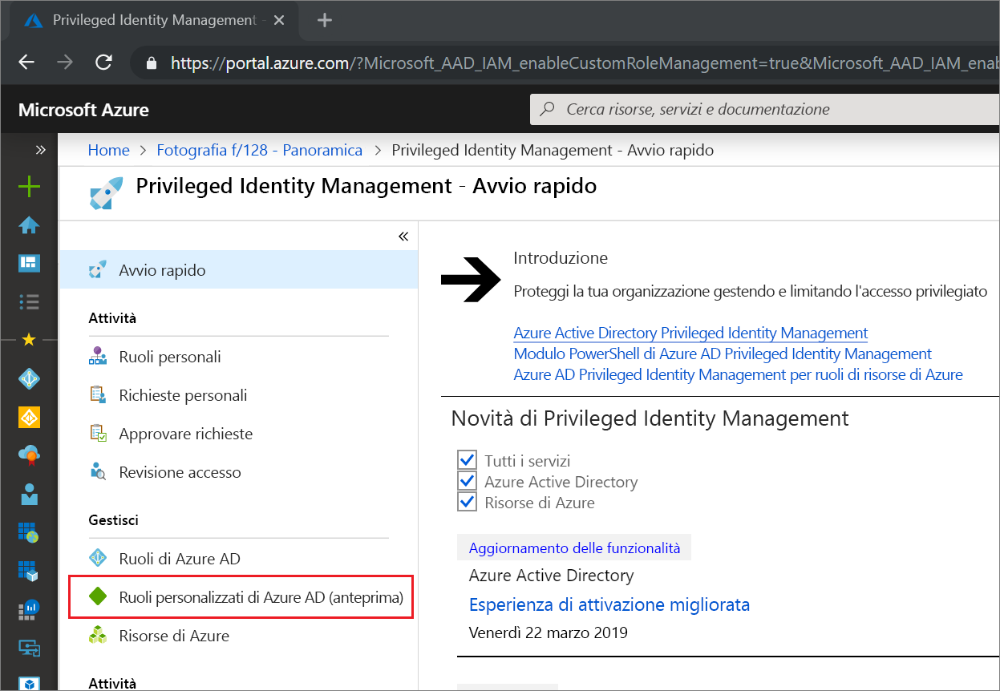
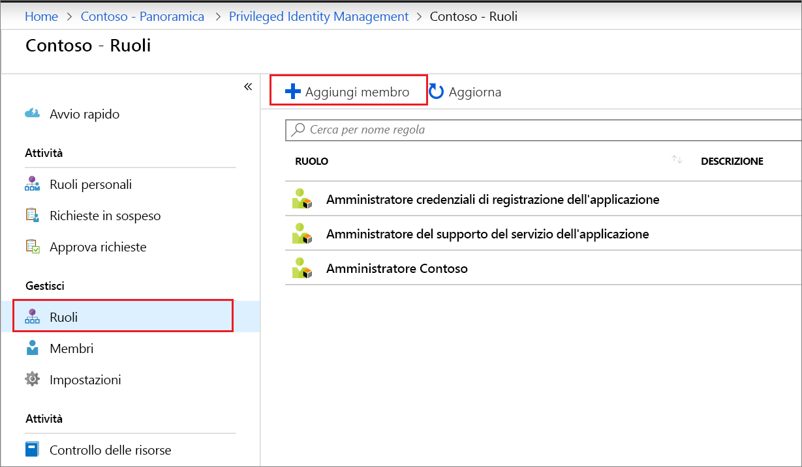
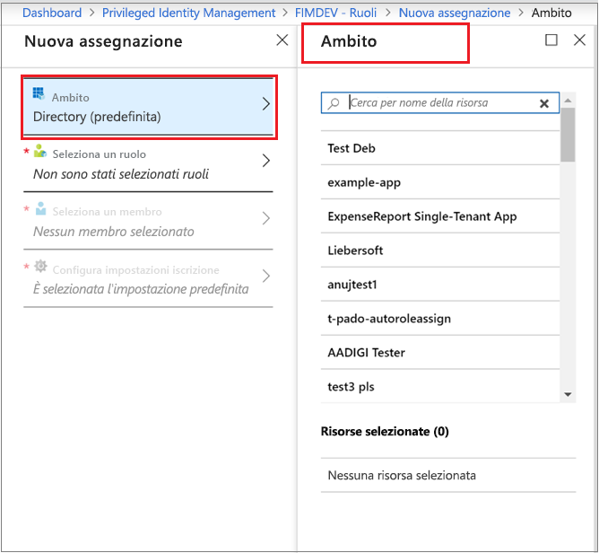
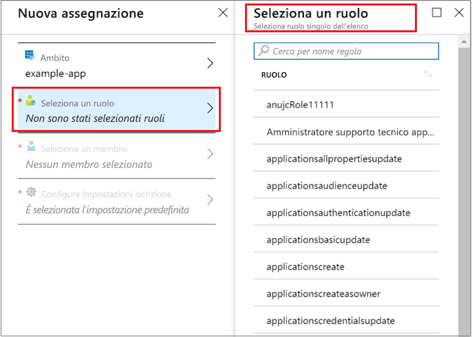
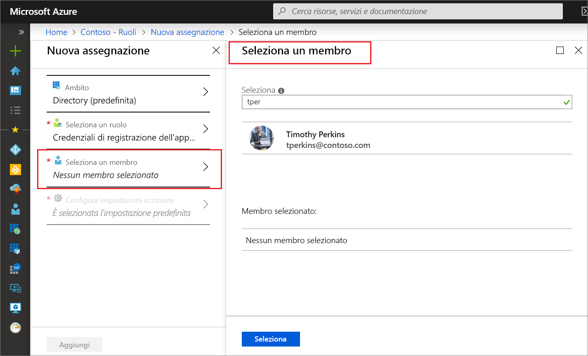
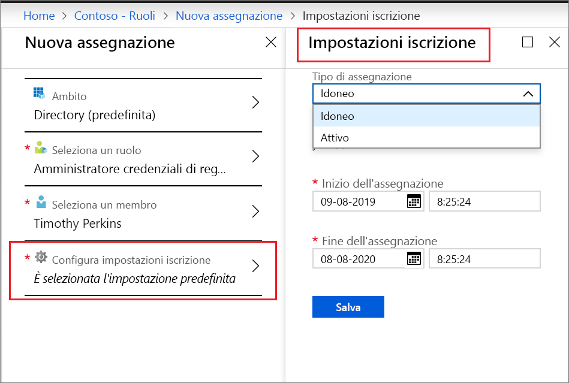

# Assegnare un ruolo personalizzato di Azure AD in Privileged Identity Management

Questo articolo illustra come usare Privileged Identity Management (PIM) per creare l'assegnazione JIT e con vincoli di tempo ai ruoli personalizzati creati per gestire le applicazioni nell'esperienza di amministrazione di Azure Active Directory (Azure AD).

- Per altre informazioni su come creare ruoli personalizzati per delegare la gestione delle applicazioni in Azure AD, vedere [Ruoli di amministratore personalizzati in Azure Active Directory (anteprima)](../users-groups-roles/roles-custom-overview.md).
- Se si usa Privileged Identity Management per la prima volta, vedere [Iniziare a usare PIM](pim-getting-started.md) per altre informazioni.
- Per informazioni su come concedere a un altro amministratore l'accesso per la gestione di Privileged Identity Management, vedere [Concedere l'accesso ad altri amministratori per gestire PIM](pim-how-to-give-access-to-pim.md).

> [!NOTE]
> I ruoli personalizzati di Azure AD non sono integrati nei ruoli della directory predefiniti durante la fase di anteprima. Non appena la funzionalità sarà disponibile a livello generale, la gestione dei ruoli verrà eseguita nell'esperienza dei ruoli predefiniti.

## Assegnare un ruolo

Privileged Identity Management può gestire i ruoli personalizzati creati in Gestione applicazioni di Azure Active Directory (Azure AD).  La procedura seguente consente di creare un'assegnazione idonea a un ruolo della directory personalizzato.

1. Accedere a [Privileged Identity Management](https://portal.azure.com/?Microsoft_AAD_IAM_enableCustomRoleManagement=true&Microsoft_AAD_IAM_enableCustomRoleAssignment=true&feature.rbacv2roles=true&feature.rbacv2=true&Microsoft_AAD_RegisteredApps=demo#blade/Microsoft_Azure_PIMCommon/CommonMenuBlade/quickStart) nel portale di Azure usando un account utente assegnato al ruolo di amministratore ruolo con privilegi.
1. Selezionare **Ruoli personalizzati di Azure AD (anteprima)** .

    

1. Selezionare **Ruoli** per visualizzare un elenco di ruoli personalizzati per le applicazioni Azure AD.

    

1. Selezionare **Aggiungi membro** per aprire la pagina di assegnazione.
1. Per limitare l'ambito dell'assegnazione di ruolo a un'applicazione singola, selezionare **Ambito** per specificare un ambito dell'applicazione.

    

1. Fare clic su **Selezionare un ruolo** per aprire l'elenco **Selezionare un ruolo**.

    

1. Selezionare un ruolo da assegnare e quindi fare clic su **Seleziona**. Verrà visualizzato l'elenco **Selezionare un membro**.

    

1. Selezionare l'utente da assegnare al ruolo e quindi fare clic su **Seleziona**. Verrà visualizzato l'elenco **Impostazioni di appartenenza**.

    

1. Nella pagina **Impostazioni di appartenenza** selezionare **Idoneo** o **Attivo**:

    - Le assegnazioni di tipo **Idoneo** richiedono all'utente assegnato al ruolo di eseguire un'azione prima di poter usare il ruolo. Le azioni possono includere il superamento di un controllo di autenticazione a più fattori, l'indicazione di una motivazione aziendale o la richiesta di approvazione da parte di responsabili approvazione designati.
    - Le assegnazioni di tipo **Attivo** non richiedono all'utente assegnato di eseguire alcuna azione per poter usare il ruolo. Per gli utenti attivi i privilegi sono sempre assegnati al ruolo.

1. Se la casella di controllo **Permanente** è presente e disponibile, a seconda delle impostazioni del ruolo, è possibile specificare se l'assegnazione è permanente. Selezionare la casella di controllo per rendere l'assegnazione con idoneità permanente o con assegnazione permanente. Deselezionare la casella di controllo per specificare una durata per l'assegnazione.
1. Per creare la nuova assegnazione di ruolo, fare clic su **Salva** e quindi su **Aggiungi**. Verrà visualizzata una notifica di stato per il processo di assegnazione.

Per verificare l'assegnazione di ruolo, in un ruolo aperto selezionare **Assegnazioni** > **Assegna** e verificare che l'assegnazione di ruolo sia identificata correttamente come idonea o attiva.

 

## Passaggi successivi

- [Attivare un ruolo personalizzato di Azure AD](azure-ad-custom-roles-assign.md)
- [Rimuovere o aggiornare un'assegnazione di ruolo personalizzato di Azure AD](azure-ad-custom-roles-update-remove.md)
- [Configurare un'assegnazione di ruolo personalizzato di Azure AD](azure-ad-custom-roles-configure.md)
- [Definizioni dei ruoli in Azure AD](../users-groups-roles/directory-assign-admin-roles.md)
