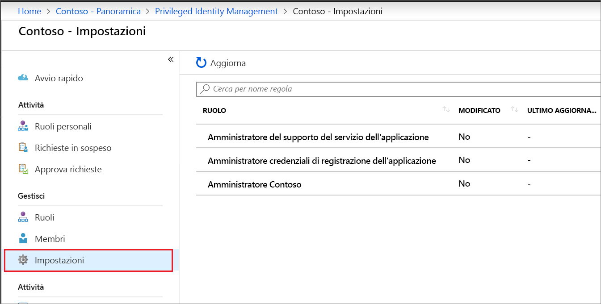
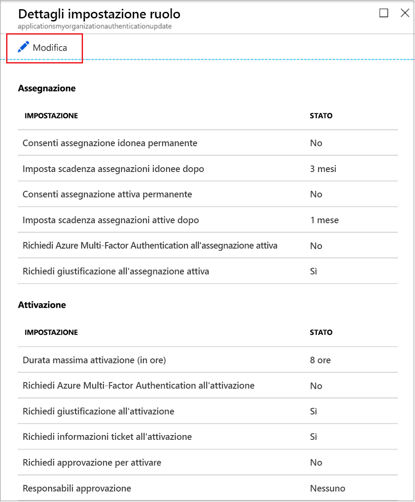
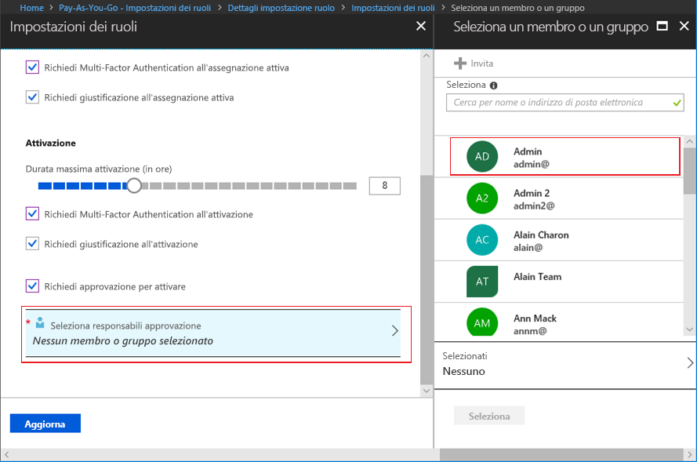

# Configurare ruoli personalizzati di Azure AD in Privileged Identity Management

Un amministratore del ruolo con privilegi può modificare le impostazioni del ruolo che si applicano a un utente quando viene attivata l'assegnazione a un ruolo personalizzato e per altri amministratori di applicazioni che assegnano ruoli personalizzati.

## Aprire le impostazioni del ruolo

Per aprire le impostazioni per un ruolo di Azure AD seguire questa procedura.

1. Accedere a [Privileged Identity Management](https://portal.azure.com/?Microsoft_AAD_IAM_enableCustomRoleManagement=true&Microsoft_AAD_IAM_enableCustomRoleAssignment=true&feature.rbacv2roles=true&feature.rbacv2=true&Microsoft_AAD_RegisteredApps=demo#blade/Microsoft_Azure_PIMCommon/CommonMenuBlade/quickStart) nel portale di Azure usando un account utente assegnato al ruolo di amministratore ruolo con privilegi.
1. Selezionare **Ruoli personalizzati di Azure AD (anteprima)** .

    

1. Selezionare **Impostazione** per aprire la pagina **Impostazioni**. Selezionare il ruolo per le impostazioni da configurare.
1. Selezionare **Modifica** per aprire la pagina **Impostazioni dei ruoli**.

    

## Impostazioni dei ruoli

Sono disponibili numerose impostazioni che è possibile configurare.

### Durata dell'assegnazione

Quando si configurano le impostazioni per un ruolo è possibile scegliere tra due opzioni di durata dell'assegnazione per ogni tipo di assegnazione (idoneo o attivo). Queste opzioni diventano la durata massima predefinita quando un membro viene assegnato al ruolo in Privileged Identity Management.

È possibile scegliere una delle opzioni seguenti per la durata dell'assegnazione *idonea*.

- **Consenti le assegnazioni idonee permanenti**: Gli amministratori possono assegnare l'appartenenza idonea permanente.
- **Scadenza delle assegnazioni idonee dopo**: Gli amministratori possono richiedere che per tutte le assegnazioni idonee venga specificata una data di inizio e fine.

Ed è anche possibile scegliere una delle opzioni di durata dell'assegnazione *attiva*:

- **Consenti l'assegnazione permanente attiva**: Gli amministratori possono assegnare l'appartenenza attiva permanente.
- **Scadenza delle assegnazioni attive dopo**: Gli amministratori possono richiedere che per tutte le assegnazioni attive venga specificata una data di inizio e fine.

### Richiedere Azure Multi-Factor Authentication

Privileged Identity Management offre inoltre l'imposizione facoltativa di Azure Multi-Factor Authentication (MFA) per due scenari distinti.

- **Richiedi Multi-Factor Authentication in caso di assegnazione attiva**

  Se si vuole solo assegnare un membro a un ruolo per un breve periodo, ad esempio un giorno, la procedura per richiedere l'attivazione dei membri assegnati potrebbe risultare troppo lunga. In questo scenario Privileged Identity Management non può imporre l'autenticazione a più fattori quando l'utente attiva l'assegnazione di ruolo, perché è già attivo nel ruolo dal momento dell'assegnazione. Per assicurarsi che l'amministratore che gestisce l'assegnazione sia effettivamente chi dichiara di essere, selezionare la casella **Richiedi Multi-Factor Authentication in caso di assegnazione attiva**.

- **Richiedi il servizio Multi-Factor Authentication all'attivazione**

  È possibile richiedere agli utenti idonei assegnati a un ruolo di eseguire la registrazione ad Azure Multi-Factor Authentication prima dell'assegnazione. Questo processo assicura che l'utente che richiede l'attivazione sia effettivamente chi dichiara di essere con ragionevole certezza. L'imposizione di questa opzione consente di proteggere ruoli critici in situazioni di potenziale compromissione dell'account utente. Per richiedere a un membro idoneo di eseguire Azure Multi-Factor Authentication prima dell'attivazione, selezionare la casella **Richiedi il servizio Multi-Factor Authentication all'attivazione**.

Per altre informazioni, vedere [Autenticazione a più fattori e Privileged Identity Management](pim-how-to-require-mfa.md).

### Durata massima dell'attivazione

Usare il dispositivo di scorrimento **Durata massima dell'attivazione** per impostare il tempo massimo, espresso in ore, in cui un ruolo rimane attivo prima della scadenza. Questo valore può essere compreso tra 1 e 24 ore.

### Immettere la giustificazione

È possibile richiedere che i membri immettano una giustificazione in caso di assegnazione attiva o all'attivazione. Per richiedere l'immissione di una giustificazione, selezionare la casella di controllo **Richiedi la giustificazione in caso di assegnazione attiva** o la casella **Richiedi la giustificazione all'attivazione**.

### Richiedere l'approvazione per l'attivazione

Se si vuole richiedere l'approvazione per attivare un ruolo, seguire questa procedura.

1. Selezionare la casella di controllo **Richiedi l'approvazione per l'attivazione**.
1. Fare clic su **Seleziona responsabili approvazione** per aprire l'elenco **Selezionare un membro o un gruppo**.

    

1. Selezionare almeno un membro o un gruppo e quindi fare clic su **Seleziona**. È necessario selezionare almeno un responsabile approvazione. Non esistono responsabili approvazione predefiniti. I responsabili dell'approvazione selezionati vengono visualizzati in un apposito elenco.
1. Dopo aver specificato le impostazioni dei ruoli, selezionare **Aggiorna** per salvare le modifiche.

## Passaggi successivi

- [Attivare un ruolo personalizzato di Azure AD](azure-ad-custom-roles-assign.md)
- [Assegnare un ruolo personalizzato di Azure AD](azure-ad-custom-roles-assign.md)
- [Rimuovere o aggiornare un'assegnazione di ruolo personalizzato di Azure AD](azure-ad-custom-roles-update-remove.md)
- [Definizioni dei ruoli in Azure AD](../users-groups-roles/directory-assign-admin-roles.md)
