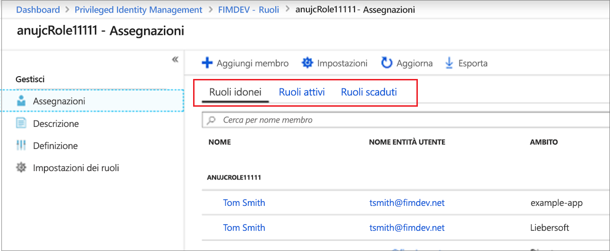
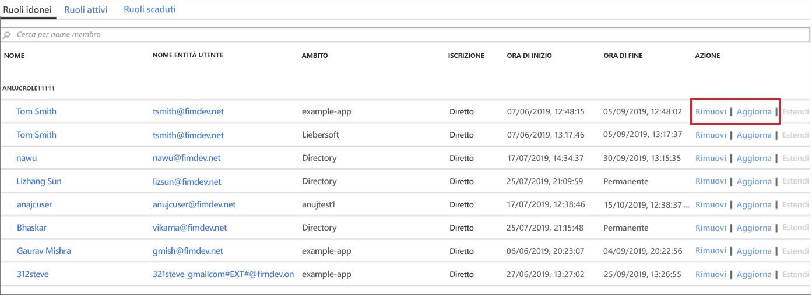

# Aggiornare o rimuovere un ruolo personalizzato di Azure AD assegnato in Privileged Identity Management

Questo articolo illustra come usare Privileged Identity Management (PIM) per aggiornare o rimuovere l'assegnazione JIT e con vincoli di tempo ai ruoli personalizzati creati per gestire le applicazioni nell'esperienza di amministrazione di Azure Active Directory (Azure AD). 

- Per altre informazioni su come creare ruoli personalizzati per delegare la gestione delle applicazioni in Azure AD, vedere [Ruoli di amministratore personalizzati in Azure Active Directory (anteprima)](../users-groups-roles/roles-custom-overview.md). 
- Se si usa Privileged Identity Management per la prima volta, vedere [Iniziare a usare Privileged Identity Management](pim-getting-started.md) per altre informazioni.

> [!NOTE]
> I ruoli personalizzati di Azure AD non sono integrati nei ruoli della directory predefiniti durante la fase di anteprima. Non appena la funzionalità sarà disponibile a livello generale, la gestione dei ruoli verrà eseguita nell'esperienza dei ruoli predefiniti.

## Aggiornare o rimuovere un'assegnazione

Seguire questi passaggi per aggiornare o rimuovere un'assegnazione di ruolo personalizzato esistente.

1. Accedere a [Privileged Identity Management](https://portal.azure.com/?Microsoft_AAD_IAM_enableCustomRoleManagement=true&Microsoft_AAD_IAM_enableCustomRoleAssignment=true&feature.rbacv2roles=true&feature.rbacv2=true&Microsoft_AAD_RegisteredApps=demo#blade/Microsoft_Azure_PIMCommon/CommonMenuBlade/quickStart) nel portale di Azure usando un account utente assegnato al ruolo di amministratore ruolo con privilegi.
1. Selezionare **Ruoli personalizzati di Azure AD (anteprima)** .

    

1. Selezionare **Ruoli** per visualizzare l'elenco delle **Assegnazioni** di ruoli personalizzati per le applicazioni Azure AD.

    

1. Selezionare il ruolo da aggiornare o rimuovere.
1. Trovare l'assegnazione del ruolo nelle schede **Ruoli idonei** o **Ruoli attivi**.
1. Fare clic su **Aggiorna** o su **Rimuovi** per aggiornare o rimuovere l'assegnazione di ruolo.

    

## Passaggi successivi

- [Attivare un ruolo personalizzato di Azure AD](azure-ad-custom-roles-assign.md)
- [Assegnare un ruolo personalizzato di Azure AD](azure-ad-custom-roles-assign.md)
- [Configurare un'assegnazione di ruolo personalizzato di Azure AD](azure-ad-custom-roles-configure.md)
