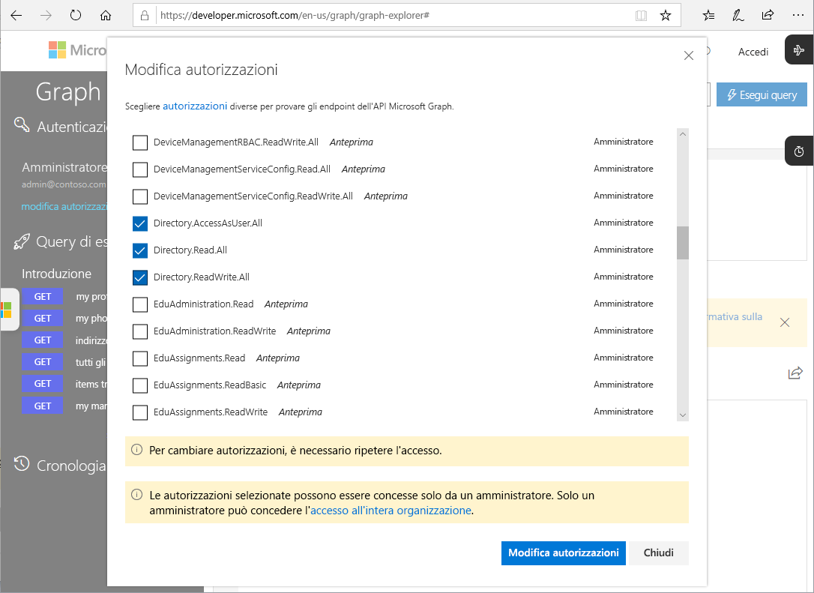

# API Microsoft Graph per Privileged Identity Management (anteprima)

È possibile eseguire tutte le attività di Privileged Identity Management con le [API Microsoft Graph](https://developer.microsoft.com/graph/docs/concepts/overview) per Azure Active Directory. Questo articolo descrive alcuni concetti importanti per l'uso delle API Microsoft Graph per Privileged Identity Management.

Per informazioni dettagliate sulle API Microsoft Graph, esaminare le [informazioni di riferimento sulle API di Azure Active Directory Privileged Identity Management](https://developer.microsoft.com/graph/docs/api-reference/beta/resources/privilegedidentitymanagement_root).

> [!IMPORTANT]
> Le API nella versione beta in Microsoft Graph sono disponibili in anteprima e sono soggetti a modifiche. L'uso di queste API nelle applicazioni di produzione non è supportato.

## Autorizzazioni necessarie

Per chiamare le API Microsoft Graph per Privileged Identity Management, è necessario avere **una o più** delle autorizzazioni seguenti:

- `Directory.AccessAsUser.All`
- `Directory.Read.All`
- `Directory.ReadWrite.All`
- `PrivilegedAccess.ReadWrite.AzureAD`

### Impostare le autorizzazioni

Per poter chiamare le API Microsoft Graph per Privileged Identity Management, le applicazioni devono disporre delle autorizzazioni necessarie. Il modo più semplice per specificare le autorizzazioni richieste consiste nell'usare il [framework di consenso di Azure AD](../develop/consent-framework.md).

### Impostare le autorizzazioni in Graph Explorer

Se si usa Graph Explorer per testare le chiamate, è possibile specificare le autorizzazioni nello strumento.

1. Accedere a [Graph Explorer](https://developer.microsoft.com/graph/graph-explorer) come amministratore globale.

1. Fare clic su **Autorizzazioni di modifica**.

    

1. Selezionare le caselle di controllo accanto alle autorizzazioni che si vogliono includere. `PrivilegedAccess.ReadWrite.AzureAD` non è ancora disponibile in Graph Explorer.

    

1. Fare clic su **Autorizzazioni di modifica** per applicare le modifiche alle autorizzazioni.

## Passaggi successivi

- [Informazioni di riferimento sulle API di Azure Active Directory Privileged Identity Management](https://developer.microsoft.com/graph/docs/api-reference/beta/resources/privilegedidentitymanagement_root)
