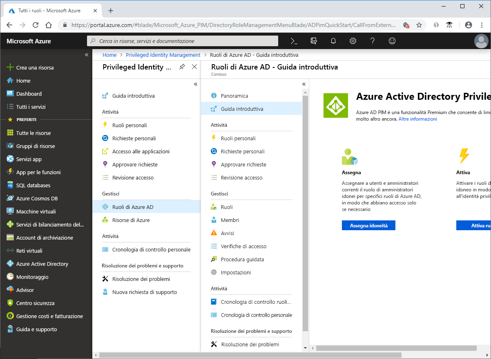

# Che cos'è Azure AD Privileged Identity Management?

Azure Active Directory Privileged Identity Management (PIM) è un servizio che permette di gestire, controllare e monitorare l'accesso a risorse importanti nell'organizzazione. incluso l'accesso alle risorse in Azure AD, alle risorse di Azure e ad altri Servizi online Microsoft, ad esempio Office 365 o Microsoft Intune.

## Perché occorre usare PIM?

Le organizzazioni vogliono ridurre al minimo il numero di utenti che hanno accesso a informazioni o risorse protette per ridurre le probabilità che un attore malintenzionato acceda al sistema, o che un utente autorizzato abbia inavvertitamente effetto su una risorsa sensibile. Tuttavia, gli utenti devono comunque eseguire operazioni con privilegi, nelle app di Azure AD, Azure, Office 365 o SaaS. Le organizzazioni possono concedere agli utenti l'accesso con privilegi JIT alle risorse di Azure e ad Azure AD. È necessario procedere con una supervisione di ciò che gli utenti fanno con i loro privilegi di amministratori. PIM consente di ridurre il rischio di diritti di accesso eccessivi, non necessari o usati in modo improprio.

## Quali operazioni si possono eseguire con PIM?

PIM consente essenzialmente di gestire chi, cosa, quando, dove e perché in relazione alle risorse importanti. Ecco alcune funzionalità principali di PIM:

- Concedere l'accesso con privilegi **JIT** ad Azure AD e alle risorse di Azure
- Assegnare l'accesso **con vincoli di tempo** alle risorse usando dati di inizio e fine
- Richiedere l'**approvazione** per attivare i ruoli con privilegi
- Applicare l'**autenticazione a più fattori** per attivare qualsiasi ruolo
- Usare la **giustificazione** per comprendere i motivi delle attivazioni da parte degli utenti
- Ricevere **notifiche** all'attivazione dei ruoli con privilegi
- Condurre **verifiche di accesso** per assicurarsi che gli utenti necessitino ancora dei ruoli
- Scaricare la **cronologia di controllo** per il controllo interno o esterno

## Prerequisiti

Per usare PIM, si deve avere una delle seguenti licenze di valutazione o a pagamento. Per altre informazioni, vedere [Informazioni su Azure Active Directory](../fundamentals/active-directory-whatis.md).

- Azure AD Premium P2
- Enterprise Mobility + Security (EMS) E5

Per altre informazioni sulle licenze per gli utenti, vedere [Requisiti della licenza per usare PIM](subscription-requirements.md).

## Terminologia

Per una migliore comprensione di PIM e della rispettiva documentazione, esaminare la terminologia seguente.

| Termine o concetto | Categoria di assegnazione di ruolo | DESCRIZIONE |
| --- | --- | --- |
| idoneo | Type | Un'assegnazione di ruolo che richiede a un utente di eseguire una o più azioni per usare il ruolo. Se un utente è stato reso idoneo per un ruolo, potrà attivare il ruolo quando avrà bisogno di svolgere le attività con privilegi. Non esiste alcuna differenza sostanziale tra l'accesso concesso a un utente con l'assegnazione permanente e quello con l'assegnazione di idoneità al ruolo. L'unica differenza è che alcuni utenti non necessitano dell'accesso continuo. |
| active | Type | Un'assegnazione di ruolo che non richiede a un utente di eseguire alcuna azione per usare il ruolo. Gli utenti con questo tipo di assegnazione hanno i privilegi assegnati al ruolo. |
| activate |  | Il processo di esecuzione di una o più azioni per usare un ruolo per cui un utente è idoneo. Le azioni possono includere il completamento di un controllo di autenticazione a più fattori (MFA), l'indicazione di una motivazione aziendale e la richiesta di approvazione da parte di responsabili dell'approvazione designati. |
| assegnato | Stato | Un utente che ha un'assegnazione di ruolo attiva. |
| attivato | Stato | Un utente che ha un'assegnazione di ruolo idonea, ha eseguito le azioni per attivare il ruolo ed è ora attivo.  Dopo l'attivazione, l'utente può usare il ruolo per un periodo di tempo preconfigurato prima che sia necessario ripeterla. |
| idonea permanente | Duration | Un'assegnazione di ruolo in cui un utente è sempre idoneo ad attivare il ruolo. |
| attiva permanente | Duration | Un'assegnazione di ruolo in cui un utente può sempre usare il ruolo senza eseguire alcuna azione. |
| idonea dopo | Duration | Un'assegnazione di ruolo in cui un utente è idoneo ad attivare il ruolo tra una data di inizio e una data di fine specificate. |
| attiva dopo | Duration | Un'assegnazione di ruolo in cui un utente può usare il ruolo senza eseguire alcuna azione tra una data di inizio e fine specificate. |
| accesso JIT (Just-In-Time) |  | Un modello in base al quale gli utenti ricevono autorizzazioni temporanee per eseguire attività con privilegi, che impedisce a utenti non autorizzati o malintenzionati di ottenere l'accesso dopo la scadenza delle autorizzazioni. L'accesso viene concesso solo quando l'utente ne ha necessità. |
| principio di accesso con privilegi minimi |  | Una procedura consigliata per la sicurezza in base alla quale ogni utente viene dotato solo dei privilegi minimi necessari per eseguire le attività che è autorizzato a svolgere. Ciò consente di ridurre al minimo il numero di amministratori globali usando in alternativa ruoli di amministratore specifici per determinati scenari. |

## Come si presenta PIM?

Dopo aver configurato PIM, saranno visibili le opzioni **Tasks**, **Manage** e **Activity** nel menu di spostamento a sinistra. Come amministratore, si sceglierà tra la gestione dei **ruoli di Azure AD** e dei ruoli della **risorsa di Azure**. Quando si sceglie il tipo di ruoli da gestire, sarà visibile un set di opzioni simile per quel tipo di ruolo.

## Ruoli e funzioni in PIM

Alla prima persona che usa PIM vengono assegnati automaticamente i ruoli di [amministratore della sicurezza](../users-groups-roles/directory-assign-admin-roles.md#security-administrator) e [amministratori dei ruoli con privilegi](../users-groups-roles/directory-assign-admin-roles.md#privileged-role-administrator) nella directory.

Per i ruoli di Azure AD, solo un utente che appartiene al ruolo di amministratore con privilegi di ruolo può gestire le assegnazioni per altri amministratori di PIM. È possibile [concedere l'accesso ad altri amministratori per gestire PIM](pim-how-to-give-access-to-pim.md). Gli amministratori globali, gli amministratori della sicurezza e il Ruolo con autorizzazioni di lettura per la sicurezza possono visualizzare le assegnazioni ai ruoli di Azure AD in PIM.

Per i ruoli delle risorse di Azure, le assegnazioni per altri amministratori di PIM possono essere gestite solo da un amministratore della sottoscrizione, da un proprietario della risorsa o da un amministratore dell'accesso dell'utente delle risorse. Gli utenti che sono amministratori con privilegi di ruolo, gli amministratori della sicurezza o i Ruoli con autorizzazioni di lettura per la sicurezza non dispongono, per impostazione predefinita, dell'accesso per visualizzare le assegnazioni ai ruoli delle risorse di Azure in PIM.

## Scenari

PIM supporta gli scenari seguenti:

**Come amministratore del ruolo con privilegi, è possibile:**

- Abilitare l’approvazione per ruoli specifici
- Specificare utenti e/o gruppi approvatori per approvare le richieste
- Visualizzare la cronologia delle richieste e delle approvazioni per tutti i ruoli con privilegi

**Come responsabile approvazione, è possibile:**

- Visualizzare le approvazioni (richieste) in sospeso
- Approvare o rifiutare le richieste di elevazione del ruolo (singolarmente e/o in blocco)
- Fornire una giustificazione per l’approvazione/il rifiuto 

**Come utente con ruolo idoneo, è possibile:**

- Richiedere l’attivazione di un ruolo che richiede l’approvazione
- Visualizzare lo stato della richiesta da attivare
- Completare l’attività in Azure AD se l’attivazione è stata approvata

## Passaggi successivi

- [Requisiti della licenza per usare PIM](subscription-requirements.md)
- [Protezione dell'accesso con privilegi per le distribuzioni ibride e cloud in Azure AD](../users-groups-roles/directory-admin-roles-secure.md?toc=%2fazure%2factive-directory%2fprivileged-identity-management%2ftoc.json)
- [Distribuire PIM](pim-deployment-plan.md)
