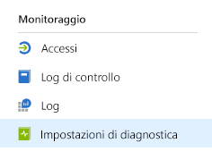
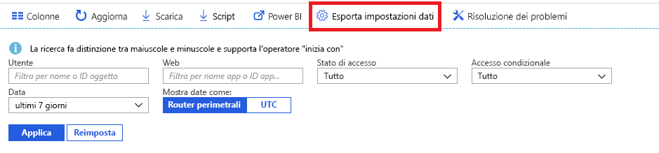

# Che cos'è il monitoraggio di Azure Active Directory? (anteprima)

Con il monitoraggio di Azure Active Directory (Azure AD) è ora possibile indirizzare i log attività di Azure AD a endpoint diversi, dove sarà poi possibile conservarli per l'uso a lungo termine o integrarli con strumenti per informazioni di sicurezza e gestione degli eventi di terze parti per ottenere informazioni dettagliate sull'ambiente.

Attualmente, è possibile indirizzare i log a:

- Un account di archiviazione di Azure.
- Un hub eventi di Azure, in modo da poterli integrare con le istanze di Splunk e Sumologic.
- Un'area di lavoro Azure Log Analytics, in cui è possibile analizzare i dati, creare dashboard e generare avvisi per eventi specifici.

> [!VIDEO https://www.youtube.com/embed/syT-9KNfug8]

[!INCLUDE [azure-monitor-log-analytics-rebrand](../../../includes/azure-monitor-log-analytics-rebrand.md)]

## Configurazione delle impostazioni di diagnostica

Per configurare le impostazioni di monitoraggio per i log attività di Azure AD, accedere prima di tutto al [portale di Azure](https://portal.azure.com) e quindi selezionare **Azure Active Directory**. A questo punto, è possibile accedere alla pagina di configurazione delle impostazioni di diagnostica in due modi:

* Selezionare **Impostazioni di diagnostica** dalla sezione **Monitoraggio**.

    
    
* Selezionare **Log di controllo** oppure **Accessi** e quindi selezionare **Esporta impostazioni**. 

    

## Indirizzare i log all'account di archiviazione

Tramite l'indirizzamento dei log a un account di archiviazione di Azure, è possibile conservarli per più tempo rispetto al periodo di conservazione predefinito indicato nei [criteri di conservazione di Azure Active Directory](reference-reports-data-retention.md). Informazioni su come [indirizzare i dati all'account di archiviazione](quickstart-azure-monitor-route-logs-to-storage-account.md).

## Eseguire lo streaming dei log in un hub eventi

L'indirizzamento dei log a un hub eventi di Azure consente l'integrazione con strumenti per informazioni di sicurezza e gestione degli eventi di terze parti, come Splunk e Sumologic. Questa integrazione consente di combinare i dati di log attività di Azure AD con altri dati gestiti dallo strumento per informazioni di sicurezza e gestione degli eventi, per fornire informazioni dettagliate più estese per il proprio ambiente. Informazioni su come [trasmettere i log a un hub eventi](tutorial-azure-monitor-stream-logs-to-event-hub.md).

## Inviare log ai log di Monitoraggio di Azure

I [log di Monitoraggio di Azure](https://docs.microsoft.com/azure/log-analytics/log-analytics-overview) sono una soluzione che consente di consolidare i dati di monitoraggio di diverse origini e offre un linguaggio di query e un motore di analisi per ottenere informazioni dettagliate sul funzionamento delle applicazioni e delle risorse. Inviando i log attività di Azure AD ai log di Monitoraggio di Azure è possibile recuperare e monitorare i dati rapidamente, nonché generare avvisi in modo efficace per i dati raccolti. Vedere come [inviare dati ai log di Monitoraggio di Azure](howto-integrate-activity-logs-with-log-analytics.md).

È anche possibile installare le visualizzazioni predefinite per i log attività di Azure AD per il monitoraggio di scenari comuni relativi agli accessi e agli eventi di controllo. Vedere come [installare e usare le viste di Log Analytics per i log attività di Azure AD](howto-install-use-log-analytics-views.md).

## Passaggi successivi

* [Log attività in Monitoraggio di Azure](concept-activity-logs-azure-monitor.md)
* [Trasmettere i log di Azure AD a un hub eventi di Azure](tutorial-azure-monitor-stream-logs-to-event-hub.md)
* [Inviare log ai log di Monitoraggio di Azure](howto-integrate-activity-logs-with-log-analytics.md)
