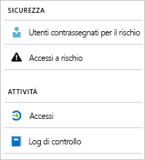

# Che cosa sono i report di Azure Active Directory?

I report di Azure Active Directory (Azure AD) offrono una visualizzazione completa delle attività nell'ambiente specifico. I dati forniti consentono di:

- Determinare l'utilizzo di app e servizi da parte degli utenti
- Rilevare rischi potenziali che pregiudicano l'integrità dell'ambiente
- Risolvere problemi che influiscono negativamente sulla produttività degli utenti  

L'architettura dei report si basa su due elementi fondamentali:

- [Report sulla sicurezza](#security-reports)
- [Report attività](#activity-reports)

## Report sulla sicurezza

I report sulla sicurezza consentono di proteggere le identità dell'organizzazione. Esistono due tipi di report sulla sicurezza:

- **Utenti contrassegnati per il rischio**: il [report sulla sicurezza relativo agli utenti contrassegni per il rischio](concept-user-at-risk.md) offre una panoramica degli account utente che potrebbero essere stati compromessi.

- **Accessi a rischio**: il [report sulla sicurezza relativo agli accessi a rischio](concept-risky-sign-ins.md) offre una indicazione sui tentativi di accesso che potrebbero essere stati eseguiti da qualcuno che non è il legittimo proprietario di un account utente. 

### Licenza di Azure AD necessaria per accedere a un report sulla sicurezza  

Tutte le edizioni di Azure Active Directory offrono report sugli utenti contrassegnati per il rischio e sugli accessi a rischio. Tuttavia, il livello di granularità dei report varia a seconda delle edizioni: 

- Nelle edizioni **Azure Active Directory Free e Basic**  è incluso un elenco degli utenti contrassegnati per il rischio e degli accessi a rischio. 

- Nell'edizione **Azure Active Directory Premium 1** questo modello consente anche di esaminare alcuni degli eventi di rischio sottostanti che sono stati rilevati per ogni report. 

- L'edizione **Azure Active Directory Premium 2** offre informazioni più dettagliate sugli eventi di rischio sottostanti e permette anche di configurare criteri di sicurezza che rispondono automaticamente a livelli di rischio configurati.

## Report sull’attività

I report sull'attività consentono di comprendere il comportamento degli utenti nell'organizzazione. Azure Active Directory prevede due tipi di report sull'attività:

- **Log di controllo**: il [report sull'attività relativo ai log di controllo](concept-audit-logs.md) consente di accedere alla cronologia di ogni attività eseguita nel tenant.

- **Accessi**: il [report sull'attività relativo agli accessi](concept-sign-ins.md) permette di determinare chi ha eseguito le attività segnalate nel report dei log di controllo.

### Report dei log di controllo 

Il [report dei log di controllo](concept-audit-logs.md) include i record delle attività di sistema per la conformità. Questi dati consentono di risolvere scenari comuni, ad esempio:

- Un utente del tenant ha avuto accesso a un gruppo amministrativo e si vuole sapere chi ha concesso tale accesso. 

- Si vuole ottenere un elenco degli utenti che accedono a un'app specifica caricata di recente, per sapere se viene usata.

- Si vuole conoscere il numero di reimpostazioni della password eseguite nel tenant.

#### Informazioni sulla licenza di Azure AD necessaria per accedere al report dei log di controllo  

Il report dei log di controllo è disponibile per le funzionalità per le quali si possiede una licenza. Se è disponibile una licenza per una funzionalità specifica, si ha anche accesso alle relative informazioni del log di controllo. Per altre informazioni, vedere [Caratteristiche e funzionalità di Azure Active Directory](https://www.microsoft.com/cloud-platform/azure-active-directory-features).   

### Report sugli accessi

Il [report relativo agli accessi](concept-sign-ins.md) permette di rispondere a domande come:

- Qual è il modello di accesso di un utente?
- Quanti utenti hanno effettuato l'accesso nell'arco di una settimana?
- Qual è lo stato di questi accessi?

#### Informazioni sulla licenza di Azure AD necessaria per accedere al report sull'attività relativo agli accessi  

Per visualizzare il report sull'attività relativo agli accessi, è necessario che al tenant sia associata una licenza di Azure AD Premium

## Accesso a livello di codice

Oltre all'interfaccia utente, Azure AD offre anche l'[accesso a livello di codice](concept-reporting-api.md) ai dati dei report tramite un set di API basate su REST. È possibile chiamare le API da numerosi linguaggi di programmazione e strumenti. 

## Passaggi successivi

- [Report sugli accessi a rischio](concept-risky-sign-ins.md)
- [Report dei log di controllo](concept-audit-logs.md)
- [Report dei log di accesso](concept-sign-ins.md)