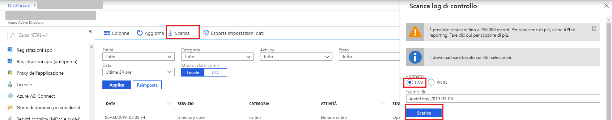

# Avvio rapido: Scaricare il report di controllo con il portale di Azure

In questa guida introduttiva si apprenderà come scaricare un file CSV dei log di controllo per il tenant per le ultime 24 ore. Dal portale di Azure è possibile scaricare fino a 250,000 record. Per impostazione predefinita, vengono scaricati gli ultimi 250,000 record, ordinati partendo dai record più recenti. 

## Prerequisiti

È necessario:

* Un tenant di Azure Active Directory. 
* Un utente con ruolo di **Amministratore della sicurezza**, **Ruolo con autorizzazioni di lettura per la sicurezza** o **Amministratore globale** per il tenant. Inoltre, tutti gli utenti nel tenant possono accedere ai propri log di controllo.

## Guida introduttiva: Scaricare un report di controllo

1. Passare al [portale di Azure](https://portal.azure.com).
2. Selezionare **Azure Active Directory** nel riquadro di spostamento sinistro e usare il pulsante **Cambia directory** per selezionare la directory attiva.
3. Nel dashboard selezionare **Azure Active Directory** e quindi selezionare **Log di controllo**. 
4. Scegliere **Ultime 24 ore** nell'elenco a discesa del filtro **Intervallo di date** e selezionare **Applica** per visualizzare i log di controllo delle ultime 24 ore. 
5. Selezionare il pulsante **Download**, selezionare **CSV** come formato file e specificare il nome del file CSV da scaricare contenente i record filtrati. 

## Passaggi successivi

* [Report delle attività di accesso nel portale di Azure Active Directory](concept-sign-ins.md)
* [Criteri di conservazione dei report di Azure Active Directory](reference-reports-data-retention.md)
* [Latenze dei report di Azure Active Directory](reference-reports-latencies.md)
