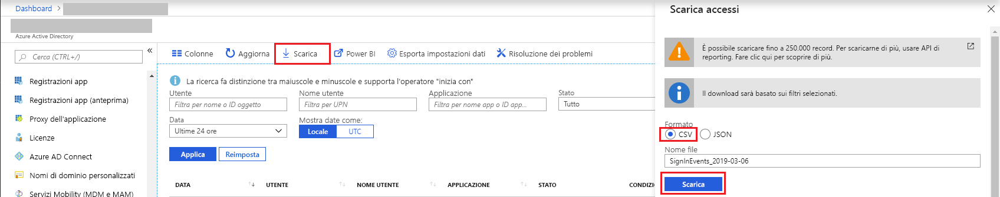

# Avvio rapido: Scaricare un report relativo agli accessi con il portale di Azure

In questa guida introduttiva si apprenderà come scaricare i dati di accesso per il tenant relativi alle ultime 24 ore. Dal portale di Azure è possibile scaricare fino a 250.000 record. Per impostazione predefinita, vengono scaricati gli ultimi 250.000 record, ordinati partendo dai record più recenti. 

## Prerequisiti

È necessario:

* Un tenant di Azure Active Directory con una licenza Premium per visualizzare il report delle attività di accesso. vedere [Procedura: Effettuare l'iscrizione alle edizioni Azure Active Directory Premium](../fundamentals/active-directory-get-started-premium.md) per aggiornare l'edizione di Azure Active Directory in uso. Si noti che se i dati sulle attività non erano disponibili prima dell'aggiornamento, ci vorranno un paio di giorni per visualizzare i dati nei report dopo aver eseguito l'aggiornamento a una licenza premium.
* Un utente con ruolo di **Amministratore della sicurezza**, **Ruolo con autorizzazioni di lettura per la sicurezza**, **Ruolo con autorizzazioni di lettura per i report** o **Amministratore globale** per il tenant. Qualsiasi utente nel tenant, inoltre, può visualizzare i propri accessi.

## Guida introduttiva: Scaricare un report relativo agli accessi

1. Passare al [portale di Azure](https://portal.azure.com).
2. Selezionare **Azure Active Directory** nel riquadro di spostamento sinistro e usare il pulsante **Cambia directory** per selezionare la directory attiva.
3. Nel dashboard selezionare **Azure Active Directory** e quindi selezionare **Accessi**. 
4. Scegliere **Ultime 24 ore** nell'elenco a discesa del filtro **Data** e selezionare **Applica** per visualizzare i dati di accesso delle ultime 24 ore. 
5. Selezionare il pulsante **Download**, selezionare **CSV** come formato file e specificare un nome file per scaricare un file CSV contenente i record filtrati. 

## Passaggi successivi

* [Report delle attività di accesso nel portale di Azure Active Directory](concept-sign-ins.md)
* [Criteri di conservazione dei report di Azure Active Directory](reference-reports-data-retention.md)
* [Latenze dei report di Azure Active Directory](reference-reports-latencies.md)
