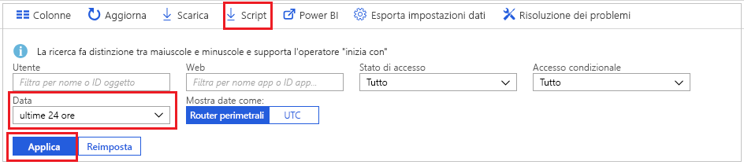
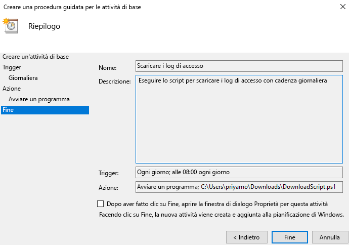

# Esercitazione: Come scaricare e usare uno script per accedere ai log di accesso

Se occorre usare i dati delle attività di accesso all'esterno del portale di Azure, è possibile scaricarli. L'opzione **Download** del portale di Azure crea un file CSV dei 5000 record più recenti. Se è necessaria maggiore flessibilità, ad esempio, per scaricare più di 5000 record alla volta oppure per scaricare i log in base a intervalli pianificati, è possibile usare il pulsante **Script** per generare uno script PowerShell per scaricare i dati.

In questa esercitazione viene illustrato come generare uno script per scaricare tutti i log di accesso relativi alle ultime 24 ore e pianificare l'esecuzione dello script ogni giorno. 

## Prerequisiti

Elementi necessari

* Un tenant di Azure Active Directory con una licenza Premium (P1/P2). Si noti che se i dati sulle attività non erano disponibili prima dell'aggiornamento, ci vorranno un paio di giorni per visualizzare i dati nei report dopo aver eseguito l'aggiornamento a una licenza premium. 
* Un utente con ruolo **Amministratore globale**, **Amministratore della sicurezza**, **Ruolo con autorizzazioni di lettura per la sicurezza** o **Ruolo con autorizzazioni di lettura per i report** per il tenant. Qualsiasi utente, inoltre, può visualizzare i propri accessi. 
* Se si vuole eseguire lo script scaricato nel computer Windows 10, [configurare il modulo AzureRM e configurare i criteri di esecuzione](concept-sign-ins.md#running-the-script-on-a-windows-10-machine).

## Esercitazione

1. Passare al [portale di Azure](https://portal.azure.com) e selezionare la directory.
2. Selezionare **Azure Active Directory** e quindi scegliere **Accessi** dalla sezione **Monitoraggio**. 
3. Usare l'elenco a discesa del filtro **Intervallo di date** e selezionare **24 ore** per ottenere i dati relativi alle ultime 24 ore. 
4. Selezionare **Applica** e verificare che il filtro venga applicato come previsto. 
5. Selezionare **Script** dal menu in alto per scaricare lo script di PowerShell con i filtri applicati.

     
     
6. Aprire l'applicazione **Utilità di pianificazione** nel computer Windows e selezionare **Crea attività di base**.
7. Immettere un nome e una descrizione per l'attività e fare clic su **Avanti**.
8. Selezionare il pulsante di opzione **Giornaliero** per consentire l'esecuzione giornaliera dell'attività e immettere la data e l'ora di inizio.
9. Nel menu di azione selezionare **Avvia programma** e scegliere lo script scaricato, quindi selezionare **Avanti**. 
10. Verificare l'attività pianificata e selezionare **Fine** per creare l'attività.

     

L'attività verrà eseguita ogni giorno e salverà i record di accesso relativi alle ultime 24 ore in un file con formato **AAD_SignInReport_AAAAMMGG_HHMMSS.csv**. È anche possibile modificare lo script di PowerShell scaricato per salvarlo come file con nome diverso oppure modificare il numero di record scaricati. 

## Passaggi successivi

* [Criteri di conservazione dei report di Azure Active Directory](reference-reports-data-retention.md)
* [Introduzione all'API di creazione report di Azure Active Directory](concept-reporting-api.md)
* [Accedere all'API di creazione di report con i certificati](tutorial-access-api-with-certificates.md)
