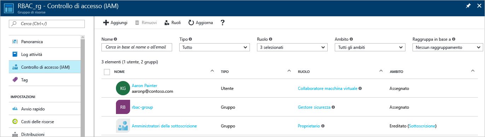
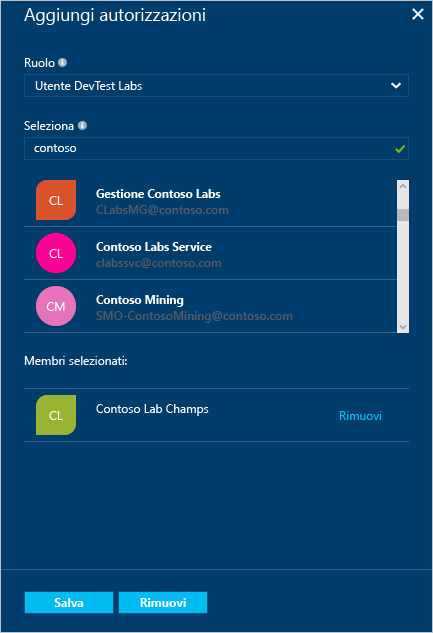
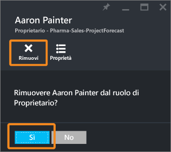
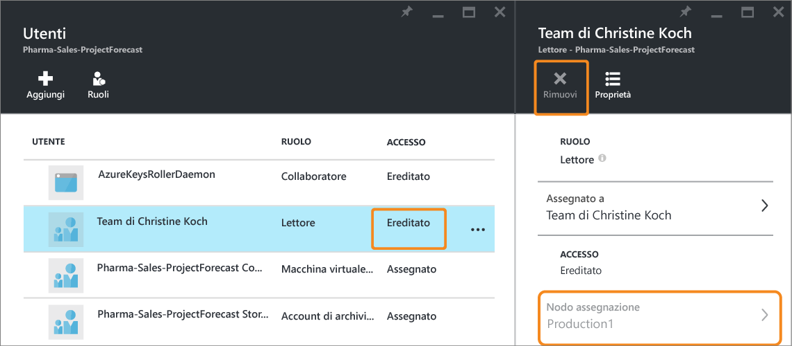

<properties
	pageTitle="Controllo degli accessi in base al ruolo nel portale di Azure | Microsoft Azure"
	description="Introduzione alla gestione degli accessi con il Controllo degli accessi in base al ruolo nel portale di Azure. Usare le assegnazioni di ruolo per assegnare autorizzazioni nella directory."
	services="active-directory"
	documentationCenter=""
	authors="kgremban"
	manager="stevenpo"
	editor=""/>

<tags
	ms.service="active-directory"
	ms.devlang="na"
	ms.topic="get-started-article"
	ms.tgt_pltfrm="na"
	ms.workload="identity"
	ms.date="05/03/2016"
	ms.author="kgremban"/>

# Usare le assegnazioni di ruolo per gestire l'accesso alle risorse di Azure Active Directory

Il Controllo degli accessi in base al ruolo di Azure (RBAC) consente la gestione specifica degli accessi per Azure. L'uso del Controllo degli accessi in base al ruolo permette di concedere agli utenti solo il livello di accesso necessario per lavorare. Questo articolo permette di iniziare subito a usare il Controllo degli accessi in base al ruolo nel portale di Azure. Per altri dettagli sulla gestione degli accessi, vedere l'articolo relativo al [Controllo degli accessi in base al ruolo](role-based-access-control-what-is.md).

## Visualizzare l'accesso
È possibile visualizzare chi ha accesso a una risorsa, a un gruppo di risorse o a una sottoscrizione dal relativo pannello principale nel [portale di Azure](https://portal.azure.com). Ad esempio, si vuole vedere chi ha accesso a uno dei gruppi di risorse:

1. Selezionare **Gruppi di risorse** nella barra di spostamento a sinistra. 
2. Selezionare il nome del gruppo di risorse nel pannello **Gruppi di risorse**.
3. Selezionare **Utenti** nella parte superiore destra del pannello del gruppo di risorse. 
4. Il pannello **Utenti** elenca tutti gli utenti, i gruppi e le applicazioni a cui è stato consentito l'accesso al gruppo di risorse.  

	

Si noti che per alcuni utenti l'accesso è stato **Assegnato**, mentre per altri è stato **Ereditato**. L'accesso viene assegnato in modo specifico al gruppo di risorse oppure ereditato da un'assegnazione nella sottoscrizione padre.

> [AZURE.NOTE] Gli utenti con i ruoli Amministratore sottoscrizione classico e Coamministratore sono considerati proprietari della sottoscrizione nel nuovo modello Controllo degli accessi in base al ruolo.

## Aggiungere un accesso
Si concede l'accesso dalla risorsa, dal gruppo di risorse o dalla sottoscrizione che costituisce l'ambito dell'assegnazione di ruolo.

1. Nel pannello **Utenti** selezionare **Aggiungi**.   
2. Selezionare il ruolo da assegnare nel pannello **Selezionare un ruolo**.
3. Selezionare l'utente, il gruppo o l'applicazione nella directory a cui si vuole concedere l'accesso. È possibile cercare nella directory usando nomi visualizzati, indirizzi di posta elettronica e identificatori di oggetto.  

	

4. Selezionare **OK** per creare l'assegnazione. Il popup **Aggiunta dell'utente in corso** tiene traccia dello stato. 

Dopo aver aggiunto un'assegnazione di ruolo, viene visualizzato il pannello **Utenti**.

## Rimuovere un accesso

1. Selezionare l'assegnazione di ruolo nel pannello **Utenti**.
2. Selezionare **Rimuovi** nel pannello dei dettagli dell'assegnazione. 
3. Selezionare **Sì** per confermare la rimozione. 

Le assegnazioni ereditate non possono essere rimosse. Si noti nell'immagine seguente che il pulsante Rimuovi è disabilitato. Esaminare i dettagli in **Nodo assegnazione**. Passare alla risorsa inclusa nell'elenco per rimuovere l'assegnazione di ruolo.

## Altri strumenti per gestire l'accesso
È possibile assegnare i ruoli e gestire l'accesso con i comandi del Controllo degli accessi in base al ruolo di Azure in strumenti diversi dal portale di Azure. Per altre informazioni sui prerequisiti e iniziare a usare i comandi del Controllo degli accessi in base al ruolo di Azure, usare i collegamenti seguenti.

- [Azure PowerShell](role-based-access-control-manage-access-powershell.md)
- [Interfaccia della riga di comando di Azure](role-based-access-control-manage-access-azure-cli.md)
- [API REST](role-based-access-control-manage-access-rest.md)

## Passaggi successivi
- [Creare un report della cronologia delle modifiche relative all'accesso](role-based-access-control-access-change-history-report.md).
- Vedere [Controllo degli accessi in base al ruolo: ruoli predefiniti](role-based-access-built-in-roles.md).
- Definire i [ruoli personalizzati nel Controllo degli accessi in base al ruolo di Azure](role-based-access-control-custom-roles.md).

<!---HONumber=AcomDC_0504_2016-->