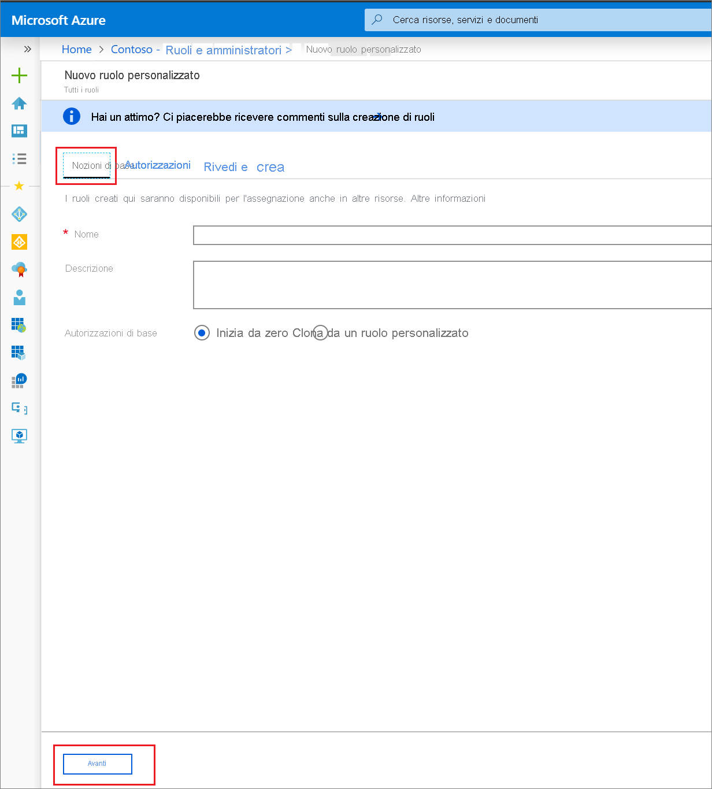
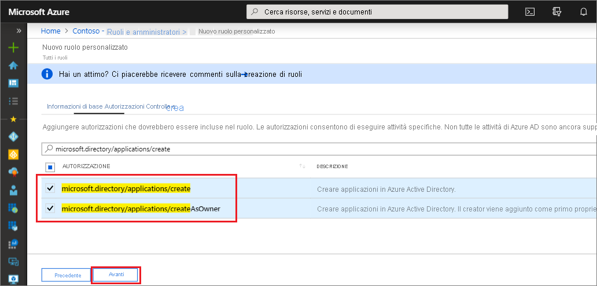

# <a name="quickstart-grant-permission-to-create-unlimited-app-registrations"></a>Avvio rapido: Concedere l'autorizzazione per creare registrazioni per l'app illimitate

In questa guida di avvio rapido verrà creato un ruolo personalizzato con l'autorizzazione per creare un numero illimitato di registrazioni di app e quindi tale ruolo verrà assegnato a un utente. L'utente assegnato può quindi usare il portale di Azure AD, Azure AD PowerShell o l'API Microsoft Graph per creare registrazioni dell'applicazione. Diversamente dal ruolo predefinito Sviluppatore di applicazioni, questo ruolo personalizzato concede la possibilità di creare un numero illimitato di registrazioni dell'applicazione. Il ruolo Sviluppatore di applicazioni concede la possibilità, ma il numero totale di oggetti creati è limitato a 250 per impedire il raggiungimento della [quota di oggetti a livello di directory](../enterprise-users/directory-service-limits-restrictions.md). Il ruolo con privilegi minimi necessario per creare e assegnare ruoli personalizzati di Azure AD è Amministratore ruolo con privilegi.

Se non si ha una sottoscrizione di Azure, [creare un account gratuito](https://azure.microsoft.com/free/) prima di iniziare.

## <a name="create-a-custom-role-using-the-azure-ad-portal"></a>Creare un ruolo personalizzato usando il portale di Azure AD

1. Accedere all'[interfaccia di amministrazione di Azure AD](https://aad.portal.azure.com) con autorizzazioni di Amministratore ruolo con privilegi o Amministratore globale nell'organizzazione di Azure AD.
1. Selezionare **Azure Active Directory** , selezionare **Ruoli e amministratori** e quindi selezionare **Nuovo ruolo personalizzato**.

    

1. Nella scheda **Informazioni di base** specificare "Autore registrazione applicazione" per il nome del ruolo e "Può creare un numero illimitato di registrazioni applicazione" per la descrizione del ruolo e quindi selezionare **Avanti**.

    

1. Nella scheda **Autorizzazioni** immettere "microsoft.directory/applications/create" nella casella di ricerca e quindi selezionare le caselle di controllo accanto alle autorizzazioni desiderate e infine selezionare **Avanti**.

    

1. Nella scheda **Rivedi e crea** rivedere le autorizzazioni e selezionare **Crea**.

### <a name="assign-the-role-in-the-azure-ad-portal"></a>Assegnare il ruolo nel portale di Azure AD

1. Accedere all'[interfaccia di amministrazione di Azure AD](https://aad.portal.azure.com) con autorizzazioni di Amministratore ruolo con privilegi o Amministratore globale nell'organizzazione di Azure AD.
1. Selezionare **Azure Active Directory** e quindi selezionare **Ruoli e amministratori**.
1. Selezionare il ruolo Autore registrazione applicazione e selezionare **Aggiungi assegnazione**.
1. Selezionare l'utente desiderato e fare clic su **Seleziona** per aggiungerlo al ruolo.

La procedura è stata completata. In questo argomento di avvio rapido è stato creato un ruolo personalizzato con l'autorizzazione per creare un numero illimitato di registrazioni di app e ora si assegnerà tale ruolo a un utente.

> [!TIP]
> Per assegnare il ruolo a un'applicazione usando il portale di Azure AD, immettere il nome dell'applicazione nella casella di ricerca della pagina di assegnazione. Per impostazione predefinita, le applicazioni non vengono visualizzate nell'elenco, ma vengono restituite nei risultati della ricerca.

### <a name="app-registration-permissions"></a>Autorizzazioni per la registrazione di app

Sono disponibili due autorizzazioni per concedere la possibilità di creare registrazioni dell'applicazione, ognuna con un comportamento diverso.

- microsoft.directory/applications/createAsOwner: se si assegna questa autorizzazione, l'autore verrà aggiunto come primo proprietario della registrazione di app creata e la registrazione di app creata verrà calcolata nella quota dei 250 oggetti creati dell'autore.
- microsoft.directory/applications/create: se si assegna questa autorizzazione l'autore non verrà aggiunto come primo proprietario della registrazione di app creata e la registrazione di app creata non verrà calcolata nella quota dei 250 oggetti creati dell'autore. Usare questa autorizzazione con cautela, perché non è possibile impedire all'assegnatario di creare registrazioni di app fino a quando non viene raggiunta la quota a livello di directory. Se vengono assegnate entrambe le autorizzazioni, questa autorizzazione avrà la precedenza.

## <a name="create-a-custom-role-in-azure-ad-powershell"></a>Creare un ruolo personalizzato in Azure AD PowerShell

### <a name="prepare-powershell"></a>Preparare PowerShell

Installare prima il modulo Azure AD PowerShell da [PowerShell Gallery](https://www.powershellgallery.com/packages/AzureADPreview/2.0.0.17). Importare quindi il modulo di anteprima di Azure AD PowerShell usando questo comando:

```powershell
import-module azureadpreview
```

Per verificare che il modulo sia pronto per l'uso, la versione restituita dal comando seguente deve corrispondere a quella elencata qui:

```powershell
get-module azureadpreview
  ModuleType Version      Name                         ExportedCommands
  ---------- ---------    ----                         ----------------
  Binary     2.0.0.115    azureadpreview               {Add-AzureADAdministrati...}
```

### <a name="create-the-custom-role-in-azure-ad-powershell"></a>Creare il ruolo personalizzato in Azure AD PowerShell

Creare un nuovo ruolo con lo script PowerShell seguente:

```powershell

# Basic role information
$displayName = "Application Registration Creator"
$description = "Can create an unlimited number of application registrations."
$templateId = (New-Guid).Guid

# Set of permissions to grant
$allowedResourceAction =
@(
    "microsoft.directory/applications/create"
    "microsoft.directory/applications/createAsOwner"
)
$rolePermissions = @{'allowedResourceActions'= $allowedResourceAction}

# Create new custom admin role
$customRole = New-AzureAdMSRoleDefinition -RolePermissions $rolePermissions -DisplayName $displayName -Description $description -TemplateId $templateId -IsEnabled $true
```

### <a name="assign-the-role-in-azure-ad-powershell"></a>Assegnare il ruolo in Azure AD PowerShell

Assegnare il ruolo usando lo script di PowerShell seguente:

```powershell
# Get the user and role definition you want to link
$user = Get-AzureADUser -Filter "userPrincipalName eq 'Adam@contoso.com'"
$roleDefinition = Get-AzureADMSRoleDefinition -Filter "displayName eq 'Application Registration Creator'"

# Get resource scope for assignment
$resourceScope = '/'

# Create a scoped role assignment
$roleAssignment = New-AzureADMSRoleAssignment -ResourceScope $resourceScope -RoleDefinitionId $roleDefinition.Id -PrincipalId $user.objectId
```

## <a name="create-a-custom-role-in-the-microsoft-graph-api"></a>Creare un ruolo personalizzato nell'API Microsoft Graph

Richiesta HTTP per creare il ruolo personalizzato.

POST

``` HTTP
https://graph.microsoft.com/beta/roleManagement/directory/roleDefinitions
```

Corpo

```HTTP
{
    "description":"Can create an unlimited number of application registrations.",
    "displayName":"Application Registration Creator",
    "isEnabled":true,
    "rolePermissions":
    [
        {
            "resourceActions":
            {
                "allowedResourceActions":
                [
                    "microsoft.directory/applications/create"
                    "microsoft.directory/applications/createAsOwner"
                ]
            },
            "condition":null
        }
    ],
    "templateId":"<PROVIDE NEW GUID HERE>",
    "version":"1"
}
```

### <a name="assign-the-role-in-the-microsoft-graph-api"></a>Assegnare il ruolo nell'API Microsoft Graph

L'assegnazione di ruolo combina un ID entità di sicurezza, che può essere un utente o un'entità servizio, un ID definizione del ruolo (ruolo) e un ambito della risorsa di Azure AD.

Richiesta HTTP per assegnare un ruolo personalizzato.

POST

``` HTTP
https://graph.microsoft.com/beta/roleManagement/directory/roleAssignments
```

Corpo

``` HTTP
{
    "principalId":"<PROVIDE OBJECTID OF USER TO ASSIGN HERE>",
    "roleDefinitionId":"<PROVIDE OBJECTID OF ROLE DEFINITION HERE>",
    "resourceScopes":["/"]
}
```

## <a name="next-steps"></a>Passaggi successivi

- Condividere le informazioni nel [forum di Azure AD sui ruoli amministrativi](https://feedback.azure.com/forums/169401-azure-active-directory?category_id=166032).
- Per altre informazioni sulle assegnazioni dei ruoli di Azure AD, vedere [Assegnare i ruoli di amministratore](permissions-reference.md).
- Per altre informazioni sulle autorizzazioni utente predefinite, vedere il [confronto tra le autorizzazioni predefinite per gli utenti guest e quelle per gli utenti membro](../fundamentals/users-default-permissions.md).
