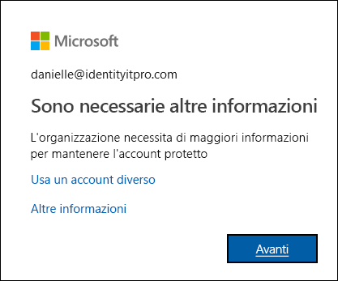

# Panoramica sulla configurazione dei metodi di verifica a due fattori

In un'organizzazione è stata attivata la verifica a due fattori. In altre parole, l'accesso all'account aziendale o dell'istituto di istruzione richiede ora una combinazione di nome utente, password e dispositivo mobile o telefono. L'organizzazione ha scelto di introdurre questa verifica aggiuntiva perché è più sicura rispetto all'uso della semplice password. È infatti basata su due forme di autenticazione: un elemento noto e un elemento che l'utente ha con sé. La verifica a due fattori può essere utile per impedire a un pirata informatico di fingere di essere un utente autorizzato perché, anche se possiedono la password dell'utente, è improbabile che abbiano anche il suo dispositivo.

>[!Important]
>Questo contenuto è destinato agli utenti. Gli amministratori possono trovare altre informazioni su come configurare e gestire l'ambiente Azure Active Directory (Azure AD) nella [documentazione di Azure Active Directory](https://docs.microsoft.com/azure/active-directory).

## Chi decide se usare questa funzionalità?

A seconda del tipo di account, l'organizzazione potrebbe decidere che è necessario usare la verifica a due fattori oppure si potrebbe deciderlo autonomamente.

- **Account aziendale o dell'istituto di istruzione.** Se si usa un account aziendale o dell'istituto di istruzione, ad esempio alain@contoso.com, spetta all'organizzazione scegliere se usare la verifica a due fattori, insieme ai metodi di verifica specifici. Poiché l'organizzazione ha deciso che è necessario usare questa funzionalità, non è possibile disattivarla individualmente.

- **Account Microsoft personale.** È possibile scegliere di impostare la verifica a due fattori per gli account Microsoft personali, ad esempio alain@outlook.com. Se si riscontrano problemi con la verifica a due fattori e l'account Microsoft personale, vedere [Attivazione o disattivazione della verifica a due fattori per l'account Microsoft](https://support.microsoft.com/help/4028586/microsoft-account-turning-two-step-verification-on-or-off). Poiché si ha la libertà di scegliere se usare questa funzionalità, è possibile attivarla o disattivarla ogni volta che si desidera.

## Accedere alla pagina Verifica aggiuntiva di sicurezza

Dopo che l'organizzazione ha attivato e configurato la verifica a due fattori, all'utente viene chiesto di specificare altre informazioni per garantire la protezione dell'account.

### Per accedere alla pagina Verifica aggiuntiva di sicurezza

1. Selezionare **Avanti** nel prompt **Sono necessarie altre informazioni**.

    Viene visualizzata la pagina **Verifica aggiuntiva di protezione**.

2. Nella pagina **Verifica aggiuntiva di protezione** è necessario definire il metodo di verifica a due fattori da usare per verificare la propria identità dopo aver eseguito l'accesso all'account aziendale o dell'istituto di istruzione. È possibile selezionare:

    | Metodo di contatto | DESCRIZIONE |
    | --- | --- |
    | App per dispositivi mobili | <ul><li>**Ricevi notifiche per la verifica.** Questa opzione invia una notifica all'app di autenticazione sul tablet o lo smartphone. Visualizzare la notifica e, se del caso, selezionare **Autentica** nell'app. L'azienda o dell'istituto di istruzione potrebbe richiedere di immettere un PIN prima eseguire l'autenticazione.</li><li>**Usa codice di verifica.** In questa modalità, l'app di autenticazione genera un nuovo codice di verifica ogni 30 secondi. Immettere il codice di verifica più recente nella schermata di accesso. L'app Microsoft Authenticator è disponibile per [Android](https://go.microsoft.com/fwlink/?linkid=866594) e [iOS](https://go.microsoft.com/fwlink/?linkid=866594).</li></ul> |
    | Telefono per l'autenticazione | <ul><li>**Telefonata** invia una chiamata vocale automatizzata al numero di telefono specificato. Per l'autenticazione, rispondere alla chiamata e premere il tasto cancelletto (#) sul tastierino telefonico.</li><li>**SMS** invia un SMS contenente un codice di verifica. Seguendo la richiesta indicata nel testo, rispondere all'SMS o immettere il codice di verifica fornito nell'interfaccia di accesso.</li></ul> |
    | Telefono ufficio | Invia una chiamata vocale automatizzata al numero di telefono fornito. Per l'autenticazione, rispondere alla chiamata e premere il tasto cancelletto (#) sul tastierino telefonico. |

## Passaggi successivi

Dopo aver eseguito l'accesso alla pagina **Verifica di sicurezza aggiuntiva**, è necessario selezionare e configurare il metodo di verifica a due fattori:

- [Configurare il dispositivo mobile come metodo di verifica](multi-factor-authentication-setup-phone-number.md)

- [Configurare il telefono dell'ufficio come metodo di verifica](multi-factor-authentication-setup-office-phone.md)

- [Configurare l'app Microsoft Authenticator come metodo di verifica](multi-factor-authentication-setup-auth-app.md)

## Risorse correlate

- [Gestire le impostazioni del metodo di verifica a due fattori](multi-factor-authentication-end-user-manage-settings.md)

- [Gestire le password delle app](multi-factor-authentication-end-user-app-passwords.md)

- [Accedere usando la verifica a due fattori](multi-factor-authentication-end-user-signin.md)

- [Risolvere i problemi relativi alla verifica a due fattori](multi-factor-authentication-end-user-troubleshoot.md) 
