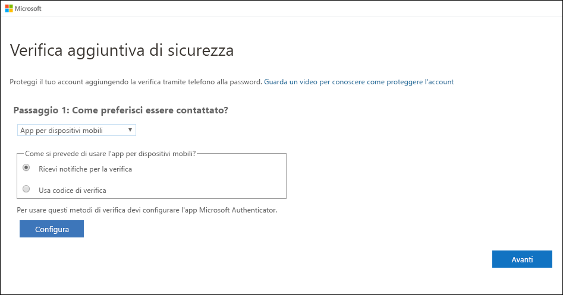
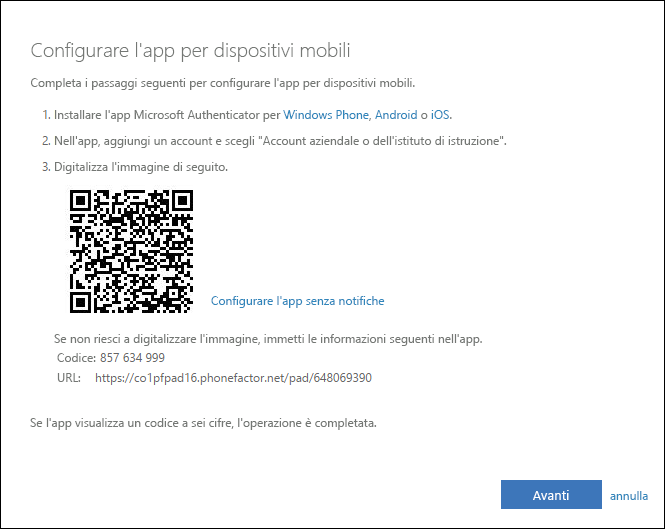
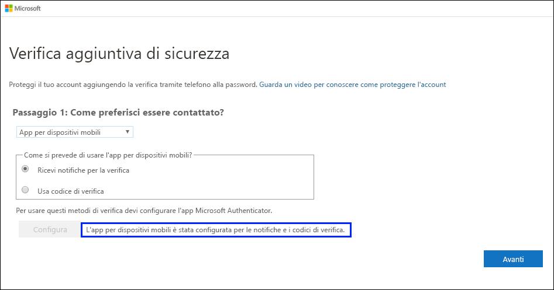
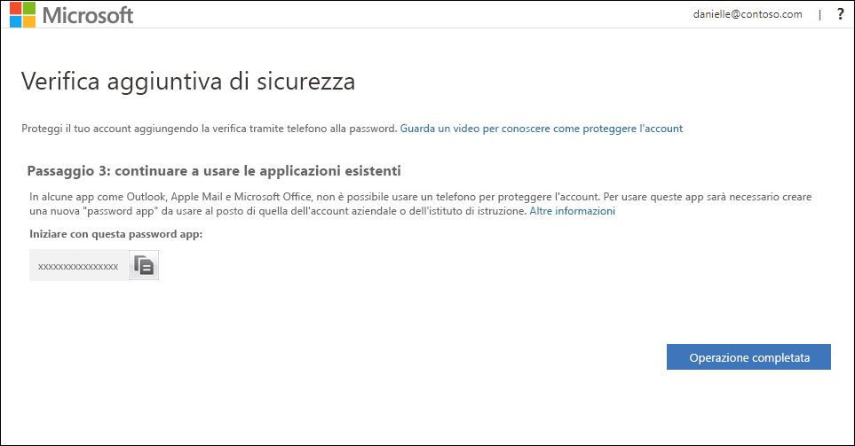
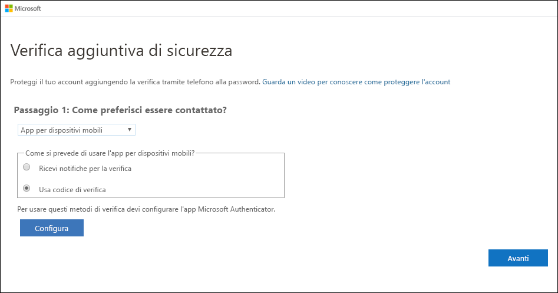
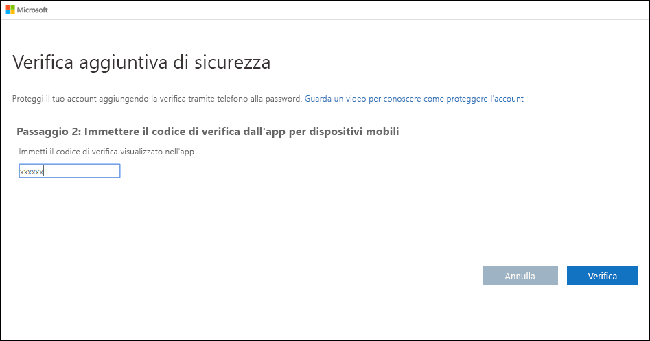

# Configurare un'app di autenticazione come metodo di verifica a due fattori

È possibile configurare un'app di autenticazione per inviare una notifica al dispositivo mobile o ricevere un codice di verifica come metodo di verifica della sicurezza. Non è necessario usare l'app Microsoft Authenticator. Durante il processo di configurazione è possibile selezionare un'app diversa. Tuttavia, in questo articolo viene usata l'app Microsoft Authenticator.

>[!Important]
>Prima di poter aggiungere l'account, è necessario scaricare e installare l'app Microsoft Authenticator. Se non è ancora stato fatto, seguire i passaggi descritti nell'articolo [Scaricare e installare l'app](user-help-auth-app-download-install.md).

>[!Note]
> Se l'opzione App per dispositivi mobili è disattivata, è possibile che l'organizzazione non consenta di usare un'app di autenticazione per la verifica. In questo caso, sarà necessario selezionare un altro metodo oppure contattare l'amministratore per ottenere supporto.

## Configurare l'app Microsoft Authenticator per l'invio di notifiche

1. Nella pagina **Verifica di sicurezza aggiuntiva** selezionare **App per dispositivi mobili** nell'area **Passaggio 1: indicare il modo in cui si preferisce essere contattati**.

2. Selezionare **Ricevi notifiche per la verifica** nell'area **Indicare come verrà usata questa app per dispositivi mobili** e quindi **Configura**.

    

    Viene visualizzata la pagina **Configurare l'app per dispositivi mobili**.

    

3. Aprire l'app Microsoft Authenticator, selezionare **Aggiungi account** dall'icona **Customize and control** (Personalizza e controlla) nell'angolo in alto a destra e quindi selezionare **Account aziendale o dell'istituto di istruzione**.

    >[!Note]
    >Se si configura l'app Microsoft Authenticator per la prima volta, è possibile che venga visualizzato un messaggio in cui viene richiesto se consentire all'app di accedere alla fotocamera (iOS) o se consentire all'app di scattare foto e registrare video (Android). Selezionare **Consenti** per consentire all'app Authenticator di accedere alla fotocamera per scattare una foto del codice a matrice nel passaggio successivo. Se non si consente l'accesso alla fotocamera, è comunque possibile configurare l'app Authenticator, ma sarà necessario aggiungere le informazioni sul codice manualmente. Per altre informazioni su come aggiungere manualmente un codice, vedere [Aggiungere manualmente un account all'app](user-help-auth-app-add-account-manual.md).

4. Usare la fotocamera del dispositivo per eseguire la scansione del codice a matrice dalla schermata **Configurare l'app mobile** sul computer e quindi scegliere **Fine**.

5. Tornare al computer e alla pagina **Verifica di sicurezza aggiuntiva**, verificare che venga visualizzato il messaggio che informa che la configurazione è stata completata e quindi selezionare **Avanti**.

    

    L'app di autenticazione invierà una notifica al dispositivo mobile come test.

6. Sul dispositivo mobile selezionare **Approva**.

7. Sul computer aggiungere il numero di telefono del dispositivo mobile nell'area **Passaggio 3: nel caso si perda l'accesso all'app per dispositivi mobili** e quindi selezionare **Avanti**.

    È consigliabile aggiungere il numero di telefono del dispositivo mobile per usarlo come backup se per qualsiasi motivo l'app per dispositivi mobili è inaccessibile o inutilizzabile.

8. Nell'area **Passaggio 4: continuare a usare le applicazioni esistenti** copiare la password per le app visualizzata e incollarla in una posizione sicura.

    

    >[!Note]
    >Per informazioni su come usare la password per le app meno recenti, vedere [Gestire le password delle app](multi-factor-authentication-end-user-app-passwords.md). È necessario usare le password per le app solo se si continuano a usare app meno recenti che non supportano la verifica a due fattori.

9. Selezionare **Operazione completata**.

## Configurare l'app Microsoft Authenticator per l'uso di codici di verifica

1. Nella pagina **Verifica di sicurezza aggiuntiva** selezionare **App per dispositivi mobili** nell'area **Passaggio 1: indicare il modo in cui si preferisce essere contattati**.

2. Selezionare **Usa codice di verifica** nell'area **Indicare come verrà usata questa app per dispositivi mobili** e quindi **Configura**.

    

    Viene visualizzata la pagina **Configurare l'app per dispositivi mobili**.

    

3. Aprire l'app Microsoft Authenticator, selezionare **Aggiungi account** dall'icona **Customize and control** (Personalizza e controlla) nell'angolo in alto a destra e quindi selezionare **Account aziendale o dell'istituto di istruzione**.

    >[!Note]
    >Se si configura l'app Microsoft Authenticator per la prima volta, è possibile che venga visualizzato un messaggio in cui viene richiesto se consentire all'app di accedere alla fotocamera (iOS) o se consentire all'app di scattare foto e registrare video (Android). Selezionare **Consenti** per consentire all'app Authenticator di accedere alla fotocamera per scattare una foto del codice a matrice nel passaggio successivo. Se non si consente l'accesso alla fotocamera, è comunque possibile configurare l'app Authenticator, ma sarà necessario aggiungere le informazioni sul codice manualmente. Per altre informazioni su come aggiungere manualmente un codice, vedere [Aggiungere manualmente un account all'app](user-help-auth-app-add-account-manual.md).

4. Usare la fotocamera del dispositivo per eseguire la scansione del codice a matrice dalla schermata **Configurare l'app mobile** sul computer e quindi scegliere **Fine**.

5. Tornare al computer e alla pagina **Verifica di sicurezza aggiuntiva**, verificare che venga visualizzato il messaggio che informa che la configurazione è stata completata e quindi selezionare **Avanti**.

    

    L'app di autenticazione richiederà un codice di verifica come test.

6. Nell'app Microsoft Authenticator scorrere verso il basso fino all'account aziendale o dell'istituto di istruzione, copiare e incollare il codice a 6 cifre dall'app alla casella **Passaggio 2: immettere il codice di verifica dall'app per dispositivi mobili** sul computer e quindi selezionare **Verifica**.

    

7. Sul computer aggiungere il numero di telefono del dispositivo mobile nell'area **Passaggio 3: nel caso si perda l'accesso all'app per dispositivi mobili** e quindi selezionare **Avanti**.

    È consigliabile aggiungere il numero di telefono del dispositivo mobile per usarlo come backup se per qualsiasi motivo l'app per dispositivi mobili è inaccessibile o inutilizzabile.

8. Nell'area **Passaggio 4: continuare a usare le applicazioni esistenti** copiare la password per le app visualizzata e incollarla in una posizione sicura.

    

    >[!Note]
    >Per informazioni su come usare la password per le app meno recenti, vedere [Gestire le password delle app](multi-factor-authentication-end-user-app-passwords.md). È necessario usare le password per le app solo se si continuano a usare app meno recenti che non supportano la verifica a due fattori.

9. Selezionare **Operazione completata**.

## Passaggi successivi

Dopo aver configurato il metodo di verifica a due fattori, è possibile aggiungere altri metodi, gestire le impostazioni e le password per le app, effettuare l'accesso oppure ottenere informazioni su alcuni problemi comuni relativi alla verifica a due fattori.

- [Gestire le impostazioni del metodo di verifica a due fattori](multi-factor-authentication-end-user-manage-settings.md)

- [Gestire le password delle app](multi-factor-authentication-end-user-app-passwords.md)

- [Accedere usando la verifica a due fattori](multi-factor-authentication-end-user-signin.md)

- [Risoluzione dei problemi della verifica a due fattori](multi-factor-authentication-end-user-troubleshoot.md)
