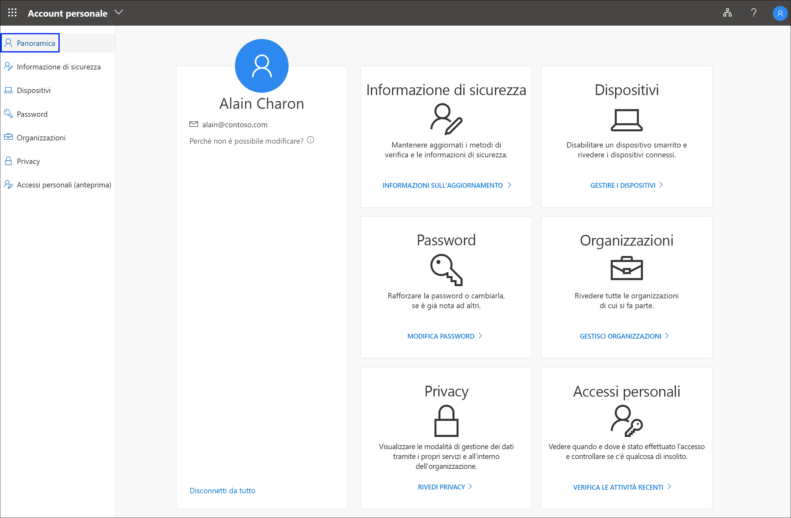

# Panoramica del portale Account personale

Il portale **Account personale** (anteprima) consente di gestire l'account aziendale o dell'istituto di istruzione configurando e gestendo le informazioni di sicurezza, gestendo le organizzazioni e i dispositivi connessi e visualizzando come vengono usati i dati nell'organizzazione.

>[!Important]
>Questo contenuto è destinato agli utenti. Gli amministratori possono trovare altre informazioni su come configurare e gestire l'ambiente Azure Active Directory (Azure AD) nella [documentazione di Azure Active Directory](https://docs.microsoft.com/azure/active-directory).

## Vai al portale Account personale

È possibile accedere al portale **Account personale** (https://myprofile.microsoft.com) ), dalla versione corrente di uno qualsiasi dei browser seguenti:

- Chrome
- Microsoft Edge
- Safari
- Firefox
- Internet Explorer 11

## Articoli sul portale Account personale

Per informazioni dettagliate e istruzioni sul contenuto disponibile nel portale **Account personale**, vedere gli articoli seguenti:

|Articolo |DESCRIZIONE |
|------|------------|
| [Aggiungere l'informazione di sicurezza](user-help-security-info-overview.md) | Diversi articoli on istruzioni su come configurare l'app Microsoft Authenticator, gli SMS o le telefonate come metodo di verifica. Sono inoltre inclusi articoli su come aggiungere un indirizzo di posta elettronica o le domande di sicurezza predefinite in modo da reimpostare autonomamente la propria password dimenticata, se necessario.|
| [Visualizzare o disabilitare i dispositivi connessi](my-account-portal-devices-page.md) | Istruzioni su come visualizzare e disabilitare i dispositivi connessi all'account aziendale o dell'istituto di istruzione.|
| [Modificare la password dell'account aziendale o dell'istituto di istruzione](my-account-change-password-page.md) | Istruzioni su come modificare la password per l'account aziendale o dell'istituto di istruzione. |
| [Visualizzare o rimuovere le organizzazioni connesse](my-account-portal-organizations-page.md) | Istruzioni su come visualizzare e rimuovere le organizzazioni connesse all'account aziendale o dell'istituto di istruzione.|
| [Visualizzare le informazioni relative alla privacy](my-account-portal-privacy-page.md) | Istruzioni su come visualizzare i servizi online connessi all'account aziendale o dell'istituto di istruzione, insieme alle condizioni per l'utilizzo dell'organizzazione.|
| [Visualizzare l'attività di accesso recente](my-account-portal-sign-ins-page.md) | Istruzioni su come visualizzare l'attività di accesso per l'account aziendale o dell'istituto di istruzione. |

## Contenuto di Office correlato

- [Accedere per gestire Office](https://support.office.com/article/sign-in-to-manage-your-office-product-959ac957-8d37-4ae4-b1b6-d6e4874e013f)

- [Andare alla pagina **Account personale** di Office](https://portal.office.com/account/#home)

- [Andare alla pagina **Mie installazioni** di Office](https://portal.office.com/account/#installs)

- [Andare alla pagina **Sottoscrizioni** di Office](https://portal.office.com/account/#subscriptions)
