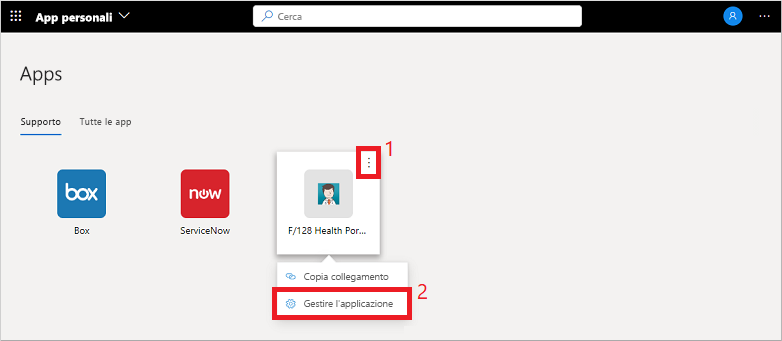
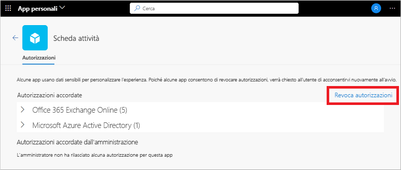

# Modificare o revocare le autorizzazioni delle applicazioni nel portale App personali

Quando si usano applicazioni aziendali nel portale **App personali**, spesso si concedono le autorizzazioni e si salvano le informazioni sull'account. Per garantire la sicurezza dei dati, è consigliabile rivedere e revocare le autorizzazioni o cancellare le credenziali dell'account salvato. La rimozione delle autorizzazioni o degli account può limitare le funzionalità dell'app. Se si verificano problemi dopo aver rimosso le autorizzazioni o gli account, contattare il supporto tecnico dell'organizzazione per ottenere assistenza aggiuntiva.

[!INCLUDE [preview-notice](../../../includes/active-directory-end-user-my-apps-and-workspaces.md)]

>[!Important]
>Questo contenuto è destinato agli utenti. Gli amministratori possono trovare altre informazioni su come configurare e gestire le app basate sul cloud nella [documentazione di Gestione applicazioni](https://docs.microsoft.com/azure/active-directory/manage-apps/access-panel-workspaces).

## Gestire le autorizzazioni dell'app

Per visualizzare le autorizzazioni concesse dall'utente o dall'amministratore, selezionare **...** quando si passa il mouse su un'app nel portale **App personali**, quindi selezionare **Gestione dell'applicazione**:

Nella parte superiore della finestra delle autorizzazioni vengono visualizzati gli elementi a cui si è concesso personalmente l'accesso. Esempi di autorizzazioni per le app includono la possibilità di accedere al calendario, ai contatti o alla fotocamera.

È possibile revocare le autorizzazioni concesse selezionando **Revoca autorizzazioni**. La rimozione di un'autorizzazione potrebbe tuttavia interrompere alcune funzionalità delle app. Se si verificano problemi dopo aver rimosso le autorizzazioni o gli account, contattare il supporto tecnico dell'organizzazione per ottenere assistenza aggiuntiva.

Nella parte inferiore della finestra delle autorizzazioni vengono visualizzati gli elementi a cui l'amministratore ha concesso l'accesso per conto dell'utente. Questa sezione non viene visualizzata se non sono presenti autorizzazioni concesse dall'amministratore. Non è possibile revocare queste autorizzazioni perché l'amministratore le ha concesse e spesso sono necessarie per i criteri dell'organizzazione.

## Passaggi successivi

Dopo aver gestito le autorizzazioni dell'app e gli account salvati nel portale **App personali**, è possibile:

- Organizzare le app nelle diverse categorie create e fornite dall'organizzazione. Per altre informazioni, vedere [Accedere e usare le raccolte nel portale App personali](my-applications-portal-workspaces.md).

## Articoli correlati

- [Aggiornare le informazioni su profilo e account](my-account-portal-overview.md). Istruzioni su come aggiornare le informazioni personali visualizzate nel portale **Profilo personale**.

- [Gestire le organizzazioni](my-account-portal-organizations-page.md). Istruzioni su come visualizzare e gestire le informazioni relative all'organizzazione nella pagina **Organizzazioni** del portale **Profilo personale**.

- [Gestire i dispositivi connessi](my-account-portal-devices-page.md). Istruzioni su come gestire i dispositivi a cui si è connessi con l'account aziendale o dell'istituto di istruzione nella pagina **Dispositivi** del portale **Profilo personale**.
