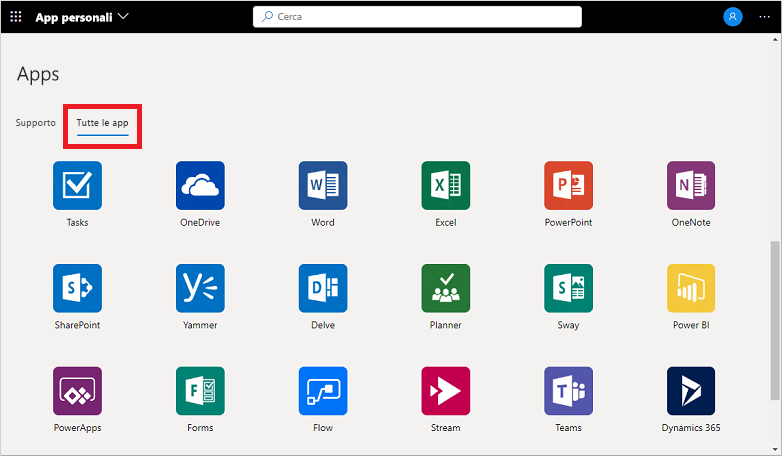
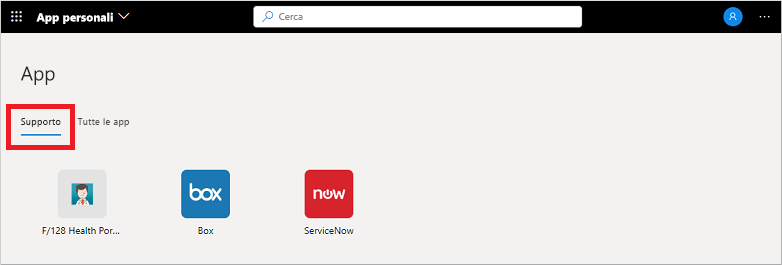

# Accedere e usare le aree di lavoro nel portale App personali (anteprima)

Le aree di lavoro sono le diverse visualizzazioni dell'app presenti nel portale **App personali** (anteprima). Le app, ad esempio, possono essere raggruppate in aree di lavoro per reparto, funzione o ruolo utente. Se non sono disponibili aree di lavoro o categorie, l'amministratore non le ha configurate né condivise con l'utente. Rivolgersi al supporto tecnico dell'organizzazione per ottenere assistenza o autorizzazioni aggiuntive per visualizzare le aree di lavoro condivise.

[!INCLUDE [preview-notice](../../../includes/active-directory-end-user-my-apps-and-workspaces.md)]

>[!Important]
>Questo contenuto è destinato agli utenti. Gli amministratori possono trovare altre informazioni su come configurare e gestire le app basate sul cloud nella [documentazione di Gestione applicazioni](https://docs.microsoft.com/azure/active-directory/manage-apps/access-panel-workspaces).

## Accedere alle app usando le aree di lavoro

Per impostazione predefinita, l'elenco delle aree di lavoro nel portale **App personali** ne mostra una denominata **Tutte le app**, in cui sono presenti tutte le app a cui l'utente può accedere:

Qualsiasi altra area di lavoro visualizzata in questo elenco è stata creata dall'amministratore e condivisa con l'utente. È possibile scegliere una delle aree di lavoro per visualizzare un set più specifico di app, ad esempio *Supporto* nell'esempio seguente:

Quando si seleziona e si visualizza un'area di lavoro, vengono visualizzate solo le applicazioni predefinite per cui si dispone dell'accesso.

## Passaggi successivi

Dopo aver organizzato le app nelle diverse categorie nel portale **App personali**, è possibile:

- Esaminare, aggiornare o revocare le autorizzazioni concesse alle applicazioni. Per altre informazioni, vedere [Modificare o revocare le autorizzazione nel portale App personali (anteprima)](my-applications-portal-permissions-saved-accounts.md).

## Articoli correlati

- [Aggiornare le informazioni su profilo e account](my-account-portal-overview.md). Istruzioni su come aggiornare le informazioni personali visualizzate nel portale **Profilo personale** (anteprima).

- [Gestire le organizzazioni](my-account-portal-organizations-page.md). Istruzioni su come visualizzare e gestire le informazioni relative all'organizzazione nella pagina **Organizzazioni** del portale **Profilo personale**.

- [Gestire i dispositivi connessi](my-account-portal-devices-page.md). Istruzioni su come gestire i dispositivi a cui si è connessi con l'account aziendale o dell'istituto di istruzione nella pagina **Dispositivi** del portale **Profilo personale**.