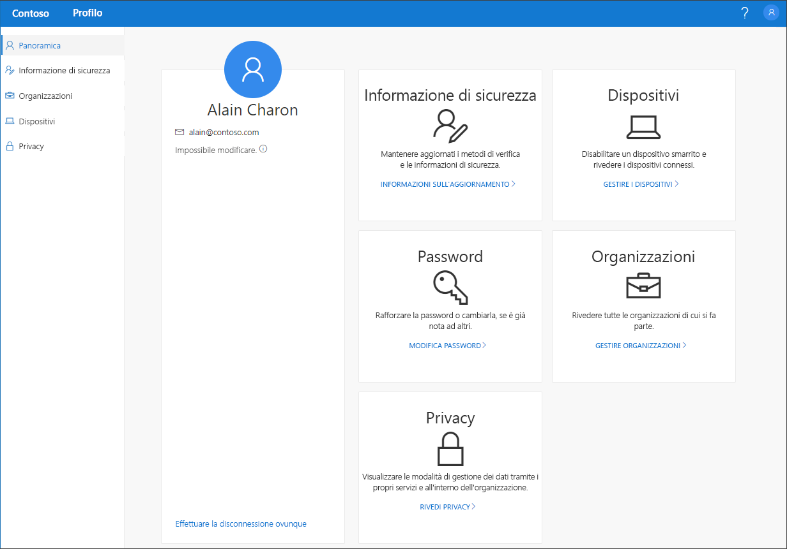

# Panoramica del portale Profilo personale (anteprima)

[!INCLUDE [preview-notice](../../../includes/active-directory-end-user-preview-notice-myprofile.md)]

Il portale **Profilo personale** (anteprima) consente di gestire l'account aziendale o dell'istituto di istruzione configurando e gestendo le informazioni di sicurezza, gestendo le organizzazioni e i dispositivi connessi e visualizzando come vengono usati i dati nell'organizzazione.

>[!Important]
>Questo contenuto è destinato agli utenti. Gli amministratori possono trovare altre informazioni su come configurare e gestire l'ambiente Azure Active Directory (Azure AD) nella [documentazione di Azure Active Directory](https://docs.microsoft.com/azure/active-directory).

## Passare al portale Profilo personale

È possibile accedere al portale **Profilo personale** (https://myprofile.microsoft.com)), dalla versione corrente di uno qualsiasi dei browser seguenti:

- Chrome
- Microsoft Edge
- Safari
- Firefox
- Internet Explorer 11

## Articoli sul portale Profilo personale

Per informazioni dettagliate e istruzioni sul contenuto disponibile nel portale **Profilo personale**, vedere gli articoli seguenti:

|Articolo |DESCRIZIONE |
|------|------------|
|[Aggiungere l'informazione di sicurezza](user-help-security-info-overview.md)| Diversi articoli on istruzioni su come configurare l'app Microsoft Authenticator, gli SMS o le telefonate come metodo di verifica. Sono inoltre inclusi articoli su come aggiungere un indirizzo di posta elettronica o le domande di sicurezza predefinite in modo da reimpostare autonomamente la propria password dimenticata, se necessario.|
|[Visualizzare o rimuovere le organizzazioni connesse](myprofile-portal-organizations-page.md)| Istruzioni su come visualizzare e rimuovere le organizzazioni connesse all'account aziendale o dell'istituto di istruzione.|
|[Visualizzare o disabilitare i dispositivi connessi](myprofile-portal-devices-page.md)| Istruzioni su come visualizzare e disabilitare i dispositivi connessi all'account aziendale o dell'istituto di istruzione.|
|[Visualizzare le informazioni relative alla privacy](myprofile-portal-privacy-page.md)| Istruzioni su come visualizzare i servizi online connessi all'account aziendale o dell'istituto di istruzione, insieme alle condizioni per l'utilizzo dell'organizzazione.|