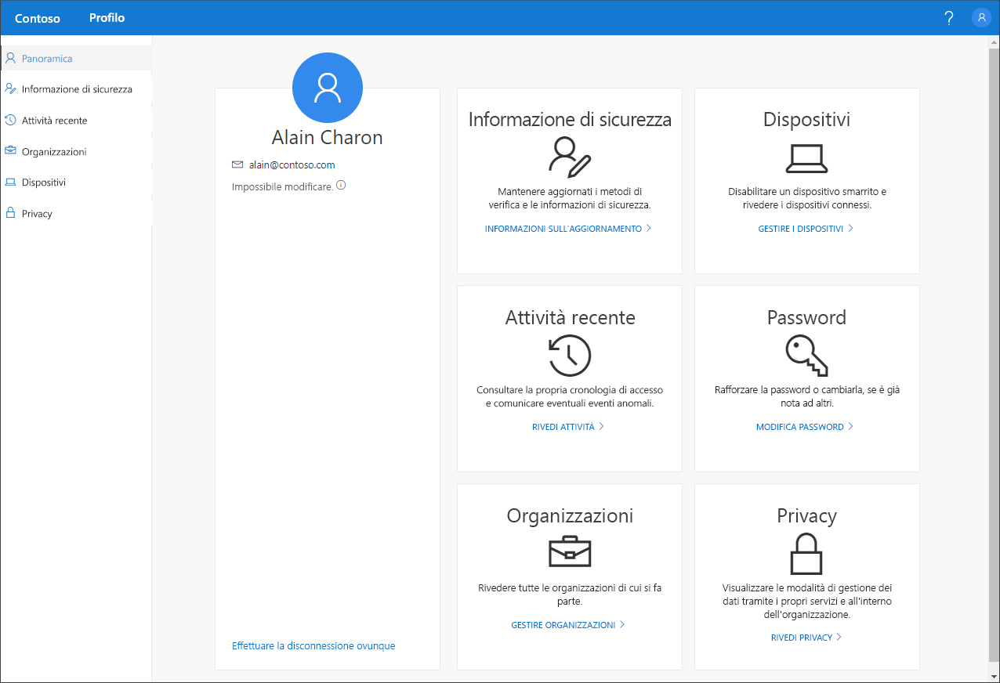

# Panoramica del portale Profilo personale (anteprima)

[!INCLUDE [preview-notice](../../../includes/active-directory-end-user-preview-notice-myprofile.md)]

È possibile usare il portale **Profilo personale** (anteprima) per gestire l'account aziendale o dell'istituto di istruzione allo scopo di:

- Configurare le informazioni di sicurezza per la verifica in due passaggi e la reimpostazione della password.

- Visualizzare l'attività di accesso.

- Gestire le organizzazioni e i dispositivi connessi.

- Visualizzare come vengono usati i dati dall'organizzazione.

>[!Important]
>Questo contenuto è destinato agli utenti. Gli amministratori possono trovare altre informazioni su come configurare e gestire l'ambiente Azure Active Directory (Azure AD) nella [documentazione di Azure Active Directory](https://docs.microsoft.com/azure/active-directory).

## Accedere al portale Profilo personale
È possibile accedere al portale **Profilo personale** passando a https://myprofile.microsoft.com, dalla versione corrente di uno qualsiasi dei browser seguenti:

- Chrome
- Microsoft Edge
- Safari
- Firefox
- Internet Explorer 11

    

## Contenuto della sezione
Per altre informazioni sul portale **Profilo personale** e le relative pagine, vedere gli articoli seguenti.

|Articolo |DESCRIZIONE |
|------|------------|
|[Gestire le informazioni di sicurezza (anteprima)](user-help-security-info-overview.md)|Descrive come configurare e gestire le informazioni di sicurezza.|
|[Visualizzare l'attività di accesso recente](myprofile-portal-recent-activity-page.md)|Descrive come visualizzare l'attività di accesso recente per l'account aziendale o dell'istituto di istruzione.|
|[Gestire le organizzazioni](myprofile-portal-organizations-page.md)|Descrive come gestire le organizzazioni connesse all'account aziendale o dell'istituto di istruzione.|
|[Gestire i dispositivi connessi](myprofile-portal-devices-page.md)| Descrive come gestire i dispositivi connessi all'account aziendale o dell'istituto di istruzione.|
|[Visualizzare le informazioni relative alla privacy](myprofile-portal-privacy-page.md)|Descrive come verificare come vengono usati i propri dati dall'organizzazione.|