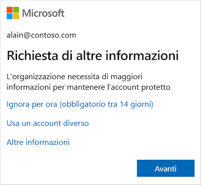
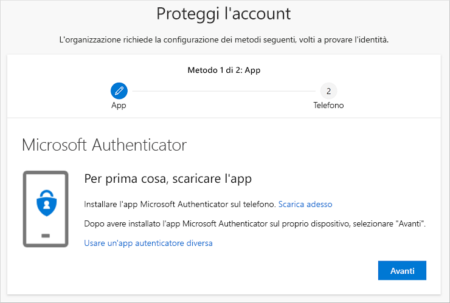
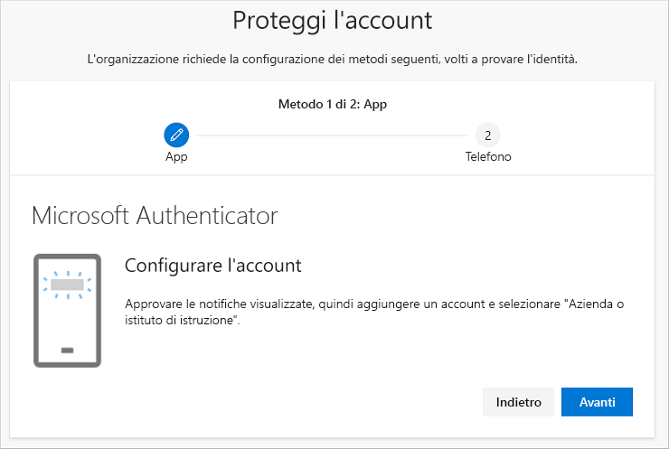
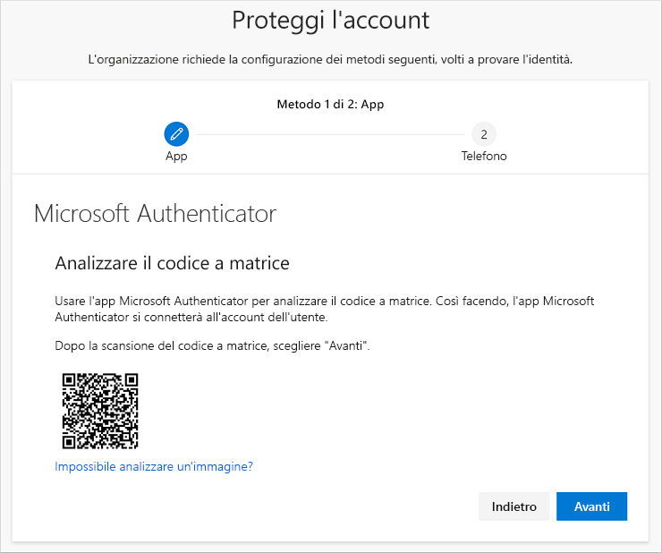
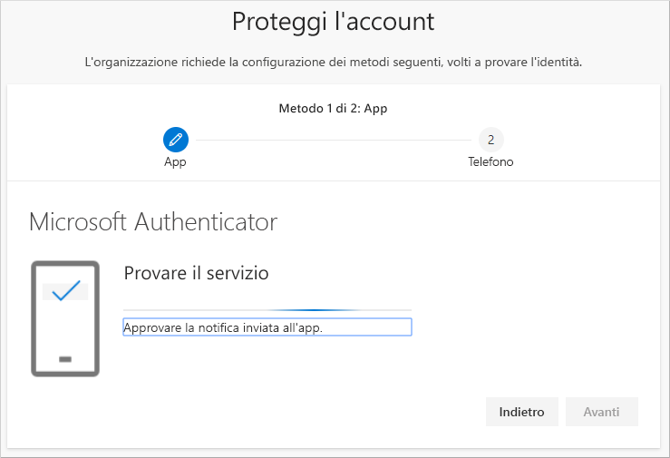
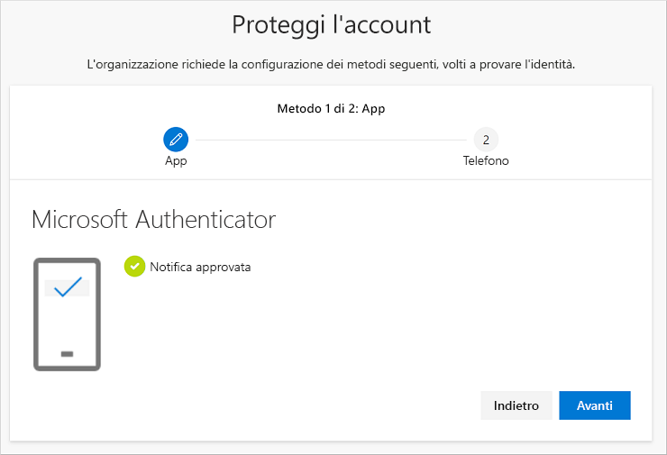
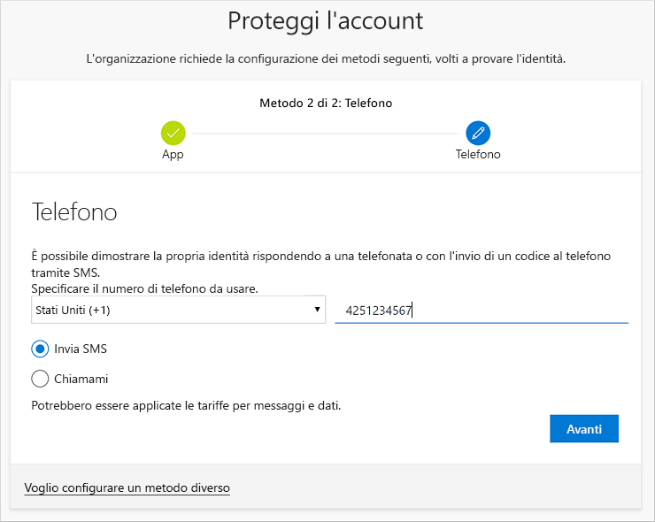
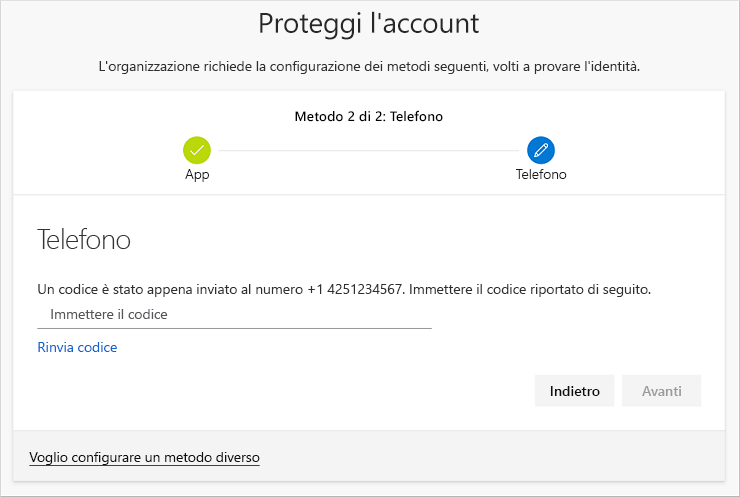
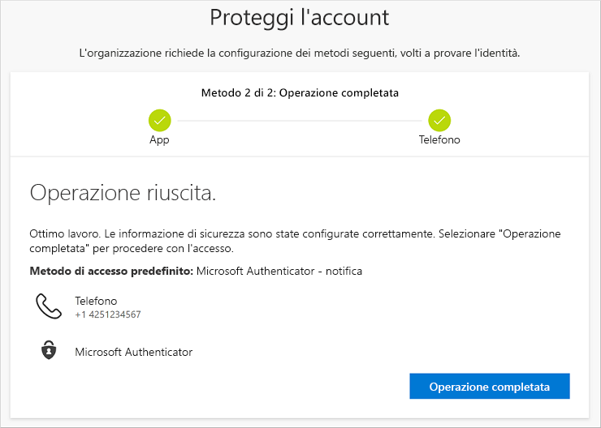

# Configurare le informazioni di sicurezza (anteprima) dal messaggio di richiesta della pagina di accesso

È possibile seguire questa procedura se subito dopo l'accesso all'account aziendale o dell'istituto di istruzione viene richiesto di configurare le informazioni di sicurezza.

Questo messaggio di richiesta verrà visualizzato solo se non si sono ancora configurate le informazioni di sicurezza richieste dall'organizzazione. Se sono state configurate in precedenza ma si vogliono apportare modifiche, è possibile seguire i passaggi illustrati nei vari articoli sulle procedure in base al metodo. Per altre informazioni, vedere la [panoramica su come aggiungere o aggiornare le informazioni di sicurezza](security-info-add-update-methods-overview.md).

[!INCLUDE [preview-notice](../../../includes/active-directory-end-user-preview-notice-security-info.md)]

## Accedere all'account aziendale o dell'istituto di istruzione

Dopo che si è eseguito l'accesso all'account aziendale o dell'istituto di istruzione, prima di poter accedere all'account verrà visualizzata la richiesta di specificare altre informazioni.

## Configurare le informazioni di sicurezza con la procedura guidata

Seguire questa procedura per configurare le informazioni di sicurezza per l'account aziendale o dell'istituto di istruzione dal messaggio di richiesta.

>[!Important]
>Questo è solo un esempio del processo. A seconda dei requisiti dell'organizzazione, l'amministratore potrebbe aver configurato altri metodi di verifica da configurare durante questo processo. In questo esempio si richiedono due metodi: l'app Microsoft Authenticator e un numero di telefono cellulare per SMS o chiamate di verifica.

1. Dopo che si è selezionato **Avanti** nel messaggio di richiesta, verrà visualizzata la procedura guidata **Proteggi l'account** con il primo metodo che l'amministratore e l'organizzazione richiedono di configurare. In questo esempio è l'app Microsoft Authenticator.

   > [!Note]
   > Se si vuole usare un'app di autenticazione diversa dall'app Microsoft Authenticator, selezionare il collegamento **Voglio usare un'app di autenticazione diversa**.
   >
   > Se l'organizzazione consente di scegliere un metodo diverso oltre all'app di autenticazione, è possibile selezionare il collegamento **Si vuole configurare un metodo diverso**.

    

2. Selezionare **Scarica adesso** per scaricare e installare l'app Microsoft Authenticator sul dispositivo mobile e quindi selezionare **Avanti**. Per altre informazioni su come scaricare e installare l'app, vedere [Scaricare e installare l'app Microsoft Authenticator](user-help-auth-app-download-install.md).

    

3. Mantenere aperta la pagina **Configura l'account** mentre si configura l'app Microsoft Authenticator sul dispositivo mobile.

4. Aprire l'app Microsoft Authenticator, scegliere di consentire le notifiche (se richiesto) e selezionare **Aggiungi account** dall'icona **Customize and control** (Personalizza e controlla) in alto a destra e quindi **Account aziendale o dell'istituto di istruzione**.

5. Tornare alla pagina **Configura l'account** sul computer e quindi selezionare **Avanti**.

    Verrà visualizzata la pagina **Esegui la scansione del codice a matrice**.

    

6. Effettuare la scansione del codice fornito con il lettore di codice a matrice dell'app Microsoft Authenticator, visualizzato sul dispositivo mobile dopo la creazione dell'account aziendale o dell'istituto di istruzione nel passaggio 5.

    L'app Authenticator dovrebbe completare l'aggiunta dell'account aziendale o dell'istituto di istruzione senza richiedere altre informazioni. Se invece il lettore di codice a matrice non riesce a leggere il codice, è possibile selezionare il link **Non è possibile eseguire la scansione del codice a matrice** e immettere manualmente il codice e l'URL nell'app Microsoft Authenticator. Per altre informazioni sull'aggiunta manuale di un codice, vedere [Aggiungere manualmente un account all'app](user-help-auth-app-add-account-manual.md).

7. Selezionare **Avanti** nella pagina **Esegui la scansione del codice a matrice** sul computer.

    Verrà inviata una notifica all'app Microsoft Authenticator sul dispositivo mobile per testare l'account.

    

8. Approvare la notifica nell'app Microsoft Authenticator, quindi selezionare **Avanti**.

    .

    Le informazioni di sicurezza vengono aggiornate in modo da usare per impostazione predefinita l'app Microsoft Authenticator per verificare l'identità quando viene usata la verifica in due passaggi o la reimpostazione della password.

9. Nella pagina di configurazione **Telefono** scegliere se si vuole ricevere un SMS o una telefonata e quindi selezionare **Avanti**. Ai fini di questo esempio si usano SMS, quindi è necessario usare il numero di telefono di un dispositivo che può accettare SMS.

    

    Verrà inviato un SMS al numero di telefono. Se si preferisce ricevere una telefonata, il processo è lo stesso. Si riceverà però una telefonata con istruzioni invece di un SMS.

10. Immettere il codice contenuto nell'SMS inviato al dispositivo mobile e quindi selezionare **Avanti**.

    

11. Esaminare la notifica di operazione riuscita e quindi selezionare **Fine**.

    

    Le informazioni di sicurezza vengono aggiornate in modo da usare l'invio di SMS come metodo di backup per verificare l'identità quando viene usata la verifica in due passaggi o la reimpostazione della password.

12. Esaminare la pagina **Operazione riuscita** per verificare di aver configurato correttamente per le informazioni di sicurezza sia l'app Microsoft Authenticator sia un metodo tramite telefono (SMS o telefonata) e quindi selezionare **Fine**.

    

## Passaggi successivi

- Per modificare, eliminare o aggiornare i metodi di gestione delle informazioni di sicurezza predefiniti, vedere:

    - [Configurare le informazioni di sicurezza per l'uso di un'app di autenticazione](security-info-setup-auth-app.md).

    - [Configurare le informazioni di sicurezza per l'uso di SMS](security-info-setup-text-msg.md).

    - [Configurare le informazioni di sicurezza per l'uso di chiamate telefoniche](security-info-setup-phone-number.md).

    - [Configurare le informazioni di sicurezza per l'uso della posta elettronica ](security-info-setup-email.md).

    - [Configurare le informazioni di sicurezza per l'uso di domande di sicurezza predefinite](security-info-setup-questions.md).

- Per informazioni su come eseguire l'accesso usando il metodo specificato, vedere [Come effettuare l'accesso](user-help-sign-in.md).

- Se la password viene persa o dimenticata, reimpostarla dal [portale per la reimpostazione della password](https://passwordreset.microsoftonline.com/) oppure seguire i passaggi nell'articolo [Reimpostare la password aziendale o dell'istituto di istruzione](user-help-reset-password.md).

- Ottenere informazioni e suggerimenti per la risoluzione dei problemi di accesso nell'articolo [Quando non riesci ad accedere al tuo account Microsoft](https://support.microsoft.com/help/12429/microsoft-account-sign-in-cant).
