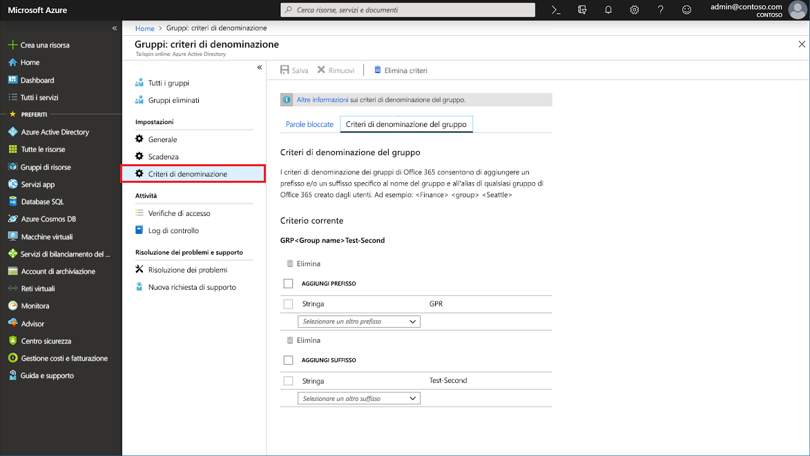
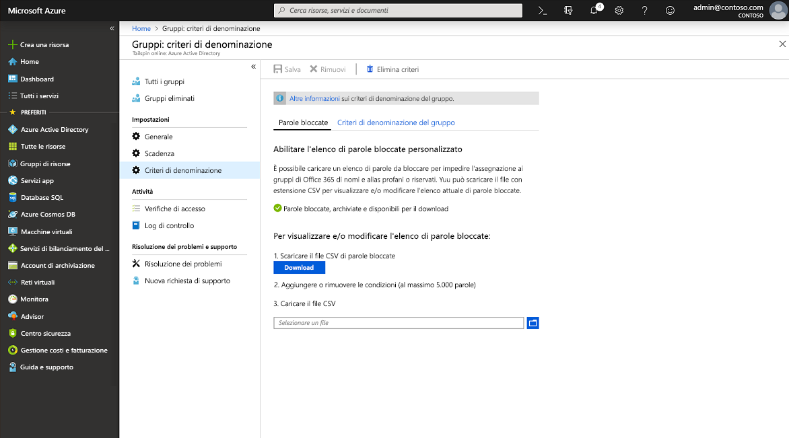

# <a name="enforce-a-naming-policy-on-office-365-groups-in-azure-active-directory"></a>Applicare un criterio di denominazione dei gruppi di Office 365 in Azure Active Directory

Per applicare convenzioni di denominazione coerenti per i gruppi di Office 365 creati o modificati dagli utenti, configurare criteri di denominazione dei gruppi per i tenant in Azure Active Directory (Azure AD). Ad esempio, è possibile usare i criteri di denominazione per comunicare la funzione, l'appartenenza, l'area geografica o il creatore di un gruppo. È anche possibile utilizzare i criteri di denominazione per agevolare la categorizzazione dei gruppi nella Rubrica. È possibile utilizzare i criteri per bloccare l'uso di parole specifiche nei nomi dei gruppi e negli alias.

> [!IMPORTANT]
> Usando criteri di denominazione di Azure AD per i gruppi di Office 365, è necessario possedere, ma non necessariamente assegnare una licenza di Azure Active Directory Premium P1 o Azure AD Basic EDU per ogni singolo utente che è un membro di uno o più gruppi di Office 365.

I criteri di denominazione sono applicati per creare o modificare i gruppi creati per più carichi di lavoro (ad esempio Outlook, Microsoft Teams, SharePoint, Exchange o Planner). Vengono applicati al nome e all'alias del gruppo. Se si imposta i criteri di denominazione in Azure AD e si dispone di criteri di denominazione dei gruppi di Exchange esistenti, il criterio di denominazione di Azure AD viene applicato all'interno dell'organizzazione.

## <a name="naming-policy-features"></a>Funzionalità dei criteri di denominazione

È possibile applicare criteri di denominazione per i gruppi in due modi diversi:

- **Criteri di denominazione prefisso-suffisso** È possibile definire prefissi o suffissi che vengono aggiunti automaticamente per applicare una convenzione di denominazione ai gruppi (ad esempio nel nome del gruppo "GRP\_GIAPPONE\_Gruppo\_Ingegneria", GRP\_GIAPPONE\_ è il prefisso e \_Ingegneria è il suffisso). 

- **Parole personalizzate bloccate** È possibile caricare un set di parole bloccate specifiche di un'organizzazione da bloccare nei gruppi creati dagli utenti (ad esempio "CEO, Salari, HR").

### <a name="prefix-suffix-naming-policy"></a>Criteri di denominazione prefisso-suffisso

La struttura generale della convenzione di denominazione è "Prefisso[NomeGruppo]Suffisso. Benché sia possibile definire più prefissi e suffissi, ci può essere una sola istanza di [NomeGruppo] nell'impostazione. I prefissi o i suffissi possono essere stringhe fisse o attributi utente, ad esempio \[Reparto\], che vengono sostituiti in base all'utente che crea il gruppo. Il numero massimo di caratteri consentito per le stringhe di prefisso e suffisso combinati è di 53 caratteri. 

I prefissi e i suffissi possono contenere caratteri speciali supportati nel nome e nell'alias del gruppo. I caratteri di prefisso o suffisso che non sono supportati nell'alias del gruppo sono comunque applicati al nome del gruppo, ma vengono rimossi dall'alias del gruppo. A causa di questa restrizione, i prefissi e i suffissi applicati al nome del gruppo potrebbero essere diversi da quelli applicati all'alias del gruppo. 

#### <a name="fixed-strings"></a>Stringhe fisse

È possibile utilizzare le stringhe per agevolare l'analisi e la differenziazione dei gruppi nell'elenco indirizzi globale e nei collegamenti della barra di spostamento sinistra dei carichi di lavoro dei gruppi. Alcuni dei prefissi comuni sono parole chiave come "Grp\_Nome", "\#Nome", "\_Nome"

#### <a name="user-attributes"></a>Attributi utente

È possibile utilizzare gli attributi che possono agevolare l'identificazione del reparto, dell'ufficio o dell'area geografica per cui è stato creato il gruppo. Ad esempio, se si definiscono criteri di denominazione come `PrefixSuffixNamingRequirement = "GRP [GroupName] [Department]"` e `User’s department = Engineering`, un nome di gruppo imposto potrebbe essere "GRP Gruppo Ingegneria". Gli attributi di Azure AD supportati sono \[Department\], \[Company\], \[Office\], \[StateOrProvince\], \[CountryOrRegion \], \[Title\]. Gli attributi utente non supportati sono considerati stringhe fisse, ad esempio "\[postalCode\]". Gli attributi di estensione e quelli personalizzati non sono supportati.

È consigliabile utilizzare gli attributi con valori compilati per tutti gli utenti dell'organizzazione e non attributi con valori long.

### <a name="custom-blocked-words"></a>Parole bloccate personalizzate

Un elenco di parole bloccate è un elenco di frasi delimitato da virgole da bloccare nei nomi e negli alias dei gruppi. Non vengono eseguite ricerche delle sottostringhe. È necessaria una corrispondenza esatta tra il nome del gruppo e una o più parole bloccate personalizzate per generare un errore. La ricerca delle sottostringhe non viene eseguita per permettere agli utenti di usare parole comuni come 'Classe' anche se 'asse' è una parola bloccata.

Regole dell'elenco di parole bloccate:

- Le parole bloccate non fanno distinzione tra maiuscole/minuscole.
- Quando un utente immette una parola bloccata come parte del nome di un gruppo, viene visualizzato un messaggio di errore con la parola bloccata.
- Non sono previste limitazioni di carattere nelle parole bloccate.
- È previsto un limite massimo di 5000 frasi che possono essere configurate nell'elenco di parole bloccate. 

### <a name="administrator-override"></a>Esenzione dell'amministratore

Alcuni amministratori possono essere esentati da questi criteri, in tutti i carichi di lavoro di gruppo e gli endpoint, per permettere loro di creare gruppi utilizzando le parole bloccate e convenzioni di denominazione personalizzate. Di seguito è riportato l'elenco dei ruoli di amministratore esentati dai criteri di denominazione dei gruppi.

- Amministratore globale
- Supporto di livello 1 partner
- Supporto di livello 2 partner
- Amministratore utenti
- Writer di directory

## <a name="configure-naming-policy-in-azure-portal"></a>Configurare criteri di denominazione nel portale di Azure

1. Accedere all'[interfaccia di amministrazione di Azure AD](https://aad.portal.azure.com) con un account Amministratore utenti.
1. Selezionare **Gruppi** e quindi **Criteri di denominazione** per visualizzare la pagina corrispondente.

    

### <a name="view-or-edit-the-prefix-suffix-naming-policy"></a>Visualizzare o modificare i criteri di denominazione prefisso-suffisso

1. Nella pagina **Criteri di denominazione** fare clic su **Criteri di denominazione del gruppo**.
1. È possibile visualizzare o modificare singolarmente i criteri di denominazione correnti per il prefisso o il suffisso selezionando gli attributi o le stringhe da applicare come parte dei criteri di denominazione.
1. Per rimuovere un prefisso o un suffisso dall'elenco, selezionare il prefisso o il suffisso desiderato e quindi fare clic su **Elimina**. È possibile eliminare più elementi contemporaneamente.
1. Salvare le modifiche per i nuovi criteri per renderla effettiva selezionando **salvare**.

### <a name="edit-custom-blocked-words"></a>Modificare parole bloccate personalizzate

1. Nella pagina **Criteri di denominazione** fare clic su **Parole bloccate**.

    

1. Visualizzare o modificare l'elenco corrente di parole bloccate personalizzate facendo clic su **Scarica**.
1. Caricare il nuovo elenco di parole bloccate personalizzate facendo clic sull'icona del file.
1. Salvare le modifiche per i nuovi criteri per renderla effettiva selezionando **salvare**.

## <a name="install-powershell-cmdlets"></a>Installare i cmdlet di PowerShell

Assicurarsi di disinstallare qualsiasi versione precedente di Azure Active Directory PowerShell per Graph Module per Windows PowerShell e installare [Azure Active Directory PowerShell Graph, versione di anteprima pubblica 2.0.0.137](https://www.powershellgallery.com/packages/AzureADPreview/2.0.0.137), prima di eseguire i comandi di PowerShell.

1. Aprire l'app Windows PowerShell come amministratore.
2. Disinstallare qualsiasi versione precedente di AzureADPreview.
  
   ``` PowerShell
   Uninstall-Module AzureADPreview
   ```

3. Installare la versione più recente di AzureADPreview.
  
   ``` PowerShell
   Install-Module AzureADPreview
   ```

   Se sono richieste sull'accesso a un repository non attendibile, immettere **Y**. L'installazione del nuovo modulo potrebbe richiedere alcuni minuti.

## <a name="configure-naming-policy-in-powershell"></a>Configurare criteri di denominazione in PowerShell

1. Aprire una finestra di Windows PowerShell nel computer in uso. È possibile aprirla senza privilegi elevati.

1. Eseguire i comandi seguenti per preparare l'esecuzione dei cmdlet.
  
   ``` PowerShell
   Import-Module AzureADPreview
   Connect-AzureAD
   ```

   Nella schermata **Accedi all'account** che viene aperta, immettere account e password amministratore per connettersi al servizio e selezionare **Accedi**.

1. Seguire i passaggi in [Cmdlet di Azure Active Directory per la configurazione delle impostazioni di gruppo](groups-settings-cmdlets.md) per creare impostazioni di gruppo per questo tenant.

### <a name="view-the-current-settings"></a>Visualizzare le impostazioni correnti

1. Recuperare i criteri di denominazione correnti per visualizzare le impostazioni correnti.
  
   ``` PowerShell
   $Setting = Get-AzureADDirectorySetting -Id (Get-AzureADDirectorySetting | where -Property DisplayName -Value "Group.Unified" -EQ).id
   ```
  
1. Visualizzare le impostazioni del gruppo corrente.
  
   ``` PowerShell
   $Setting.Values
   ```
  
### <a name="set-the-naming-policy-and-custom-blocked-words"></a>Impostare i criteri di denominazione e le parole bloccate personalizzate

1. Impostare prefissi e suffissi dei nomi di gruppo in Azure AD PowerShell. Per un corretto funzionamento [GroupName] deve essere incluso nell'impostazione.
  
   ``` PowerShell
   $Setting["PrefixSuffixNamingRequirement"] =“GRP_[GroupName]_[Department]"
   ```
  
1. Impostare le parole bloccate personalizzate da limitare. Nell'esempio seguente viene illustrato come aggiungere le parole personalizzate.
  
   ``` PowerShell
   $Setting["CustomBlockedWordsList"]=“Payroll,CEO,HR"
   ```
  
1. Salvare le impostazioni per i nuovi criteri per renderla effettiva, come nell'esempio seguente.
  
   ``` PowerShell
   Set-AzureADDirectorySetting -Id (Get-AzureADDirectorySetting | where -Property DisplayName -Value "Group.Unified" -EQ).id -DirectorySetting $Setting
   ```
  
È tutto. Sono stati impostati criteri di denominazione e sono state aggiunte le parole bloccate.

## <a name="export-or-import-custom-blocked-words"></a>Esportare o importare parole bloccate personalizzate

Per altre informazioni, vedere l'articolo [Cmdlet di Azure Active Directory per la configurazione delle impostazioni di gruppo](groups-settings-cmdlets.md).

Di seguito è riportato un esempio di script di PowerShell per esportare più parole bloccate:

``` PowerShell
$Words = (Get-AzureADDirectorySetting).Values | Where-Object -Property Name -Value CustomBlockedWordsList -EQ 
Add-Content "c:\work\currentblockedwordslist.txt" -Value $words.value.Split(",").Replace("`"","")  
```

Di seguito è riportato un esempio di script di PowerShell per importare più parole bloccate:

``` PowerShell
$BadWords = Get-Content "C:\work\currentblockedwordslist.txt"
$BadWords = [string]::join(",", $BadWords)
$Settings = Get-AzureADDirectorySetting | Where-Object {$_.DisplayName -eq "Group.Unified"}
if ($Settings.Count -eq 0)
    {$Template = Get-AzureADDirectorySettingTemplate | Where-Object {$_.DisplayName -eq "Group.Unified"}
    $Settings = $Template.CreateDirectorySetting()
    New-AzureADDirectorySetting -DirectorySetting $Settings
    $Settings = Get-AzureADDirectorySetting | Where-Object {$_.DisplayName -eq "Group.Unified"}}
$Settings["CustomBlockedWordsList"] = $BadWords
Set-AzureADDirectorySetting -Id $Settings.Id -DirectorySetting $Settings 
```

## <a name="remove-the-naming-policy"></a>Rimuovere i criteri di denominazione

### <a name="remove-the-naming-policy-using-azure-portal"></a>Rimuovere i criteri di denominazione con il portale di Azure

1. Nella pagina **Criteri di denominazione** fare clic su **Elimina criteri**.
1. Dopo la conferma dell'eliminazione, i criteri di denominazione vengono rimossi, inclusi tutti i criteri di denominazione prefisso-suffisso e le eventuali parole bloccate personalizzate.

### <a name="remove-the-naming-policy-using-azure-ad-powershell"></a>Rimuovere i criteri di denominazione con Azure AD PowerShell

1. Rimuovere prefissi e suffissi dei nomi di gruppo in Azure AD PowerShell.
  
   ``` PowerShell
   $Setting["PrefixSuffixNamingRequirement"] =""
   ```
  
1. Rimuovere le parole bloccate personalizzate.
  
   ``` PowerShell
   $Setting["CustomBlockedWordsList"]=""
   ```
  
1. Salvare le impostazioni.
  
   ``` PowerShell
   Set-AzureADDirectorySetting -Id (Get-AzureADDirectorySetting | where -Property DisplayName -Value "Group.Unified" -EQ).id -DirectorySetting $Setting
   ```

## <a name="experience-across-office-365-apps"></a>Esperienza tra le app di Office 365

Dopo aver impostato criteri di denominazione dei gruppi in Azure AD, quando un utente crea un gruppo in un'app di Office 365, viene visualizzato quanto segue:

- Un'anteprima del nome conforme ai criteri di denominazione (con prefissi e suffissi) non appena l'utente digita il nome del gruppo
- Se l'utente immette parole bloccate, viene visualizzato un messaggio di errore che ne consente la rimozione.

Carico di lavoro | Conformità
----------- | -------------------------------
Portali di Azure Active Directory | Il portale di Azure AD e il portale Riquadro di accesso mostrano il nome imposto dai criteri di denominazione quando l'utente digita il nome del gruppo durante la creazione o la modifica di un gruppo. Se un utente immette una parola bloccata personalizzata, viene visualizzato un messaggio di errore contenente la parola bloccata che ne consente la rimozione.
Outlook Web Access (OWA) | Outlook Web Access mostra il nome imposto dai criteri di denominazione quando l'utente digita un nome o un alias del gruppo. Se un utente immette una parola bloccata personalizzata, nell'interfaccia utente viene visualizzato un messaggio di errore contenente la parola bloccata che ne consente la rimozione.
Desktop Outlook | I gruppi creati nel desktop Outlook sono conformi alle impostazioni dei criteri di denominazione. L'app desktop Outlook non visualizza ancora l'anteprima del nome del gruppo imposto e non restituisce errori per le parole bloccate personalizzate quando l'utente immette il nome del gruppo. Tuttavia, i criteri di denominazione vengono applicati automaticamente durante la creazione o la modifica di un gruppo e vengono visualizzati messaggi di errore se sono presenti parole bloccate personalizzate nel nome o nell'alias del gruppo.
Microsoft Teams | Microsoft Teams mostra il nome imposto dai criteri di denominazione dei gruppi quando l'utente immette un nome di team. Se un utente immette una parola bloccata personalizzata, viene visualizzato un messaggio di errore contenente la parola bloccata che ne consente la rimozione.
SharePoint  |  SharePoint mostra il nome imposto dai criteri di denominazione quando l'utente digita un nome di sito o un indirizzo di posta elettronica del gruppo. Se un utente immette una parola bloccata personalizzata, viene visualizzato un messaggio di errore contenente la parola bloccata che ne consente la rimozione.
Microsoft Stream | Microsoft Stream mostra il nome imposto dai criteri di denominazione dei gruppi quando l'utente digita un nome o un alias di posta elettronica del gruppo. Se un utente immette una parola bloccata personalizzata, viene visualizzato un messaggio di errore contenente la parola bloccata che ne consente la rimozione.
App Outlook per iOS e Android | I gruppi creati nelle app Outlook sono conformi ai criteri di denominazione configurati. L'app per dispositivi mobili Outlook non visualizza ancora l'anteprima del nome imposto dai criteri di denominazione e non restituisce errori per le parole bloccate personalizzate quando l'utente immette il nome del gruppo. Tuttavia, i criteri di denominazione vengono applicati automaticamente quando si fa clic su Crea o Modifica e vengono visualizzati messaggi di errore se sono presenti parole bloccate personalizzate nel nome o nell'alias del gruppo.
App per dispositivi mobili Gruppi | I gruppi creati nell'app per dispositivi mobili Gruppi sono conformi ai criteri di denominazione. L'app per dispositivi mobili Gruppi non visualizza l'anteprima dei criteri di denominazione e non restituisce errori per le parole bloccate personalizzate quando l'utente immette il nome del gruppo. Tuttavia, i criteri di denominazione vengono applicati automaticamente durante la creazione o la modifica di un gruppo e vengono visualizzati messaggi di errore appropriati se sono presenti parole bloccate personalizzate nel nome o nell'alias del gruppo.
Planner | Planner è conforme ai criteri di denominazione. Planner mostra l'anteprima dei criteri di denominazione quando si immette il nome del piano. Se un utente immette una parola bloccata personalizzata, viene visualizzato un messaggio di errore quando si crea il piano.
Dynamics 365 for Customer Engagement | Dynamics 365 for Customer Engagement è conforme ai criteri di denominazione. Dynamics 365 mostra il nome imposto dai criteri di denominazione quando l'utente digita un nome o un alias del gruppo. Se l'utente immette una parola bloccata personalizzata, viene visualizzato un messaggio di errore contenente la parola bloccata che ne consente la rimozione.
School Data Sync (SDS) | I gruppi creati tramite SDS sono conformi ai criteri di denominazione, ma i criteri di denominazione non vengono applicati automaticamente. Gli amministratori SDS devono aggiungere prefissi e suffissi ai nomi di classe per cui occorre creare e caricare i gruppi in SDS. In caso contrario, la creazione o la modifica del gruppo avrà esito negativo.
Outlook Customer Manager (OCM) | Outlook Customer Manager è conforme ai criteri di denominazione, che vengono applicati automaticamente al gruppo creato in Outlook Customer Manager. Se viene rilevata una parola bloccata personalizzata, la creazione del gruppo in OCM viene bloccata e l'utente non può utilizzare l'app OCM.
App Classroom | I gruppi creati nell'app Classroom sono conformi ai criteri di denominazione, ma tali criteri non vengono applicati automaticamente e l'anteprima dei criteri di denominazione non viene visualizzata agli utenti quando immettono un nome per il gruppo della classe. Gli utenti devono immettere il nome per il gruppo della classi imposto con prefissi e suffissi. In caso contrario, l'operazione di creazione o modifica del gruppo della classe ha esito negativo con errori.
Power BI | Le aree di lavoro di Power BI sono conformi ai criteri di denominazione.    
Yammer | Quando un utente connesso a Yammer con il proprio account Azure Active Directory crea un gruppo o modifica il nome di gruppo, quest'ultimo risulterà conforme ai criteri di denominazione. Questo vale sia per i gruppi collegati a Office 365 sia per tutti gli altri gruppi di Yammer.<br>Se un gruppo collegato a Office 365 è stato creato prima che il criterio di denominazione fosse stato stabilito, il nome del gruppo non seguirà automaticamente i criteri di denominazione. Quando un utente modifica il nome del gruppo, gli sarà richiesto di aggiungere il prefisso e suffisso.
StaffHub  | I team StaffHub non seguono i criteri di denominazione, a differenza del gruppo di Office 365 sottostante. Il nome del team StaffHub non applica i prefissi e i suffissi e verifica la presenza di parole bloccate personalizzate. StaffHub tuttavia applica i prefissi e i suffissi e rimuove le parole bloccate dal gruppo di Office 365 sottostante.
PowerShell per Exchange | I cmdlet di PowerShell per Exchange sono conformi ai criteri di denominazione. Gli utenti ricevono messaggi di errore appropriati con prefissi e suffissi suggeriti e relativi alle parole bloccate personalizzate se non seguono i criteri di denominazione nel nome e nell'alias del gruppo (mailNickname).
Cmdlet di PowerShell per Azure Active Directory | I cmdlet di PowerShell per Azure Active Directory sono conformi ai criteri di denominazione. Gli utenti ricevono messaggi di errore appropriati con prefissi e suffissi suggeriti e relativi alle parole bloccate personalizzate se non seguono la convenzione di denominazione nei nomi e negli alias del gruppo.
Interfaccia di amministrazione di Exchange | L'interfaccia di amministrazione di Exchange è conforme ai criteri di denominazione. Gli utenti ricevono messaggi di errore appropriati con prefissi e suffissi suggeriti e relativi alle parole bloccate personalizzate se non seguono la convenzione di denominazione nel nome e nell'alias del gruppo.
Interfaccia di amministrazione di Microsoft 365 | Interfaccia di amministrazione di Microsoft 365 è conforme ai criteri di denominazione. Quando un utente crea o modifica i nomi dei gruppi, i criteri di denominazione vengono applicati automaticamente e gli utenti ricevono messaggi di errore appropriati quando immettono parole bloccate personalizzate. L'interfaccia di amministrazione di Microsoft 365 non visualizza ancora l'anteprima dei criteri di denominazione e non restituisce errori per le parole bloccate personalizzate quando l'utente immette il nome del gruppo.

## <a name="next-steps"></a>Passaggi successivi

Questi articoli forniscono informazioni aggiuntive sui gruppi di Azure AD.

- [Vedere i gruppi esistenti](../fundamentals/active-directory-groups-view-azure-portal.md)
- [Criteri di scadenza per i gruppi di Office 365](groups-lifecycle.md)
- [Gestire le impostazioni di un gruppo](../fundamentals/active-directory-groups-settings-azure-portal.md)
- [Gestire i membri di un gruppo](../fundamentals/active-directory-groups-members-azure-portal.md)
- [Gestire le appartenenze di un gruppo](../fundamentals/active-directory-groups-membership-azure-portal.md)
- [Gestire le regole dinamiche per gli utenti in un gruppo](groups-dynamic-membership.md)
