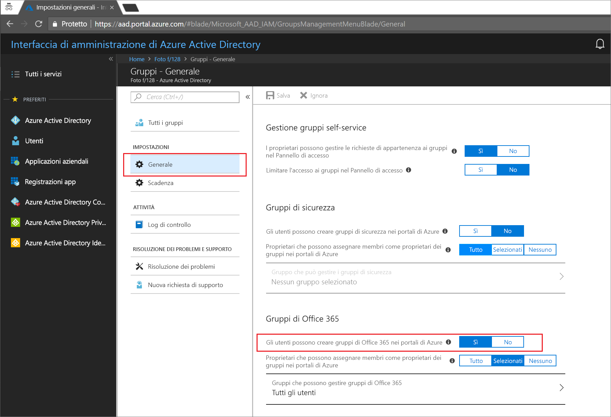
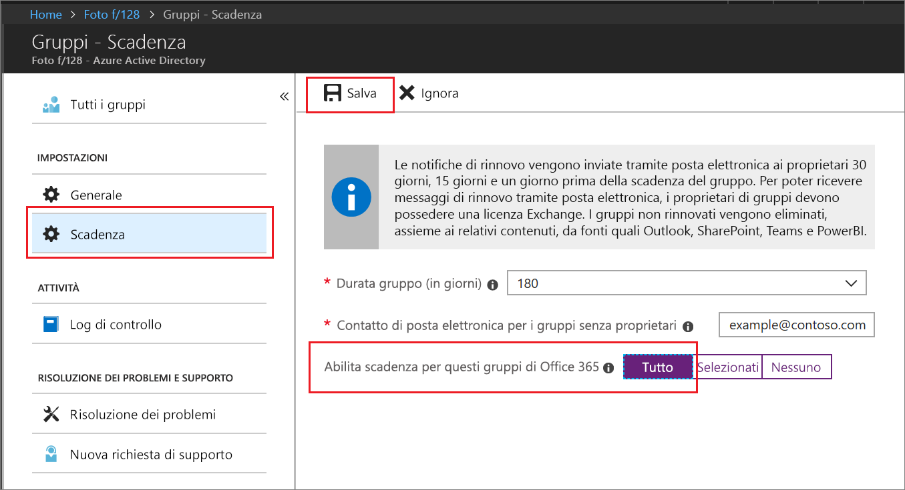

# Avvio rapido: Impostare la scadenza dei gruppi di Office 365 in Azure Active Directory

In questo argomento di avvio rapido si impostano i criteri di scadenza per i gruppi di Office 365. Quando gli utenti possono configurare gruppi personalizzati, i gruppi inutilizzati possono moltiplicarsi. Un modo per gestire i gruppi inutilizzati consiste nell'impostare la scadenza per tali gruppi, per ridurre le attività di manutenzione legate all'eliminazione manuale dei gruppi.

I criteri di scadenza sono semplici:

* I proprietari del gruppo ricevono una notifica per rinnovare un gruppo in scadenza
* Un gruppo che non viene rinnovato viene eliminato
* Un gruppo di Office 365 eliminato può essere ripristinato entro 30 giorni da un proprietario del gruppo o da un amministratore di Azure AD

Se non si ha una sottoscrizione di Azure, [creare un account gratuito](https://azure.microsoft.com/free/) prima di iniziare.

## Prerequisito

Per configurare la scadenza del gruppo, è necessario essere un Amministratore globale o un Amministratore utenti nell'organizzazione.

## Attivare la creazione dei gruppi da parte degli utenti

1. Accedere al [portale di Azure](https://portal.azure.com) con un account di Amministratore globale o Amministratore utenti dell'organizzazione.

2. Selezionare **Gruppi** e quindi selezionare **Generale**.
  
   

3. Impostare **Gli utenti possono creare gruppi di Office 365** su **Sì**.

4. Al termine, selezionare **Salva** per salvare le impostazioni dei gruppi.

## Impostare la scadenza dei gruppi

1. Accedere al [portale di Azure](https://portal.azure.com), selezionare **Azure Active Directory** > **Gruppi** > **Scadenza** per visualizzare le impostazioni di scadenza.
  
   

2. Impostare l'intervallo di scadenza. Selezionare un valore predefinito o immettere un valore personalizzato superiore a 31 giorni. 

3. Specificare un indirizzo e-mail per l'invio delle notifiche di scadenza quando un gruppo non ha un proprietario.

4. Per questo avvio rapido, impostare **Abilita scadenza per questi gruppi di Office 365** su **Tutti**.

5. Al termine, selezionare **Salva** per salvare le impostazioni di scadenza.

L'operazione è terminata. In questo argomento di avvio rapido sono stati impostati criteri di scadenza per i gruppi di Office 365 selezionati.

## Pulire le risorse

### Per rimuovere i criteri di scadenza

1. Assicurarsi di accedere al [portale di Azure](https://portal.azure.com) con un account di amministratore globale per il tenant.
2. Selezionare **Azure Active Directory** > **Gruppi** > **Scadenza**.
3. Impostare **Abilita scadenza per questi gruppi di Office 365** su **Nessuno**.

### Per disattivare la creazione dei gruppi da parte degli utenti

1. Selezionare **Azure Active Directory** > **Gruppi** > **Generale**. 
2. Impostare **Gli utenti possono creare gruppi di Office 365 nei portali di Azure** su **No**.

## Passaggi successivi

Per altre informazioni sulla scadenza, tra cui vincoli tecnici, aggiunta di un elenco di parole bloccate personalizzate ed esperienze degli utenti finali nelle app di Office 365, vedere l'articolo seguente che contiene i dettagli relativi ai criteri di scadenza:

> [!div class="nextstepaction"]
> [Dettagli sui criteri di scadenza](groups-lifecycle.md)
