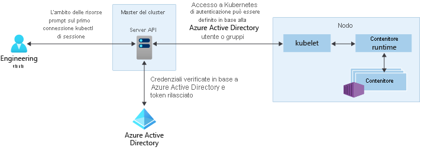

# Opzioni di accesso e identità per il servizio Azure Kubernetes

Esistono diversi modi per eseguire l'autenticazione con i cluster Kubernetes e proteggerli. Usando i controlli degli accessi in base al ruolo, è possibile concedere agli utenti o ai gruppi l'accesso solo alle risorse necessarie. Con il servizio Azure Kubernetes, è possibile migliorare ulteriormente la struttura di autorizzazioni e la sicurezza usando Azure Active Directory. Questi approcci consentono di proteggere i carichi di lavoro dell'applicazione e i dati dei clienti.

Questo articolo introduce i principali concetti utili per l'autenticazione e l'assegnazione di autorizzazioni nel servizio Kubernetes di Azure:

- [Account del servizio Kubernetes](#kubernetes-service-accounts)
- [Integrazione di Azure Active Directory](#azure-active-directory-integration)
- [Controlli degli accessi in base al ruolo](#role-based-access-controls-rbac)
- [Role e ClusterRole](#roles-and-clusterroles)
- [RoleBinding e ClusterRoleBinding](#rolebindings-and-clusterrolebindings)

## Account del servizio Kubernetes

Uno dei tipi di utenti primari in Kubernetes è un *account del servizio*. Un account del servizio esiste ed è gestito nell'API Kubernetes. Le credenziali per gli account del servizio vengono archiviate come segreti di Kubernetes e possono quindi essere usate da pod autorizzati a comunicare con il server dell'API. La maggior parte delle richieste dell'API fornisce un token di autenticazione per un account del servizio o un account utente normale.

Gli account utente normali consentono un accesso più tradizionale per amministratori o sviluppatori umani, non solo per servizi e processi. Kubernetes non fornisce una soluzione di gestione delle identità in cui sono archiviati i normali account utente e password, ma è possibile integrare in Kubernetes soluzioni di gestione delle identità esterne. Per i cluster del servizio Kubernetes di Azure, la soluzione integrata di gestione delle identità è Azure Active Directory.

Per altre informazioni sulle opzioni di gestione delle identità in Kubernetes, vedere [Kubernetes authentication][kubernetes-authentication] (Autenticazione di Kubernetes).

## Integrazione di Azure Active Directory

È possibile migliorare la sicurezza dei cluster del servizio Kubernetes di Azure con l'integrazione di Azure Active Directory (AD). Azure Active Directory (Azure AD), nato da decenni di esperienza nella gestione delle identità aziendali, è un servizio directory e di gestione delle identità basato sul cloud multi-tenant, che combina i principali servizi directory, la gestione dell'accesso alle applicazioni e la protezione delle identità. Con Azure AD, è possibile integrare le identità locali nei cluster del servizio Kubernetes di Azure per offrire un'unica origine per la sicurezza e la gestione degli account.

Con i cluster del servizio Kubernetes di Azure integrati in AD Azure, è possibile concedere agli utenti o ai gruppi l'accesso alle risorse di Kubernetes all'interno di uno spazio dei nomi o nel cluster. Per ottenere un contesto di configurazione `kubectl`, un utente può eseguire il comando [az aks get-credentials][az-aks-get-credentials]. Quando un utente interagisce quindi con il cluster del servizio Kubernetes di Azure usando `kubectl`, gli viene chiesto di accedere con le credenziali di Azure AD. Questo approccio fornisce un'unica origine per la gestione degli account utente e le credenziali della password. L'utente può accedere solo risorse definite dall'amministratore del cluster.

L'autenticazione di Azure AD nei cluster del servizio Kubernetes di Azure usa OpenID Connect, un livello di identità basato sul protocollo OAuth 2.0. OAuth 2.0 definisce i meccanismi per ottenere e usare i token di accesso per accedere alle risorse protette e OpenID Connect implementa l'autenticazione come estensione al processo di autorizzazione di OAuth 2.0. Per altre informazioni su OpenID Connect, vedere la [documentazione di OpenID Connect][openid-connect]. Per verificare i token di autenticazione ottenuti da Azure AD tramite OpenID Connect, i cluster del servizio Kubernetes di Azure usano l'autenticazione del token del webhook di Kubernetes. Per altre informazioni, vedere la [documentazione sull'autenticazione del token del webhook][webhook-token-docs].

## Controlli degli accessi in base al ruolo

Per fornire un filtro granulare delle azioni che gli utenti possono eseguire, Kubernetes usa i controlli degli accessi in base al ruolo. Questo meccanismo di controllo consente di assegnare agli utenti o ai gruppi di utenti l'autorizzazione per eseguire operazioni come la creazione o la modifica di risorse oppure la visualizzazione di log generati dall'esecuzione dei carichi di lavoro dell'applicazione. È possibile definire l'ambito di queste autorizzazioni in un singolo spazio dei nomi o concederle nell'intero cluster del servizio Kubernetes di Azure. Con il controllo degli accessi in base al ruolo, si creano i *ruoli* per definire le autorizzazioni e quindi si assegnano tali ruoli agli utenti con le *associazioni dei ruoli*.

Per altre informazioni, vedere [Uso di autorizzazioni del controllo degli accessi in base al ruolo][kubernetes-rbac].

### Controlli degli accessi in base al ruolo di Azure
Un meccanismo aggiuntivo per il controllo dell'accesso alle risorse è costituito dai controlli degli accessi in base al ruolo di Azure. Il controllo degli accessi in base al ruolo di Kubernetes è progettato per usare le risorse nel cluster del servizio Kubernetes di Azure, mentre il controllo degli accessi in base al ruolo di Azure è progettato per usare le risorse nella sottoscrizione di Azure. Con il controllo degli accessi in base al ruolo di Azure si crea una *definizione del ruolo* che determina le autorizzazioni da applicare. Questa definizione del ruolo viene quindi assegnata a un utente o a un gruppo per un particolare *ambito*, che può essere una singola risorsa o gruppo di risorse oppure l'intera sottoscrizione.

Per altre informazioni, vedere [Informazioni sul controllo degli accessi in base al ruolo di Azure][azure-rbac].

## Role e ClusterRole

Prima di assegnare le autorizzazioni agli utenti con il controllo degli accessi in base al ruolo di Kubernetes, si definiscono tali autorizzazioni come *Role*. I ruoli di Kubernetes *concedono* le autorizzazioni. Non è possibile *negare* un'autorizzazione.

I ruoli vengono usati per concedere le autorizzazioni all'interno di uno spazio dei nomi. Se è necessario concedere le autorizzazioni nell'intero cluster o alle risorse cluster all'esterno di un determinato spazio dei nomi, è invece possibile usare i *ClusterRole*.

Un ClusterRole concede le autorizzazioni alle risorse nello stesso modo, ma può essere applicato alle risorse di tutto il cluster, non a uno specifico spazio dei nomi.

## RoleBinding e ClusterRoleBinding

Dopo aver definito i ruoli per concedere le autorizzazioni alle risorse, si assegnano tali autorizzazioni di controllo degli accessi in base al ruolo di Kubernetes con un *RoleBinding*. Se il cluster del servizio Kubernetes di Azure viene integrato con Azure Active Directory, le associazioni consentono di concedere agli utenti di Azure AD le autorizzazioni per eseguire azioni all'interno del cluster.

Le associazioni dei ruoli vengono usate per assegnare i ruoli per un determinato spazio dei nomi. Questo approccio consente di separare logicamente un singolo cluster del servizio Kubernetes di Azure e gli utenti potranno accedere solo alle risorse dell'applicazione nello spazio dei nomi assegnato. Se è necessario associare i ruoli nell'intero cluster o alle risorse cluster all'esterno di un determinato spazio dei nomi, è invece possibile usare i *ClusterRoleBinding*.

Un ClusterRoleBinding associa i ruoli agli utenti nello stesso modo, ma può essere applicato alle risorse di tutto il cluster, non a uno specifico spazio dei nomi. Questo approccio consente di concedere agli amministratori o ai tecnici del supporto l'accesso a tutte le risorse nel cluster del servizio Kubernetes di Azure.

## Passaggi successivi

Per iniziare a usare Azure AD e il controllo degli accessi in base al ruolo di Kubernetes, vedere [Integrare Azure Active Directory con il servizio Kubernetes di Azure][aks-aad].

Per altre informazioni sui concetti fondamentali relativi a Kubernetes e al servizio Kubernetes di Azure, vedere gli articoli seguenti:

- [Kubernetes / Cluster AKS e carichi di lavoro][aks-concepts-clusters-workloads]
- [Kubernetes / Sicurezza di AKS][aks-concepts-security]
- [Kubernetes / Reti virtuali in AKS][aks-concepts-network]
- [Kubernetes / Archiviazione in AKS][aks-concepts-storage]
- [Kubernetes / Ridimensionamento in AKS][aks-concepts-scale]

<!-- LINKS - External -->
[kubernetes-authentication]: https://kubernetes.io/docs/reference/access-authn-authz/authentication
[webhook-token-docs]: https://kubernetes.io/docs/reference/access-authn-authz/authentication/#webhook-token-authentication
[kubernetes-rbac]: https://kubernetes.io/docs/reference/access-authn-authz/rbac/

<!-- LINKS - Internal -->
[openid-connect]: ../active-directory/develop/v1-protocols-openid-connect-code.md
[az-aks-get-credentials]: /cli/azure/aks#az-aks-get-credentials
[azure-rbac]: ../role-based-access-control/overview.md
[aks-aad]: aad-integration.md
[aks-concepts-clusters-workloads]: concepts-clusters-workloads.md
[aks-concepts-security]: concepts-security.md
[aks-concepts-scale]: concepts-scale.md
[aks-concepts-storage]: concepts-storage.md
[aks-concepts-network]: concepts-network.md
