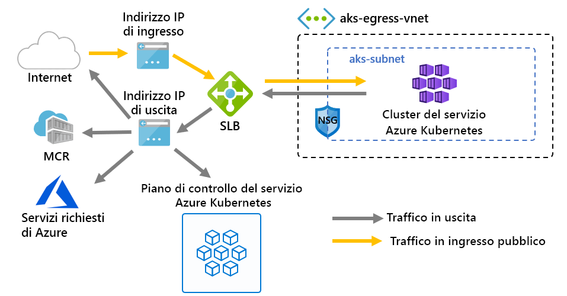

# <a name="customize-cluster-egress-with-a-user-defined-route-preview"></a>Personalizzare l'uscita del cluster con una route definita dall'utente (anteprima)

L'uscita da un cluster AKS può essere personalizzata per adattarsi a scenari specifici. Per impostazione predefinita, AKS effettuerà il provisioning di uno SKU standard Load Balancer essere configurato e usato per l'uscita. Tuttavia, l'installazione predefinita potrebbe non soddisfare i requisiti di tutti gli scenari se gli indirizzi IP pubblici non sono consentiti o se sono necessari hop aggiuntivi per l'uscita.

Questo articolo illustra come personalizzare la route in uscita di un cluster per supportare scenari di rete personalizzati, ad esempio quelli che non consentono indirizzi IP pubblici e che il cluster deve sedersi dietro un'appliance virtuale di rete.

> [!IMPORTANT]
> Le funzionalità di anteprima di AKS sono self-service e sono offerte in base al consenso esplicito. Le anteprime vengono fornite *così come sono* e sono *disponibili* e sono escluse dal contratto di servizio (SLA) e dalla garanzia limitata. Le anteprime AKS sono parzialmente coperte dal supporto tecnico per il *massimo sforzo* . Pertanto, le funzionalità non sono destinate all'uso in produzione. Per ulteriori informazioni, vedere gli articoli di supporto seguenti:
>
> * [Criteri di supporto AKS](support-policies.md)
> * [Domande frequenti relative al supporto tecnico Azure](faq.md)

## <a name="prerequisites"></a>Prerequisiti
* Versione 2.0.81 o successiva dell'interfaccia della riga di comando di Azure
* Versione di anteprima dell'interfaccia della riga di comando di Azure 0.4.28 o successiva
* Versione API di `2020-01-01` o versione successiva

## <a name="install-the-latest-azure-cli-aks-preview-extension"></a>Installare l'estensione più recente dell'interfaccia della riga di comando di Azure AKS
Per impostare il tipo in uscita di un cluster, è necessaria l'estensione dell'interfaccia della riga di comando di Azure AKS Preview 0.4.18 o versione successiva. Installare l'estensione dell'interfaccia della riga di comando di Azure AKS anteprima usando il comando AZ Extension Add, quindi verificare la presenza di eventuali aggiornamenti disponibili usando il comando AZ Extension Update seguente:

```azure-cli
# Install the aks-preview extension
az extension add --name aks-preview

# Update the extension to make sure you have the latest version installed
az extension update --name aks-preview
```

## <a name="limitations"></a>Limitazioni
* Durante la fase `outboundType` di anteprima, può essere definito solo in fase di creazione del cluster e non può essere aggiornato in seguito.
* Durante la fase `outboundType` di anteprima, i cluster AKS devono usare Azure CNI. Kubenet è configurabile. l'utilizzo richiede associazioni manuali della tabella di route alla subnet AKS.
* L' `outboundType` `vm-set-type` impostazione richiede cluster AKS con di `VirtualMachineScaleSets` e `load-balancer-sku` di. `Standard`
* L' `outboundType` impostazione di su un `UDR` valore richiede una route definita dall'utente con connettività in uscita valida per il cluster.
* L' `outboundType` impostazione di su un `UDR` valore implica che l'IP di origine in ingresso indirizzato al servizio di bilanciamento del carico potrebbe **non corrispondere** all'indirizzo di destinazione in uscita del cluster.

## <a name="overview-of-outbound-types-in-aks"></a>Panoramica dei tipi in uscita in AKS

Un cluster AKS può essere personalizzato con un tipo `outboundType` di servizio di bilanciamento del carico o di routing definito dall'utente univoco.

> [!IMPORTANT]
> Il tipo in uscita influisca solo sul traffico in uscita del cluster. Per ulteriori informazioni, vedere [configurazione dei controller di ingresso](ingress-basic.md) .

### <a name="outbound-type-of-loadbalancer"></a>Tipo in uscita di loadBalancer

Se `loadBalancer` è impostato, AKS completa automaticamente la seguente installazione. Il servizio di bilanciamento del carico viene usato per l'uscita tramite un indirizzo IP pubblico assegnato da AKS. Un tipo in uscita di `loadBalancer` supporta i servizi Kubernetes di `loadBalancer`tipo, che prevedono l'uscita dal servizio di bilanciamento del carico creato dal provider di risorse AKS.

Il seguente programma di installazione viene eseguito da AKS.
   * Viene eseguito il provisioning di un indirizzo IP pubblico per l'uscita del cluster.
   * L'indirizzo IP pubblico viene assegnato alla risorsa del servizio di bilanciamento del carico.
   * I pool back-end per il servizio di bilanciamento del carico sono impostati per i nodi agente nel cluster.

Di seguito è riportata una topologia di rete distribuita nei cluster AKS per impostazione `outboundType` predefinita `loadBalancer`, che usa un di.



### <a name="outbound-type-of-userdefinedrouting"></a>Tipo in uscita di userDefinedRouting

> [!NOTE]
> L'uso di un tipo in uscita è uno scenario di rete avanzato e richiede una configurazione di rete corretta.

Se `userDefinedRouting` è impostato, AKS non configurerà automaticamente i percorsi in uscita. L' **utente**deve eseguire le operazioni seguenti.

Il cluster deve essere distribuito in una rete virtuale esistente con una subnet configurata. Una route definita dall'utente (UDR) valida deve esistere nella subnet con connettività in uscita.

Il provider di risorse AKS distribuirà un servizio di bilanciamento del carico standard (SLB). Il servizio di bilanciamento del carico non è configurato con alcuna regola e non [comporta alcun addebito fino a quando non viene inserita una regola](https://azure.microsoft.com/pricing/details/load-balancer/). AKS **non** effettuerà automaticamente il provisioning di un indirizzo IP pubblico per il front-end SLB. AKS **non** configurerà automaticamente il pool back-end del servizio di bilanciamento del carico.

## <a name="deploy-a-cluster-with-outbound-type-of-udr-and-azure-firewall"></a>Distribuire un cluster con il tipo di UDR e il firewall di Azure in uscita

Per illustrare l'applicazione di un cluster con tipo in uscita usando una route definita dall'utente, è possibile configurare un cluster in una rete virtuale con peering con un firewall di Azure.


* Il traffico in ingresso è forzato a passare attraverso i filtri del firewall
   * Una subnet isolata include un servizio di bilanciamento del carico interno per il routing nei nodi degli agenti
   * I nodi agente sono isolati in una subnet dedicata
* Le richieste in uscita iniziano dai nodi dell'agente all'IP interno del firewall di Azure usando una route definita dall'utente
   * Le richieste provenienti dai nodi dell'agente AKS seguono una UDR che è stata posizionata nella subnet in cui è stato distribuito il cluster AKS.
   * Egresses del firewall di Azure dalla rete virtuale da un front-end IP pubblico
   * L'accesso al piano di controllo AKS è protetto da un NSG, che ha abilitato l'indirizzo IP front-end del firewall
   * L'accesso alla rete Internet pubblica o ad altri servizi di Azure viene trasmesso da e verso l'indirizzo IP front-end del firewall

### <a name="set-configuration-via-environment-variables"></a>Impostare la configurazione tramite le variabili di ambiente

Definire un set di variabili di ambiente da usare nelle creazioni di risorse.

```bash
PREFIX="contosofin"
RG="${PREFIX}-rg"
LOC="eastus"
NAME="${PREFIX}outboundudr"
AKS_NAME="${PREFIX}aks"
VNET_NAME="${PREFIX}vnet"
AKSSUBNET_NAME="${PREFIX}akssubnet"
SVCSUBNET_NAME="${PREFIX}svcsubnet"
# DO NOT CHANGE FWSUBNET_NAME - This is currently a requirement for Azure Firewall.
FWSUBNET_NAME="AzureFirewallSubnet"
FWNAME="${PREFIX}fw"
FWPUBLICIP_NAME="${PREFIX}fwpublicip"
FWIPCONFIG_NAME="${PREFIX}fwconfig"
FWROUTE_TABLE_NAME="${PREFIX}fwrt"
FWROUTE_NAME="${PREFIX}fwrn"
FWROUTE_NAME_INTERNET="${PREFIX}fwinternet"
DEVSUBNET_NAME="${PREFIX}dev"
```

Impostare quindi gli ID sottoscrizione.

```azure-cli
# Get ARM Access Token and Subscription ID - This will be used for AuthN later.

ACCESS_TOKEN=$(az account get-access-token -o tsv --query 'accessToken')

# NOTE: Update Subscription Name
# Set Default Azure Subscription to be Used via Subscription ID

az account set -s <SUBSCRIPTION_ID_GOES_HERE>

# NOTE: Update Subscription Name for setting SUBID

SUBID=$(az account show -s '<SUBSCRIPTION_NAME_GOES_HERE>' -o tsv --query 'id')
```

## <a name="create-a-virtual-network-with-multiple-subnets"></a>Creare una rete virtuale con più subnet

Effettuare il provisioning di una rete virtuale con tre subnet separate, una per il cluster, una per il firewall e una per l'ingresso del servizio.


Creare un gruppo di risorse che contenga tutte le risorse.

```azure-cli
# Create Resource Group

az group create --name $RG --location $LOC
```

Creare due reti virtuali per ospitare il cluster AKS e il firewall di Azure. Ognuno avrà una propria subnet. Iniziamo con la rete AKS.

```
# Dedicated virtual network with AKS subnet

az network vnet create \
    --resource-group $RG \
    --name $VNET_NAME \
    --address-prefixes 100.64.0.0/16 \
    --subnet-name $AKSSUBNET_NAME \
    --subnet-prefix 100.64.1.0/24

# Dedicated subnet for K8s services

az network vnet subnet create \
    --resource-group $RG \
    --vnet-name $VNET_NAME \
    --name $SVCSUBNET_NAME \
    --address-prefix 100.64.2.0/24

# Dedicated subnet for Azure Firewall (Firewall name cannot be changed)

az network vnet subnet create \
    --resource-group $RG \
    --vnet-name $VNET_NAME \
    --name $FWSUBNET_NAME \
    --address-prefix 100.64.3.0/24
```

## <a name="create-and-setup-an-azure-firewall-with-a-udr"></a>Creare e configurare un firewall di Azure con un UDR

È necessario configurare le regole di Azure firewall in ingresso e in uscita. Lo scopo principale del firewall è quello di consentire alle organizzazioni di configurare le regole di traffico in ingresso e in uscita granulari all'interno e all'esterno del cluster AKS.


Creare una risorsa IP pubblico con SKU standard che verrà usata come indirizzo front-end del firewall di Azure.

```azure-cli
az network public-ip create -g $RG -n $FWPUBLICIP_NAME -l $LOC --sku "Standard"
```

Registrare l'estensione dell'interfaccia della riga di comando di anteprima per creare un firewall di Azure.
```azure-cli
# Install Azure Firewall preview CLI extension

az extension add --name azure-firewall

# Deploy Azure Firewall

az network firewall create -g $RG -n $FWNAME -l $LOC
```

È ora possibile assegnare l'indirizzo IP creato in precedenza al front-end del firewall.
> [!NOTE]
> La configurazione dell'indirizzo IP pubblico per il firewall di Azure può richiedere alcuni minuti.
> 
> Se vengono ricevuti ripetutamente errori nel comando seguente, eliminare il firewall e l'IP pubblico esistenti ed effettuare il provisioning dell'IP pubblico e del firewall di Azure tramite il portale nello stesso momento.

```azure-cli
# Configure Firewall IP Config

az network firewall ip-config create -g $RG -f $FWNAME -n $FWIPCONFIG_NAME --public-ip-address $FWPUBLICIP_NAME --vnet-name $VNET_NAME
```

Quando il comando precedente ha avuto esito positivo, salvare l'indirizzo IP front-end firewall per la configurazione in un secondo momento.

```bash
# Capture Firewall IP Address for Later Use

FWPUBLIC_IP=$(az network public-ip show -g $RG -n $FWPUBLICIP_NAME --query "ipAddress" -o tsv)
FWPRIVATE_IP=$(az network firewall show -g $RG -n $FWNAME --query "ipConfigurations[0].privateIpAddress" -o tsv)
```

### <a name="create-a-udr-with-a-hop-to-azure-firewall"></a>Creare un UDR con un hop al firewall di Azure

Azure effettua il routing automatico del traffico tra subnet di Azure, reti virtuali e reti locali. Per modificare il routing predefinito di Azure è necessario creare una tabella di route.

Creare una tabella di route vuota da associare a una determinata subnet. La tabella di route definisce l'hop successivo come il firewall di Azure creato in precedenza. A ogni subnet può essere associata una o nessuna tabella di route.

```azure-cli
# Create UDR and add a route for Azure Firewall

az network route-table create -g $RG --name $FWROUTE_TABLE_NAME
az network route-table route create -g $RG --name $FWROUTE_NAME --route-table-name $FWROUTE_TABLE_NAME --address-prefix 0.0.0.0/0 --next-hop-type VirtualAppliance --next-hop-ip-address $FWPRIVATE_IP --subscription $SUBID
az network route-table route create -g $RG --name $FWROUTE_NAME_INTERNET --route-table-name $FWROUTE_TABLE_NAME --address-prefix $FWPUBLIC_IP/32 --next-hop-type Internet
```

Vedere la [documentazione della tabella di route della rete virtuale](../virtual-network/virtual-networks-udr-overview.md#user-defined) in cui è possibile eseguire l'override delle route di sistema predefinite di Azure o aggiungere altre route alla tabella di route di una subnet.

## <a name="adding-network-firewall-rules"></a>Aggiunta di regole del firewall di rete

> [!WARNING]
> Di seguito è riportato un esempio di aggiunta di una regola del firewall. Tutti gli endpoint in uscita definiti negli [endpoint in uscita necessari](egress.md) devono essere abilitati dalle regole del firewall dell'applicazione per il funzionamento dei cluster AKS. Senza questi endpoint abilitati, il cluster non può funzionare.

Di seguito è riportato un esempio di una regola di rete e di applicazione. Viene aggiunta una regola di rete che consente qualsiasi protocollo, indirizzo di origine, indirizzo di destinazione e porte di destinazione. Viene anche aggiunta una regola dell'applicazione per **alcuni** degli endpoint richiesti da AKS.

In uno scenario di produzione è necessario abilitare l'accesso solo agli endpoint necessari per l'applicazione e a quelli definiti in [AKS in uscita](egress.md).

```
# Add Network FW Rules

az network firewall network-rule create -g $RG -f $FWNAME --collection-name 'aksfwnr' -n 'netrules' --protocols 'Any' --source-addresses '*' --destination-addresses '*' --destination-ports '*' --action allow --priority 100

# Add Application FW Rules
# IMPORTANT: Add AKS required egress endpoints

az network firewall application-rule create -g $RG -f $FWNAME \
    --collection-name 'AKS_Global_Required' \
    --action allow \
    --priority 100 \
    -n 'required' \
    --source-addresses '*' \
    --protocols 'http=80' 'https=443' \
    --target-fqdns \
        'aksrepos.azurecr.io' \
        '*blob.core.windows.net' \
        'mcr.microsoft.com' \
        '*cdn.mscr.io' \
        '*.data.mcr.microsoft.com' \
        'management.azure.com' \
        'login.microsoftonline.com' \
        'ntp.ubuntu.com' \
        'packages.microsoft.com' \
        'acs-mirror.azureedge.net'
```

Vedere la [documentazione del firewall di Azure](https://docs.microsoft.com/azure/firewall/overview) per altre informazioni sul servizio firewall di Azure.

## <a name="associate-the-route-table-to-aks"></a>Associare la tabella di route a AKS

Per associare il cluster al firewall, è necessario che la subnet dedicata per la subnet del cluster faccia riferimento alla tabella di route creata in precedenza. È possibile eseguire l'associazione inviando un comando alla rete virtuale che contiene sia il cluster che il firewall per aggiornare la tabella di route della subnet del cluster.

```azure-cli
# Associate route table with next hop to Firewall to the AKS subnet

az network vnet subnet update -g $RG --vnet-name $VNET_NAME --name $AKSSUBNET_NAME --route-table $FWROUTE_TABLE_NAME
```

## <a name="deploy-aks-with-outbound-type-of-udr-to-the-existing-network"></a>Distribuire AKS con il tipo di UDR in uscita alla rete esistente

A questo punto è possibile distribuire un cluster AKS nella configurazione della rete virtuale esistente. Per impostare un tipo in uscita del cluster sul routing definito dall'utente, è necessario fornire una subnet esistente a AKS.


### <a name="create-a-service-principal-with-access-to-provision-inside-the-existing-virtual-network"></a>Creare un'entità servizio con accesso al provisioning all'interno della rete virtuale esistente

Un'entità servizio viene usata da AKS per creare le risorse del cluster. L'entità servizio passata in fase di creazione viene usata per creare risorse AKS sottostanti, ad esempio macchine virtuali, archiviazione e servizi di bilanciamento del carico usati da AKS. Se vengono concesse autorizzazioni insufficienti, non sarà possibile effettuare il provisioning di un cluster AKS.

```azure-cli
# Create SP and Assign Permission to Virtual Network

az ad sp create-for-rbac -n "${PREFIX}sp" --skip-assignment
```

Sostituire ora `APPID` e `PASSWORD` con l'ID dell'entità servizio e la password dell'entità servizio generate automaticamente dall'output del comando precedente. Si fa riferimento all'ID della risorsa VNET per concedere le autorizzazioni all'entità servizio in modo che AKS possa distribuire le risorse al suo interno.

```azure-cli
APPID="<SERVICE_PRINCIPAL_APPID_GOES_HERE>"
PASSWORD="<SERVICEPRINCIPAL_PASSWORD_GOES_HERE>"
VNETID=$(az network vnet show -g $RG --name $VNET_NAME --query id -o tsv)

# Assign SP Permission to VNET

az role assignment create --assignee $APPID --scope $VNETID --role Contributor

# View Role Assignment
az role assignment list --assignee $APPID --all -o table
```

### <a name="deploy-aks"></a>Distribuisci AKS

Infine, il cluster AKS può essere distribuito nella subnet esistente dedicata al cluster. La subnet di destinazione da distribuire in viene definita con la variabile di ambiente `$SUBNETID`,. La `$SUBNETID` variabile non è stata definita nei passaggi precedenti. Per impostare il valore per l'ID subnet, è possibile usare il comando seguente:

```azurecli
SUBNETID="/subscriptions/$SUBID/resourceGroups/$RG/providers/Microsoft.Network/virtualNetworks/$VNET_NAME/subnets/$AKSSUBNET_NAME"
```

Si definirà il tipo in uscita per seguire il UDR che esiste nella subnet, consentendo ad AKS di ignorare l'installazione e il provisioning IP per il servizio di bilanciamento del carico che ora può essere strettamente interno.

È possibile aggiungere la funzionalità AKS per gli [intervalli IP autorizzati del server API](api-server-authorized-ip-ranges.md) per limitare l'accesso al server API solo all'endpoint pubblico del firewall. La funzionalità degli intervalli IP autorizzati è indicata nel diagramma come NSG che deve essere passata per accedere al piano di controllo. Quando si Abilita la funzionalità intervallo IP autorizzato per limitare l'accesso al server API, gli strumenti di sviluppo devono usare un JumpBox dalla rete virtuale del firewall oppure è necessario aggiungere tutti gli endpoint per sviluppatori all'intervallo di indirizzi IP autorizzati.

> [!TIP]
> È possibile aggiungere funzionalità aggiuntive alla distribuzione del cluster, ad esempio (cluster privato) []. Quando si usano intervalli IP autorizzati, per accedere al server API è necessario un JumpBox all'interno della rete cluster.

```azure-cli
az aks create -g $RG -n $AKS_NAME -l $LOC \
  --node-count 3 \
  --network-plugin azure --generate-ssh-keys \
  --service-cidr 192.168.0.0/16 \
  --dns-service-ip 192.168.0.10 \
  --docker-bridge-address 172.22.0.1/29 \
  --vnet-subnet-id $SUBNETID \
  --service-principal $APPID \
  --client-secret $PASSWORD \
  --load-balancer-sku standard \
  --outbound-type userDefinedRouting \
  --api-server-authorized-ip-ranges $FWPUBLIC_IP
  ```

### <a name="enable-developer-access-to-the-api-server"></a>Consentire agli sviluppatori di accedere al server API

A causa della configurazione degli intervalli IP autorizzati per il cluster, è necessario aggiungere gli indirizzi IP degli strumenti per sviluppatori all'elenco di cluster AKS degli intervalli IP approvati per accedere al server API. Un'altra opzione consiste nel configurare un JumpBox con gli strumenti necessari all'interno di una subnet separata nella rete virtuale del firewall.

Aggiungere un altro indirizzo IP agli intervalli approvati con il comando seguente

```bash
# Retrieve your IP address
CURRENT_IP=$(dig @resolver1.opendns.com ANY myip.opendns.com +short)

# Add to AKS approved list
az aks update -g $RG -n $AKS_NAME --api-server-authorized-ip-ranges $CURRENT_IP/32

```

 Usare il comando [AZ AKS Get-credentials][az-aks-get-credentials] per `kubectl` configurare la connessione al cluster Kubernetes appena creato. 

 ```azure-cli
 az aks get-credentials -g $RG -n $AKS_NAME
 ```

### <a name="setup-the-internal-load-balancer"></a>Configurare il servizio di bilanciamento del carico interno

AKS ha distribuito un servizio di bilanciamento del carico con il cluster, che può essere configurato come un servizio di [bilanciamento del carico interno](internal-lb.md).

Per creare un servizio di bilanciamento del carico interno, creare un manifesto del servizio denominato Internal-lb. YAML con il tipo di servizio LoadBalancer e l'annotazione Azure-Load-Balancer-Internal come illustrato nell'esempio seguente:

```yaml
apiVersion: v1
kind: Service
metadata:
  name: internal-app
  annotations:
    service.beta.kubernetes.io/azure-load-balancer-internal: "true"
    service.beta.kubernetes.io/azure-load-balancer-internal-subnet: "contosofinsvcsubnet"
spec:
  type: LoadBalancer
  ports:
  - port: 80
  selector:
    app: internal-app
```

Distribuire il servizio di bilanciamento del carico interno usando kubectl Apply e specificare il nome del manifesto YAML:

```bash
kubectl apply -f internal-lb.yaml
```

## <a name="deploy-a-kubernetes-service"></a>Distribuire un servizio Kubernetes

Poiché il tipo in uscita del cluster è impostato come UDR, l'associazione dei nodi dell'agente come pool back-end per il servizio di bilanciamento del carico non viene completata automaticamente da AKS al momento della creazione del cluster. Tuttavia, l'associazione del pool back-end viene gestita dal provider di servizi cloud di Azure Kubernetes quando viene distribuito il servizio Kubernetes.

Distribuire l'applicazione Azure vote App copiando il file YAML riportato di seguito in `example.yaml`un file denominato.

```yaml
apiVersion: apps/v1
kind: Deployment
metadata:
  name: azure-vote-back
spec:
  replicas: 1
  selector:
    matchLabels:
      app: azure-vote-back
  template:
    metadata:
      labels:
        app: azure-vote-back
    spec:
      nodeSelector:
        "beta.kubernetes.io/os": linux
      containers:
      - name: azure-vote-back
        image: redis
        resources:
          requests:
            cpu: 100m
            memory: 128Mi
          limits:
            cpu: 250m
            memory: 256Mi
        ports:
        - containerPort: 6379
          name: redis
---
apiVersion: v1
kind: Service
metadata:
  name: azure-vote-back
spec:
  ports:
  - port: 6379
  selector:
    app: azure-vote-back
---
apiVersion: apps/v1
kind: Deployment
metadata:
  name: azure-vote-front
spec:
  replicas: 1
  selector:
    matchLabels:
      app: azure-vote-front
  template:
    metadata:
      labels:
        app: azure-vote-front
    spec:
      nodeSelector:
        "beta.kubernetes.io/os": linux
      containers:
      - name: azure-vote-front
        image: microsoft/azure-vote-front:v1
        resources:
          requests:
            cpu: 100m
            memory: 128Mi
          limits:
            cpu: 250m
            memory: 256Mi
        ports:
        - containerPort: 80
        env:
        - name: REDIS
          value: "azure-vote-back"
---
apiVersion: v1
kind: Service
metadata:
  name: azure-vote-front
  annotations:
    service.beta.kubernetes.io/azure-load-balancer-internal: "true"
    service.beta.kubernetes.io/azure-load-balancer-internal-subnet: "contosofinsvcsubnet"
spec:
  type: LoadBalancer
  ports:
  - port: 80
  selector:
    app: azure-vote-front
```

Distribuire il servizio eseguendo:

```bash
kubectl apply -f example.yaml
```

## <a name="add-a-dnat-rule-to-azure-firewall"></a>Aggiungere una regola DNAT al firewall di Azure

Per configurare la connettività in ingresso, è necessario scrivere una regola DNAT nel firewall di Azure. Per testare la connettività al cluster, viene definita una regola per l'indirizzo IP pubblico front-end del firewall da indirizzare all'IP interno esposto dal servizio interno.

È possibile personalizzare l'indirizzo di destinazione perché è la porta sul firewall a cui accedere. L'indirizzo convertito deve essere l'indirizzo IP del servizio di bilanciamento del carico interno. La porta convertita deve essere la porta esposta per il servizio Kubernetes.

Sarà necessario specificare l'indirizzo IP interno assegnato al servizio di bilanciamento del carico creato dal servizio Kubernetes. Recuperare l'indirizzo eseguendo:

```bash
kubectl get services
```

L'indirizzo IP necessario verrà elencato nella colonna EXTERNAL-IP, simile a quanto riportato di seguito.

```bash
NAME               TYPE           CLUSTER-IP       EXTERNAL-IP   PORT(S)        AGE
azure-vote-back    ClusterIP      192.168.92.209   <none>        6379/TCP       23m
azure-vote-front   LoadBalancer   192.168.19.183   100.64.2.5    80:32106/TCP   23m
kubernetes         ClusterIP      192.168.0.1      <none>        443/TCP        4d3h
```

```azure-cli
az network firewall nat-rule create --collection-name exampleset --destination-addresses $FWPUBLIC_IP --destination-ports 80 --firewall-name $FWNAME --name inboundrule --protocols Any --resource-group $RG --source-addresses '*' --translated-port 80 --action Dnat --priority 100 --translated-address <INSERT IP OF K8s SERVICE>
```

## <a name="clean-up-resources"></a>Pulire le risorse

> [!NOTE]
> Quando si elimina il servizio interno Kubernetes, se il servizio di bilanciamento del carico interno non è più usato da alcun servizio, il provider di servizi cloud di Azure eliminerà il servizio di bilanciamento del carico interno. Alla successiva distribuzione del servizio, verrà distribuito un servizio di bilanciamento del carico se non è possibile trovarlo con la configurazione richiesta.

Per pulire le risorse di Azure, eliminare il gruppo di risorse AKS.

```azure-cli
az group delete -g $RG
```

## <a name="validate-connectivity"></a>Convalidare la connettività

Passare all'indirizzo IP front-end del firewall di Azure in un browser per convalidare la connettività.

Verrà visualizzata un'immagine dell'app Azure vote.

## <a name="next-steps"></a>Passaggi successivi

Vedere [Panoramica di UdR](https://docs.microsoft.com/azure/virtual-network/virtual-networks-udr-overview)per la rete di Azure.

Vedere [come creare, modificare o eliminare una tabella di route](https://docs.microsoft.com/azure/virtual-network/manage-route-table).

<!-- LINKS - internal -->
[az-aks-get-credentials]: /cli/azure/aks?view=azure-cli-latest#az-aks-get-credentials
