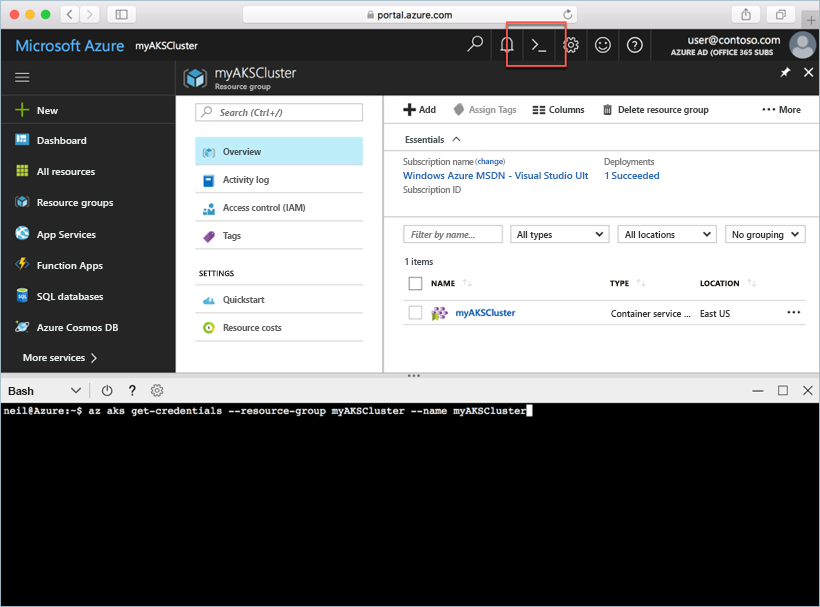

# <a name="deploy-an-azure-container-service-aks-cluster"></a>Distribuire un cluster del servizio contenitore di Azure

In questa guida introduttiva viene distribuito un cluster del servizio contenitore di Azure usando il portale di Azure. Un'applicazione multi-contenitore costituita dal front-end Web e da un'istanza di Redis viene quindi eseguita nel cluster. Al termine, l'applicazione è accessibile tramite Internet.


Questa guida introduttiva presuppone una comprensione di base dei concetti relativi a Kubernetes. Per informazioni dettagliate su Kubernetes, vedere la [documentazione di Kubernetes](https://kubernetes.io/docs/home/).

## <a name="sign-in-to-azure"></a>Accedere ad Azure

Accedere al portale di Azure all'indirizzo http://portal.azure.com.

## <a name="create-service-principal"></a>Creare un'entità servizio

Prima di creare il cluster del servizio contenitore di Azure nel portale di Azure, è necessario creare un'entità servizio. Azure usa questa entità servizio per gestire l'infrastruttura associata al cluster del servizio contenitore di Azure.

Selezionare **Azure Active Directory** > **Registrazioni per l'app** > **Registrazione nuova applicazione**.

Immettere un nome per l'applicazione, che può essere qualsiasi valore. Selezionare **App Web/API** per il tipo di applicazione. Immettere un valore per **URL accesso**, che può essere qualsiasi valore in un formato di URL valido, ma non deve essere un endpoint reale.

Selezionare **Create** (Crea) al termine.


Selezionare la registrazione dell'applicazione appena creata e prendere nota dell'ID applicazione. Questo valore sarà necessario per la creazione del cluster del servizio contenitore di Azure.


È quindi necessario creare una password per l'entità servizio. Selezionare **Tutte le impostazioni** > **Chiavi** e immettere qualsiasi valore per la descrizione della chiave. Selezionare una durata, ovvero il tempo di validità dell'entità servizio.

Fare clic su **Salva** e prendere nota del valore della password. La password sarà necessaria per la creazione del cluster del servizio contenitore di Azure.


## <a name="create-aks-cluster"></a>Creare un cluster del servizio contenitore di Azure

Selezionare **Nuovo** > **Contenitori** > **Servizio contenitore di Azure (anteprima)**.

Specificare il nome del cluster, il prefisso DNS, il nome del gruppo di risorse, la posizione e la versione di Kubernetes per il cluster. Prendere nota dei nomi del cluster e del gruppo di risorse, perché saranno necessari per la connessione al cluster.

Selezionare **OK** al termine.


Nel modulo di configurazione immettere i dati seguenti:

- Nome utente: nome assegnato agli account amministrativi nei nodi del cluster.
- Chiave pubblica SSH: associata alla chiave che verrà usata per accedere ai nodi del cluster.
- ID client dell'entità servizio: ID applicazione dell'entità servizio creata in precedenza in questo documento.
- Segreto client dell'entità servizio: password dell'entità servizio creata in precedenza in questo documento.
- Numero di nodi: numero di nodi del servizio contenitore di Azure da creare.
- Dimensioni macchina virtuale: dimensioni di macchina virtuale per i nodi del servizio contenitore di Azure.
- Dimensioni disco sistema operativo: dimensioni per il disco del sistema operativo dei nodi del servizio contenitore di Azure.

Selezionare **OK** al termine e quindi di nuovo **OK** dopo il completamento della convalida.


Dopo una breve attesa, il cluster del servizio contenitore di Azure viene distribuito ed è pronto per l'uso.

## <a name="connect-to-the-cluster"></a>Connettersi al cluster

Per gestire un cluster Kubernetes, usare [kubectl](https://kubernetes.io/docs/user-guide/kubectl/), il client da riga di comando di Kubernetes. Il client kubectl è preinstallato in Azure Cloud Shell.

Aprire Cloud Shell usando il pulsante nell'angolo in alto a destra del portale di Azure.



Usare il comando [az aks get-credentials](/cli/azure/aks?view=azure-cli-latest#az_aks_get_credentials) per configurare kubectl per la connessione al cluster Kubernetes.

Copiare e incollare il comando seguente in Cloud Shell. Modificare il nome del gruppo di risorse e del cluster se necessario.

```azurecli-interactive
az aks get-credentials --resource-group myAKSCluster --name myAKSCluster
```

Per verificare la connessione al cluster, usare il comando [kubectl get](https://kubernetes.io/docs/user-guide/kubectl/v1.6/#get) per restituire un elenco dei nodi del cluster.

```azurecli-interactive
kubectl get nodes
```

Output:

```
NAME                       STATUS    ROLES     AGE       VERSION
aks-agentpool-14693408-0   Ready     agent     6m        v1.8.1
aks-agentpool-14693408-1   Ready     agent     6m        v1.8.1
aks-agentpool-14693408-2   Ready     agent     7m        v1.8.1
```

## <a name="run-the-application"></a>Eseguire l'applicazione

Un file manifesto di Kubernetes definisce uno stato desiderato per il cluster, incluse le immagini del contenitore da eseguire. Per questo esempio, viene usato un manifesto per creare tutti gli oggetti necessari per eseguire l'applicazione Azure Vote.

Creare un file denominato `azure-vote.yml` e copiarvi il codice YAML seguente. Se si usa Azure Cloud Shell, questo file può essere creato usando vi o Nano come in un sistema virtuale o fisico.

```yaml
apiVersion: apps/v1beta1
kind: Deployment
metadata:
  name: azure-vote-back
spec:
  replicas: 1
  template:
    metadata:
      labels:
        app: azure-vote-back
    spec:
      containers:
      - name: azure-vote-back
        image: redis
        ports:
        - containerPort: 6379
          name: redis
---
apiVersion: v1
kind: Service
metadata:
  name: azure-vote-back
spec:
  ports:
  - port: 6379
  selector:
    app: azure-vote-back
---
apiVersion: apps/v1beta1
kind: Deployment
metadata:
  name: azure-vote-front
spec:
  replicas: 1
  template:
    metadata:
      labels:
        app: azure-vote-front
    spec:
      containers:
      - name: azure-vote-front
        image: microsoft/azure-vote-front:redis-v1
        ports:
        - containerPort: 80
        env:
        - name: REDIS
          value: "azure-vote-back"
---
apiVersion: v1
kind: Service
metadata:
  name: azure-vote-front
spec:
  type: LoadBalancer
  ports:
  - port: 80
  selector:
    app: azure-vote-front
```

Usare il comando [kubectl create](https://kubernetes.io/docs/user-guide/kubectl/v1.6/#create) per eseguire l'applicazione.

```azurecli-interactive
kubectl create -f azure-vote.yml
```

Output:

```
deployment "azure-vote-back" created
service "azure-vote-back" created
deployment "azure-vote-front" created
service "azure-vote-front" created
```

## <a name="test-the-application"></a>Test dell'applicazione

Mentre l'applicazione viene eseguita, viene creato un [servizio di Kubernetes](https://kubernetes.io/docs/concepts/services-networking/service/) che espone il front-end dell'applicazione a Internet. Il processo potrebbe richiedere alcuni minuti.

Per monitorare lo stato, usare il comando [kubectl get service](https://kubernetes.io/docs/user-guide/kubectl/v1.6/#get) con l'argomento `--watch`.

```azurecli-interactive
kubectl get service azure-vote-front --watch
```

*EXTERNAL-IP* per il servizio *azure-vote-front* inizialmente viene visualizzato come *pending*.

```
NAME               TYPE           CLUSTER-IP   EXTERNAL-IP   PORT(S)        AGE
azure-vote-front   LoadBalancer   10.0.37.27   <pending>     80:30572/TCP   6s
```

Dopo il passaggio di *EXTERNAL-IP* da *pending* a un *indirizzo IP*, usare `CTRL-C` per arrestare il processo kubectl watch.

```
azure-vote-front   LoadBalancer   10.0.37.27   52.179.23.131   80:30572/TCP   2m
```

È ora possibile passare all'indirizzo IP esterno per visualizzare l'app Azure Vote.


## <a name="delete-cluster"></a>Eliminare il cluster

Quando il cluster non è più necessario, è possibile eliminare il gruppo di risorse del cluster, operazione che comporta l'eliminazione di tutte le risorse associate. A questo scopo, è possibile usare il portale di Azure selezionando il gruppo di risorse e facendo clic sul pulsante di eliminazione. In alternativa, è possibile usare il comando [az group delete](/cli/azure/group#delete) in Cloud Shell.

```azurecli-interactive
az group delete --name myAKSCluster --no-wait
```

## <a name="get-the-code"></a>Ottenere il codice

In questa guida introduttiva sono state usate immagini del contenitore già creato per creare una distribuzione di Kubernetes. Il codice dell'applicazione correlato, Dockerfile, e il file manifesto di Kubernetes sono disponibili su GitHub.

[https://github.com/Azure-Samples/azure-voting-app-redis](https://github.com/Azure-Samples/azure-voting-app-redis.git)

## <a name="next-steps"></a>Passaggi successivi

In questa guida introduttiva è stato distribuito un cluster Kubernetes in cui è stata quindi distribuita un'applicazione multicontenitore.

Per altre informazioni sul servizio contenitore di Azure e l'analisi del codice completo per un esempio di distribuzione, passare all'esercitazione sul cluster Kubernetes.

> [!div class="nextstepaction"]
> [Gestire un cluster del servizio contenitore di Azure](./tutorial-kubernetes-prepare-app.md)

