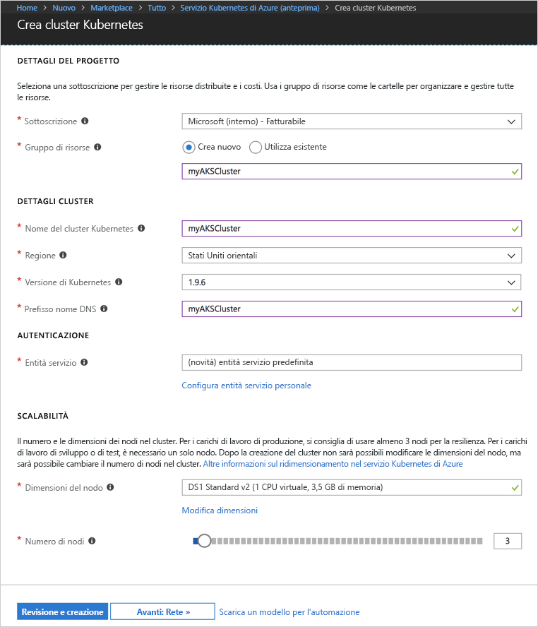
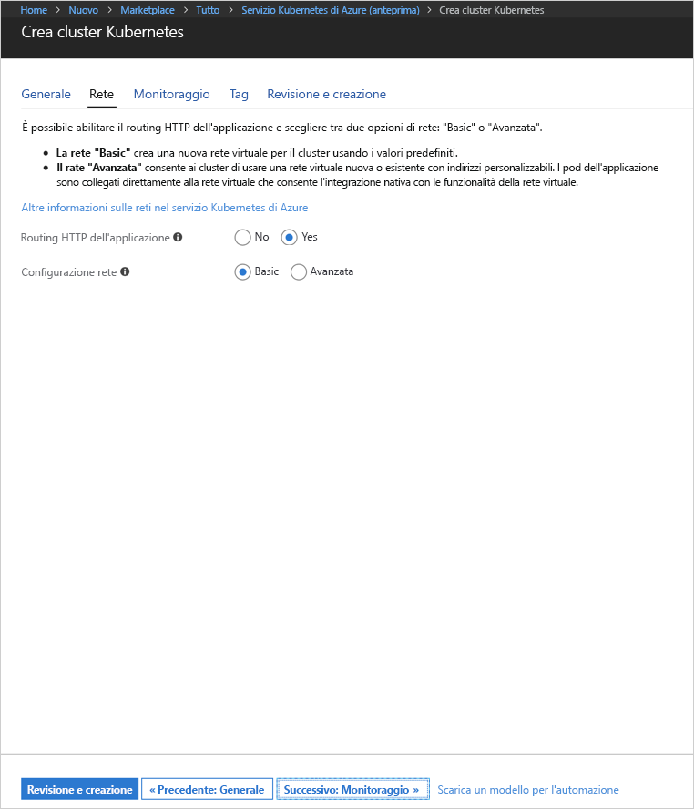
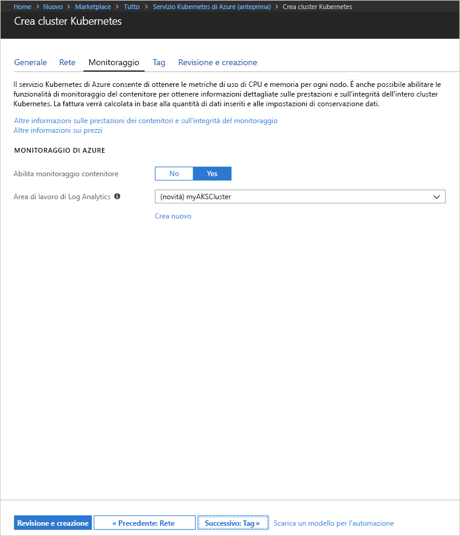
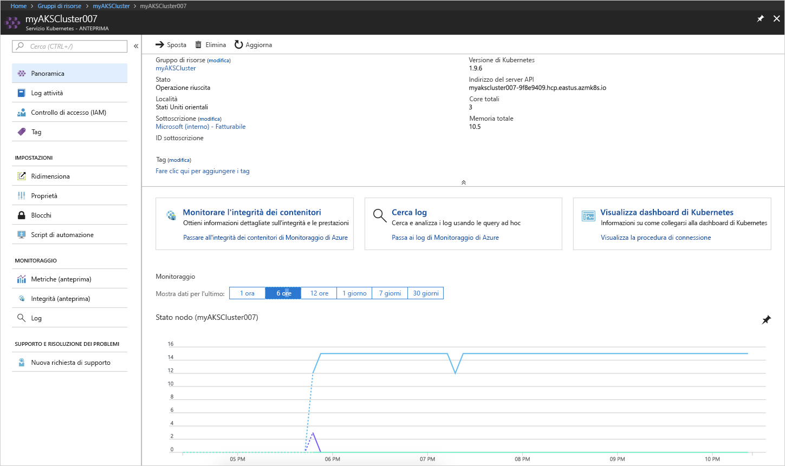
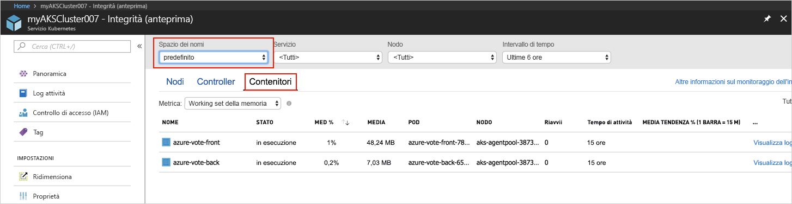
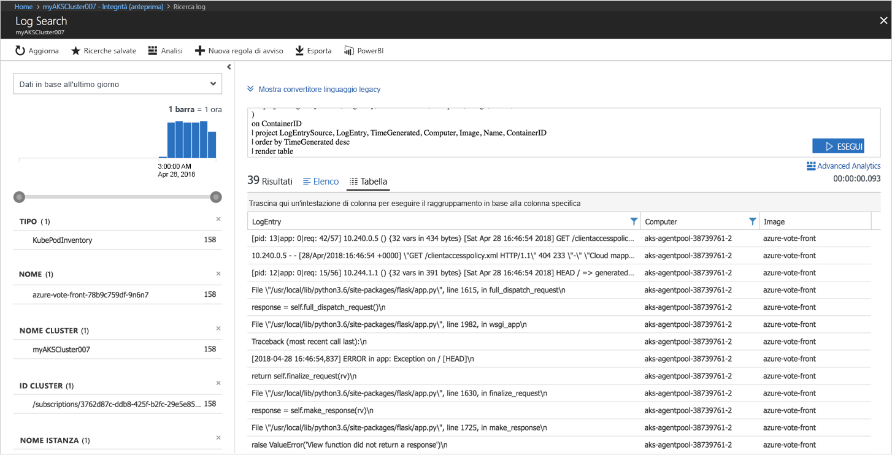

# <a name="quickstart-deploy-an-azure-kubernetes-service-aks-cluster"></a>Guida introduttiva: distribuire un cluster di Azure Kubernetes Service (AKS)

In questa guida introduttiva viene distribuito un cluster del servizio contenitore di Azure usando il portale di Azure. Un'applicazione multi-contenitore costituita dal front-end Web e da un'istanza di Redis viene quindi eseguita nel cluster. Al termine, l'applicazione è accessibile tramite Internet.


Questa guida introduttiva presuppone una comprensione di base dei concetti relativi a Kubernetes. Per informazioni dettagliate su Kubernetes, vedere la [documentazione di Kubernetes][kubernetes-documentation].

## <a name="sign-in-to-azure"></a>Accedere ad Azure

Accedere al portale di Azure all'indirizzo http://portal.azure.com.


## <a name="create-aks-cluster"></a>Creare un cluster del servizio contenitore di Azure

Scegliere **Crea una risorsa** > cercare **Kubernetes** > selezionare **Kubernetes Service** > **Crea**.

Completare i passaggi seguenti in ogni intestazione del modulo per la creazione di un cluster del servizio contenitore di Azure.

- **PROJECT DETAILS** (DETTAGLI PROGETTO): selezionare una sottoscrizione di Azure e un gruppo di risorse di Azure nuovo o esistente.
- **CLUSTER DETAILS** (DETTAGLI CLUSTER): immettere un nome, un'area, una versione e un prefisso di nome DNS per il cluster del servizio contenitore di Azure.
- **AUTHENTICATION** (AUTENTICAZIONE): creare una nuova entità servizio o usarne una esistente. Quando si usa un nome dell'entità servizio esistente, è necessario specificarne l'ID client e il segreto.
- **SCALE** (SCALABILITÀ): selezionare una dimensione di macchina virtuale per i nodi del servizio contenitore di Azure. Le dimensioni della macchina virtuale **non possono** essere modificate dopo che un cluster del servizio contenitore di Azure è stato distribuito. Selezionare anche il numero di nodi da distribuire nel cluster. Il numero di nodi **può** essere modificato dopo che il cluster è stato distribuito.

Al termine dell'operazione, selezionare **Next: Networking** (Avanti: Rete).



Configurare le opzioni di rete seguenti:

- **Http application routing** (Routing applicazione HTTP) - configura un controller di ingresso integrato con creazione automatica del nome DNS pubblico. Per altre informazioni sul routing HTTP, vedere, [AKS HTTP routing and DNS][http-routing] (Routing e HTTP ASK e DNS).
- **Network configuration** (Configurazione di rete) - scegliere la configurazione di rete di base tramite il plug-in [kubenet][kubenet] di Kubernetes oppure la configurazione di rete avanzata tramite [Azure CNI][azure-cni]. Per altre informazioni sulle opzioni relative alla rete, vedere [AKS networking overview][aks-network] (Panoramica di rete AKS).

Al termine dell'operazione, selezionare **Next: Monitoring** (Avanti: Monitoraggio).



Quando si distribuisce un cluster del servizio contenitore di Azure, Azure Container Insights può essere configurato per monitorare l'integrità del cluster e i pod in esecuzione nel cluster. Per altre informazioni sul monitoraggio dell'integrità del contenitore, vedere [Monitor Azure Kubernetes Service health][aks-monitor] (Monitorare l'integrità di Azure Kubernetes Service).

Selezionare **Yes** (Sì) per abilitare il monitoraggio del contenitore e selezionare un'area di lavoro di Log Analytics esistente o crearne una nuova.

Al termine dell'operazione, selezionare **Review + create** (Esamina + crea) e quindi **Create** (Crea).



Dopo una breve attesa, il cluster del servizio contenitore di Azure viene distribuito ed è pronto per l'uso. Passare al gruppo di risorse cluster del servizi contenitore di Azure e selezionare la risorsa appropriata per visualizzare il dashboard del cluster.



## <a name="connect-to-the-cluster"></a>Connettersi al cluster

Per gestire un cluster Kubernetes, usare [kubectl][kubectl], il client da riga di comando di Kubernetes. Il client kubectl è preinstallato in Azure Cloud Shell.

Aprire Cloud Shell usando il pulsante nell'angolo in alto a destra del portale di Azure.


Usare il comando [az aks get-credentials][az-aks-get-credentials] per configurare kubectl per la connessione al cluster Kubernetes.

Copiare e incollare il comando seguente in Cloud Shell. Modificare il nome del gruppo di risorse e del cluster se necessario.

```azurecli-interactive
az aks get-credentials --resource-group myAKSCluster --name myAKSCluster
```

Per verificare la connessione al cluster, usare il comando [kubectl get][kubectl-get] per restituire un elenco dei nodi del cluster.

```azurecli-interactive
kubectl get nodes
```

Output:

```
NAME                       STATUS    ROLES     AGE       VERSION
aks-agentpool-11482510-0   Ready     agent     9m        v1.9.6
aks-agentpool-11482510-1   Ready     agent     8m        v1.9.6
aks-agentpool-11482510-2   Ready     agent     9m        v1.9.6
```

## <a name="run-the-application"></a>Eseguire l'applicazione

I file manifesto di Kubernetes definiscono uno stato desiderato per un cluster, incluse le immagini del contenitore da eseguire. Per questo esempio, viene usato un manifesto per creare tutti gli oggetti necessari per eseguire l'applicazione Azure Vote. Questi oggetti includono due [distribuzioni Kubernetes][kubernetes-deployment], una per il front-end di Azure Vote e l'altra per un'istanza Redis. Vengono anche creati due [servizi di Kubernetes][kubernetes-service], un servizio interno per l'istanza Redis e un servizio esterno per l'accesso all'applicazione Azure Vote da Internet.

Creare un file denominato `azure-vote.yaml` e copiarvi il codice YAML seguente. Se si usa Azure Cloud Shell, creare questo file usando vi o Nano come in un sistema virtuale o fisico.

```yaml
apiVersion: apps/v1beta1
kind: Deployment
metadata:
  name: azure-vote-back
spec:
  replicas: 1
  template:
    metadata:
      labels:
        app: azure-vote-back
    spec:
      containers:
      - name: azure-vote-back
        image: redis
        ports:
        - containerPort: 6379
          name: redis
---
apiVersion: v1
kind: Service
metadata:
  name: azure-vote-back
spec:
  ports:
  - port: 6379
  selector:
    app: azure-vote-back
---
apiVersion: apps/v1beta1
kind: Deployment
metadata:
  name: azure-vote-front
spec:
  replicas: 1
  template:
    metadata:
      labels:
        app: azure-vote-front
    spec:
      containers:
      - name: azure-vote-front
        image: microsoft/azure-vote-front:v1
        ports:
        - containerPort: 80
        env:
        - name: REDIS
          value: "azure-vote-back"
---
apiVersion: v1
kind: Service
metadata:
  name: azure-vote-front
spec:
  type: LoadBalancer
  ports:
  - port: 80
  selector:
    app: azure-vote-front
```

Usare il comando [kubectl apply][kubectl-apply] per eseguire l'applicazione.

```azurecli-interactive
kubectl apply -f azure-vote.yaml
```

Output:

```
deployment "azure-vote-back" created
service "azure-vote-back" created
deployment "azure-vote-front" created
service "azure-vote-front" created
```

## <a name="test-the-application"></a>Test dell'applicazione

Durante l'esecuzione dell'applicazione, viene creato un [servizio Kubernetes][kubernetes-service] per esporre l'applicazione a Internet. Il processo potrebbe richiedere alcuni minuti.

Per monitorare lo stato, usare il comando [kubectl get service][kubectl-get] con l'argomento `--watch`.

```azurecli-interactive
kubectl get service azure-vote-front --watch
```

*EXTERNAL-IP* per il servizio *azure-vote-front* inizialmente viene visualizzato come *pending*.

```
NAME               TYPE           CLUSTER-IP   EXTERNAL-IP   PORT(S)        AGE
azure-vote-front   LoadBalancer   10.0.37.27   <pending>     80:30572/TCP   6s
```

Dopo il passaggio di *EXTERNAL-IP* da *pending* a un *indirizzo IP*, usare `CTRL-C` per arrestare il processo kubectl watch.

```
azure-vote-front   LoadBalancer   10.0.37.27   52.179.23.131   80:30572/TCP   2m
```

Passare ora all'indirizzo IP esterno per visualizzare l'app Azure Vote.


## <a name="monitor-health-and-logs"></a>Monitoraggio di stato e registri

Se il monitoraggio di Azure Container Insights è stato abilitato, i valori di integrità per il cluster del servizio contenitore di Azure e dei pod in esecuzione nel cluster sono disponibili nel dashboard del cluster. Per altre informazioni sul monitoraggio dell'integrità del contenitore, vedere [Monitor Azure Kubernetes Service health][aks-monitor] (Monitorare l'integrità di Azure Kubernetes Service).

Per visualizzare lo stato, il tempo di attività e l'uso delle risorse correnti per i pod di Azure Vote, tornare alla risorsa del servizio contenitore di Azure, selezionare **Monitor Container Health** (Monitora integrità contenitori) > selezionare lo spazio dei nomi **predefinito** > e quindi selezionare **Containers** (Contenitori). L'inserimento di questi dati nel portale di Azure potrebbe richiedere alcuni minuti.



Per visualizzare i registri per il pod `azure-vote-front`, selezionare il collegamento **View Logs** (Visualizza registri). Tali registri includono i flussi stdout e stderr del contenitore.



## <a name="delete-cluster"></a>Eliminare il cluster

Quando il cluster non è più necessario, eliminare la risorsa del cluster, operazione che comporta l'eliminazione di tutte le risorse associate. Questa operazione può essere eseguita nel portale di Azure selezionando il pulsante di eliminazione nel dashboard del cluster del servizio contenitore di Azure. In alternativa, è possibile usare il comando [az aks delete][az-aks-delete] in Cloud Shell.

```azurecli-interactive
az aks delete --resource-group myAKSCluster --name myAKSCluster --no-wait
```

## <a name="get-the-code"></a>Ottenere il codice

In questa guida introduttiva sono state usate immagini del contenitore già creato per creare una distribuzione di Kubernetes. Il codice dell'applicazione correlato, Dockerfile, e il file manifesto di Kubernetes sono disponibili su GitHub.

[https://github.com/Azure-Samples/azure-voting-app-redis][azure-vote-app]

## <a name="next-steps"></a>Passaggi successivi

In questa guida introduttiva è stato distribuito un cluster Kubernetes in cui è stata quindi distribuita un'applicazione multicontenitore.

Per altre informazioni sul servizio contenitore di Azure e l'analisi del codice completo per un esempio di distribuzione, passare all'esercitazione sul cluster Kubernetes.

> [!div class="nextstepaction"]
> [Esercitazione sul servizio contenitore di Azure][aks-tutorial]

<!-- LINKS - external -->
[azure-vote-app]: https://github.com/Azure-Samples/azure-voting-app-redis.git
[azure-cni]: https://github.com/Azure/azure-container-networking/blob/master/docs/cni.md
[kubectl]: https://kubernetes.io/docs/user-guide/kubectl/
[kubectl-apply]: https://kubernetes.io/docs/reference/generated/kubectl/kubectl-commands#apply
[kubectl-get]: https://kubernetes.io/docs/reference/generated/kubectl/kubectl-commands#get
[kubenet]: https://kubernetes.io/docs/concepts/cluster-administration/network-plugins/#kubenet
[kubernetes-deployment]: https://kubernetes.io/docs/concepts/workloads/controllers/deployment/
[kubernetes-documentation]: https://kubernetes.io/docs/home/
[kubernetes-service]: https://kubernetes.io/docs/concepts/services-networking/service/

<!-- LINKS - internal -->
[az-aks-get-credentials]: /cli/azure/aks?view=azure-cli-latest#az_aks_get_credentials
[az-aks-delete]: /cli/azure/aks#az-aks-delete
[aks-monitor]: ../monitoring/monitoring-container-health.md
[aks-network]: ./networking-overview.md
[aks-tutorial]: ./tutorial-kubernetes-prepare-app.md
[http-routing]: ./http-application-routing.md
