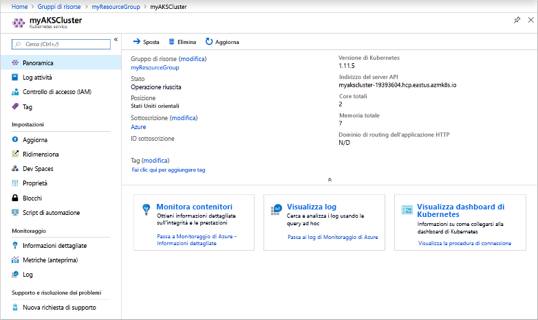
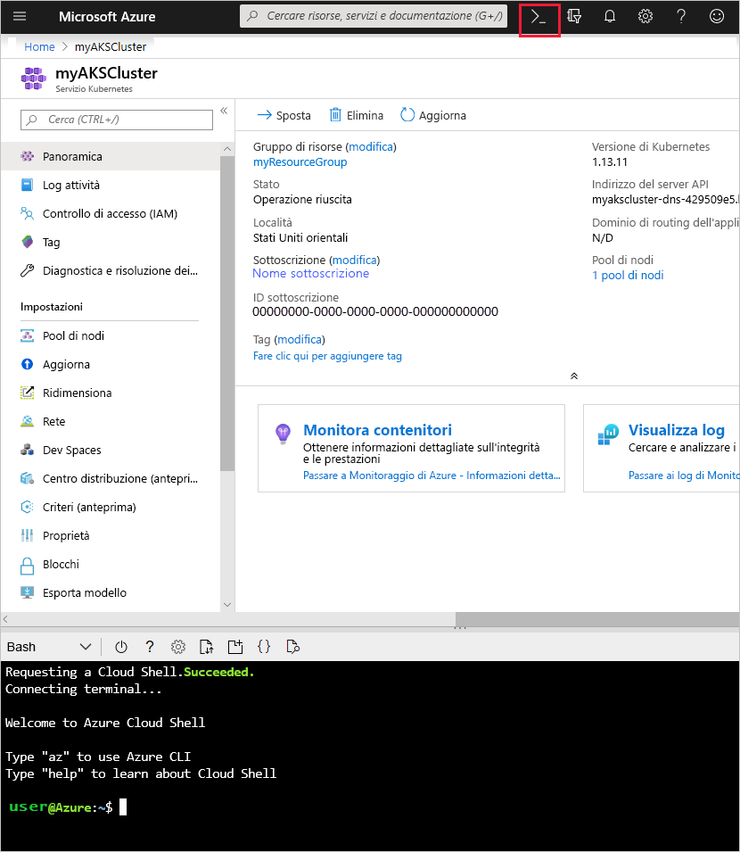
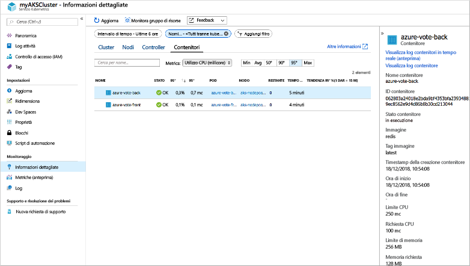
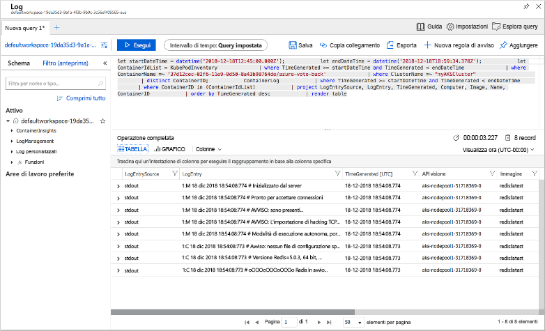

# <a name="quickstart-deploy-an-azure-kubernetes-service-aks-cluster"></a>Guida introduttiva: distribuire un cluster di Azure Kubernetes Service (AKS)

In questa guida introduttiva viene distribuito un cluster del servizio contenitore di Azure usando il portale di Azure. Un'applicazione multi-contenitore costituita dal front-end Web e da un'istanza di Redis viene quindi eseguita nel cluster. Al termine, l'applicazione è accessibile tramite Internet.


Questa guida introduttiva presuppone una comprensione di base dei concetti relativi a Kubernetes. Per informazioni dettagliate su Kubernetes, vedere la [documentazione di Kubernetes][kubernetes-documentation].

Se non si ha una sottoscrizione di Azure, creare un [account gratuito](https://azure.microsoft.com/free/?WT.mc_id=A261C142F) prima di iniziare.

## <a name="sign-in-to-azure"></a>Accedere ad Azure

Accedere al portale di Azure all'indirizzo https://portal.azure.com.

## <a name="create-an-aks-cluster"></a>Creare un cluster del servizio contenitore di Azure

Nell'angolo superiore sinistro del portale di Azure, selezionare **Crea una risorsa** > **Servizio Kubernetes**.

Per creare un cluster del servizio Kubernetes di Azure, seguire questa procedura:

1. **Informazioni di base** - Configurare le opzioni seguenti:
    - *DETTAGLI DEL PROGETTO*: selezionare una sottoscrizione di Azure, quindi selezionare o creare un gruppo di risorse di Azure, ad esempio *myResourceGroup*. Immettere un **nome cluster Kubernetes**, ad esempio *myAKSCluster*.
    - *DETTAGLI CLUSTER*: selezionare un'area, una versione di Kubernetes e il prefisso di nome DNS per il cluster del servizio Kubernetes di Azure.
    - *PIANO*: selezionare le dimensioni di macchina virtuale per i nodi del servizio Kubernetes di Azure. Le dimensioni della macchina virtuale **non possono** essere modificate dopo che un cluster del servizio contenitore di Azure è stato distribuito.
        - Selezionare il numero di nodi da distribuire nel cluster. Per questa guida introduttiva, impostare **Numero di nodi** su *1*. Il numero di nodi **può** essere modificato dopo che il cluster è stato distribuito.
    
    

    Al termine, selezionare **Avanti: autenticazione**.

1. **Autenticazione**: configurare le opzioni seguenti:
    - Creare una nuova entità servizio o *configurare* l'uso di un'entità esistente. Quando si usa un nome dell'entità servizio esistente, è necessario specificarne l'ID client e il segreto.
    - Abilitare l'opzione per il controllo degli accessi in base al ruolo di Kubernetes, per ottenere un controllo più capillare sull'accesso alle risorse Kubernetes distribuite nel cluster del servizio Kubernetes di Azure.

    Al termine dell'operazione, selezionare **Next: Networking** (Avanti: Rete).

1. **Rete**: configurare le opzioni di rete seguenti, che devono essere impostate come predefinite:
    
    - **Routing HTTP dell'applicazione** - Selezionare **Sì** per configurare un controller di ingresso integrato con creazione automatica del nome DNS pubblico. Per altre informazioni sul routing HTTP, vedere, [AKS HTTP routing and DNS][http-routing] (Routing HTTP e DNS nel servizio contenitore di Azure).
    - **Configurazione della rete** - Selezionare la configurazione di rete **Basic** usando il plugin [kubenet][kubenet] di Kubernetes, anziché la configurazione di rete avanzata con l'[interfaccia di rete dei contenitori di Azure][azure-cni]. Per altre informazioni sulle opzioni relative alla rete, vedere [AKS networking overview][aks-network] (Panoramica di rete AKS).
    
    Al termine dell'operazione, selezionare **Next: Monitoring** (Avanti: Monitoraggio).

1. Quando si distribuisce un cluster AKS, è possibile configurare Monitoraggio di Azure per i contenitori, per monitorare l'integrità del cluster AKS e dei pod in esecuzione nel cluster. Per altre informazioni sul monitoraggio dell'integrità del contenitore, vedere [Monitor Azure Kubernetes Service health][aks-monitor] (Monitorare l'integrità di Azure Kubernetes Service).

    Selezionare **Yes** (Sì) per abilitare il monitoraggio del contenitore e selezionare un'area di lavoro di Log Analytics esistente o crearne una nuova.
    
    Selezionare **Rivedi e crea** e quindi **Crea**.

Sono necessari alcuni minuti perché il cluster del servizio Kubernetes di Azure venga creato e sia pronto per l'uso. Individuare il gruppo di risorse del cluster del servizio Kubernetes di Azure, ad esempio *myResourceGroup*, e selezionare la risorsa del servizio Kubernetes di Azure, ad esempio *myAKSCluster*. Viene visualizzato il dashboard del cluster del servizio Kubernetes di Azure, come nello screenshot seguente:



## <a name="connect-to-the-cluster"></a>Connettersi al cluster

Per gestire un cluster Kubernetes, usare [kubectl][kubectl], il client da riga di comando di Kubernetes. Il client `kubectl` è preinstallato in Azure Cloud Shell.

Aprire Cloud Shell usando il pulsante nell'angolo in alto a destra del portale di Azure.



Per configurare [ per la connessione al cluster Kubernetes, usare il comando ]az aks get-credentials[az-aks-get-credentials]`kubectl`. L'esempio seguente ottiene le credenziali per il nome cluster *myAKSCluster* nel gruppo di risorse denominato *myResourceGroup*:

```azurecli-interactive
az aks get-credentials --resource-group myResourceGroup --name myAKSCluster
```

Per verificare la connessione al cluster, usare il comando [kubectl get][kubectl-get] per restituire un elenco dei nodi del cluster.

```azurecli-interactive
kubectl get nodes
```

L'esempio di output seguente mostra il nodo singolo creato nei passaggi precedenti.

```
NAME                       STATUS    ROLES     AGE       VERSION
aks-agentpool-14693408-0   Ready     agent     10m       v1.11.2
```

## <a name="run-the-application"></a>Eseguire l'applicazione

I file manifesto di Kubernetes definiscono uno stato desiderato per un cluster, incluse le immagini del contenitore da eseguire. In questa guida introduttiva viene usato un manifesto per creare tutti gli oggetti necessari per eseguire l'applicazione Azure Vote di esempio. Questi oggetti includono due [distribuzioni Kubernetes][kubernetes-deployment], una per il front-end di Azure Vote e l'altra per un'istanza Redis. Vengono anche creati due [servizi di Kubernetes][kubernetes-service], un servizio interno per l'istanza Redis e un servizio esterno per l'accesso all'applicazione Azure Vote da Internet.

> [!TIP]
> In questa guida introduttiva, si creano e distribuiscono manualmente i manifesti dell'applicazione nel cluster AKS. In altre situazioni reali, è possibile usare [Azure Dev Spaces] [ azure-dev-spaces] per eseguire rapidamente l'iterazione e il debug del codice direttamente nel cluster AKS. È possibile usare Dev Spaces su piattaforme del sistema operativo e ambienti di sviluppo e collaborare con altri utenti nel team.

Creare un file denominato `azure-vote.yaml` e copiarvi il codice YAML seguente. Se si usa Azure Cloud Shell, creare il file usando `vi` o `Nano`, come in un sistema virtuale o fisico.

```yaml
apiVersion: apps/v1
kind: Deployment
metadata:
  name: azure-vote-back
spec:
  replicas: 1
  selector:
    matchLabels:
      app: azure-vote-back
  template:
    metadata:
      labels:
        app: azure-vote-back
    spec:
      containers:
      - name: azure-vote-back
        image: redis
        resources:
          requests:
            cpu: 100m
            memory: 128Mi
          limits:
            cpu: 250m
            memory: 256Mi
        ports:
        - containerPort: 6379
          name: redis
---
apiVersion: v1
kind: Service
metadata:
  name: azure-vote-back
spec:
  ports:
  - port: 6379
  selector:
    app: azure-vote-back
---
apiVersion: apps/v1
kind: Deployment
metadata:
  name: azure-vote-front
spec:
  replicas: 1
  selector:
    matchLabels:
      app: azure-vote-front
  template:
    metadata:
      labels:
        app: azure-vote-front
    spec:
      containers:
      - name: azure-vote-front
        image: microsoft/azure-vote-front:v1
        resources:
          requests:
            cpu: 100m
            memory: 128Mi
          limits:
            cpu: 250m
            memory: 256Mi
        ports:
        - containerPort: 80
        env:
        - name: REDIS
          value: "azure-vote-back"
---
apiVersion: v1
kind: Service
metadata:
  name: azure-vote-front
spec:
  type: LoadBalancer
  ports:
  - port: 80
  selector:
    app: azure-vote-front
```

Usare il comando [kubectl apply][kubectl-apply] per eseguire l'applicazione.

```azurecli-interactive
kubectl apply -f azure-vote.yaml
```

L'output di esempio seguente mostra le risorse di Kubernetes create nel cluster del servizio Kubernetes di Azure:

```
deployment "azure-vote-back" created
service "azure-vote-back" created
deployment "azure-vote-front" created
service "azure-vote-front" created
```

## <a name="test-the-application"></a>Test dell'applicazione

Durante l'esecuzione dell'applicazione, viene creato un [servizio Kubernetes][kubernetes-service] per esporre l'applicazione a Internet. Il processo potrebbe richiedere alcuni minuti.

Per monitorare lo stato, usare il comando [kubectl get service][kubectl-get] con l'argomento `--watch`.

```azurecli-interactive
kubectl get service azure-vote-front --watch
```

*EXTERNAL-IP* per il servizio *azure-vote-front* inizialmente viene visualizzato come *pending*.

```
NAME               TYPE           CLUSTER-IP   EXTERNAL-IP   PORT(S)        AGE
azure-vote-front   LoadBalancer   10.0.37.27   <pending>     80:30572/TCP   6s
```

Dopo il passaggio di *EXTERNAL-IP* da *pending* a un *indirizzo IP*, usare `CTRL-C` per arrestare il processo kubectl watch.

```
azure-vote-front   LoadBalancer   10.0.37.27   52.179.23.131   80:30572/TCP   2m
```

Aprire un Web browser all'indirizzo IP esterno del servizio per visualizzare l'applicazione Azure Vote, come mostrato nell'esempio seguente:


## <a name="monitor-health-and-logs"></a>Monitoraggio di stato e registri

Con la creazione del cluster è stato abilitato il monitoraggio di Informazioni dettagliate contenitore. Questa funzione di monitoraggio fornisce metriche di integrità sia per il cluster del servizio Kubernetes di Azure che per i pod in esecuzione nel cluster. Per altre informazioni sul monitoraggio dell'integrità del contenitore, vedere [Monitor Azure Kubernetes Service health][aks-monitor] (Monitorare l'integrità di Azure Kubernetes Service).

L'inserimento di questi dati nel portale di Azure potrebbe richiedere alcuni minuti. Per visualizzare lo stato corrente, il tempo di attività e l'utilizzo delle risorse per i pod di Azure Vote, tornare alla risorsa del servizio Kubernetes di Azure nel portale di Azure, ad esempio *myAKSCluster*. È quindi possibile accedere allo stato di integrità nel modo seguente:

1. Sulla sinistra, sotto **Monitoraggio**, scegliere **Informazioni dettagliate (anteprima)**
1. Nella parte superiore scegliere **+ Aggiungi filtro**
1. Selezionare *Spazio dei nomi* come proprietà, quindi scegliere *\<All but kube-system\>* (Tutti tranne kube-system)
1. Scegliere di visualizzare i **Contenitori**.

Verranno visualizzati i contenitori *azure-vote-back* e *azure-vote-front*, come mostrato in questo esempio:



Per visualizzare i log per il pod `azure-vote-front`, selezionare il collegamento **View container logs** (Visualizza log contenitore) sul lato destro dell'elenco dei contenitori. Questi log includono i flussi *stdout* e *stderr* del contenitore.



## <a name="delete-cluster"></a>Eliminare il cluster

Quando il cluster non è più necessario, eliminare la risorsa del cluster, operazione che comporta l'eliminazione di tutte le risorse associate. Questa operazione può essere eseguita nel portale di Azure selezionando il pulsante **Elimina** nel dashboard del cluster del servizio Kubernetes di Azure. In alternativa, è possibile usare il comando [az aks delete][az-aks-delete] in Cloud Shell:

```azurecli-interactive
az aks delete --resource-group myResourceGroup --name myAKSCluster --no-wait
```

> [!NOTE]
> Quando si elimina il cluster, l'entità servizio di Azure Active Directory utilizzata dal cluster AKS non viene rimossa. Per istruzioni su come rimuovere l'entità servizio, vedere le [considerazioni sull'entità servizio AKS e la sua eliminazione][sp-delete].

## <a name="get-the-code"></a>Ottenere il codice

In questa guida introduttiva sono state usate immagini del contenitore già creato per creare una distribuzione di Kubernetes. Il codice dell'applicazione correlato, Dockerfile, e il file manifesto di Kubernetes sono disponibili su GitHub.

[https://github.com/Azure-Samples/azure-voting-app-redis][azure-vote-app]

## <a name="next-steps"></a>Passaggi successivi

In questa guida introduttiva è stato distribuito un cluster Kubernetes in cui è stata quindi distribuita un'applicazione multicontenitore.

Per altre informazioni sul servizio contenitore di Azure e l'analisi del codice completo per un esempio di distribuzione, passare all'esercitazione sul cluster Kubernetes.

> [!div class="nextstepaction"]
> [Esercitazione sul servizio contenitore di Azure][aks-tutorial]

<!-- LINKS - external -->
[azure-vote-app]: https://github.com/Azure-Samples/azure-voting-app-redis.git
[azure-cni]: https://github.com/Azure/azure-container-networking/blob/master/docs/cni.md
[kubectl]: https://kubernetes.io/docs/user-guide/kubectl/
[kubectl-apply]: https://kubernetes.io/docs/reference/generated/kubectl/kubectl-commands#apply
[kubectl-get]: https://kubernetes.io/docs/reference/generated/kubectl/kubectl-commands#get
[kubenet]: https://kubernetes.io/docs/concepts/cluster-administration/network-plugins/#kubenet
[kubernetes-deployment]: https://kubernetes.io/docs/concepts/workloads/controllers/deployment/
[kubernetes-documentation]: https://kubernetes.io/docs/home/
[kubernetes-service]: https://kubernetes.io/docs/concepts/services-networking/service/

<!-- LINKS - internal -->
[az-aks-get-credentials]: /cli/azure/aks?view=azure-cli-latest#az-aks-get-credentials
[az-aks-delete]: /cli/azure/aks#az-aks-delete
[aks-monitor]: ../monitoring/monitoring-container-health.md
[aks-network]: ./concepts-network.md
[aks-tutorial]: ./tutorial-kubernetes-prepare-app.md
[http-routing]: ./http-application-routing.md
[sp-delete]: kubernetes-service-principal.md#additional-considerations
[azure-dev-spaces]: https://docs.microsoft.com/azure/dev-spaces/
