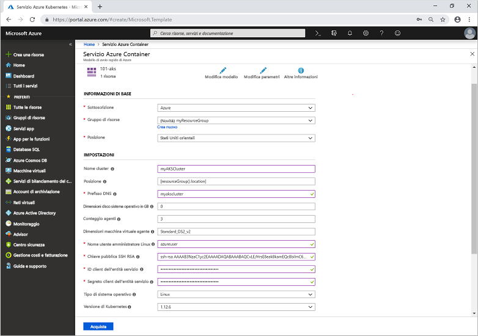

# <a name="quickstart-deploy-an-azure-kubernetes-service-aks-cluster-using-an-azure-resource-manager-template"></a>Guida introduttiva: Distribuire un cluster del servizio Azure Kubernetes usando un modello di Azure Resource Manager

Il servizio Azure Kubernetes è un servizio Kubernetes gestito che permette di distribuire e gestire rapidamente i cluster. In questo modulo dell'Avvio rapido verrà distribuito un cluster del servizio Azure Kubernetes usando un modello di Azure Resource Manager. Nel cluster verrà eseguita un'applicazione multi-contenitore che include un front-end Web e un'istanza di Redis.


Questa guida introduttiva presuppone una comprensione di base dei concetti relativi a Kubernetes. Per altre informazioni, vedere [Concetti di base relativi a Kubernetes per il servizio Azure Kubernetes][kubernetes-concepts].

Se non si ha una sottoscrizione di Azure, creare un [account gratuito](https://azure.microsoft.com/free/?WT.mc_id=A261C142F) prima di iniziare.

[!INCLUDE [cloud-shell-try-it.md](../../includes/cloud-shell-try-it.md)]

Se si sceglie di installare e usare l'interfaccia della riga di comando in locale, questo modulo dell'Avvio rapido richiederà l'utilizzo della versione 2.0.61 o successive dell'interfaccia della riga di comando di Azure. Eseguire `az --version` per trovare la versione. Se è necessario eseguire l'installazione o l'aggiornamento, vedere [Installare l'interfaccia della riga di comando di Azure][azure-cli-install].

## <a name="prerequisites"></a>Prerequisiti

Per creare un cluster del servizio Azure Kubernetes usando un modello di Resource Manager, è necessario specificare una chiave pubblica SSH e l'entità servizio di Azure Active Directory. Se è necessaria una di queste risorse, vedere la sezione successiva. In caso contrario passare direttamente alla sezione [Creare un cluster del servizio Azure Kubernetes](#create-an-aks-cluster).

### <a name="create-an-ssh-key-pair"></a>Creare una coppia di chiavi SSH

Per accedere ai nodi del servizio Azure Kubernetes è necessario connettersi tramite una coppia di chiavi SSH. Usare il comando `ssh-keygen` per generare i file di chiave pubblica e privata SSH. Per impostazione predefinita, questi file vengono creati nella directory *~/.ssh*. Se nel percorso specificato è presente una coppia di chiavi SSH con lo stesso nome, questi file vengono sovrascritti.

Il comando seguente crea una coppia di chiavi SSH usando la crittografia RSA e una lunghezza in bit pari a 2048:

```azurecli-interactive
ssh-keygen -t rsa -b 2048
```

Per altre informazioni su come creare le chiavi SSH, vedere [Creare e gestire chiavi SSH per l'autenticazione in una macchina virtuale Linux in Azure][ssh-keys].

### <a name="create-a-service-principal"></a>Creare un'entità servizio

Per consentire a un cluster servizio Azure Kubernetes di interagire con altre risorse di Azure viene usata un'entità servizio di Azure Active Directory. Creare un'entità servizio usando il comando [az ad sp create-for-rbac][az-ad-sp-create-for-rbac]. Il parametro `--skip-assignment` limita l'assegnazione di autorizzazioni aggiuntive. Per impostazione predefinita, questa entità servizio è valida per un anno.

```azurecli-interactive
az ad sp create-for-rbac --skip-assignment
```

L'output è simile all'esempio seguente:

```json
{
  "appId": "8b1ede42-d407-46c2-a1bc-6b213b04295f",
  "displayName": "azure-cli-2019-04-19-21-42-11",
  "name": "http://azure-cli-2019-04-19-21-42-11",
  "password": "27e5ac58-81b0-46c1-bd87-85b4ef622682",
  "tenant": "73f978cf-87f2-41bf-92ab-2e7ce012db57"
}
```

Prendere nota di *appId* e *password*. Questi valori vengono usati nei passaggi successivi.

## <a name="create-an-aks-cluster"></a>Creare un cluster del servizio Azure Container

Il modello usato in questo modulo di avvio rapido consente di [distribuire un cluster del servizio Azure Kubernetes](https://azure.microsoft.com/resources/templates/101-aks/). Per altri esempi per il servizio Azure Kubernetes, vedere il sito dei [modelli di avvio rapido per il servizio Azure Kubernetes][aks-quickstart-templates].

1. Selezionare l'immagine seguente per accedere ad Azure e aprire un modello.

    [](https://portal.azure.com/#create/Microsoft.Template/uri/https%3A%2F%2Fraw.githubusercontent.com%2FAzure%2Fazure-quickstart-templates%2Fmaster%2F101-aks%2Fazuredeploy.json)

2. Selezionare o immettere i valori seguenti.  

    Per questo modello di avvio rapido, lasciare i valori predefiniti per *Dimensioni disco sistema operativo*, *Numero di agenti*, *Dimensioni macchina virtuale agente*, *Tipo di sistema operativo* e *Versione di Kubernetes*. Specificare i valori personalizzati per i parametri del modello seguenti:

    * **Sottoscrizione** Selezionare una sottoscrizione di Azure.
    * **Gruppo di risorse**: Selezionare **Crea nuovo**. Specificare un nome univoco per il gruppo di risorse, ad esempio *myResourceGroup* e quindi scegliere **OK**.
    * **Località**: Selezionare una località, ad esempio **Stati Uniti orientali**.
    * **Nome cluster**: Specificare un nome univoco per il cluster del servizio Azure Kubernetes, ad esempio *myAKSCluster*.
    * **Prefisso DNS**: Specificare un prefisso DNS univoco per il cluster, ad esempio *myakscluster*.
    * **Nome utente amministratore Linux**: Specificare il nome utente per la connessione tramite SSH, ad esempio *azureuser*.
    * **Chiave pubblica RSA SSH**: Copiare e incollare la parte *pubblica* della coppia di chiavi SSH (per impostazione predefinita, il contenuto di *~/.ssh/id_rsa.pub*).
    * **ID client entità servizio**: Copiare e incollare l'*appId* dell'entità servizio dal comando `az ad sp create-for-rbac`.
    * **Segreto client entità servizio**: Copiare e incollare la *password* dell'entità servizio dal comando `az ad sp create-for-rbac`.
    * **Accetto le condizioni riportate sopra**: selezionare questa casella per accettare.

    

3. Selezionare **Acquisto**.

La creazione del cluster del servizio Azure Kubernetes richiede alcuni minuti. Attendere il completamento della distribuzione del cluster prima di procedere al passaggio successivo.

## <a name="connect-to-the-cluster"></a>Connettersi al cluster

Per gestire un cluster Kubernetes, usare [kubectl][kubectl], il client da riga di comando di Kubernetes. Se si usa Azure Cloud Shell, `kubectl` è già installato. Per installare `kubectl` in locale, usare il comando [az aks install-cli][az-aks-install-cli]:

```azurecli
az aks install-cli
```

Per configurare `kubectl` per la connessione al cluster Kubernetes, usare il comando [az aks get-credentials][az-aks-get-credentials]. Questo comando scarica le credenziali e configura l'interfaccia della riga di comando di Kubernetes per usarli.

```azurecli-interactive
az aks get-credentials --resource-group myResourceGroup --name myAKSCluster
```

Per verificare la connessione al cluster, usare il comando [kubectl get][kubectl-get] per restituire un elenco dei nodi del cluster.

```azurecli-interactive
kubectl get nodes
```

L'output di esempio seguente mostra i nodi creati nei passaggi precedenti. Assicurarsi che lo stato di tutti i nodi sia impostato su *Pronto*:

```
NAME                       STATUS   ROLES   AGE     VERSION
aks-agentpool-41324942-0   Ready    agent   6m44s   v1.12.6
aks-agentpool-41324942-1   Ready    agent   6m46s   v1.12.6
aks-agentpool-41324942-2   Ready    agent   6m45s   v1.12.6
```

## <a name="run-the-application"></a>Eseguire l'applicazione

Un file manifesto di Kubernetes definisce uno stato desiderato per il cluster, ad esempio le immagini del contenitore da eseguire. In questa guida introduttiva, viene usato un manifesto per creare tutti gli oggetti necessari per eseguire l'applicazione Azure Vote. Questo manifesto include due [distribuzioni di Kubernetes][kubernetes-deployment]: una per le applicazioni Python Azure Vote di esempio e l'altra per un'istanza di Redis. Vengono anche creati due [servizi Kubernetes][kubernetes-service]: un servizio interno per l'istanza di Redis e un servizio esterno per accedere all'applicazione Azure Vote da Internet.

> [!TIP]
> In questa guida introduttiva, si creano e distribuiscono manualmente i manifesti dell'applicazione nel cluster servizio Azure Kubernetes. In altre situazioni reali, è possibile usare [Azure Dev Spaces][azure-dev-spaces] per eseguire rapidamente l'iterazione e il debug del codice direttamente nel cluster servizio Azure Kubernetes. È possibile usare Dev Spaces su piattaforme del sistema operativo e ambienti di sviluppo e collaborare con altri utenti nel team.

Creare un file denominato `azure-vote.yaml` e copiarlo nella definizione YAML seguente. Se si usa Azure Cloud Shell, questo file può essere creato usando `vi` o `nano` come se si usasse un sistema virtuale o fisico:

```yaml
apiVersion: apps/v1
kind: Deployment
metadata:
  name: azure-vote-back
spec:
  replicas: 1
  selector:
    matchLabels:
      app: azure-vote-back
  template:
    metadata:
      labels:
        app: azure-vote-back
    spec:
      nodeSelector:
        "beta.kubernetes.io/os": linux
      containers:
      - name: azure-vote-back
        image: redis
        resources:
          requests:
            cpu: 100m
            memory: 128Mi
          limits:
            cpu: 250m
            memory: 256Mi
        ports:
        - containerPort: 6379
          name: redis
---
apiVersion: v1
kind: Service
metadata:
  name: azure-vote-back
spec:
  ports:
  - port: 6379
  selector:
    app: azure-vote-back
---
apiVersion: apps/v1
kind: Deployment
metadata:
  name: azure-vote-front
spec:
  replicas: 1
  selector:
    matchLabels:
      app: azure-vote-front
  template:
    metadata:
      labels:
        app: azure-vote-front
    spec:
      nodeSelector:
        "beta.kubernetes.io/os": linux
      containers:
      - name: azure-vote-front
        image: microsoft/azure-vote-front:v1
        resources:
          requests:
            cpu: 100m
            memory: 128Mi
          limits:
            cpu: 250m
            memory: 256Mi
        ports:
        - containerPort: 80
        env:
        - name: REDIS
          value: "azure-vote-back"
---
apiVersion: v1
kind: Service
metadata:
  name: azure-vote-front
spec:
  type: LoadBalancer
  ports:
  - port: 80
  selector:
    app: azure-vote-front
```

Distribuire l'applicazione usando il comando [kubectl apply][kubectl-apply] e specificare il nome del manifesto YAML:

```azurecli-interactive
kubectl apply -f azure-vote.yaml
```

L'output di esempio seguente mostra le distribuzioni e i servizi creati correttamente:

```
deployment "azure-vote-back" created
service "azure-vote-back" created
deployment "azure-vote-front" created
service "azure-vote-front" created
```

## <a name="test-the-application"></a>Test dell'applicazione

Durante l'esecuzione dell'applicazione, un servizio Kubernetes espone il front-end dell'applicazione a Internet. Il processo potrebbe richiedere alcuni minuti.

Per monitorare lo stato, usare il comando [kubectl get service][kubectl-get] con l'argomento `--watch`.

```azurecli-interactive
kubectl get service azure-vote-front --watch
```

*EXTERNAL-IP* per il servizio *azure-vote-front* viene inizialmente visualizzato come *pending*.

```
NAME               TYPE           CLUSTER-IP   EXTERNAL-IP   PORT(S)        AGE
azure-vote-front   LoadBalancer   10.0.37.27   <pending>     80:30572/TCP   6s
```

Quando *EXTERNAL-IP* passa da *pending* a un effettivo indirizzo IP pubblico, usare `CTRL-C` per arrestare il processo di controllo `kubectl`. L'output di esempio seguente mostra un indirizzo IP pubblico valido assegnato al servizio:

```
azure-vote-front   LoadBalancer   10.0.37.27   52.179.23.131   80:30572/TCP   2m
```

Per osservare l'app Azure Vote in azione, aprire un Web browser all'indirizzo IP esterno del servizio.


## <a name="delete-cluster"></a>Eliminare il cluster

Quando il cluster non è più necessario, usare il comando [az group delete][az-group-delete] per rimuovere il gruppo di risorse, il servizio contenitore e tutte le risorse correlate.

```azurecli-interactive
az group delete --name myResourceGroup --yes --no-wait
```

> [!NOTE]
> Quando si elimina il cluster, l'entità servizio di Azure Active Directory utilizzata dal cluster servizio Azure Kubernetes non viene rimossa. Per istruzioni su come rimuovere l'entità servizio, vedere le [considerazioni sull'entità servizio servizio Azure Kubernetes e la sua eliminazione][sp-delete].

## <a name="get-the-code"></a>Ottenere il codice

In questa guida introduttiva sono state usate immagini del contenitore già creato per creare una distribuzione di Kubernetes. Il codice dell'applicazione correlato, Dockerfile, e il file manifesto di Kubernetes sono disponibili su GitHub.

[https://github.com/Azure-Samples/azure-voting-app-redis][azure-vote-app]

## <a name="next-steps"></a>Passaggi successivi

In questa guida introduttiva è stato distribuito un cluster Kubernetes in cui è stata quindi distribuita un'applicazione multicontenitore. [Accedere al dashboard Web di Kubernetes][kubernetes-dashboard] per il cluster appena creato.

Per altre informazioni sul servizio Azure Container e l'analisi del codice completo per un esempio di distribuzione, passare all'esercitazione sul cluster Kubernetes.

> [!div class="nextstepaction"]
> [Esercitazione sul servizio Azure Container][aks-tutorial]

<!-- LINKS - external -->
[azure-vote-app]: https://github.com/Azure-Samples/azure-voting-app-redis.git
[kubectl]: https://kubernetes.io/docs/user-guide/kubectl/
[kubectl-apply]: https://kubernetes.io/docs/reference/generated/kubectl/kubectl-commands#apply
[kubectl-get]: https://kubernetes.io/docs/reference/generated/kubectl/kubectl-commands#get
[azure-dev-spaces]: https://docs.microsoft.com/azure/dev-spaces/
[aks-quickstart-templates]: https://azure.microsoft.com/resources/templates/?term=Azure+Kubernetes+Service

<!-- LINKS - internal -->
[kubernetes-concepts]: concepts-clusters-workloads.md
[aks-monitor]: https://aka.ms/coingfonboarding
[aks-tutorial]: ./tutorial-kubernetes-prepare-app.md
[az-aks-browse]: /cli/azure/aks?view=azure-cli-latest#az-aks-browse
[az-aks-create]: /cli/azure/aks?view=azure-cli-latest#az-aks-create
[az-aks-get-credentials]: /cli/azure/aks?view=azure-cli-latest#az-aks-get-credentials
[az-aks-install-cli]: /cli/azure/aks?view=azure-cli-latest#az-aks-install-cli
[az-group-create]: /cli/azure/group#az-group-create
[az-group-delete]: /cli/azure/group#az-group-delete
[azure-cli-install]: /cli/azure/install-azure-cli
[sp-delete]: kubernetes-service-principal.md#additional-considerations
[azure-portal]: https://portal.azure.com
[kubernetes-deployment]: concepts-clusters-workloads.md#deployments-and-yaml-manifests
[kubernetes-service]: concepts-network.md#services
[kubernetes-dashboard]: kubernetes-dashboard.md
[ssh-keys]: ../virtual-machines/linux/create-ssh-keys-detailed.md
[az-ad-sp-create-for-rbac]: /cli/azure/ad/sp#az-ad-sp-create-for-rbac
