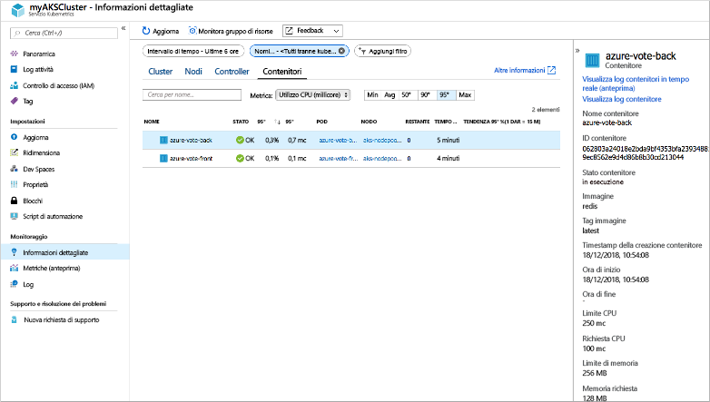
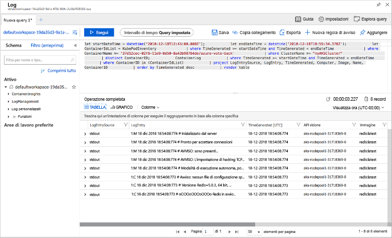

# <a name="quickstart-deploy-an-azure-kubernetes-service-aks-cluster-using-the-azure-cli"></a>Guida introduttiva: Distribuire un cluster del servizio Azure Kubernetes tramite l'interfaccia della riga di comando di Azure

Il servizio Azure Kubernetes è un servizio Kubernetes gestito che permette di distribuire e gestire rapidamente i cluster. In questo argomento di avvio rapido si distribuirà un cluster del servizio Azure Kubernetes tramite l'interfaccia della riga di comando di Azure. Nel cluster verrà eseguita un'applicazione multi-contenitore che include un front-end Web e un'istanza di Redis. Verrà quindi descritto come monitorare l'integrità del cluster e dei pod che eseguono l'applicazione.

Se si vogliono usare contenitori di Windows Server, attualmente in anteprima nel servizio Azure Kubernetes, vedere [Creare un cluster del servizio Azure Kubernetes che supporta contenitori di Windows Server][windows-container-cli].


Questa guida introduttiva presuppone una comprensione di base dei concetti relativi a Kubernetes. Per altre informazioni, vedere [Concetti di base relativi a Kubernetes per il servizio Azure Kubernetes][kubernetes-concepts].

Se non si ha una sottoscrizione di Azure, creare un [account gratuito](https://azure.microsoft.com/free/?WT.mc_id=A261C142F) prima di iniziare.

[!INCLUDE [cloud-shell-try-it.md](../../includes/cloud-shell-try-it.md)]

Se si sceglie di installare e usare l'interfaccia della riga di comando in locale, per questo argomento di avvio rapido è necessario usare la versione 2.0.64 o successiva dell'interfaccia della riga di comando di Azure. Eseguire `az --version` per trovare la versione. Se è necessario eseguire l'installazione o l'aggiornamento, vedere [Installare l'interfaccia della riga di comando di Azure][azure-cli-install].

## <a name="create-a-resource-group"></a>Creare un gruppo di risorse

Un gruppo di risorse di Azure è un gruppo logico in cui le risorse di Azure vengono distribuite e gestite. Quando si crea un gruppo di risorse, viene chiesto di specificare una posizione. Questo è il percorso in cui vengono archiviati i metadati del gruppo di risorse, ma anche quello in cui vengono eseguite le risorse in Azure se non si specifica un'altra area durante la creazione della risorsa. Creare un gruppo di risorse con il comando [az group create][az-group-create].

L'esempio seguente crea un gruppo di risorse denominato *myResourceGroup* nella località *stati uniti orientali*.

```azurecli-interactive
az group create --name myResourceGroup --location eastus
```

L'output di esempio seguente mostra il gruppo di risorse creato correttamente:

```json
{
  "id": "/subscriptions/<guid>/resourceGroups/myResourceGroup",
  "location": "eastus",
  "managedBy": null,
  "name": "myResourceGroup",
  "properties": {
    "provisioningState": "Succeeded"
  },
  "tags": null
}
```

## <a name="create-aks-cluster"></a>Creare un cluster del servizio Azure Container

Usare il comando [az aks create][az-aks-create] per creare un cluster del servizio Azure Kubernetes. L'esempio seguente crea un cluster denominato *myAKSCluster* con un nodo. Viene inoltre abilitato Monitoraggio di Azure per i contenitori mediante il parametro *--enable-addons monitoring*.

```azurecli-interactive
az aks create \
    --resource-group myResourceGroup \
    --name myAKSCluster \
    --node-count 1 \
    --enable-addons monitoring \
    --generate-ssh-keys
```

Il comando viene completato dopo pochi minuti e vengono restituite informazioni in formato JSON sul cluster.

## <a name="connect-to-the-cluster"></a>Connettersi al cluster

Per gestire un cluster Kubernetes, usare [kubectl][kubectl], il client da riga di comando di Kubernetes. Se si usa Azure Cloud Shell, `kubectl` è già installato. Per installare `kubectl` in locale, usare il comando [az aks install-cli][az-aks-install-cli]:

```azurecli
az aks install-cli
```

Per configurare `kubectl` per la connessione al cluster Kubernetes, usare il comando [az aks get-credentials][az-aks-get-credentials]. Questo comando scarica le credenziali e configura l'interfaccia della riga di comando di Kubernetes per usarli.

```azurecli-interactive
az aks get-credentials --resource-group myResourceGroup --name myAKSCluster
```

Per verificare la connessione al cluster, usare il comando [kubectl get][kubectl-get] per restituire un elenco dei nodi del cluster.

```azurecli-interactive
kubectl get nodes
```

L'esempio di output seguente mostra il nodo singolo creato nei passaggi precedenti. Assicurarsi che lo stato del nodo sia impostato su *Pronto*:

```output
NAME                       STATUS   ROLES   AGE     VERSION
aks-nodepool1-31718369-0   Ready    agent   6m44s   v1.12.8
```

## <a name="run-the-application"></a>Eseguire l'applicazione

Un file manifesto di Kubernetes definisce uno stato desiderato per il cluster, ad esempio le immagini del contenitore da eseguire. In questa guida introduttiva, viene usato un manifesto per creare tutti gli oggetti necessari per eseguire l'applicazione Azure Vote. Questo manifesto include due [distribuzioni di Kubernetes][kubernetes-deployment]: una per le applicazioni Python Azure Vote di esempio e l'altra per un'istanza di Redis. Vengono anche creati due [servizi Kubernetes][kubernetes-service]: un servizio interno per l'istanza di Redis e un servizio esterno per accedere all'applicazione Azure Vote da Internet.

> [!TIP]
> In questa guida introduttiva, si creano e distribuiscono manualmente i manifesti dell'applicazione nel cluster servizio Azure Kubernetes. In altre situazioni reali, è possibile usare [Azure Dev Spaces][azure-dev-spaces] per eseguire rapidamente l'iterazione e il debug del codice direttamente nel cluster servizio Azure Kubernetes. È possibile usare Dev Spaces su piattaforme del sistema operativo e ambienti di sviluppo e collaborare con altri utenti nel team.

Creare un file denominato `azure-vote.yaml` e copiarlo nella definizione YAML seguente. Se si usa Azure Cloud Shell, questo file può essere creato usando `vi` o `nano` come se si usasse un sistema virtuale o fisico:

```yaml
apiVersion: apps/v1
kind: Deployment
metadata:
  name: azure-vote-back
spec:
  replicas: 1
  selector:
    matchLabels:
      app: azure-vote-back
  template:
    metadata:
      labels:
        app: azure-vote-back
    spec:
      nodeSelector:
        "beta.kubernetes.io/os": linux
      containers:
      - name: azure-vote-back
        image: redis
        resources:
          requests:
            cpu: 100m
            memory: 128Mi
          limits:
            cpu: 250m
            memory: 256Mi
        ports:
        - containerPort: 6379
          name: redis
---
apiVersion: v1
kind: Service
metadata:
  name: azure-vote-back
spec:
  ports:
  - port: 6379
  selector:
    app: azure-vote-back
---
apiVersion: apps/v1
kind: Deployment
metadata:
  name: azure-vote-front
spec:
  replicas: 1
  selector:
    matchLabels:
      app: azure-vote-front
  template:
    metadata:
      labels:
        app: azure-vote-front
    spec:
      nodeSelector:
        "beta.kubernetes.io/os": linux
      containers:
      - name: azure-vote-front
        image: microsoft/azure-vote-front:v1
        resources:
          requests:
            cpu: 100m
            memory: 128Mi
          limits:
            cpu: 250m
            memory: 256Mi
        ports:
        - containerPort: 80
        env:
        - name: REDIS
          value: "azure-vote-back"
---
apiVersion: v1
kind: Service
metadata:
  name: azure-vote-front
spec:
  type: LoadBalancer
  ports:
  - port: 80
  selector:
    app: azure-vote-front
```

Distribuire l'applicazione usando il comando [kubectl apply][kubectl-apply] e specificare il nome del manifesto YAML:

```azurecli-interactive
kubectl apply -f azure-vote.yaml
```

L'output di esempio seguente mostra le distribuzioni e i servizi creati correttamente:

```output
deployment "azure-vote-back" created
service "azure-vote-back" created
deployment "azure-vote-front" created
service "azure-vote-front" created
```

## <a name="test-the-application"></a>Test dell'applicazione

Durante l'esecuzione dell'applicazione, un servizio Kubernetes espone il front-end dell'applicazione a Internet. Il processo potrebbe richiedere alcuni minuti.

Per monitorare lo stato, usare il comando [kubectl get service][kubectl-get] con l'argomento `--watch`.

```azurecli-interactive
kubectl get service azure-vote-front --watch
```

*EXTERNAL-IP* per il servizio *azure-vote-front* viene inizialmente visualizzato come *pending*.

```output
NAME               TYPE           CLUSTER-IP   EXTERNAL-IP   PORT(S)        AGE
azure-vote-front   LoadBalancer   10.0.37.27   <pending>     80:30572/TCP   6s
```

Quando *EXTERNAL-IP* passa da *pending* a un effettivo indirizzo IP pubblico, usare `CTRL-C` per arrestare il processo di controllo `kubectl`. L'output di esempio seguente mostra un indirizzo IP pubblico valido assegnato al servizio:

```output
azure-vote-front   LoadBalancer   10.0.37.27   52.179.23.131   80:30572/TCP   2m
```

Per osservare l'app Azure Vote in azione, aprire un Web browser all'indirizzo IP esterno del servizio.


## <a name="monitor-health-and-logs"></a>Monitoraggio di stato e log

Quando è stato creato il cluster del servizio Azure Kubernetes, è stato abilitato Monitoraggio di Azure per i contenitori, in modo da acquisire le metriche di integrità sia per i pod sia per i nodi del cluster. Queste metriche di integrità sono disponibili nel portale di Azure.

Per visualizzare lo stato corrente, i tempi di attività e l'utilizzo delle risorse per i pod di Azure Vote, seguire questa procedura:

1. In un Web browser passare al portale di Azure [https://portal.azure.com][azure-portal].
1. Selezionare il gruppo di risorse, ad esempio *myResourceGroup*, quindi selezionare il cluster del servizio Azure Kubernetes, ad esempio *myservizio Azure KubernetesCluster*.
1. In **Monitoraggio** a sinistra selezionare **Informazioni dettagliate**.
1. Nella parte superiore selezionare **+ Aggiungi filtro**.
1. Selezionare *Spazio dei nomi* come proprietà e quindi scegliere *\<Tutti tranne kube-system\>* .
1. Selezionare **Contenitori**.

Verranno visualizzati i contenitori *azure-vote-back* e *azure-vote-front*, come mostrato in questo esempio:



Per visualizzare i log per il pod `azure-vote-back`, scegliere l'opzione **Visualizza in Analisi** e quindi selezionare il collegamento **Visualizza log contenitori** a destra dell'elenco di contenitori. Questi log includono i flussi *stdout* e *stderr* del contenitore.



## <a name="delete-the-cluster"></a>Eliminare il cluster

Quando il cluster non è più necessario, usare il comando [az group delete][az-group-delete] per rimuovere il gruppo di risorse, il servizio contenitore e tutte le risorse correlate.

```azurecli-interactive
az group delete --name myResourceGroup --yes --no-wait
```

> [!NOTE]
> Quando si elimina il cluster, l'entità servizio di Azure Active Directory utilizzata dal cluster servizio Azure Kubernetes non viene rimossa. Per istruzioni su come rimuovere l'entità servizio, vedere le [considerazioni sull'entità servizio servizio Azure Kubernetes e la sua eliminazione][sp-delete].

## <a name="get-the-code"></a>Ottenere il codice

In questa guida introduttiva sono state usate immagini del contenitore già creato per creare una distribuzione di Kubernetes. Il codice dell'applicazione correlato, Dockerfile, e il file manifesto di Kubernetes sono disponibili su GitHub.

[https://github.com/Azure-Samples/azure-voting-app-redis][azure-vote-app]

## <a name="next-steps"></a>Passaggi successivi

In questa guida introduttiva è stato distribuito un cluster Kubernetes in cui è stata quindi distribuita un'applicazione multicontenitore. È anche possibile [accedere al dashboard Web di Kubernetes][kubernetes-dashboard] per il cluster del servizio Azure Kubernetes.

Per altre informazioni sul servizio Azure Container e l'analisi del codice completo per un esempio di distribuzione, passare all'esercitazione sul cluster Kubernetes.

> [!div class="nextstepaction"]
> [Esercitazione sul servizio Azure Container][aks-tutorial]

<!-- LINKS - external -->
[azure-vote-app]: https://github.com/Azure-Samples/azure-voting-app-redis.git
[kubectl]: https://kubernetes.io/docs/user-guide/kubectl/
[kubectl-apply]: https://kubernetes.io/docs/reference/generated/kubectl/kubectl-commands#apply
[kubectl-get]: https://kubernetes.io/docs/reference/generated/kubectl/kubectl-commands#get
[azure-dev-spaces]: https://docs.microsoft.com/azure/dev-spaces/

<!-- LINKS - internal -->
[kubernetes-concepts]: concepts-clusters-workloads.md
[aks-monitor]: https://aka.ms/coingfonboarding
[aks-tutorial]: ./tutorial-kubernetes-prepare-app.md
[az-aks-browse]: /cli/azure/aks?view=azure-cli-latest#az-aks-browse
[az-aks-create]: /cli/azure/aks?view=azure-cli-latest#az-aks-create
[az-aks-get-credentials]: /cli/azure/aks?view=azure-cli-latest#az-aks-get-credentials
[az-aks-install-cli]: /cli/azure/aks?view=azure-cli-latest#az-aks-install-cli
[az-group-create]: /cli/azure/group#az-group-create
[az-group-delete]: /cli/azure/group#az-group-delete
[azure-cli-install]: /cli/azure/install-azure-cli
[sp-delete]: kubernetes-service-principal.md#additional-considerations
[azure-portal]: https://portal.azure.com
[kubernetes-deployment]: concepts-clusters-workloads.md#deployments-and-yaml-manifests
[kubernetes-service]: concepts-network.md#services
[kubernetes-dashboard]: kubernetes-dashboard.md
[windows-container-cli]: windows-container-cli.md
