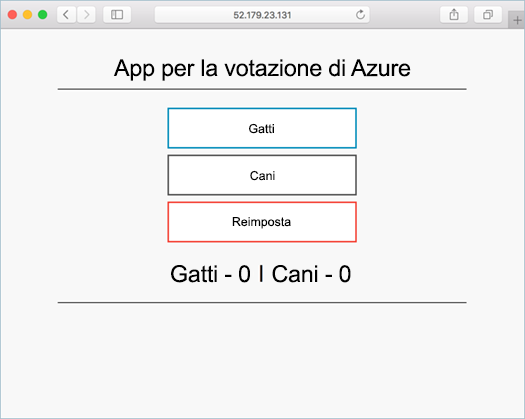

# <a name="tutorial-prepare-an-application-for-azure-kubernetes-service-aks"></a>Esercitazione: Preparare un'applicazione per il servizio Kubernetes di Azure (AKS)

In questa esercitazione, parte uno di sette, si prepara un'applicazione multi-contenitore per l'uso in Kubernetes. Per compilare e testare in locale un'applicazione, si usano strumenti di sviluppo esistenti, ad esempio Docker Compose. Si apprenderà come:

> [!div class="checklist"]
> * Clonare l'origine di un'applicazione di esempio da GitHub
> * Creare un'immagine del contenitore dall'origine dell'applicazione di esempio
> * Testare l'applicazione multicontenitore in un ambiente Docker locale

Al termine, l'applicazione seguente viene eseguita nell'ambiente di sviluppo locale:



Nelle esercitazioni successive, l'immagine del contenitore verrà caricata in un'istanza di Registro contenitori di Azure e quindi distribuita in un cluster AKS.

## <a name="before-you-begin"></a>Prima di iniziare

Questa esercitazione presuppone una conoscenza di base dei concetti principali di Docker, ad esempio contenitori, immagini del contenitore e comandi `docker`. Per una panoramica sulle nozioni di base dei contenitori, vedere [Get started with Docker][docker-get-started] (Introduzione a Docker).

Per completare questa esercitazione, è necessario un ambiente di sviluppo Docker locale in cui sono in esecuzione i contenitori Linux. Docker offre pacchetti che consentono di configurare Docker in un sistema [Mac][docker-for-mac], [Windows][docker-for-windows] o [Linux][docker-for-linux].

Azure Cloud Shell non include i componenti di Docker necessari per completare ogni passaggio di queste esercitazioni. È pertanto consigliabile usare un ambiente di sviluppo completo di Docker.

## <a name="get-application-code"></a>Ottenere il codice dell'applicazione

L'applicazione di esempio utilizzata in questa esercitazione è un'app di voto base. L'applicazione è costituita da un componente Web front-end e un'istanza Redis back-end. Viene creato un pacchetto del componente Web in un'immagine del contenitore personalizzata. L'istanza di Redis usa un'immagine non modificata dell'hub Docker.

Usare [git][] per clonare l'applicazione di esempio nell'ambiente di sviluppo:

```console
git clone https://github.com/Azure-Samples/azure-voting-app-redis.git
```

Cambiare directory in modo da usare la directory clonata.

```console
cd azure-voting-app-redis
```

All'interno della directory sono disponibili il codice sorgente dell'applicazione, un file Docker Compose creato in precedenza e un file manifesto Kubernetes. Questi file vengono usati in tutta la serie di esercitazioni.

## <a name="create-container-images"></a>Creare immagini del contenitore

[Docker Compose][docker-compose] può essere usato per automatizzare la compilazione di immagini del contenitore e la distribuzione di applicazioni multicontenitore.

Usare il file `docker-compose.yaml` di esempio per creare l'immagine del contenitore, scaricare l'immagine Redis e avviare l'applicazione:

```console
docker-compose up -d
```

Al termine usare il comando [docker images][docker-images] per vedere le immagini create. Sono state scaricate o create tre immagini. L'immagine *azure-vote-front* contiene l'applicazione front-end e usa l'immagine `nginx-flask` come base. L'immagine `redis` viene usata per avviare un'istanza di Redis.

```
$ docker images

REPOSITORY                   TAG        IMAGE ID            CREATED             SIZE
azure-vote-front             latest     9cc914e25834        40 seconds ago      694MB
redis                        latest     a1b99da73d05        7 days ago          106MB
tiangolo/uwsgi-nginx-flask   flask      788ca94b2313        9 months ago        694MB
```

Eseguire il comando [docker ps][docker-ps] per vedere i contenitori in esecuzione:

```
$ docker ps

CONTAINER ID        IMAGE             COMMAND                  CREATED             STATUS              PORTS                           NAMES
82411933e8f9        azure-vote-front  "/usr/bin/supervisord"   57 seconds ago      Up 30 seconds       443/tcp, 0.0.0.0:8080->80/tcp   azure-vote-front
b68fed4b66b6        redis             "docker-entrypoint..."   57 seconds ago      Up 30 seconds       0.0.0.0:6379->6379/tcp          azure-vote-back
```

## <a name="test-application-locally"></a>Testare l'applicazione in locale

Per vedere l'applicazione in esecuzione, immettere http://localhost:8080 in un Web browser locale. L'applicazione di esempio viene caricata, come illustrato nell'esempio seguente:


## <a name="clean-up-resources"></a>Pulire le risorse

Ora che le funzionalità dell'applicazione sono state verificate, i contenitori in esecuzione possono essere arrestati e rimossi. Non eliminare le immagini del contenitore perché nell'esercitazione successiva l'immagine *azure-vote-front* verrà caricata in un'istanza di Registro contenitori di Azure.

Arrestare e rimuovere le istanze e le risorse di contenitore con il comando [docker-compose down][docker-compose-down]:

```console
docker-compose down
```

Dopo che l'applicazione locale è stata rimossa, è disponibile un'immagine Docker contenente l'applicazione Azure Vote, *azure-front-front*, da usare nell'esercitazione successiva.

## <a name="next-steps"></a>Passaggi successivi

In questa esercitazione è stata testata un'applicazione e sono state create le immagini del contenitore per l'applicazione stessa. Si è appreso come:

> [!div class="checklist"]
> * Clonare l'origine di un'applicazione di esempio da GitHub
> * Creare un'immagine del contenitore dall'origine dell'applicazione di esempio
> * Testare l'applicazione multicontenitore in un ambiente Docker locale

Passare alla prossima esercitazione per apprendere come archiviare le immagini del contenitore in Registro contenitori di Azure.

> [!div class="nextstepaction"]
> [Eseguire il push delle immagini nel Registro contenitori di Azure][aks-tutorial-prepare-acr]

<!-- LINKS - external -->
[docker-compose]: https://docs.docker.com/compose/
[docker-for-linux]: https://docs.docker.com/engine/installation/#supported-platforms
[docker-for-mac]: https://docs.docker.com/docker-for-mac/
[docker-for-windows]: https://docs.docker.com/docker-for-windows/
[docker-get-started]: https://docs.docker.com/get-started/
[docker-images]: https://docs.docker.com/engine/reference/commandline/images/
[docker-ps]: https://docs.docker.com/engine/reference/commandline/ps/
[docker-compose-down]: https://docs.docker.com/compose/reference/down
[git]: https://git-scm.com/downloads

<!-- LINKS - internal -->
[aks-tutorial-prepare-acr]: ./tutorial-kubernetes-prepare-acr.md
