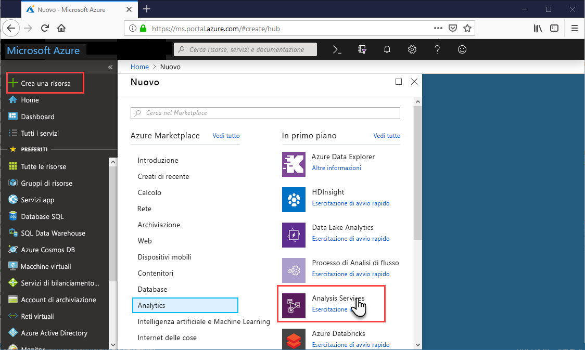

# Guida introduttiva: Creare un server - Portale

Questa guida introduttiva descrive come creare una risorsa server Analysis Services nella sottoscrizione di Azure usando il portale.

## Prerequisiti 

* **Sottoscrizione di Azure**: visitare la pagina [Versione di prova gratuita di Azure](https://azure.microsoft.com/offers/ms-azr-0044p/) per creare un account.
* **Azure Active Directory**: la sottoscrizione deve essere associata a un tenant Azure Active Directory. Inoltre è necessario essere registrati ad Azure con un account nell'Azure Active Directory specifica. Per altre informazioni, vedere [Autenticazione e autorizzazioni utente](analysis-services-manage-users.md).

## Accedere al portale di Azure 

[Accedere al portale](https://portal.azure.com)

## Creare un server

1. Fare clic su **+ Crea una risorsa** > **Analytics** > **Analysis Services**.

    

2. In **Analysis Services** compilare i campi obbligatori e quindi fare clic su **Crea**.
   
   * **Nome server**: digitare un nome univoco usato per fare riferimento al server. Il nome del server deve iniziare con una lettera minuscola e contenere tra 3 e 128 caratteri minuscoli e numeri. Gli spazi e i caratteri speciali non sono consentiti.
   * **Sottoscrizione** selezionare la sottoscrizione a cui il server verrà associato.
   * **Gruppo di risorse**: creare un nuovo gruppo di risorse o selezionarne uno già esistente. I gruppi di risorse sono progettati per facilitare la gestione di una raccolta di risorse di Azure. Per altre informazioni, vedere [Gruppi di risorse](../azure-resource-manager/resource-group-overview.md).
   * **Località**: località del data center di Azure che ospita il server. Selezionare una località vicina alla base di utenti più estesa.
   * **Piano tariffario**: Selezione di un piano tariffario. Se si sta eseguendo il test e si intende installare il database modello di esempio, selezionare il piano gratuito **D1**. Per altre informazioni, vedere [Prezzi di Azure Analysis Services](https://azure.microsoft.com/pricing/details/analysis-services/). 
   * **Amministratore**: per impostazione predefinita, sarà l'account con cui si esegue l'accesso. È possibile scegliere un altro account da Azure Active Directory.
   * **Impostazione dell'archiviazione di backup**: facoltativo. Se si ha già un [account di archiviazione](../storage/common/storage-introduction.md), è possibile specificarlo come account predefinito per il backup del database modello. Le impostazioni di [backup e ripristino](analysis-services-backup.md) possono essere specificate successivamente.
   * **Scadenza della chiave di archiviazione**: facoltativo. Specificare un periodo di scadenza della chiave di archiviazione.

La creazione del server in genere richiede meno di un minuto. Se si seleziona **Add to Portal** (Aggiungi al portale), spostarsi nel portale per vedere il nuovo server. In alternativa, passare a **Tutti i servizi** > **Analysis Services** per vedere se il server è pronto. I server supportano modelli tabulari con livelli di compatibilità 1200 e successivi. Il livello di compatibilità dei modelli è specificato in SSDT o SSMS.

## Pulire le risorse

Quando non è più necessario, eliminare il server. Nel riquadro **Panoramica** del server, fare clic su **Elimina**. 

 

## Passaggi successivi
In questa guida introduttiva si è appreso come creare un server nella sottoscrizione di Azure. Una volta creato il server, è consigliabile garantirne la sicurezza configurando un firewall (facoltativo). È inoltre possibile aggiungere un modello di dati di esempio al server, direttamente dal portale. Un modello di esempio è utile per avere informazioni sulla configurazione dei ruoli del database modello e sul test delle connessioni client. Per altre informazioni, continuare con l'esercitazione per l'aggiunta di un modello di esempio.

> [!div class="nextstepaction"]
> [Avvio rapido: configurare il firewall del server - Portale](analysis-services-qs-firewall.md)   
> [!div class="nextstepaction"]
> [Esercitazione: aggiungere un modello di esempio al server](analysis-services-create-sample-model.md)
