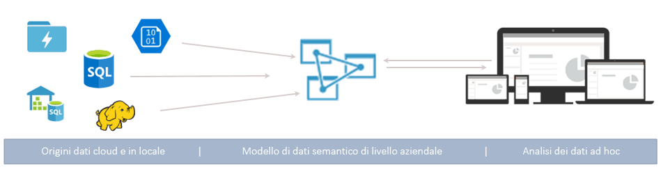
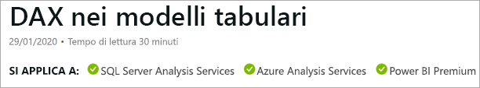
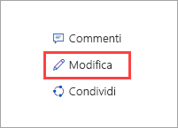

# Informazioni su Azure Analysis Services

Azure Analysis Services è una piattaforma distribuita come servizio (PaaS) completamente gestita che fornisce modelli di dati di livello aziendale nel cloud. Usare le funzionalità avanzate di mashup e modellazione per combinare dati da più origini, definire metriche e proteggere i dati in un singolo modello semantico tabulare di dati attendibile. Il modello di dati consente agli utenti di esplorare in modo più semplice e rapido enormi quantità di dati per un'analisi ad hoc.

**Video:** guardare [Panoramica di Azure Analysis Services](https://sec.ch9.ms/ch9/d6dd/a1cda46b-ef03-4cea-8f11-68da23c5d6dd/AzureASoverview_high.mp4) per scoprire come Azure Analysis Services si integra con le funzionalità BI generali di Microsoft.

## Operazioni iniziali rapide

Nel portale di Azure è possibile [creare un server](analysis-services-create-server.md) in pochi minuti. Con i [modelli](../azure-resource-manager/resource-manager-create-first-template.md) di Azure Resource Manager e PowerShell è possibile creare server tramite un modello dichiarativo. Con un singolo modello si possono distribuire le risorse del server e altri componenti di Azure, ad esempio gli account di archiviazione e Funzioni di Azure. 

**Video:** guardare il video [Automating deployment](https://channel9.msdn.com/series/Azure-Analysis-Services/AzureAnalysisServicesAutomation) (Automatizzazione della distribuzione) per altre informazioni su come usare Automazione di Azure per velocizzare la creazione del server.

Azure Analysis Services si integra con molti servizi di Azure e permette di creare soluzioni di analisi avanzate. L'integrazione con [Azure Active Directory](../active-directory/fundamentals/active-directory-whatis.md) offe l'accesso ai dati essenziali sicuro e in base al ruolo. È possibile ottenere l'integrazione con le pipeline di [Azure Data Factory](../data-factory/introduction.md) includendo un'attività che carica i dati nel modello. È possibile usare [Automazione di Azure](../automation/automation-intro.md) e [Funzioni di Azure](../azure-functions/functions-overview.md) per un'orchestrazione semplice di modelli tramite codice personalizzato. 

## Il piano giusto quando serve

Azure Analysis Services è disponibile nei livelli **Developer**, **Basic** e **Standard**. Entro ogni livello, i costi del piano dipendono da potenza di elaborazione, QPU e dimensioni della memoria. Quando si crea un server, si seleziona un piano entro un livello. È possibile passare a un piano inferiore o superiore entro lo stesso livello oppure passare a un livello superiore, ma non è possibile passare da un livello superiore a un livello inferiore.

### Livello Developer

Questo livello è consigliato per gli scenari di valutazione, sviluppo e test. Un singolo piano include le stesse funzionalità del livello Standard, ma con limitazioni per potenza di elaborazione, QPU e dimensioni della memoria. L'aumento del numero di istanze delle repliche delle query *non è disponibile* per questo livello. Questo livello non offre alcun Contratto di servizio.

|Pianificazione  |QPU  |Memoria (GB)  |
|---------|---------|---------|
|D1    |    20     |    3     |

### Livello Basic

Il livello è consigliato per soluzioni di produzione con modelli tabulari di dimensioni più ridotte, concorrenza limitata tra utenti e requisiti semplici per l'aggiornamento dei dati. L'aumento del numero di istanze delle repliche delle query *non è disponibile* per questo livello. Prospettive, partizioni multiple e funzionalità del modello tabulare DirectQuery *non sono supportate* in questo livello.  

|Pianificazione  |QPU  |Memoria (GB)  |
|---------|---------|---------|
|B1    |    40     |    10     |
|B2    |    80     |    20     |

### Livello Standard

Questo livello è ottimale per applicazioni di produzione cruciali, che necessitano di concorrenza elastica tra utenti e hanno modelli di dati in rapida crescita. Supporta l'aggiornamento di dati avanzato per aggiornamenti del modello di dati in tempo quasi reale e supporta tutte le funzionalità di modellazione tabulare.

|Pianificazione  |QPU  |Memoria (GB)  |
|---------|---------|---------|
|S0    |    40     |    10     |
|S1    |    100     |    25     |
|S2    |    200     |    50     |
|S4    |    400     |    100     |
|S8*    |    320     |    200     |
|S9*    |    640    |    400     |

\* Non disponibile in tutte le aree.  

## Disponibilità per area

Azure Analysis Services è supportato in aree di tutto il mondo. La disponibilità dei piani supportati e delle repliche delle query dipendono dall'area scelta. La disponibilità dei piani e delle repliche delle query può cambiare in base alle necessità e alle risorse disponibili per ogni area. 

### Americhe

|Region  | Piani supportati | Repliche delle query (solo piani Standard) |
|---------|---------|:---------:|
|Brasile meridionale     |    B1, B2, S0, S1, S2, S4, D1     |     1    |
|Canada centrale    |     B1, B2, S0, S1, S2, S4, D1    |     1    |
|Stati Uniti orientali     |     B1, B2, S0, S1, S2, S4, D1    |    1     |
|Stati Uniti orientali 2     |     B1, B2, S0, S1, S2, S4, D1   |    7    |
|Stati Uniti orientali 2     |     S8, S9   |    1    |
|Stati Uniti centro-settentrionali     |     B1, B2, S0, S1, S2, S4, D1     |    1     |
|Stati Uniti centrali     |    B1, B2, S0, S1, S2, S4, D1     |    1     |
|Stati Uniti centro-meridionali     |    B1, B2, S0, S1, S2, S4, D1     |    1     |
|Stati Uniti centro-occidentali   |     B1, B2, S0, S1, S2, S4, D1    |    3     |
|Stati Uniti occidentali     |    B1, B2, S0, S1, S2, S4, D1    |    7   |
|Stati Uniti occidentali     |    S8, S9   |    2  |
|Stati Uniti occidentali 2    |    B1, B2, S0, S1, S2, S4, D1    |    3   |
|Stati Uniti occidentali 2    |    S8, S9  |    1     |

### Europa

|Region  | Piani supportati | Repliche delle query (solo piani Standard) |
|---------|---------|:---------:|
|Europa settentrionale     |    B1, B2, S0, S1, S2, S4, D1      |    7     |
|Regno Unito meridionale     |    B1, B2, S0, S1, S2, S4, D1      |     1    |
|Europa occidentale     |    B1, B2, S0, S1, S2, S4, D1   |    7    |
|Europa occidentale    |   S8, S9  |  1  |

### Asia/Pacifico 

|Region  | Piani supportati | Repliche delle query (solo piani Standard) |
|---------|---------|:---------:|
|Australia orientale     |    B1, B2, S0, S1, S2, S4     |    3     |
|Australia orientale     |    S8, S9    |    1     |
|Australia sud-orientale     | B1, B2, S0, S1, S2, S4, D1       |    1     |
|Giappone orientale     |   B1, B2, S0, S1, S2, S4, D1       |    1     |
|Asia sud-orientale     |     B1, B2, S0, S1, S2, S4, S8, S9, D1     |   1      |
|India occidentale     |    B1, B2, S0, S1, S2, S4, D1     |    1     |

## Ridimensionare in base alle esigenze specifiche

### Passaggio a un piano superiore\inferiore, sospensione e ripresa

È possibile aumentare o ridurre le prestazioni o sospendere il server. Usare il portale di Azure oppure usare PowerShell per ottenere subito il controllo totale. Si paga solo per le risorse utilizzate.  

### Aumentare il numero di istanze delle risorse per risposte rapide alle query

Con l'aumento del numero di istanze, le query dei client vengono distribuite tra più *repliche delle query* in un pool di query. Le repliche delle query hanno copie sincronizzate dei modelli tabulari. Distribuendo il carico di lavoro delle query, è possibile ridurre i tempi di risposta quando questi carichi di lavoro sono elevati. Le operazioni di elaborazione del modello possono essere separate dal pool di query, assicurando così che le prestazioni delle query dei client non vengano influenzate negativamente dalle operazioni di elaborazione. 

È possibile creare un pool di query con fino a sette repliche delle query aggiuntive (otto in totale, incluso il server). Il numero di repliche delle query consentito nel pool dipende dall'area e dal piano scelti. Le repliche delle query non possono essere distribuite al di fuori dell'area del server. Le repliche delle query vengono fatturate alla stessa tariffa del server.

Proprio come con la modifica dei livelli, è possibile aumentare il numero di istanze delle repliche delle query in base alle esigenze. Configurare l'aumento del numero di istanze nel portale o con le API REST. Per altre informazioni, vedere [Aumento delle istanze di Azure Analysis Services](analysis-services-scale-out.md).

## Prezzi

Il costo totale dipende da vari fattori, ad esempio l'area scelta, il livello, le repliche delle query e la sospensione/ripresa. Usare il calcolatore [Prezzi di Azure Analysis Services](https://azure.microsoft.com/pricing/details/analysis-services/) per determinare i prezzi tipici per la propria area. Questo strumento calcola i prezzi per un'istanza di un server singolo per una singola area. Tenere presente che le repliche delle query vengono fatturate alla stessa tariffa del server. 

## Compilare in SQL Server Analysis Services

Azure Analysis Services è compatibile con molte funzionalità avanzate già disponibili in SQL Server Analysis Services Enterprise Edition. Azure Analysis Services supporta modelli tabulari con [livelli di compatibilità](analysis-services-compat-level.md) 1200 e successivi. I modelli tabulari sono costrutti di modellazione relazionale (modello, tabelle, colonne) articolati in definizioni di oggetto metadati tabulari in codice TMSL (Tabular Model Scripting Language) e TOM (Tabular Object Model). Sono supportate anche partizioni, prospettive, sicurezza a livello di riga, relazioni bidirezionali e traduzioni\*. I modelli multidimensionali e PowerPivot per SharePoint *non sono* supportati in Azure Analysis Services.

I modelli tabulari sono supportati in entrambe le modalità in memoria e DirectQuery. I modelli tabulari nella modalità in memoria (impostazione predefinita) supportano più origini dati. Poiché i dati del modello sono estremamente compressi e memorizzati nella cache in memoria, questa modalità offre la risposta alla query più veloce per grandi quantità di dati. Offre anche la massima flessibilità per query e set di dati complessi. Il partizionamento abilita i carichi incrementali, aumenta la parallelizzazione e riduce l'utilizzo di memoria. Altre funzionalità di modellazione di dati avanzate, come le tabelle calcolate, e tutte le funzioni DAX sono supportate. I modelli in memoria devono essere aggiornati (elaborati) per aggiornare i dati memorizzati nella cache dalle origini dati. Con il supporto dell'entità servizio di Azure, le operazioni di aggiornamento automatico tramite PowerShell, TOM, TMSL e REST offrono la flessibilità necessaria per assicurare che i dati del modello siano sempre aggiornati. 

La modalità DirectQuery* sfrutta il database relazionale back-end per l'esecuzione di query e l'archiviazione. I set di dati di dimensioni molto grandi in singole origini di dati di SQL Server, SQL Server Data Warehouse, database SQL di Azure, Azure SQL Data Warehouse, Oracle e Teradata sono supportati. I set di dati back-end possono superare la memoria delle risorse del server disponibile. Gli scenari di aggiornamento del modello di dati complessi non sono necessari. Esistono anche alcune restrizioni, ad esempio tipi di origini dati limitati, limitazioni della formula DAX e alcune funzionalità avanzate di modellazione di dati non supportate. Prima di determinare la modalità migliore, vedere [Modalità DirectQuery](https://docs.microsoft.com/analysis-services/tabular-models/directquery-mode-ssas-tabular).

\* La disponibilità delle funzionalità dipende dal livello.

## Origini dati supportate

I modelli tabulari in Azure Analysis Services supportano un'ampia gamma di origini dati, dai semplici file di testo ai Big Data in Azure Data Lake Store. Per altre informazioni, vedere [Origini dati supportate in Azure Analysis Services](analysis-services-datasource.md).

## Livello di compatibilità

Il termine livello di compatibilità fa riferimento a comportamenti specifici di ogni versione nel motore di Analysis Services. Azure Analysis Services supporta modelli tabulari con livelli di compatibilità 1200 e successivi. Per altre informazioni, vedere [Livello di compatibilità per i modelli tabulari di Analysis Services](analysis-services-compat-level.md).

## I dati sono protetti

Azure Analysis Services fornisce la sicurezza per i dati sensibili a più livelli. Essendo un servizio di Azure, Analysis Services prevede che il livello **Basic** degli attacchi Distributed Denial of Service (DDoS) sia automaticamente abilitato come parte della piattaforma Azure. Per altre informazioni, vedere [Panoramica di Protezione DDoS di Azure Standard](../virtual-network/ddos-protection-overview.md). 

A livello di server, Analysis Services fornisce firewall, autenticazione di Azure, ruoli di amministratore del server e crittografia sul lato server. A livello di modello di dati, i ruoli utente e la sicurezza a livello di riga e a livello di oggetto assicurano che i dati siano sicuri e vengano visualizzati solo dagli utenti autorizzati.

### Firewall

Il firewall di Azure Analysis Services blocca tutte le connessioni client diverse dagli indirizzi IP specificati nelle regole. Per impostazione predefinita, la protezione del firewall non è abilitata per i nuovi server. È consigliabile abilitarla e configurare regole come parte di uno script di provisioning del server o nel portale immediatamente dopo aver creato il server. Configurare le regole che specificano gli indirizzi IP consentiti in base agli indirizzi IP dei singoli client o per intervalli di indirizzi IP. Le connessioni di Power BI (servizio) possono essere consentite o bloccate. Configurare il firewall e le regole nel portale o usando PowerShell. Per altre informazioni, vedere [Configurare un firewall del server](analysis-services-qs-firewall.md).

### Authentication

L'autenticazione utente viene gestita da [Azure Active Directory (AAD)](../active-directory/fundamentals/active-directory-whatis.md). Durante l'accesso, gli utenti usano un'identità dell'account organizzazione con accesso al database in base al ruolo. Le identità utente devono essere membri dell'istanza predefinita di Azure Active Directory per la sottoscrizione in cui si trova il server. Per altre informazioni, vedere [Autenticazione e autorizzazioni utente](analysis-services-manage-users.md).

### Sicurezza dei dati

Azure Analysis Services usa Archiviazione BLOB di Azure per rendere persistenti i metadati e la risorsa di archiviazione per i database di Analysis Services. I file di dati nel BLOB vengono crittografati con la [crittografia lato server BLOB di Azure](../storage/common/storage-service-encryption.md). Quando si usa la modalità di query diretta, vengono archiviati solo i metadati. L'accesso ai dati effettivi viene eseguito tramite il protocollo crittografato dall'origine dati in fase di query.

È possibile ottenere la sicurezza dell'accesso alle origini dati in locale all'interno dell'organizzazione installando e configurando un [gateway dati locale](analysis-services-gateway.md). I gateway forniscono accesso ai dati per le modalità DirectQuery e in memoria.

### Ruoli

Analysis Services usa l'[autorizzazione basata sui ruoli](https://docs.microsoft.com/analysis-services/tabular-models/roles-ssas-tabular) che concede l'accesso al server e alle operazioni, agli oggetti e ai dati del database modello. Tutti gli utenti accedono a un database o a un server con il proprio account utente di Azure AD all'interno di un ruolo assegnato. Il ruolo di amministratore del server è a livello di risorsa del server. Per impostazione predefinita, l'account usato durante la creazione di un server viene automaticamente incluso nel ruolo di amministratori del server. Altri account utente e gruppo vengono aggiunti tramite il portale, SSMS o PowerShell.
  
Agli utenti finali non amministratori che eseguono query sui dati viene concesso l'accesso tramite i ruoli del database. Un ruolo del database viene creato come oggetto separato nel database e si applica solo al database in cui è stato creato. I ruoli del database vengono definiti dalle autorizzazioni Amministratore, Lettura e Lettura ed elaborazione (database). Gli account utente e gruppo vengono aggiunti tramite SSMS o PowerShell.

### Sicurezza a livello di riga

I modelli tabulari a tutti i livelli di compatibilità supportano la sicurezza a livello di riga. La sicurezza a livello di riga viene configurata nel modello usando le espressioni DAX che definiscono le righe in una tabella ed eventuali righe nelle diverse direzioni di una tabella correlata su cui un utente può eseguire query. I filtri di riga tramite le espressioni DAX vengono definiti per le autorizzazioni Lettura e Lettura ed elaborazione. 

### Sicurezza a livello di oggetto 

I modelli tabulari al livello di compatibilità 1400 supportano la sicurezza a livello di oggetto, che include la sicurezza a livello di tabella e la sicurezza a livello di colonna. La sicurezza a livello di oggetto viene impostata nei metadati basati su JSON nel file Model.bim usando TMSL o TOM. Per altre informazioni, vedere [Sicurezza a livello di oggetto](https://docs.microsoft.com/analysis-services/tabular-models/object-level-security).

### Automazione tramite le entità servizio

Le entità servizio sono una risorsa dell'applicazione Azure Active Directory creata all'interno del tenant per l'esecuzione automatica di operazioni a livello di servizio e di risorsa. Le entità servizio vengono usate con Automazione di Azure, la modalità automatica di PowerShell, le applicazioni client personalizzate e le app Web per automatizzare le attività comuni, ad esempio aggiornamento dei dati, passaggio a un piano superiore/inferiore e sospensione/ripresa. Le autorizzazioni vengono assegnate alle entità servizio tramite l'appartenenza a un ruolo. Per altre informazioni, vedere [Automazione con le entità servizio](analysis-services-service-principal.md).

### Governance di Azure

Azure Analysis Services è disciplinato dalle [Condizioni di Microsoft Online Services](https://www.microsoftvolumelicensing.com/DocumentSearch.aspx?Mode=3&DocumentTypeId=31) e dall'[Informativa sulla privacy di Microsoft](https://privacy.microsoft.com/privacystatement).
Per altre informazioni sulla sicurezza di Azure, vedere [Microsoft Trust Center](https://www.microsoft.com/trustcenter).

## Usare gli strumenti noti

### Visual Studio

È possibile sviluppare e distribuire i modelli usando gratuitamente [SQL Server Data Tools (SSDT) per Visual Studio](/sql/ssdt/download-sql-server-data-tools-ssdt). SSDT include modelli di progetto di Analysis Services che consentono di iniziare subito a lavorare. SSDT include ora Recupera dati, una query dell'origine dati moderna, e funzionalità di mashup per modelli tabulari 1400. Gli utenti che hanno familiarità con Recupera dati in Power BI Desktop ed Excel 2016 sanno già quanto sia facile creare query dell'origine dati a personalizzazione elevata. 

Se si usa Visual Studio 2017 o versione successiva, I progetti di Microsoft Analysis Services sono disponibili come pacchetto VSIX installabile gratuitamente. È possibile [scaricarli dal Marketplace](https://marketplace.visualstudio.com/items?itemName=ProBITools.MicrosoftAnalysisServicesModelingProjects).

### SQL Server Management Studio

Gestire i server e i database modello usando [SQL Server Management Studio (SSMS)](https://docs.microsoft.com/sql/ssms/download-sql-server-management-studio-ssms) È possibile connettersi ai server sul cloud, eseguire gli script TMSL direttamente dalla finestra di query XMLA e automatizzare le attività usando gli script TMSL e PowerShell. Le nuove funzionalità sono disponibili rapidamente, perché SSMS viene aggiornato ogni mese.

### PowerShell

Le attività di gestione delle risorse del server, ad esempio la creazione di risorse del server, la sospensione o la ripresa delle operazioni di un server oppure la modifica del livello di servizio, usano i cmdlet di Azure PowerShell. Le altre attività per la gestione dei database, ad esempio l'aggiunta o la rimozione dei membri di un ruolo, l'elaborazione o l'esecuzione di script TMSL, usano cmdlet del modulo SqlServer. Per altre informazioni, vedere [Gestire Azure Analysis Services con PowerShell](analysis-services-powershell.md).

### Modello a oggetti e script

I modelli tabulari offrono uno sviluppo rapido e sono altamente personalizzabili. I modelli tabulari includono il [modello a oggetti tabulare](https://docs.microsoft.com/bi-reference/tom/introduction-to-the-tabular-object-model-tom-in-analysis-services-amo) (TOM, Tabular Object Model) per descrivere i modelli a oggetti. Il modello a oggetti tabulare viene esposto in JSON tramite [TMSL (Tabular Model Scripting Language)](https://docs.microsoft.com/bi-reference/tmsl/tabular-model-scripting-language-tmsl-reference) e nel linguaggio DDL (Data Definition Language) AMO tramite lo spazio dei nomi [Microsoft.AnalysisServices.Tabular](/dotnet/api/microsoft.analysisservices.tabular). 

## Supporto degli strumenti client più recenti

Gli strumenti moderni per l'esplorazione e la visualizzazione dei dati come Power BI, Excel, Reporting Services e strumenti di terze parti sono tutti supportati e forniscono agli utenti informazioni dettagliate a interattività elevata e visivamente accattivanti nei dati del modello. 

## Monitoraggio e diagnostica

Azure Analysis Services, essendo integrato con le metriche di Azure, fornisce un numero elevato di metriche specifiche delle risorse, che consentono di monitorare le prestazioni e l'integrità dei server. Per altre informazioni, vedere [Monitorare le metriche dei server](analysis-services-monitor.md). Registrare le metriche con i [log di diagnostica di risorse di Azure](../azure-monitor/platform/diagnostic-logs-overview.md). Monitorare e inviare log ad [Archiviazione di Azure](https://azure.microsoft.com/services/storage/), trasmetterli ad [Hub eventi di Azure](https://azure.microsoft.com/services/event-hubs/) ed esportarli in [log di Monitoraggio di Azure](https://azure.microsoft.com/services/log-analytics/), che è un servizio di [Azure](https://www.microsoft.com/cloud-platform/operations-management-suite). Per altre informazioni, vedere [Configurare la registrazione diagnostica](analysis-services-logging.md).

Azure Analysis Services supporta anche l'uso delle viste [DMV](https://docs.microsoft.com/analysis-services/instances/use-dynamic-management-views-dmvs-to-monitor-analysis-services). Le viste DMV, basate sulla sintassi SQL, interfacciano i set di righe dello schema che restituiscono metadati e informazioni di monitoraggio sull'istanza del server.

## Documentazione

La documentazione specifica di Azure Analysis Services è inclusa qui. Usare il sommario sul lato sinistro della schermata del browser per trovare gli articoli. 

Poiché i modelli tabulari di Azure Analysis Services sono molto simili ai modelli tabulari in SQL Server Analysis Services, è disponibile una ricca libreria di articoli condivisi concettuali, procedurali, per sviluppatori e di riferimento nella [documentazione su SQL Server Analysis Services](https://docs.microsoft.com/analysis-services/analysis-services-overview). Negli articoli della documentazione su SQL Server Analysis Services, un banner SI APPLICA A sotto il titolo indica se si applicano anche ad Azure Analysis Services.

### Contribuire

La documentazione su Analysis Services, come questo articolo, è open source. Con un account GitHub è possibile modificare un articolo facendo clic su Modifica (matita) nell'angolo in alto a destra della schermata del browser. Usare l'editor nel browser e quindi fare clic su Propose file change (Proponi modifica file). 

Il contributo verrà esaminato dal team della documentazione e, se approvato, il nome account GitHub verrà visualizzato come collaboratore. Per altre informazioni, vedere la [guida per i collaboratori di Microsoft Docs](https://docs.microsoft.com/contribute/).

La documentazione di Azure Analysis Services usa anche i [problemi di GitHub](https://docs.microsoft.com/teamblog/a-new-feedback-system-is-coming-to-docs). È possibile inviare commenti e suggerimenti sul prodotto o sulla documentazione. Usare la sezione **Commenti** nella parte inferiore di un articolo. I problemi di GitHub non sono ancora abilitati per la documentazione su SQL Server Analysis Services. 

## Blog

Per rimanere sempre aggiornati sulle continue modifiche, consultare il [blog del team di Azure Analysis Services](https://blogs.msdn.microsoft.com/analysisservices/) e il [blog di Azure](https://azure.microsoft.com/blog/).

## Community

Analysis Services è costituito da una vivace community di utenti. È possibile partecipare alle discussioni sul [forum di Azure Analysis Services](https://aka.ms/azureanalysisservicesforum).

## Passaggi successivi

> [!div class="nextstepaction"]
> [Iscriversi per ottenere una versione di valutazione gratuita di Azure](https://azure.microsoft.com/offers/ms-azr-0044p/)   

> [!div class="nextstepaction"]
> [Avvio rapido: Creare un server - Portale](analysis-services-create-server.md)   

> [!div class="nextstepaction"]
> [Avvio rapido: Creare un server: PowerShell](analysis-services-create-powershell.md)  
