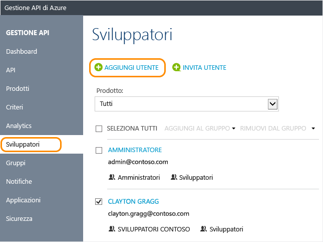

# Come gestire gli account utente in Gestione API di Azure
In Gestione API gli sviluppatori sono gli utenti delle API esposte con Gestione API. In questa guida viene illustrato come creare e invitare gli sviluppatori a usare le API e i prodotti resi disponibili con l'istanza di Gestione API. Per informazioni sulla gestione degli account utente a livello di codice, vedere la documentazione [Entità utente](https://msdn.microsoft.com/library/azure/dn776330.aspx) nel riferimento [API Management REST (REST di gestione API)](https://msdn.microsoft.com/library/azure/dn776326.aspx).

## Prerequisiti

Completare le attività riportate in questo articolo: [Creare un'istanza di Gestione API di Azure](get-started-create-service-instance.md).

[!INCLUDE [api-management-navigate-to-instance.md](../../includes/api-management-navigate-to-instance.md)]

## Creare un nuovo sviluppatore

Per aggiungere un nuovo utente, eseguire la procedura in questa sezione:

1. Selezionare la scheda **Utenti** a sinistra della schermata.
2. Premere **+Aggiungi**.
3. Immettere le informazioni appropriate per l'utente.
4. Fare clic su **Aggiungi**.

    

Per impostazione predefinita, i nuovi account sviluppatore creati sono **attivi** e associati al gruppo **Sviluppatori**. Gli account sviluppatore con stato **attivo** possono essere usati per accedere a tutte le API per cui dispongono di sottoscrizioni. Per associare il nuovo sviluppatore creato ad altri gruppi, vedere [Come associare gruppi a sviluppatori][How to associate groups with developers].

## Invitare uno sviluppatore
Per invitare uno sviluppatore, eseguire la procedura in questa sezione:

1. Selezionare la scheda **Utenti** a sinistra della schermata.
2. Fare clic su **+Invita**.

Viene visualizzato un messaggio di conferma, ma il nuovo sviluppatore invitato non appare nell'elenco finché l'invito non viene accettato. 

Quando uno sviluppatore viene invitato, gli viene inviato un messaggio di posta elettronica generato con un modello e personalizzabile. Per altre informazioni, vedere [Configurare modelli di posta elettronica][Configure email templates].

Dopo l'accettazione dell'invito, l'account diventa attivo.

##  Disattivare o riattivare un account sviluppatore

Per impostazione predefinita, un nuovo account sviluppatore creato o invitato è **Attivo**. Per disattivare un account sviluppatore, fare clic su **Blocca**. Per riattivare un account sviluppatore bloccato, fare clic su **Attiva**. Un account sviluppatore bloccato non può accedere al portale per sviluppatori né chiamare le API. Per eliminare un account utente, fare clic su **Elimina**.

Per bloccare un utente, eseguire la procedura seguente.

1. Selezionare la scheda **Utenti** a sinistra della schermata.
2. Fare clic sull'utente che si vuole bloccare.
3. Fare clic su **Blocca**.

## Reimpostare la password di un utente

Per lavorare con gli account utente a livello di codice, vedere la documentazione [Entità utente](https://msdn.microsoft.com/library/azure/dn776330.aspx) nel riferimento [API Management REST (REST di gestione API)](https://msdn.microsoft.com/library/azure/dn776326.aspx). Per reimpostare la password di un account utente su un valore specifico, è possibile usare la procedura [Update a user (Aggiornamento di un utente)](https://msdn.microsoft.com/library/azure/dn776330.aspx#UpdateUser) e specificare la password desiderata.

## Passaggi successivi
Dopo aver creato un account sviluppatore, è possibile associarlo ai ruoli ed effettuarne la sottoscrizione a prodotti e API. Per altre informazioni, vedere [Come creare e usare i gruppi][How to create and use groups].

[api-management-management-console]: ./media/api-management-howto-create-or-invite-developers/api-management-management-console.png
[api-management-add-new-user]: ./media/api-management-howto-create-or-invite-developers/api-management-add-new-user.png
[api-management-create-developer]: ./media/api-management-howto-create-or-invite-developers/api-management-create-developer.png
[api-management-invite-developer]: ./media/api-management-howto-create-or-invite-developers/api-management-invite-developer.png
[api-management-new-developer]: ./media/api-management-howto-create-or-invite-developers/api-management-new-developer.png
[api-management-invite-developer-window]: ./media/api-management-howto-create-or-invite-developers/api-management-invite-developer-window.png
[api-management-invite-developer-confirmation]: ./media/api-management-howto-create-or-invite-developers/api-management-invite-developer-confirmation.png
[api-management-pending-verification]: ./media/api-management-howto-create-or-invite-developers/api-management-pending-verification.png
[api-management-view-developer]: ./media/api-management-howto-create-or-invite-developers/api-management-view-developer.png
[api-management-reset-password]: ./media/api-management-howto-create-or-invite-developers/api-management-reset-password.png

[Create a new developer]: #create-developer
[Invite a developer]: #invite-developer
[Deactivate or reactivate a developer account]: #block-developer
[Next steps]: #next-steps
[How to create and use groups]: api-management-howto-create-groups.md
[How to associate groups with developers]: api-management-howto-create-groups.md#associate-group-developer

[Get started with Azure API Management]: get-started-create-service-instance.md
[Create an API Management service instance]: get-started-create-service-instance.md
[Configure email templates]: api-management-howto-configure-notifications.md#email-templates
