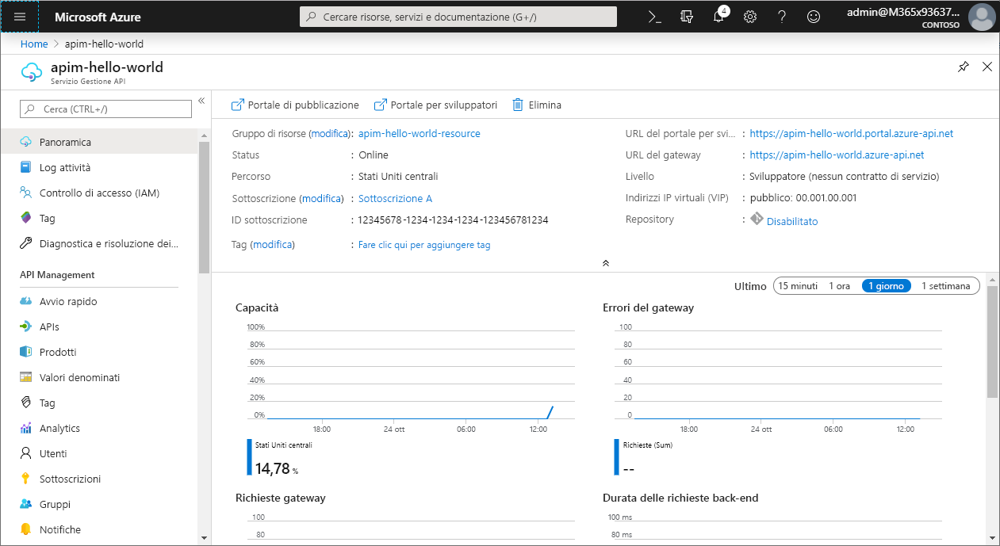
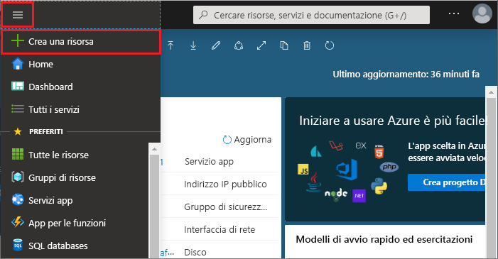
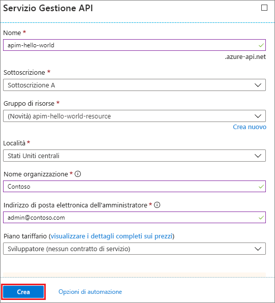
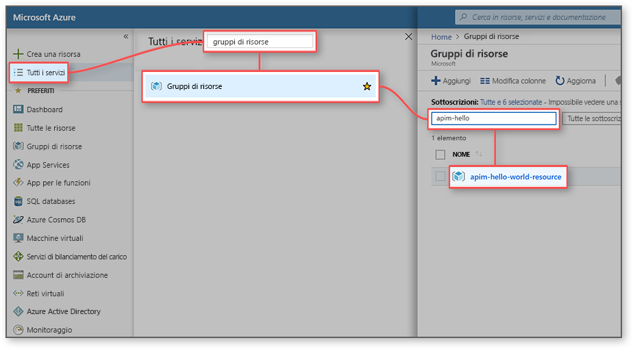
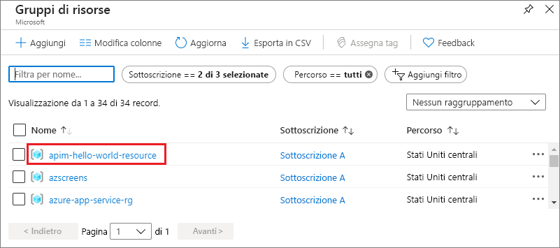

# Creare una nuova istanza del servizio Gestione API di Azure

Gestione API di Azure consente alle organizzazioni di pubblicare API per permettere a sviluppatori esterni, partner e interni di sfruttare tutte le potenzialità dei dati e dei servizi. Gestione API fornisce le competenze fondamentali per assicurare un programma API di successo attraverso il coinvolgimento degli sviluppatori, informazioni aziendali approfondite, strumenti di analisi, sicurezza e protezione. Gestione API di Azure consente di creare e gestire gateway API moderni per servizi back-end esistenti ospitati ovunque. Per altre informazioni, vedere la [panoramica](api-management-key-concepts.md).

In questa guida introduttiva vengono descritti i passaggi per la creazione di una nuova istanza di Gestione API con il portale di Azure.

[!INCLUDE [quickstarts-free-trial-note](../../includes/quickstarts-free-trial-note.md)]

## Accedere ad Azure

Accedere al portale di Azure all'indirizzo http://portal.azure.com.

## Creare un nuovo servizio

1. Nel [portale di Azure](https://portal.azure.com/) selezionare **Crea una risorsa** > **Integrazione aziendale** > **Gestione API**.

    In alternativa scegliere **Nuova**, digitare `API management` nella casella di ricerca e premere INVIO. Fare clic su **Create**(Crea).

2. Nella finestra **Servizio Gestione API** immettere le impostazioni.

    

    | Impostazione                 | Valore consigliato                               | Descrizione                                                                                                                                                                                                                                                                                                                         |
|-------------------------|-----------------------------------------------|-------------------------------------------------------------------------------------------------------------------------------------------------------------------------------------------------------------------------------------------------------------------------------------------------------------------------------------|
| **Nome**                | Un nome univoco per il servizio Gestione API | Il nome non può essere modificato in seguito. Nome del servizio viene usato per generare un nome di dominio predefinito nel formato *{nome} .azure-api.net.* Se si desidera usare un nome di dominio personalizzato, vedere [Configure a custom domain](configure-custom-domain.md) (Configurare un dominio personalizzato).   Il nome del servizio viene usato per fare riferimento al servizio e alla risorsa di Azure corrispondenti. |
| **Sottoscrizione**        | Sottoscrizione in uso                             | La sottoscrizione in cui verrà creata questa nuova istanza del servizio. È possibile selezionare una sottoscrizione tra le sottoscrizioni di Azure alle quali si ha accesso.                                                                                                                                                            |
| **Gruppo di risorse**      | *apimResourceGroup*                           | È possibile selezionare un gruppo di risorse nuovo o esistente. Un gruppo di risorse è una raccolta di risorse che condividono il ciclo di vita, le autorizzazioni e i criteri. Fare clic [qui](../azure-resource-manager/resource-group-overview.md#resource-groups) per altre informazioni.                                                                                                  |
| **Posizione**            | *Stati Uniti occidentali*                                    | Selezionare l'area geografica più vicina. Nell'elenco a discesa vengono visualizzate solo le aree dei servizi di Gestione API disponibili.                                                                                                                                                                                                          |
| **Nome organizzazione**   | Il nome dell'organizzazione                 | Questo nome viene usato in numerose posizioni, ad esempio il titolo del portale per sviluppatori e il mittente delle notifiche tramite posta elettronica.                                                                                                                                                                                                             |
| **Indirizzo di posta elettronica dell'amministratore** | *admin@org.com*                               | Impostare l'indirizzo di posta elettronica a cui inviare tutte le notifiche da **Gestione API**.                                                                                                                                                                                                                                              |
| **Piano tariffario**        | *Developer*                                   | Impostare il livello **Sviluppatore** per valutare il servizio. Questo livello non è disponibile per la produzione. Per altre informazioni sulla scalabilità dei livelli di Gestione API, vedere [upgrade and scale](upgrade-and-scale.md) (Aggiornare e ridimensionare).                                                                                                                                    |

3. Scegliere **Create**.

    > [!TIP]
    > Di solito sono necessari da 20 a 30 minuti per creare un servizio di Gestione API. Se si seleziona **Aggiungi al dashboard** è più facile trovare un servizio appena creato.

[!INCLUDE [api-management-navigate-to-instance.md](../../includes/api-management-navigate-to-instance.md)]

## Pulire le risorse

Quando non servono più, è possibile rimuovere il gruppo di risorse e tutte le risorse correlate seguendo questa procedura:

1. Nel portale di Azure fare clic su **Tutti i servizi**.
2. Immettere `resource groups` nella casella di ricerca e fare clic sul risultato.

    

3. Cercare il gruppo di risorse e fare clic su di esso.
4. Fare clic su **Elimina gruppo di risorse**.

    

5. Immettere il nome del gruppo di risorse per confermare l'eliminazione.
6. Fare clic su **Elimina**.

## Passaggi successivi

> [!div class="nextstepaction"]
> [Importare e pubblicare la prima API](import-and-publish.md)
