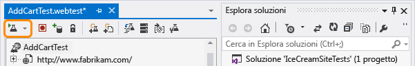
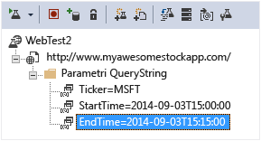
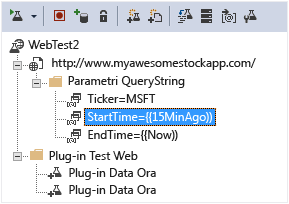

<properties title="Monitor any web site's availability and responsiveness" pageTitle="Monitorare la disponibilità e la velocità di risposta dei siti Web" description="Configurare i test Web in Application Insights. Ottenere avvisi se un sito Web diventa non disponibile o risponde lentamente." metaKeywords="analytics web test availability" authors="awills"  manager="kamrani" />

<tags ms.service="application-insights" ms.workload="tbd" ms.tgt_pltfrm="ibiza" ms.devlang="na" ms.topic="article" ms.date="2014-10-30" ms.author="awills" />
 
# Monitorare la disponibilità e la velocità di risposta dei siti Web

Dopo aver distribuito l'applicazione Web, è possibile configurare test web per monitorarne la disponibilità e la velocità di risposta. Application Insights invia richieste Web a intervalli regolari da vari punti distribuiti in tutto il mondo e può inviare avvisi all'utente nel caso in cui l'applicazione risponda lentamente o non risponda affatto.

È possibile configurare test Web per qualsiasi endpoint HTTP accessibile dalla rete Internet pubblica.

*Si tratta di un sito Web di Azure? È sufficiente [creare il test Web nel pannello del sito Web][azurewebtest].*

1. [Creare una nuova risorsa](#create)
1. [Configurare un test Web](#setup)
1. [Visualizzare risultati](#monitor)
2. [Se si verificano errori...](#failures)
2. [Test Web in più passaggi](#multistep)
1. [Modificare o disabilitare un test](#edit)

 [Video](#video)
 [Passaggi successivi](#next)

## Configurazione di un test Web

### 1. Creare una nuova risorsa

Ignorare questo passaggio se è già stata[configurata una risorsa Application Insights][start] per questa applicazione e si vuole visualizzare i dati sulla disponibilità nella stessa posizione.

Accedere a [Microsoft Azure](http://azure.com), passare al [portale di Anteprima](https://portal.azure.com) e creare una nuova risorsa Application Insights. 

### 2. Creare un test web

Nel pannello della panoramica per l'applicazione fare clic nel riquadro dei test Web. 

*Sono già presenti alcuni test Web? Fare clic nel riquadro dei test Web e scegliere Aggiungi test Web.*

Configurare i dettagli dei test.

- **L'URL** deve essere visibile da dalla rete Internet pubblica. Può includere una stringa di query, pertanto è possibile, ad esempio, esercitarsi nell'uso del database. Se l'URL comporta un reindirizzamento, l'operazione verrà effettuata fino a un numero massimo di 10 reindirizzamenti.

- **Le posizioni dei test** sono le ubicazioni da cui i server inviano richieste Web all'URL indicato. Sceglierne due o tre, in modo da poter distinguere i problemi del sito Web dai problemi di rete. Non è possibile selezionare più di tre posizioni.

- **Criteri di successo**:
    **Codici HTTP restituiti**: in genere 200. 

Stringa relativa alla     **corrispondenza di contenuto**, quale "Benvenuto!" Verrà verificato che sia presente in tutte le risposte. Deve trattarsi di una stringa di testo normale, senza caratteri jolly. È importante ricordare che, se il contenuto cambia, potrebbe essere necessario aggiornare la stringa.

- **Avvisi**: Per impostazione predefinita, se si verificano errori ripetuti nell'arco di 15 minuti viene inviato un avviso. È comunque possibile modificare l'impostazione in modo da aumentare la sensibilità del test e modificare gli indirizzi di posta elettronica a cui inviare la notifica.

#### Testare più URL

È possibile aggiungere altri test per qualsiasi numero di URL. Ad esempio, oltre a testare la home page è possibile verificare che il database sia in esecuzione testando l'URL per una ricerca.

### 3. Visualizzare i report di disponibilità

Dopo 1-2 minuti fare clic su Aggiorna nel pannello della panoramica. In questa versione l'aggiornamento non viene eseguito automaticamente.

Il grafico nel pannello della panoramica combina i risultati per tutti i test Web dell'applicazione.

#### Componenti di pagina

Immagini, fogli di stile, script e altri componenti statici sono richiesti nell'ambito del test.  

Il tempo di risposta registrato è il tempo impiegato per il caricamento completo di tutti i componenti.

In caso di errore di caricamento dei componenti, il test viene contrassegnato come non riuscito.

## Se si verificano errori...

Fare clic sul pannello dei test Web per vedere risultati separati per ciascun test.

Aprire uno specifico test Web.

Scorrere verso il basso fino a **Test non superati** e selezionare un risultato.

Il risultato mostra il motivo dell'errore.

Per maggiori dettagli, scaricare il file dei risultati ed esaminarlo in Visual Studio.

##Test Web in più passaggi

È possibile monitorare uno scenario che comporta una sequenza di URL. Ad esempio, se si monitora un sito Web di vendita, si potrebbe testare il corretto funzionamento dei carrelli acquisti. 

Per creare un test in più passaggi, registrare lo scenario con Visual Studio, quindi caricare la registrazione in Application Insights. Application Insights riprodurrà lo scenario a intervalli e verificherà le risposte.

#### 1. Registrare uno scenario

Usare Visual Studio Ultimate per registrare una sessione Web.

1. Creare un progetto di test delle prestazioni Web.
    
2. Aprire il file .webtest e iniziare la registrazione.
    
3. Eseguire le azioni utente che si vuole simulare nel test: aprire il sito Web, aggiungere un prodotto al carrello e così via. Quindi, arrestare il test. 
    
    Non creare uno scenario lungo, in quanto è presente un limite di 100 passaggi e 2 minuti.
4. Eseguire il test in Visual Studio per verificarne il corretto funzionamento.
    Il programma di esecuzione del test Web apre un browser Web e ripete le azioni registrate. Verificare che funzioni come previsto. 
    
 

Non inserire cicli nel codice del test Web.

#### 2. Caricare il test Web in Application Insights

Nel portale Application Insights, creare un nuovo test Web.

Selezionare un test in più passaggi e caricare il file .webtest.

Visualizzare i risultati del test e gli eventuali errori nello stesso modo dei test con singolo URL. 

Un motivo frequente di errore è l'eccessiva durata del test. L'esecuzione non deve superare i due minuti.

### Inserimento di plug-in relativi a tempo e numeri casuali nel test in più passaggi

Si supponga di voler testare uno strumento che riceva dati dipendenti dal tempo, come ad esempio valori di scorte da un feed esterno. Quando si registra il test Web, è necessario usare tempi specifici impostandoli come parametri del test, StartTime e EndTime.

Quando di esegue il test, si vuole che EndTime sia sempre l'ora corrente e StartTime 15 minuti fa.

I plug-in del test Web consentono di definire questa impostazione.

1. Aggiungere un plug-in del test Web per ciascun valore di parametro desiderato. Nella barra degli strumenti del test Web scegliere **Aggiungi plug-in test Web**.

    

    In questo esempio, verranno usate due istanze di Plug-in data e ora, una per "15 minuti fa" e l'altra per "ora". 

2. Aprire le proprietà di ciascun plug-in. Assegnare un nome al plug-in e impostarlo in modo che usi l'ora corrente. Per uno di essi, impostare Aggiungi minuti = -15.

    

3. Nei parametri del test Web, usare {{nome plug-in}} per fare riferimento a un nome di plug-in.

    

Ora caricare il test nel portale. Userà i valori dinamici ogni volta che verrà eseguito.

##  Modificare o disabilitare un test

Aprire un singolo test per modificarlo o disabilitarlo.

Disabilitare i test Web può essere utile durante l'esecuzione di operazioni di manutenzione sul servizio.

## Video

> [AZURE.VIDEO monitoring-availability-with-application-insights]

## Passaggi successivi

[Ricerca nei registri di diagnostica][diagnostica]

[Risoluzione dei problemi][qna]

[AZURE.INCLUDE [app-insights-learn-more](../includes/app-insights-learn-more.md)]

[azurewebtest]: ../insights-create-web-tests/
