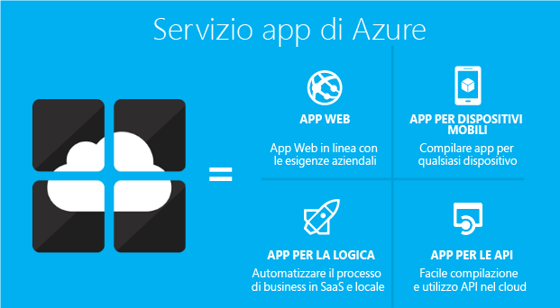

<properties 
	pageTitle="Panoramica delle app per le API" 
	description="Informazioni sui motivi per i quali il servizio app di Azure è la piattaforma migliore per lo sviluppo, la pubblicazione e l'hosting di API RESTful." 
	services="app-service\api" 
	documentationCenter=".net" 
	authors="tdykstra" 
	manager="wpickett" 
	editor=""/>

<tags 
	ms.service="app-service-api" 
	ms.workload="web" 
	ms.tgt_pltfrm="na" 
	ms.devlang="na" 
	ms.topic="article" 
	ms.date="01/08/2016" 
	ms.author="tdykstra"/>

# Panoramica delle app per le API

Le app per le API sono uno dei quattro tipi di app offerti da [Servizio app di Azure](../app-service/app-service-value-prop-what-is.md).

Il [servizio app](../app-service/app-service-value-prop-what-is.md) è una piattaforma completamente gestita che offre un set completo di funzionalità per scenari Web, mobili e di integrazione. Le app per le API nel servizio App offrono delle funzionalità che rendono più semplice creare, ospitare e utilizzare le API nel cloud e in locale. Distribuire la propria API come un'app per le API in Servizio app e trarre vantaggio dalla sicurezza di livello aziendale, dal controllo di accesso semplificato, dalla connettività ibrida, dalla generazione automatica di SDK e dalla perfetta integrazione con le [app per la logica](../app-service-logic/app-service-logic-what-are-logic-apps.md).

## Vantaggi delle app per le API

Le app per le API offrono le funzionalità seguenti:

- **Facilità di utilizzo**: grazie al supporto integrato per i [metadati dell’API Swagger](#concepts) le API sono più facilmente utilizzabili da client diversi. Viene generato automaticamente il codice client per le API in diversi linguaggi, inclusi C#, Java e Javascript. Configurare facilmente [CORS](#concepts) senza modificare il codice. Per altre informazioni, vedere [Metadati dell’App per le API del servizio app per l’individuazione dell’API e la generazione di codice](app-service-api-metadata.md) e [Consumare un'app API da JavaScript mediante CORS](app-service-api-cors-consume-javascript.md). 

- **Controllo di accesso semplificato**: protegge un'app per le API da accessi non autenticati senza apportare modifiche al codice. I servizi di autenticazione integrati proteggono le API dall'accesso da altri servizi o da client che rappresentano gli utenti. I provider di identità supportati includono Azure Active Directory e i provider di terze parti, ad esempio Facebook e Twitter. I client possono usare Active Directory Authentication Library (ADAL) o Mobile Apps SDK. Per altre informazioni, vedere [Espansione dell’autenticazione/autorizzazione del servizio App](/blog/announcing-app-service-authentication-authorization/) e [App per le API del servizio app: modifiche apportate](app-service-api-whats-changed.md).

- **Integrazione con Visual Studio**: gli strumenti dedicati in Visual Studio semplificano il processo di creazione, distribuzione, utilizzo, debug e gestione delle app per le API. Per altre informazioni, vedere [Annuncio di Azure SDK 2.8.1 per Visual Studio](/blog/announcing-azure-sdk-2-8-1-for-net/).

- **Integrazione con app per la logica**: le app per le API create possono essere utilizzate dalle [app per la logica del servizio app](../app-service-logic/app-service-logic-what-are-logic-apps.md). Per altre informazioni, vedere [Uso dell'API personalizzata ospitata nel servizio app con App per la logica](../app-service-logic/app-service-logic-custom-hosted-api.md). Per informazioni sulle modifiche in corso nelle modalità di integrazione di app per le API con app per la logica, vedere [App per le API del servizio app: modifiche apportate](app-service-api-whats-changed.md).

- **Uso dell'API esistente**: è possibile usare le API esistenti così come sono, senza modificarne il codice. Per sfruttare le funzionalità delle app per le API, è sufficiente distribuire il codice in un'app per le API. L'API può usare qualsiasi linguaggio o framework supportato dal servizio app, inclusi ASP.NET, C#, Java, PHP, Node. js e Python.

Inoltre, un'app per le API può avvalersi delle funzionalità offerte dalle [app Web](../app-service-web/app-service-web-overview.md) e dalle [app per dispositivi mobili](../app-service-mobile/app-service-mobile-value-prop.md). È anche vero il contrario: se si usa un'app Web o un’app per dispositivi mobili per ospitare un'API, questa può sfruttare i vantaggi di funzionalità delle app per le API come i metadati Swagger per la generazione di codice client e CORS per l'accesso browser tra domini. L’unica differenza fra i tre tipi di app (API, Web e mobile) è data dal nome e dall’icona con cui sono contraddistinte nel portale di Azure. Poiché tutti i tipi hanno le stesse funzioni, non è mai necessario cambiare un’app da un tipo all’altro per ottenere le funzioni richieste. In ogni caso modificare il tipo di un’app esistente è facile. Per altre informazioni, vedere **Modifica del tipo di app** in [Introduzione alle app per le API e ad ASP.NET nel servizio app di Azure](app-service-api-dotnet-get-started.md#optional-changing-an-app-type).

## Aumento delle app per le API con Gestione API 

Le app per le API e la [Gestione API di Azure](../api-management/api-management-key-concepts.md) sono servizi complementari:

* Gestione API permette di gestire le API. I front-end di Gestione API vengono applicati su un'API per controllare e limitare l'utilizzo, modificare l'input e output, raggruppare diverse API in un'unica API e così via. Le API gestite possono essere ospitate in qualsiasi punto.
* Le app per le api consentono l'hosting delle API. Questo servizio offre funzionalità che semplificano lo sviluppo e l'utilizzo delle API, ma non offre le funzionalità di monitoraggio, limitazione o consolidamento della Gestione API. 

È possibile usare Gestione API per gestire le API ospitate dalle app per le API oppure usare le app per le API senza Gestione API.

Gestione API e le app per le API talvolta offrono funzionalità simili. Ad esempio, entrambe permettono di automatizzare il supporto CORS. Quando i due servizi vengono usati insieme, per CORS si usa Gestione API perché funziona da front-end per le app per le API.

## Concetti delle app per le API 

- **Swagger**: un framework per la documentazione e per l'individuazione di un'API RESTful, usato per impostazione predefinita nelle app per le API. Per altre informazioni, visitare il sito [http://swagger.io/](http://swagger.io/).
- **Condivisione risorse tra le origini (CORS)**: un meccanismo che consente a JavaScript in esecuzione in un browser di effettuare chiamate a un'API ospitata in un dominio diverso da quello da cui è stata caricata la pagina Web. Per altre informazioni, vedere [Utilizzare un'app per le API da JavaScript tramite CORS](app-service-api-cors-consume-javascript.md). 
- **Trigger**: API REST che può essere chiamata dalle [app per la logica](../app-service-logic/app-service-logic-what-are-logic-apps.md) per avviare un processo di flusso di lavoro quando viene soddisfatta una determinata condizione. Ad esempio, un'app per le API può fornire un metodo che viene chiamato periodicamente dall'app per la logica per cercare una determinata frase in un feed di Twitter. Per altre informazioni, vedere la pagina relativa ai [trigger delle app per le API](app-service-api-dotnet-triggers.md).
- **Azione**: API REST che può essere chiamata dalle [app per la logica](../app-service-logic/app-service-logic-what-are-logic-apps.md) per elaborare i dati dopo l'avvio di un flusso di lavoro da parte di un trigger. Ad esempio, un'app per le API può fornire un metodo che viene chiamato dall'app per la logica per rispondere a un tweet rilevato dal trigger di Twitter. Le azioni sono metodi API esposti da una definizione dell'API Swagger.

## Introduzione

Per iniziare a usare le app per le API, seguire una delle esercitazioni [Introduzione alle app per le API](app-service-api-dotnet-get-started.md).

Per porre domande sulle app per le API, avviare un thread nel [forum sulle app per le API](https://social.msdn.microsoft.com/Forums/it-IT/home?forum=AzureAPIApps).

<!---HONumber=AcomDC_0316_2016-->