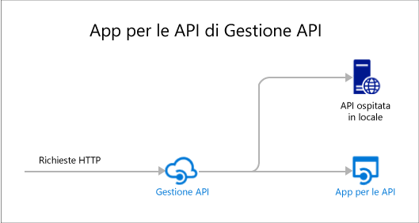

# Panoramica delle app per le API
Le app per le API del servizio app di Azure includono funzionalità che rendono più semplice sviluppare, ospitare e usare le API nel cloud e in locale. Le app per le API offrono sicurezza di livello aziendale, controllo di accesso semplificato, connettività ibrida, generazione automatica di SDK e perfetta integrazione con le [app per la logica](../logic-apps/logic-apps-what-are-logic-apps.md).

[servizio app di Azure](../app-service/app-service-value-prop-what-is.md) è una piattaforma completamente gestita per scenari Web, mobili e di integrazione. Le app per le API sono uno dei quattro tipi di app offerti da [Servizio app di Azure](../app-service/app-service-value-prop-what-is.md).

## Perché usare le app per le API?
Di seguito sono elencate alcune delle funzionalità principali delle app per le API:

* **Uso dell'API esistente**: è possibile usare le API esistenti così come sono, senza modificarne il codice. Per sfruttare le app per le API, è sufficiente distribuire il codice in un'app per le API. L'API può usare qualsiasi linguaggio o framework supportato dal servizio app, inclusi ASP.NET, C#, Java, PHP, Node. js e Python.
* **Facilità di utilizzo** : grazie al supporto integrato per i [metadati dell’API Swagger](http://swagger.io/) le API sono più facilmente utilizzabili da client diversi.  Viene generato automaticamente il codice client per le API in diversi linguaggi, inclusi C#, Java e Javascript. Configurare facilmente [CORS](app-service-api-cors-consume-javascript.md) senza modificare il codice. Per altre informazioni, vedere [Metadati delle app per le API del servizio app per l'individuazione di API e la generazione di codice](app-service-api-metadata.md) e [Utilizzare un'app per le API da JavaScript tramite CORS](app-service-api-cors-consume-javascript.md). 
* **Controllo di accesso semplificato** : protegge un'app per le API da accessi non autenticati senza apportare modifiche al codice. I servizi di autenticazione integrati proteggono le API dall'accesso da altri servizi o da client che rappresentano gli utenti. I provider di identità supportati includono Azure Active Directory, Facebook, Twitter, Google e account Microsoft. I client possono usare Active Directory Authentication Library (ADAL) o Mobile Apps SDK. Per altre informazioni, vedere [Autenticazione e autorizzazione per app per le API nel servizio app di Azure](app-service-api-authentication.md).
* **Integrazione con Visual Studio** : gli strumenti dedicati in Visual Studio semplificano il processo di creazione, distribuzione, utilizzo, debug e gestione delle app per le API. Per altre informazioni, vedere [Annuncio di Azure SDK 2.8.1 per Visual Studio](https://azure.microsoft.com/blog/announcing-azure-sdk-2-8-1-for-net/).
* **Integrazione con app per la logica** : le app per le API create possono essere utilizzate dalle [app per la logica del servizio app](../logic-apps/logic-apps-what-are-logic-apps.md).  Per altre informazioni, vedere [Uso dell'API personalizzata ospitata nel servizio app con App per la logica](../logic-apps/logic-apps-custom-hosted-api.md) and [Nuova versione dello schema 2015-08-01-preview](../logic-apps/logic-apps-schema-2015-08-01.md).

Inoltre, un'app per le API può avvalersi delle funzionalità offerte dalle [app Web](../app-service-web/app-service-web-overview.md) e dalle [app per dispositivi mobili](../app-service-mobile/app-service-mobile-value-prop.md). È anche vero il contrario: se si usa un'app Web o un’app per dispositivi mobili per ospitare un'API, questa può sfruttare i vantaggi di funzionalità delle app per le API come i metadati Swagger per la generazione di codice client e CORS per l'accesso browser tra domini. L’unica differenza fra i tre tipi di app (API, Web e mobile) è data dal nome e dall’icona con cui sono contraddistinte nel portale di Azure.

## Qual è la differenza tra le app per le API e Gestione API di Azure?
Le app per le API e la [Gestione API di Azure](../api-management/api-management-key-concepts.md) sono servizi complementari:

* Gestione API permette di gestire le API. I front-end di Gestione API vengono applicati su un'API per controllare e limitare l'utilizzo, modificare l'input e output, raggruppare diverse API in un unico endpoint e così via. Le API gestite possono essere ospitate in qualsiasi punto.
* Le app per le api consentono l'hosting delle API. Questo servizio offre funzionalità che semplificano lo sviluppo e l'utilizzo delle API, ma non offre le funzionalità di monitoraggio, limitazione o consolidamento della Gestione API. Se non sono necessarie le funzionalità di Gestione API, è possibile ospitare le API nelle app per le API senza usare Gestione API.

Ecco un diagramma che illustra Gestione API usato per le API ospitate nelle app per le API e altrove.

Gestione API e le app per le API talvolta offrono funzionalità simili.  Ad esempio, entrambe permettono di automatizzare il supporto CORS. Quando i due servizi vengono usati insieme, per CORS si usa Gestione API perché funziona da front-end per le app per le API. 

## Introduzione
Per iniziare a usare le app per le API distribuendo il codice di esempio in una di esse, vedere l'esercitazione relativa al framework preferito:

* [ASP.NET](app-service-api-dotnet-get-started.md) 
* [Node.JS](app-service-api-nodejs-api-app.md) 
* [Java](app-service-api-java-api-app.md) 

Per porre domande sulle app per le API, avviare un thread nel [forum sulle app per le API](https://social.msdn.microsoft.com/Forums/en-US/home?forum=AzureAPIApps). 

<!--HONumber=Jan17_HO3-->

