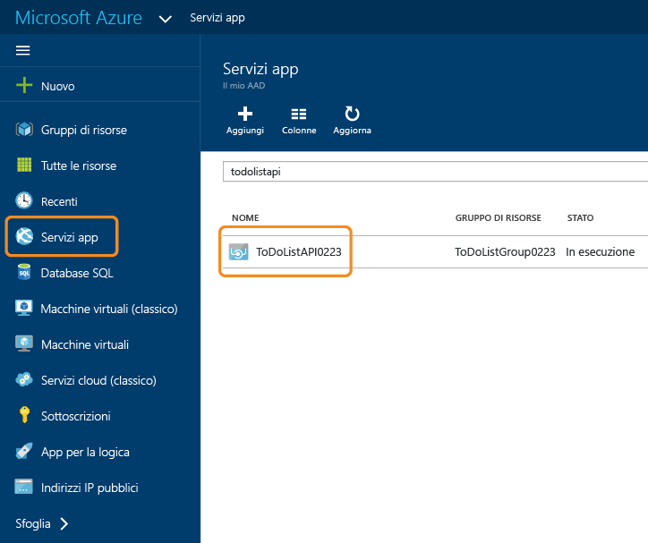
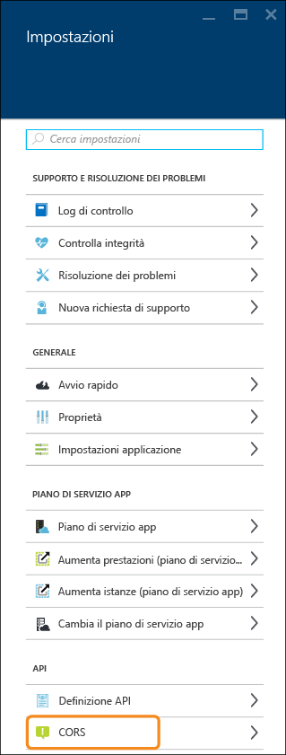
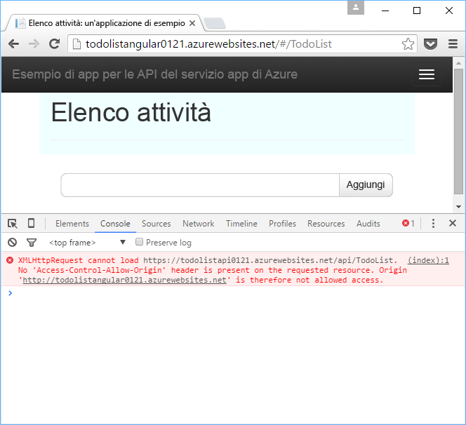
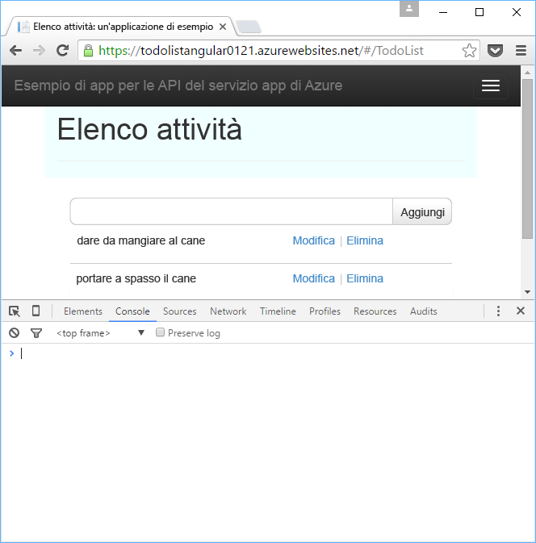

<properties
	pageTitle="Supporto di CORS nel servizio app | Microsoft Azure"
	description="Informazioni su come usare il supporto di CORS nel servizio app di Azure."
	services="app-service\api"
	documentationCenter=".net"
	authors="tdykstra"
	manager="wpickett"
	editor=""/>

<tags
	ms.service="app-service-api"
	ms.workload="na"
	ms.tgt_pltfrm="dotnet"
	ms.devlang="na"
	ms.topic="get-started-article"
	ms.date="03/31/2016"
	ms.author="tdykstra"/>

# Utilizzare un'app per le API da JavaScript tramite CORS

## Panoramica

Il servizio app include il supporto predefinito per la condivisione di risorse tra le origini (CORS), che consente ai client JavaScript di eseguire chiamate tra domini ospitati in app per le API, app Web o app per dispositivi mobili. Questa funzionalità del servizio app consente di sfruttare i vantaggi della condivisione CORS senza scrivere codice nell'API.

[CORS](https://en.wikipedia.org/wiki/Cross-origin_resource_sharing) è un protocollo Internet che consente di effettuare chiamate API da JavaScript a un dominio diverso da quello da cui il browser ha caricato JavaScript. Senza CORS è possibile effettuare una chiamata da una pagina Web contoso.com a un endpoint API contoso.com, ma non a un endpoint di fabrikam.com.

Questo articolo contiene due sezioni:

* La sezione [Come configurare CORS nel servizio app di Azure](#corsconfig) illustra in linea generale come configurare CORS per qualsiasi app per le API, app Web o app per dispositivi mobili. La sezione si applica allo stesso modo a tutti i framework supportati dal servizio app, inclusi .NET, Node.js e Java. 

* A partire dalla sezione [Proseguimento dell'esercitazione introduttiva su .NET](#tutorialstart) l'articolo è un'esercitazione che illustra il supporto di CORS basandosi su quanto è stato fatto in [Introduzione alle app per le API e ad ASP.NET nel servizio app di Azure](app-service-api-dotnet-get-started.md).

##  Come configurare CORS nel servizio app di Azure

È possibile configurare CORS nel portale di Azure o tramite gli strumenti di [Azure Resource Manager](../resource-group-overview.md).

#### Configurare CORS nel portale di Azure

8. Nel browser passare al [portale di Azure](https://portal.azure.com/).

2. Fare clic su **Servizi app** e quindi sul nome dell'app per le API.

	

10. Nel pannello **Impostazioni** che viene visualizzato a destra del pannello **App per le API** trovare la sezione **API** e quindi fare clic su **CORS**.

	

11. Nella casella di testo immettere l'URL o gli URL da cui consentire le chiamate JavaScript.

	Ad esempio, se l'applicazione JavaScript è stata distribuita in un'app Web denominata todolistangular, immettere "https://todolistangular.azurewebsites.net". In alternativa, è possibile immettere un asterisco (*) per specificare che vengono accettati tutti i domini di origine.

13. Fare clic su **Save**.

	

	Dopo aver fatto clic su **Salva**, l'app per le API accetterà le chiamate JavaScript dagli URL specificati.

### Configurare CORS con gli strumenti di Gestione risorse di Azure

È anche possibile configurare CORS per un'app per le API usando [modelli di Azure Resource Manager](../resource-group-authoring-templates.md) in strumenti della riga di comando come [Azure PowerShell](../powershell-install-configure.md) e l'[interfaccia della riga di comando di Azure](../xplat-cli-install.md).

Per un esempio di un modello di Azure Resource Manager che imposta la proprietà CORS, aprire il [file azuredeploy.json nel repository dell'applicazione di esempio di questa esercitazione](https://github.com/azure-samples/app-service-api-dotnet-todo-list/blob/master/azuredeploy.json). Trovare la sezione del modello simile all'esempio seguente:

		"cors": {
		    "allowedOrigins": [
		        "todolistangular.azurewebsites.net"
		    ]
		}

##  Proseguimento dell'esercitazione introduttiva su .NET

Se si sta seguendo la serie introduttiva su Node.js o Java per le app per le API, passare all'articolo successivo relativo all'[autenticazione per le app per le API del servizio app](app-service-api-authentication.md).

Il resto di questo articolo è una continuazione della serie introduttiva su .NET e si presuppone che sia stata completata correttamente [la prima esercitazione](app-service-api-dotnet-get-started.md).

## Distribuire il progetto ToDoListAngular in una nuova app Web

Nella [prima esercitazione](app-service-api-dotnet-get-started.md) è stata creata un'app per le API di livello intermedio e un'app per le API di livello dati. In questa esercitazione si creerà un'app Web di applicazione a singola pagina che chiama l'app per le API di livello intermedio. Per consentire il funzionamento dell'applicazione a singola pagina, si deve abilitare CORS nell'app per le API di livello intermedio.

Nell'[applicazione di esempio ToDoList](https://github.com/Azure-Samples/app-service-api-dotnet-todo-list) il progetto ToDoListAngular è un semplice client AngularJS che chiama il progetto API Web ToDoListAPI di livello intermedio. Il codice JavaScript nel file *app/scripts/todoListSvc.js* chiama l'API usando il provider HTTP AngularJS.

		angular.module('todoApp')
		.factory('todoListSvc', ['$http', function ($http) {
		    var apiEndpoint = "http://localhost:46439";
		
		    $http.defaults.useXDomain = true;
		    delete $http.defaults.headers.common['X-Requested-With']; 
		
		    return {
		        getItems : function(){
		            return $http.get(apiEndpoint + '/api/TodoList');
		        },

		        /* Get by ID, Put, and Delete methods not shown */

		        postItem : function(item){
		            return $http.post(apiEndpoint + '/api/TodoList', item);
		        }
		    };
		}]);

### Creare una nuova app Web per il progetto ToDoListAngular

La procedura per creare una nuova app Web e per distribuirvi un progetto è simile a quella illustrata nella prima esercitazione di questa serie. L'unica differenza è che il tipo di app è **App Web** anziché **App per le API**.

1. In **Esplora soluzioni** fare clic con il pulsante destro del mouse sul progetto ToDoListAngular e quindi scegliere **Pubblica**.

3.  Nella scheda **Profilo** della procedura guidata **Pubblica sito Web** fare clic su **Servizio app di Microsoft Azure**.

5. Nella finestra di dialogo **Servizio App** fare clic su **Nuovo**.

3. Nella scheda **Hosting** della finestra di dialogo **Crea servizio app** immettere un valore in **Nome app Web** che sia univoco nel dominio *azurewebsites.net*.

5. Scegliere la **Sottoscrizione** di Azure da usare.

6. Nell'elenco a discesa **Gruppo di risorse** selezionare il nome del gruppo di risorse creato in precedenza.

4. Nell'elenco a discesa **Piano di servizio app** scegliere lo stesso piano creato in precedenza.

7. Fare clic su **Crea**.

	Visual Studio crea l'app Web, crea un profilo di pubblicazione per l'app e visualizza il passaggio **Connessione** della procedura guidata **Pubblica sito Web**.

	Non è ancora il momento di fare clic su **Pubblica**. Nella sezione seguente si configura la nuova app Web per la chiamata all'app per le API di livello intermedio in esecuzione nel servizio app.

### Impostare l'URL di livello intermedio nelle impostazioni dell'app Web

1. Andare al [portale di Azure](https://portal.azure.com/) e passare al pannello **App Web** per l'app Web creata per ospitare il progetto TodoListAngular (front-end).

2. Fare clic su **Impostazioni > Impostazioni applicazione**.

3. Nella sezione **Impostazioni app** aggiungere la chiave e il valore seguenti:

	|Chiave|Valore|Esempio
	|---|---|---|
	|toDoListAPIURL|https://{your dell'app per le API di livello intermedio}.azurewebsites.net|https://todolistapi0121.azurewebsites.net|

4. Fare clic su **Save**.

	Quando il codice è in esecuzione in Azure, questo valore sostituisce l'URL localhost contenuto nel file *Web.config*.

	Il codice che ottiene il valore dell'impostazione è in *index.cshtml*:

		
		

	Il codice in *todoListSvc.js* usa l'impostazione:

		return {
		    getItems : function(){
		        return $http.get(apiEndpoint + '/api/TodoList');
		    },
		    getItem : function(id){
		        return $http.get(apiEndpoint + '/api/TodoList/' + id);
		    },
		    postItem : function(item){
		        return $http.post(apiEndpoint + '/api/TodoList', item);
		    },
		    putItem : function(item){
		        return $http.put(apiEndpoint + '/api/TodoList/', item);
		    },
		    deleteItem : function(id){
		        return $http({
		            method: 'DELETE',
		            url: apiEndpoint + '/api/TodoList/' + id
		        });
		    }
		};

### Distribuire il progetto Web ToDoListAngular nella nuova app Web

*  Nel passaggio **Connessione** della procedura guidata **Pubblica sul Web** fare clic su **Pubblica**.

	Visual Studio distribuisce il progetto ToDoListAngular nella nuova app Web e apre un browser all'URL dell'app Web.

### Testare l'applicazione senza avere abilitato CORS 

2. Negli strumenti di sviluppo del browser aprire la finestra della console.

3. Nella finestra del browser che visualizza l'interfaccia utente di AngularJS fare clic sul collegamento **To Do List**.

	Il codice JavaScript prova a chiamare l'app per le API di livello intermedio, ma la chiamata non riesce perché il front-end è in esecuzione in un dominio diverso da quello del back-end. La finestra della console degli strumenti di sviluppo del browser mostra un messaggio di errore tra origini.

	

## Configurare CORS per l'app per le API di livello intermedio

In questa sezione si configura l'app per le API ToDoListAPI per consentire le chiamate JavaScript dall'app Web creata per il progetto ToDoListAngular.
 
8. Nel browser passare al [portale di Azure](https://portal.azure.com/).

2. Fare clic su **Servizi app** e quindi fare clic sull'app per le API ToDoListAPI (livello intermedio).

	

10. Nel pannello **Impostazioni** che viene visualizzato a destra del pannello **App per le API** trovare la sezione **API** e quindi fare clic su **CORS**.

	

12. Nella casella di testo immettere l'URL per l'app Web ToDoListAngular (front-end). Ad esempio, se è stato distribuito il progetto ToDoListAngular in un'app Web denominata todolistangular0121, consentire le chiamate dall'URL `https://todolistangular0121.azurewebsites.net`.

	In alternativa, è possibile immettere un asterisco (*) per specificare che vengono accettati tutti i domini di origine.

13. Fare clic su **Save**.

	

	Dopo aver fatto clic su **Salva**, l'app per le API accetterà le chiamate JavaScript dall'URL specificato. In questa schermata, l'app per le API ToDoListAPI0223 accetterà le chiamate client JavaScript dall'app Web ToDoListAngular.

### Testare l'applicazione con CORS abilitato

* Aprire un browser all'URL HTTPS dell'app Web. 

	Questa volta l'applicazione consente di visualizzare, aggiungere, modificare ed eliminare attività.

	

## CORS del servizio app e CORS di API Web

In un progetto API Web è possibile installare il pacchetto NuGet [Microsoft.AspNet.WebApi.Cors](https://www.nuget.org/packages/Microsoft.AspNet.WebApi.Cors/) per specificare nel codice i domini da cui l'API accetterà chiamate JavaScript.
 
Il supporto di CORS per l'API Web è più flessibile del supporto di CORS per il servizio app. Ad esempio, nel codice è possibile specificare origini accettate diverse a seconda del metodo di azione, mentre per CORS per il servizio app si specifica un set di origini accettate per tutti i metodi di un'app per le API.

> [AZURE.NOTE] Non cercare di usare sia CORS per l'API Web che CORS per il servizio app in un'app per le API. CORS per il servizio app avrà la precedenza e CORS per l'API Web non avrà effetto. Ad esempio, se si abilita un dominio di origine nel servizio app e si abilitano tutti i domini di origine nel codice dell'API Web, l'app per le API di Azure accetterà solo chiamate dal dominio specificato in Azure.

### Come abilitare CORS nel codice dell'API Web

I passaggi seguenti riepilogano il processo di abilitazione del supporto di CORS per l'API Web. Per altre informazioni, vedere l'articolo relativo all'[abilitazione della condivisione di richieste tra le origini nelle API Web ASP.NET 2](http://www.asp.net/web-api/overview/security/enabling-cross-origin-requests-in-web-api).

1. In un progetto API Web installare il pacchetto NuGet [Microsoft.AspNet.WebApi.Cors](https://www.nuget.org/packages/Microsoft.AspNet.WebApi.Cors/).

1. Includere una riga di codice `config.EnableCors()` nel metodo **Register** della classe **WebApiConfig**, come nell'esempio seguente.

		public static class WebApiConfig
		{
		    public static void Register(HttpConfiguration config)
		    {
		        // Web API configuration and services
	            
		        // The following line enables you to control CORS by using Web API code
		        config.EnableCors();
	
		        // Web API routes
		        config.MapHttpAttributeRoutes();
	
		        config.Routes.MapHttpRoute(
		            name: "DefaultApi",
		            routeTemplate: "api/{controller}/{id}",
		            defaults: new { id = RouteParameter.Optional }
		        );
		    }
		}

1. Nel controller dell'API Web aggiungere un'istruzione `using` per lo spazio dei nomi `System.Web.Http.Cors` e aggiungere l'attributo `EnableCors` alla classe controller o a singoli metodi di azione. Nell'esempio seguente il supporto di CORS si applica all'intero controller.

		namespace ToDoListAPI.Controllers 
		{
		    [HttpOperationExceptionFilterAttribute]
		    [EnableCors(origins:"*", headers:"*", methods: "*")]
		    public class ToDoListController : ApiController
 
	> **Nota**: usare questo attributo con cautela. Se si specificano caratteri jolly per tutti i parametri, l'API sarà aperta a tutte le origini e a tutte le richieste HTTP. Le impostazioni riportate di seguito sono solo a scopo dimostrativo.

## Risoluzione dei problemi

Se si verifica un problema durante l'esecuzione di questa esercitazione, assicurarsi che sia in uso la versione più recente di Azure SDK per .NET. Il modo più semplice per farlo consiste nel procedere al [download di Azure SDK per Visual Studio 2015](http://go.microsoft.com/fwlink/?linkid=518003). Se è installata la versione corrente, l'Installazione guidata piattaforma Web informa che non è necessaria alcuna installazione.

Se dopo aver impostato un URL nel pannello CORS del portale si continua a ricevere errori CORS, accertarsi che siano state apportate le giuste modifiche nei punti appropriati. Ad esempio:

* Verificare che il protocollo sia stato immesso correttamente, ovvero `https` anziché `http`, e assicurarsi di usare `https` per eseguire l'app Web front-end.
* Verificare che le impostazioni CORS siano state immesse nell'app per le API di livello intermedio anziché nell'app Web front-end.

Se si sta configurando CORS nel codice dell'applicazione e nel servizio app di Azure, si noti che l'impostazione CORS del servizio app sovrascrive ogni altra cosa nel codice dell'applicazione.

Per altre informazioni sulle funzionalità di Visual Studio che semplificano la risoluzione dei problemi, vedere [Risoluzione dei problemi di un'app Web nel servizio app di Azure tramite Visual Studio](../app-service-web/web-sites-dotnet-troubleshoot-visual-studio.md).

## Passaggi successivi 

In questo articolo è stato illustrato come abilitare il supporto di CORS del servizio app perché il codice JavaScript del client possa chiamare un'API in un dominio diverso. Nel prossimo articolo della serie introduttiva alle app per le API viene illustrata l'[autenticazione per le app per le API del servizio app](app-service-api-authentication.md).

<!---HONumber=AcomDC_0406_2016-->