<properties 
	pageTitle="Proteggere un'app per le API di Azure" 
	description="Informazioni su come proteggere un'app per le API di Azure con Visual Studio." 
	services="app-service\api" 
	documentationCenter=".net" 
	authors="tdykstra" 
	manager="wpickett" 
	editor="jimbe"/>

<tags 
	ms.service="app-service-api" 
	ms.workload="web" 
	ms.tgt_pltfrm="dotnet" 
	ms.devlang="na" 
	ms.topic="article" 
	ms.date="06/26/2015" 
	ms.author="tdykstra"/>

# Proteggere un'app per le API: aggiungere l'autenticazione di Azure Active Directory o del provider di servizi di social networking

## Panoramica

Questa esercitazione mostra come proteggere un'app per le API in modo che solo gli utenti autenticati possano accedervi, oltre a mostrare il codice che si può usare nell'app per le API ASP.NET per recuperare le informazioni relative all'utente connesso.

Si eseguirà la procedura seguente:

- Chiamare l'app per le API per verificare che sia funzionante.
- Applicare regole di autenticazione all'app per le API.
- Chiamare ancora l'app per le API per verificare che rifiuti le richieste non autenticate.
- Accedere al provider configurato.
- Chiamare ancora l'app per le API per verificare che l'accesso autenticato funzioni.
- Scrivere e testare il codice che recupera le attestazioni per l'utente connesso.

Per altre informazioni sull'autenticazione nel servizio app di Azure, vedere [Autenticazione per app per le API e per dispositivi mobili](../app-service/app-service-authentication-overview.md).

## Prerequisiti

Questa esercitazione usa l'app per le API creata in [Creare un'app per le API](app-service-dotnet-create-api-app.md) e distribuita in [Distribuire un'app per le API](app-service-dotnet-deploy-api-app.md).

## Usare il browser per chiamare l'app per le API 

Il modo più semplice per verificare che l'app per le API sia accessibile pubblicamente è chiamarla da un browser.

1. Nel browser passare al [portale di anteprima di Azure].

3. Dalla home page fare clic su **Sfoglia > App per le API** e quindi fare clic sul nome dell'app per le API che si vuole proteggere.

	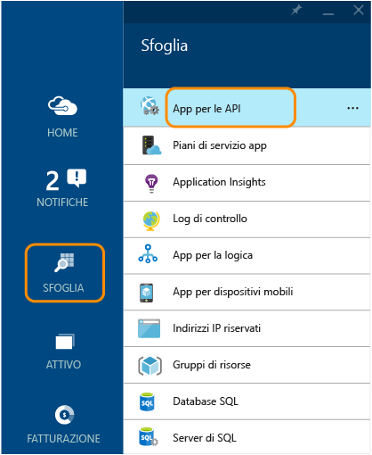

	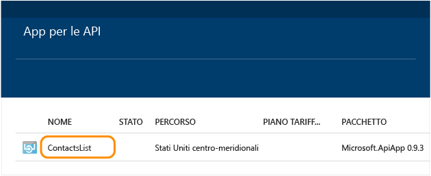

3. Nel pannello **App per le API** fare clic sull'**URL** per aprire una finestra del browser da cui chiamare l'app per le API.

	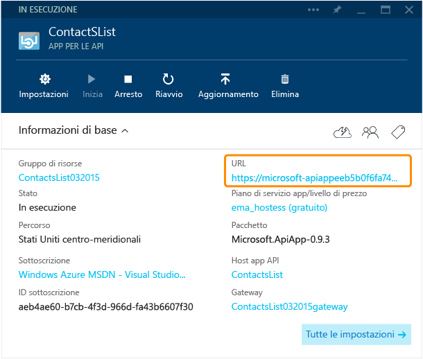

2. Aggiungere `/api/contacts/get/` all'URL nella barra degli indirizzi del browser.

	Ad esempio, se l'URL dell'app per le API è:

    	https://microsoft-apiappeeb5bdsasd744e188be7fa26f239bd4b.azurewebsites.net/

	L'URL completo sarà:

    	https://microsoft-apiappeeb5bdsasd744e188be7fa26f239bd4b.azurewebsites.net/api/contacts/get/

	Ogni browser gestisce le chiamate API in modo diverso. L'immagine mostra una chiamata riuscita da un browser Chrome.

	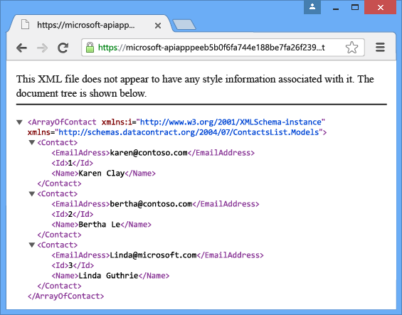

2. Salvare l'URL usato che dovrà essere usato di nuovo più avanti nell'esercitazione.

## Proteggere l'app per le API

L'app per le API è stata distribuita in un gruppo di risorse. È possibile aggiungere app Web e altre app per le API allo stesso gruppo di risorse e ogni app per le API del gruppo di risorse può avere una delle tre impostazioni di accessibilità seguenti: <!--todo: diagram showing different accessibility settings-->

- **Pubblico (anonimo)**: chiunque può chiamare l'app per le API dall'esterno del gruppo di risorse senza aver effettuato l'accesso.
- **Pubblico (autenticato)**: solo agli utenti autenticati è consentito chiamare l'app per le API dall'esterno del gruppo di risorse.
- **Interno**: solo alle altre app per le API o alle app Web dello stesso gruppo di risorse è consentito chiamare l'app per le API. Le chiamate dalle app Web vengono considerate esterne anche se le app Web si trovano nello stesso gruppo di risorse.

Quando Visual Studio ha creato automaticamente il gruppo di risorse, ha creato anche un *gateway*. Un gateway è una speciale app Web che gestisce tutte le richieste destinate alle app per le API del gruppo di risorse.

Quando si passa al pannello del gruppo di risorse nel [portale di anteprima di Azure], è possibile vedere l'app per le API e il gateway nel diagramma.

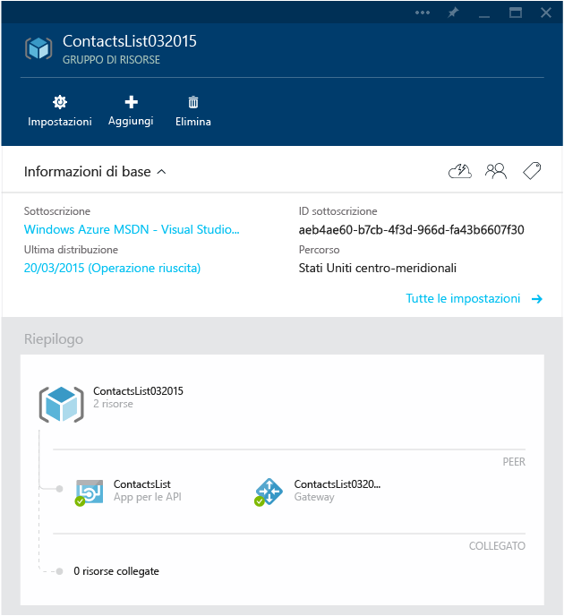

### Configurare l'app per le API in modo che richieda l'autenticazione

Per configurare l'app per le API in modo che accetti solo le richieste autenticate, sarà necessario impostarne l'accessibilità su **Pubblico (autenticato)** e configurare il gateway in modo che richieda l'autenticazione a un provider, ad esempio Azure Active Directory, Google o Facebook.

[AZURE.INCLUDE [app-service-api-config-auth](../../includes/app-service-api-config-auth.md)]

L'app per le API ora è protetta da accesso non autenticato. Ora è necessario configurare il gateway per specificare il provider di autenticazione da usare.

### Configurare il gateway per l'uso di un provider di autenticazione

[AZURE.INCLUDE [app-service-api-gateway-config-auth](../../includes/app-service-api-gateway-config-auth.md)]

## Verificare che l'autenticazione funzioni

**Nota:** in caso di problemi di accesso durante l'esecuzione dei passaggi seguenti, provare ad aprire una finestra privata o in incognito.
 
1. Aprire una finestra del browser e nella barra degli indirizzi immettere l'URL che chiama il metodo `Get` dell'app per le API, come in precedenza.

	Questa volta il tentativo di accedere all'app per le API restituisce un messaggio di errore.

	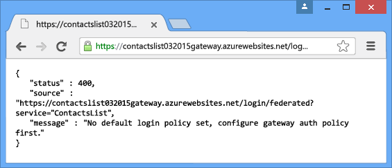

2. Nel browser passare all'URL di accesso. L'URL usa il modello seguente:

    	http://[gatewayurl]/login/[providername]

	È possibile ottenere l'URL del gateway dal pannello **Gateway** nel [portale di anteprima di Azure]. Per visualizzare il pannello **Gateway** fare clic sul gateway nel diagramma mostrato nel pannello **Gruppo di risorse**.

	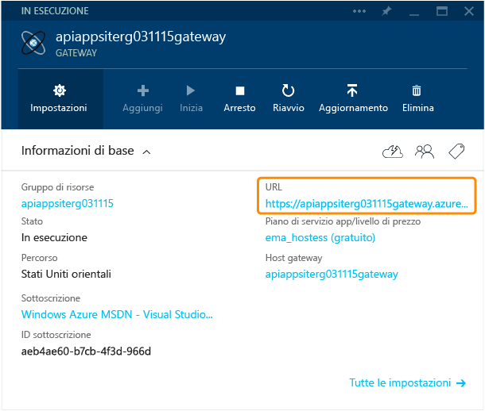

	[nome provider] deve essere costituito da uno dei valori seguenti:
	
	* "microsoftaccount"
	* "facebook"
	* "twitter"
	* "google"
	* "aad"

	Di seguito viene riportato un URL di accesso di esempio per Azure Active Directory:

		https://dropboxrgaeb4ae60b7cb4f3d966dfa43.azurewebsites.net/login/aad/

	Si noti che, a differenza dell'URL precedente, questo non include il nome dell'app per le API: il gateway sta autenticando l'utente e non l'app per le API. Il gateway gestisce l'autenticazione per tutte le app per le API del gruppo di risorse.

3. Immettere le credenziali quando il browser visualizza una pagina di accesso.
 
	Se è stato configurato l'accesso di Azure Active Directory, accedere come uno degli utenti elencati nella scheda **Utenti** per l'applicazione creata nella scheda Azure Active Directory del [portale di Azure], ad esempio admin@contoso.onmicrosoft.com.

	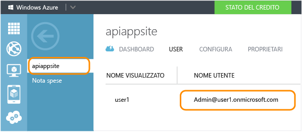

	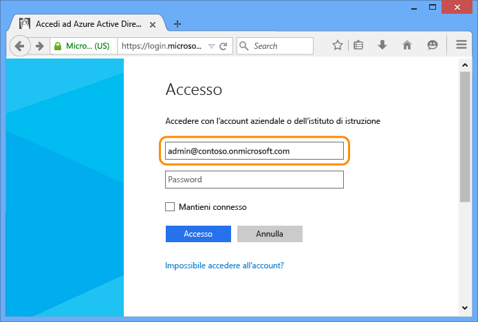

4. Quando appare un messaggio simile ad "Accesso completato", immettere di nuovo l'URL del metodo Get dell'app per le API.

	Questa volta l'utente è stato autenticato e quindi la chiamata riesce. Il gateway riconosce l'utente autenticato e passa la richiesta all'app per le API.

	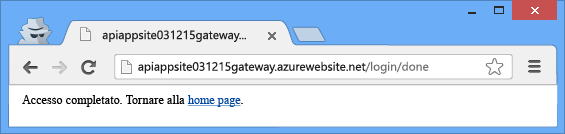

	

	Se è stata abilitata l'interfaccia utente di Swagger, ora si può anche andare alla pagina dell'interfaccia utente di Swagger. Tuttavia, verrà visualizzata un'icona di **ERRORE** rossa nell'angolo in basso a destra della pagina e, se si fa clic sull'icona, apparirà un messaggio che informa che non è possibile accedere al file JSON di Swagger. Infatti Swagger effettua una chiamata AJAX senza includere il token Zumo per cercare di recuperare il file JSON. Questo non impedisce alla pagina dell'interfaccia utente di Swagger di funzionare.

## Usare Postman per inviare una richiesta Post

Quando si accede al gateway, il gateway invia un token di autenticazione. Questo token deve essere incluso in tutte le richieste da origini esterne che passano attraverso il gateway. Quando si accede a un'API con un browser, il browser in genere archivia il token in un cookie e lo invia con tutte le chiamate successive all'API.

In questo modo è possibile vedere cosa accade in background. In questa sezione dell'esercitazione viene usato uno strumento del browser per creare e inviare una richiesta Post. Il token di autorizzazione viene ricevuto dal cookie e incluso in un'intestazione HTTP. Questa sezione è facoltativa: nella sezione precedente è stato già verificato che l'app per le API accetta solo l'accesso autenticato.

Queste istruzioni mostrano come usare lo strumento Postman nel browser Chrome, ma è possibile eseguire la stessa procedura con qualsiasi strumento client REST e strumento di sviluppo browser.

1. In una finestra del browser Chrome seguire i passaggi della sezione precedente per eseguire l'autenticazione e quindi aprire gli strumenti di sviluppo (F12).

	

3. Nella scheda **Resources** degli strumenti di sviluppo di Chrome trovare i cookie per il gateway e fare tre volte clic sul valore del cookie **x-zumo-auth** per selezionarne tutti gli elementi.

	**Nota:** assicurarsi di ottenere tutti i valori del cookie Se si fa doppio clic, è possibile che si ottenga solo la parte iniziale.

5. Fare clic con il pulsante destro del mouse sull'opzione **Value** del cookie **x-zumo-auth** e quindi scegliere **Copy**.

	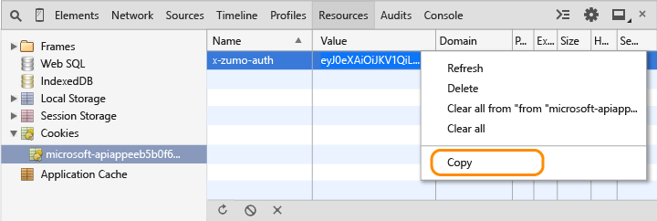

4. Installare l'estensione Postman nel browser Chrome, se non è ancora stata installata.

6. Aprire l'estensione Postman.

7. Nel campo Request URL immettere l'URL del metodo Get dell'app per le API usato in precedenza, ma omettere `get/` alla fine.
 
		http://[apiappurl]/api/contacts
    
8. Fare clic su **Headers** e quindi aggiungere un'intestazione *x-zumo-auth*. Incollare il valore del token dagli Appunti al campo **Value**.

9. Aggiungere un'intestazione *Content-Type* con il valore *application/json*.

10. Fare clic su **form-data** e quindi aggiungere una chiave *contact* con il valore seguente:

		{   "Id": 0,   "Name": "Li Yan",   "EmailAddress": "yan@contoso.com" }

11. Fare clic su Send.

	L'app per le API restituisce la risposta *201 Created*.

	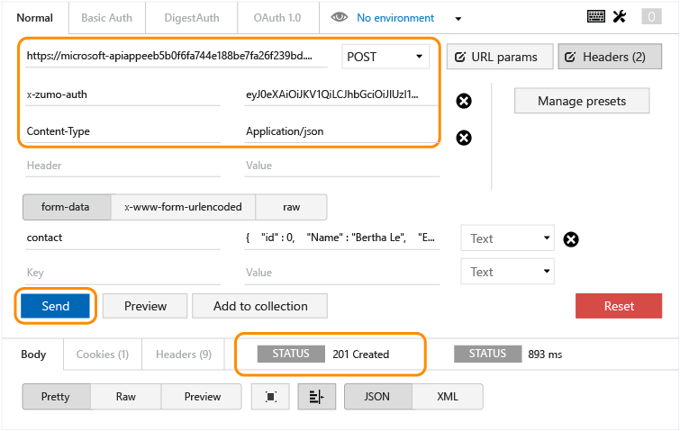

12. Per verificare che questa richiesta non può funzionare senza il token di autenticazione, eliminare l'intestazione dell'autenticazione e fare di nuovo clic su Send.

	Si ottiene una risposta *403 Forbidden*.

	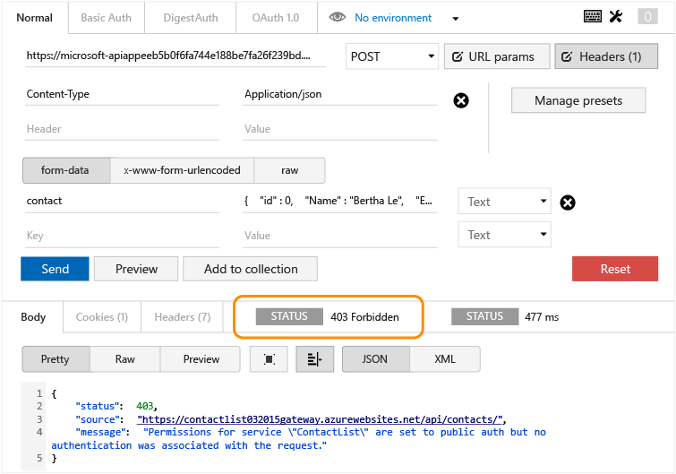

## Ottenere informazioni sull'utente connesso

Questa sezione illustra come modificare il codice nell'app per le API ContactsList in modo che recuperi e restituisca il nome e l'indirizzo di posta elettronica dell'utente connesso.

1. In Visual Studio aprire il progetto di app per le API distribuito in [Distribuire un'app per le API](app-service-dotnet-deploy-api-app.md) e chiamato nel corso di questa esercitazione.

3. Aprire il file apiapp.json e aggiungere una riga che indica che l'app per le API usa l'autenticazione di Azure Active Directory.

		"authentication": [{"type": "aad"}]

	Il file apiapp.json finale sarà simile all'esempio seguente:

		{
		    "$schema": "http://json-schema.org/schemas/2014-11-01/apiapp.json#",
		    "id": "ContactsList",
		    "namespace": "microsoft.com",
		    "gateway": "2015-01-14",
		    "version": "1.0.0",
		    "title": "ContactsList",
		    "summary": "",
		    "author": "",
		    "endpoints": {
		        "apiDefinition": "/swagger/docs/v1",
		        "status": null
		    },
		    "authentication": [{"type": "aad"}]
		}

	In questa esercitazione viene usato come esempio il provider Azure Active Directory. Per gli altri provider, sarà necessario usare l'identificatore appropriato. Di seguito sono indicati i valori validi per i provider:

	* "aad"
	* "microsoftaccount"
	* "google"
	* "twitter"
	* "facebook". 

2. Nel file *ContactsController.cs* sostituire il codice nel metodo `Get` con il codice seguente.

		var runtime = Runtime.FromAppSettings(Request);
		var user = runtime.CurrentUser;
		TokenResult token = await user.GetRawTokenAsync("aad");
		var name = (string)token.Claims["name"];
		var email = (string)token.Claims["http://schemas.xmlsoap.org/ws/2005/05/identity/claims/upn"];
		return new Contact[]
		{
		    new Contact { Id = 1, EmailAddress = email, Name = name }
		};

	Invece dei tre contatti di esempio, il codice restituisce le informazioni di contatto per l'utente connesso.

	Nel codice di esempio viene usato Azure Active Directory. Per gli altri provider sarà necessario usare il nome token e l'identificatore delle attestazioni appropriati, come indicato nel passaggio precedente.

	Per informazioni sulle attestazioni di Azure Active Directory disponibili, vedere [Tipi di attestazioni e token supportati](https://msdn.microsoft.com/library/dn195587.aspx).

3. Aggiungere un'istruzione using per `Microsoft.Azure.AppService.ApiApps.Service`.

		using Microsoft.Azure.AppService.ApiApps.Service;

3. Distribuire di nuovo il progetto.

	Visual Studio riproporrà le impostazioni usate per la distribuzione del progetto durante l'esercitazione sulla [distribuzione](app-service-dotnet-deploy-api-app.md). Fare clic con il pulsante destro del mouse sul progetto, scegliere **Pubblica** e quindi fare clic su **Pubblica** nella finestra di dialogo **Pubblica sul Web**.

6. Seguire la procedura svolta in precedenza per inviare una richiesta GET all'app per le API protetta.

	Il messaggio di risposta mostra il nome e l'ID dell'identità usata per l'accesso.

	

## Passaggi successivi

È stato appreso come proteggere un'app per le API di Azure richiedendo l'autenticazione di Azure Active Directory o del provider di servizi di social networking. Per altre informazioni, vedere [Autenticazione per app per le API e per dispositivi mobili](../app-service/app-service-authentication-overview.md).

[portale di Azure]: https://manage.windowsazure.com/
[portale di anteprima di Azure]: https://portal.azure.com/

<!---HONumber=July15_HO3-->