<properties
	pageTitle="Introduzione alle app per le API e ad ASP.NET nel servizio app di Azure | Microsoft Azure"
	description="Informazioni su come creare un'app per le API ASP.NET nel servizio app di Azure con Visual Studio 2015."
	services="app-service\api"
	documentationCenter=".net"
	authors="tdykstra"
	manager="wpickett"
	editor=""/>

<tags
	ms.service="app-service-api"
	ms.workload="na"
	ms.tgt_pltfrm="dotnet"
	ms.devlang="na"
	ms.topic="hero-article"
	ms.date="03/09/2016"
	ms.author="tdykstra"/>

# Introduzione alle app per le API e ad ASP.NET nel servizio app di Azure

[AZURE.INCLUDE [selettore](../../includes/app-service-api-get-started-selector.md)]

## Panoramica

Questa è la prima di una serie di esercitazioni che illustrano come usare le funzionalità del servizio app di Azure utili per lo sviluppo e l'hosting di API:

* Supporto integrato per i metadati dell'API
* Supporto CORS
* Supporto per l'autenticazione e l'autorizzazione

Verrà distribuita un'applicazione di esempio a due [app per le API](app-service-api-apps-why-best-platform.md) e a un'app Web nel servizio app di Azure. L'applicazione di esempio è un elenco di attività con un front-end costituito da un'applicazione a singola pagina AngularJS, un livello intermedio API Web ASP.NET e un livello dati API Web ASP.NET, come illustrato nel diagramma.

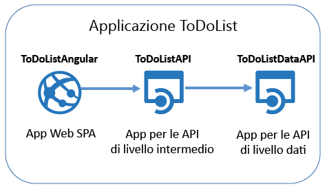

Di seguito è riportata una schermata del front-end applicazione a singola pagina.

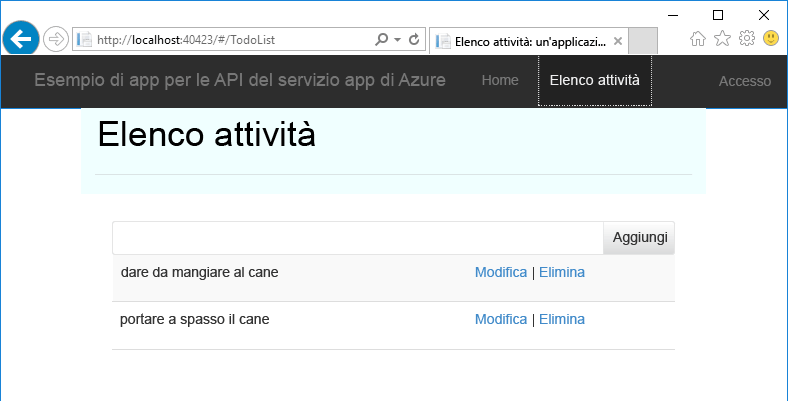

Al termine di questa esercitazione, le due API Web saranno in esecuzione tra le app per le API del servizio app. Dopo aver completato l'esercitazione seguente, l'intera applicazione sarà in esecuzione nel cloud, con l'applicazione a singola pagina in un'app Web del servizio app. Nelle esercitazioni successive verranno aggiunte l'autenticazione e l'autorizzazione.

## Contenuto dell'esercitazione

In questa esercitazione si apprenderà come:

* Utilizzare le app per le API e le app Web nel servizio app di Azure usando gli strumenti incorporati in Visual Studio 2015.
* Automatizzare l'individuazione di API tramite il pacchetto NuGet Swashbuckle per generare in modo dinamico il file JSON di definizione dell'API Swagger.
* Usare codice client generato automaticamente per utilizzare un'app per le API da un client .NET.
* Usare il portale di Azure per configurare l'endpoint per i metadati dell'app per le API.

## Prerequisiti

[AZURE.INCLUDE [prerequisites](../../includes/app-service-api-dotnet-get-started-prereqs.md)]

## Scaricare l'applicazione di esempio 

1. Scaricare il repository [Azure-Samples/app-service-api-dotnet-to-do-list](https://github.com/Azure-Samples/app-service-api-dotnet-todo-list).

	È possibile fare clic sul pulsante **Download ZIP** o clonare il repository nel computer locale.

2. Aprire la soluzione ToDoList in Visual Studio 2015 o 2013.

	La soluzione di Visual Studio è un'applicazione di esempio che usa attività semplici costituite da una descrizione e un proprietario.

		public class ToDoItem 
		{ 
		    public int ID { get; set; } 
		    public string Description { get; set; } 
		    public string Owner { get; set; } 
		} 
 
	La soluzione contiene tre progetti:

	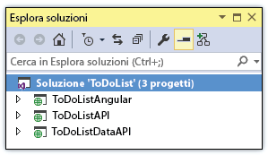

	* **ToDoListAngular**: front-end. Un'applicazione a singola pagina AngularJS che chiama il livello intermedio. 

	* **ToDoListAPI**: livello intermedio. Un progetto API Web ASP.NET che chiama il livello dati per eseguire operazioni CRUD sulle attività.

	* **ToDoListDataAPI**: livello dati. Un progetto API Web ASP.NET che esegue operazioni CRUD sulle attività. Le attività sono archiviate in memoria, ciò significa che ogni volta che l'applicazione viene riavviata tutte le modifiche vengono perse.

	Il livello intermedio fornisce l'ID utente nel campo `Owner` durante la chiamata al livello dati. Nel codice scaricato, l'ID utente è sempre "*". Aggiungendo l'autenticazione nelle esercitazioni successive, il livello intermedio fornirà l'ID utente effettivo al livello dati.

2. Compilare la soluzione per ripristinare i pacchetti NuGet.

### Eseguire l'applicazione in locale (facoltativo)

In questa sezione si verificare di poter eseguire il client localmente e chiamare l'API mentre è anch'essa in esecuzione in locale.

**Nota:** queste istruzioni sono valide per i browser Internet Explorer ed Edge che consentono le chiamate JavaScript multiorigine da e verso gli URL `http://localhost`. Se si usa Chrome, avviare il browser con l'opzione `--disable-web-security`. Se si usa Firefox, saltare questa sezione.

1. Impostare i tre progetti come progetti di avvio, partendo da ToDoListDataAPI, quindi ToDoListAPI e infine ToDoListAngular. In **Esplora soluzioni** fare clic con il pulsante destro del mouse sulla soluzione, scegliere **Proprietà**, selezionare **Progetti di avvio multipli**, mettere i progetti nell'ordine corretto e impostare **Azione** su **Avvio** per ogni progetto.  

2. Premere F5 per avviare i progetti.

	Vengono aperte tre finestre del browser. Due finestre del browser mostrano pagine di errore HTTP 403 (esplorazione directory non consentita), come è normale per i progetti API Web. La terza finestra del browser mostra l'interfaccia utente di AngularJS.

3. Nella finestra del browser che mostra l'interfaccia utente di AngularJS fare clic sulla scheda **Todo List**.

	L'interfaccia utente mostra due attività predefinite.

	

4. Aggiungere, modificare ed eliminare attività per provare il funzionamento dell'applicazione.

	Le modifiche apportate vengono archiviate nella memoria e vengono perse quando si riavvia l'applicazione.

3. Chiudere le finestre del browser.

## Usare l'interfaccia utente e i metadati di Swagger

Il supporto per i metadati dell'API [Swagger](http://swagger.io/) 2.0 è integrato nel servizio app di Azure. Ogni app per le API specifica un endpoint dell'URL che restituisce i metadati per l'API in formato JSON Swagger. I metadati restituiti da tale endpoint possono essere usati per generare codice client.

Un progetto API Web ASP.NET può generare in modo dinamico i metadati di Swagger usando il pacchetto NuGet [Swashbuckle](https://www.nuget.org/packages/Swashbuckle). Il pacchetto NuGet Swashbuckle è già installato in ToDoListDataAPI e nei progetto ToDoListAPI scaricati.

In questa sezione dell'esercitazione si esaminano i metadati di Swagger 2.0 generati e quindi si prova un'interfaccia utente di test basata sui metadati di Swagger.

2. Impostare il progetto ToDoListDataAPI come progetto di avvio. 
 
4. Premere F5 per eseguire l'applicazione in modalità debug.

	Verrà aperto il browser alla pagina di errore HTTP 403.

12. Nella barra degli indirizzi del browser aggiungere `swagger/docs/v1` alla fine della riga e quindi premere INVIO. L'URL sarà `http://localhost:45914/swagger/docs/v1`.

	Questo è l'URL predefinito usato da Swashbuckle per restituire i metadati JSON di Swagger 2.0 per l'API.

	Se si usa Internet Explorer, il browser richiede di scaricare un file *v1.json*.

	

	Se si usa Chrome, Firefox o Edge, il browser visualizza il codice JSON nella finestra del browser.

	

	L'esempio seguente illustra la prima sezione dei metadati di Swagger per l'API, con la definizione per il metodo Get. Questi metadati sono alla base dell'interfaccia utente di Swagger che si useranno nei passaggi seguenti. Si useranno anche in una sezione successiva dell'esercitazione per generare automaticamente il codice client.

		{
		  "swagger": "2.0",
		  "info": {
		    "version": "v1",
		    "title": "ToDoListDataAPI"
		  },
		  "host": "localhost:45914",
		  "schemes": [ "http" ],
		  "paths": {
		    "/api/ToDoList": {
		      "get": {
		        "tags": [ "ToDoList" ],
		        "operationId": "ToDoList_GetByOwner",
		        "consumes": [ ],
		        "produces": [ "application/json", "text/json", "application/xml", "text/xml" ],
		        "parameters": [
		          {
		            "name": "owner",
		            "in": "query",
		            "required": true,
		            "type": "string"
		          }
		        ],
		        "responses": {
		          "200": {
		            "description": "OK",
		            "schema": {
		              "type": "array",
		              "items": { "$ref": "#/definitions/ToDoItem" }
		            }
		          }
		        },
		        "deprecated": false
		      },

1. Chiudere il browser.

3. Nel progetto ToDoListDataAPI in **Esplora soluzioni** aprire il file *App\_Start\\SwaggerConfig.cs*, quindi scorrere in basso fino al codice seguente e rimuovere il commento.

		/*
		    })
		.EnableSwaggerUi(c =>
		    {
		*/

	Il file *SwaggerConfig.cs* viene creato quando si installa il pacchetto Swashbuckle in un progetto. Il file fornisce una serie di modi per configurare Swashbuckle.

	Il codice in cui sono stati rimossi i commenti abilita l'interfaccia utente di Swagger che si userà nei passaggi seguenti. Quando si crea un progetto API Web con il modello di progetto app per le API, questo codice è impostato come commento per impostazione predefinita come misura di sicurezza.

5. Eseguire di nuovo il progetto.

3. Nella barra degli indirizzi del browser aggiungere `swagger` alla fine della riga e quindi premere INVIO. L'URL sarà `http://localhost:45914/swagger`.

4. Quando viene visualizzata la pagina dell'interfaccia utente di Swagger fare clic su **ToDoList** per visualizzare i metodi disponibili.

	

5. Fare clic su **GET**.

6. Immettere un asterisco come valore del parametro `owner` e quindi fare clic su **Try it out**.

	

	L'interfaccia utente di Swagger chiama il metodo Get ToDoList e visualizza il codice di risposta e i risultati JSON.

	

6. Fare clic su **Post** e quindi fare clic sulla casella sotto **Model Schema**.

	Selezionando lo schema del modello viene precompilata automaticamente la casella di input in cui è possibile specificare il valore del parametro per il metodo Post. Se questo non funziona in Internet Explorer, usare un browser diverso o immettere manualmente il valore del parametro nel passaggio successivo.

	

7. Modificare lo script JSON nella casella di input del parametro `contact`, in modo che appaia come l'esempio seguente, oppure sostituire con il proprio testo descrittivo:

		{
		  "ID": 2,
		  "Description": "buy the dog a toy",
		  "Owner": "*"
		}

10. Fare clic su **Try it out**.

	L'API ToDoList restituisce un codice di risposta HTTP 204 che indica l'esito positivo.

11. Fare clic su **Get > Try it out**.

	La risposta al metodo Get ora include la nuova attività.

12. Provare anche i metodi Put, Delete e Get by ID.

14. Chiudere il browser.

Swashbuckle funziona con qualsiasi progetto API Web ASP.NET. Se si vuole aggiungere la generazione metadati di Swagger a un progetto esistente, è sufficiente installare il pacchetto Swashbuckle.

**Note:** i metadati di Swagger includono un ID univoco per ogni operazione API. Per impostazione predefinita, Swashbuckle può generare ID operazione di Swagger duplicati per i metodi del controller dell'API Web. Ciò si verifica se il controller presenta metodi di overload HTTP, ad esempio `Get()` e `Get(id)`. Per informazioni su come gestire gli overload, vedere [Personalizzare le definizioni delle API generate da Swashbuckle](app-service-api-dotnet-swashbuckle-customize.md). Se si crea un progetto di API Web in Visual Studio usando il modello App per le API di Azure, al file *SwaggerConfig.cs* viene aggiunto automaticamente codice che genera ID operazione univoci.

## Creare un'app per le API in Azure e distribuire il progetto ToDoListAPI nell'app

In questa sezione si usano gli strumenti di Azure integrati nella procedura guidata **Pubblica sito Web** di Visual Studio per creare una nuova app per le API in Azure. Si distribuisce quindi il progetto ToDoListDataAPI nella nuova app per le API e si chiama l'API eseguendo di nuovo l'interfaccia utente di Swagger, questa volta mentre è in esecuzione nel cloud.

1. In **Esplora soluzioni** fare clic con il pulsante destro del mouse sul progetto ToDoListDataAPI e quindi scegliere **Pubblica**.

	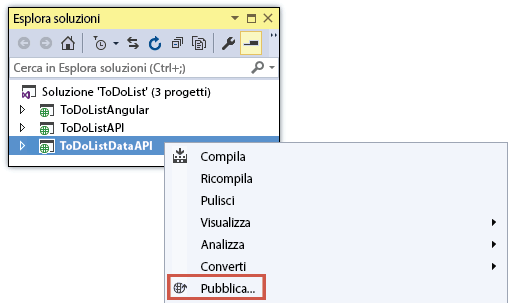

3.  Nel passaggio **Profilo** della procedura guidata **Pubblica sito Web** fare clic su **Servizio app di Microsoft Azure**.

	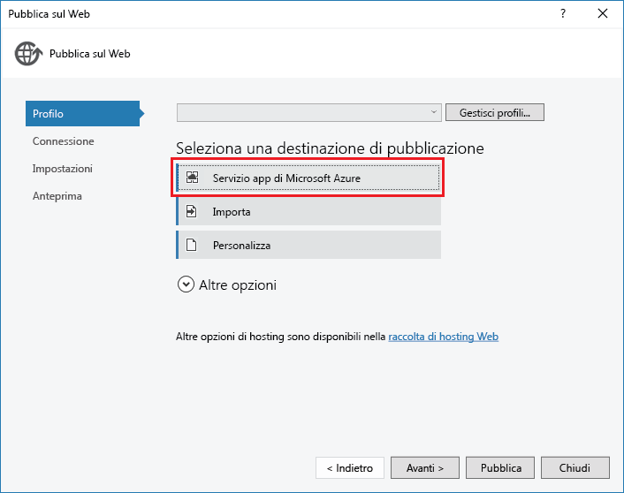

4. Accedere al proprio account Azure, se non è già stato fatto, o aggiornare le credenziali se sono scadute.

4. Nella finestra di dialogo del servizio app, scegliere la **sottoscrizione** di Azure da usare e quindi fare clic su **Nuovo**.

	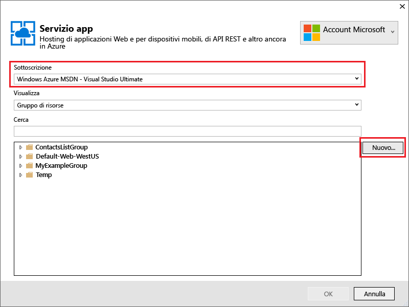

	Viene visualizzata la scheda **Hosting** della finestra di dialogo **Crea servizio app**.

	Poiché si sta distribuendo un progetto API Web con Swashbuckle installato, Visual Studio presuppone che si voglia creare un'app per le API come è indicato dal titolo **Nome app per le API** e dal fatto che l'elenco a discesa **Modifica tipo** sia impostato su **App per le API**.

	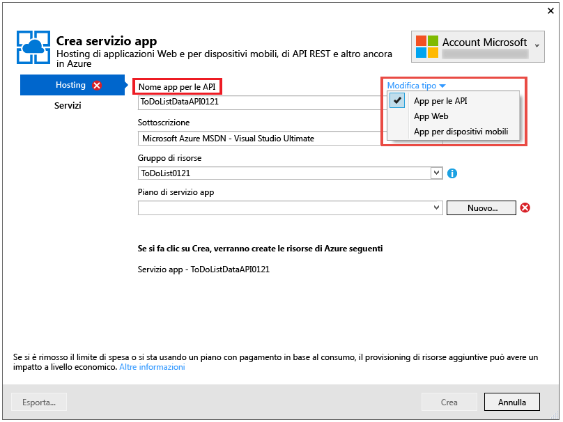

	 Le funzionalità disponibili per la nuova app per le API, app Web o app per dispositivi mobili non sono determinate dal tipo di app. Tutte le funzionalità dell'app per le API illustrate in questa esercitazione sono disponibili per tutti e tre i tipi. La sola differenza è data dell'icona e dal testo visualizzati nel portale di Azure per identificare il tipo di app e l'ordine in cui le funzionalità vengono elencate in alcune pagine nel portale. Il portale di Azure verrà illustrato più avanti nell'esercitazione. Si tratta di un'interfaccia Web per la gestione delle risorse di Azure.

	Per queste esercitazioni il front-end dell'applicazione a singola pagina è in esecuzione in un'app Web e ogni back-end dell'API Web è in esecuzione in un'app per le API, ma sarebbe esattamente lo stesso se si trattasse di tre app Web o di tre app per le API. Una singola app per le API o app Web può anche ospitare sia il front-end dell'applicazione a singola pagina che il back-end di livello intermedio.

4. Immettere un **Nome app per le API** univoco nel dominio *azurewebsites.net*, ad esempio ToDoListDataAPI più un numero che lo renda univoco.

	Visual Studio propone un nome univoco aggiungendo una stringa di data e ora al nome del progetto. Se si preferisce, è possibile accettare questo nome.

	Se si immette un nome già usato da un altro utente, a destra, invece di un segno di spunta verde, verrà visualizzato un punto esclamativo rosso e sarà necessario specificare un nome diverso.

	Azure utilizzerà questo nome come prefisso per l'URL dell'applicazione. L'URL completo sarà costituito da questo nome e da *.azurewebsites.net*. Ad esempio, se il nome del sito è `ToDoListDataAPI`, l'URL sarà `todolistdataapi.azurewebsites.net`.

6. Nell'elenco a discesa **Gruppo di risorse** fare clic su **Nuovo** e quindi immettere "ToDoListGroup" o un altro nome, se si preferisce.

	Un gruppo di risorse è una raccolta di risorse di Azure, ad esempio app per le api, database, VM e così via. Per questa esercitazione è consigliabile creare un nuovo gruppo di risorse, per eliminare facilmente tutte le risorse di Azure create per l'esercitazione in un unico passaggio.

	Questa casella consente di selezionare un [gruppo di risorse](../azure-portal/resource-group-portal.md) esistente o crearne uno nuovo digitando un nome diverso da qualsiasi gruppo di risorse esistente nella sottoscrizione.

4. Fare clic sul pulsante **Nuovo** accanto all'elenco a discesa **Piano di servizio app**.

	Lo screenshot mostra i valori di esempio per **Nome app per le API**, **Sottoscrizione** e **Gruppo di risorse**. I valori dell'utente saranno diversi.

	

	Nei passaggi seguenti si crea un piano di servizio app per il nuovo gruppo di risorse. Un piano di servizio app specifica le risorse di calcolo in cui viene eseguita l'app per le API. Se, ad esempio, si sceglie il livello gratuito, l'app per le API viene eseguita in VM condivise, mentre con alcuni livelli a pagamento viene eseguita in VM dedicate. Per altre informazioni sui piani di servizio app, vedere [Panoramica approfondita dei piani del servizio app di Azure](../app-service/azure-web-sites-web-hosting-plans-in-depth-overview.md).

5. Nella finestra di dialogo **Configura piano di servizio app** immettere "ToDoListPlan" o un altro nome, se si preferisce.

5. Nell'elenco a discesa **Località** scegliere la località più vicina.

	Questa impostazione specifica il data center di Azure in cui verrà eseguita l'app. Per questa esercitazione, è possibile selezionare qualsiasi area senza riscontrare differenze evidenti, ma per un'app di produzione è consigliabile che il server sia il più vicino possibile ai client che accedono al server per ridurre al minimo la [latenza](http://www.bing.com/search?q=web%20latency%20introduction&qs=n&form=QBRE&pq=web%20latency%20introduction&sc=1-24&sp=-1&sk=&cvid=eefff99dfc864d25a75a83740f1e0090).

5. Nell'elenco a discesa **Dimensioni** fare clic su **Gratuito**.

	Per questa esercitazione il piano tariffario gratuito fornirà prestazioni sufficienti.

6. Nella finestra di dialogo **Configura piano di servizio app** fare clic su **OK**.

	

7. Nella finestra di dialogo **Crea servizio App** fare clic su **Crea**.

	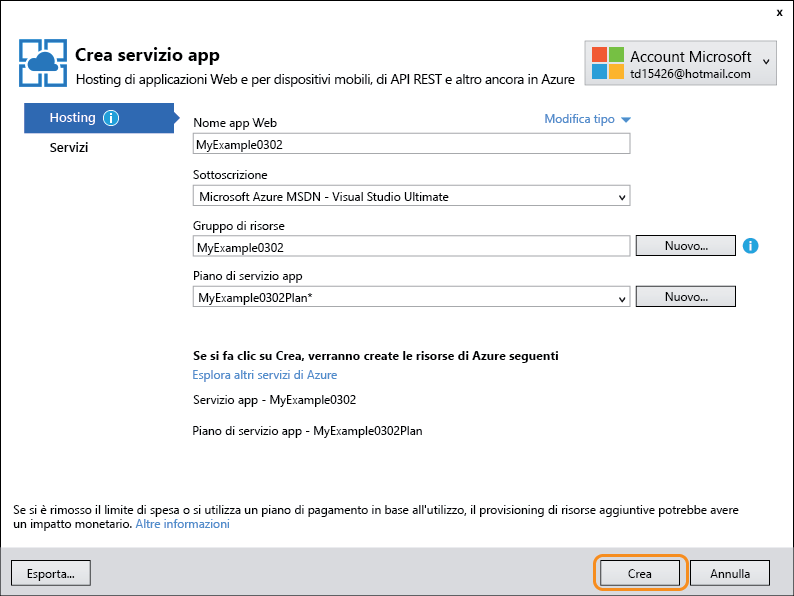

	Visual Studio crea l'app per le API.

	**Nota:** esistono altri modi per creare app per le API nel servizio app di Azure. In Visual Studio, ad esempio, quando si crea un nuovo progetto, è possibile creare risorse di Azure esattamente come è stato fatto per un progetto esistente. È anche possibile creare app per le API usando il [portale di Azure](https://portal.azure.com/), i [cmdlet di Azure per Windows PowerShell](../powershell-install-configure.md) o l'[interfaccia della riga di comando multipiattaforma](../xplat-cli.md).

	Quando Visual Studio termina la creazione dell'app per le API, crea un profilo di pubblicazione che include tutte le impostazioni necessarie per la nuova app per le API. Nei passaggi seguenti usare il nuovo profilo di pubblicazione per distribuire il progetto.

8. Nella scheda **Connessione** della procedura guidata **Pubblica sul Web** fare clic su **Avanti**.

	Ora sarebbe anche possibile andare avanti e fare clic su **Pubblica** per distribuire immediatamente il progetto nella nuova app per le API, ma ai fini dell'esercitazione si esamineranno le altre schede di questa finestra di dialogo per conoscere quali operazioni è possibile eseguire.

	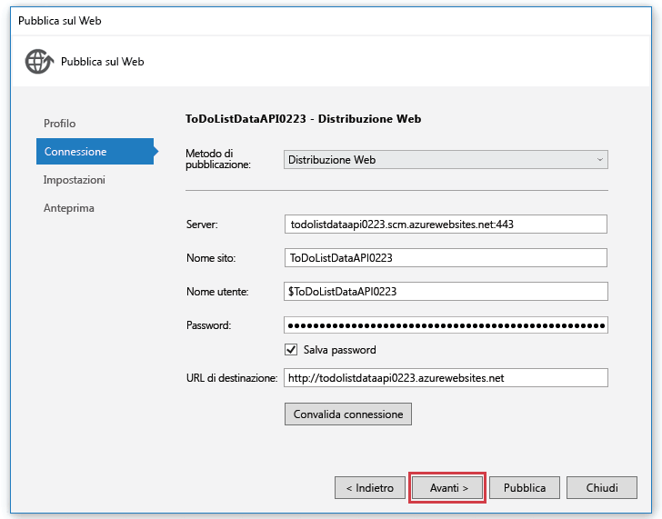

	La scheda successiva è **Impostazioni**, dove è possibile modificare la configurazione della build per distribuire una build di debug per il [debug remoto](../app-service-web/web-sites-dotnet-troubleshoot-visual-studio.md#remotedebug). La scheda include anche alcune **Opzioni pubblicazione file**:

	* Rimuovi i file aggiuntivi nella destinazione
	* Precompila durante la pubblicazione
	* Escludi file dalla cartella App\_Data

	Per questa esercitazione non ne è necessaria nessuna. Per una descrizione dettagliata del funzionamento di queste opzioni, vedere [Procedura: Distribuire un progetto di applicazione Web tramite la pubblicazione con un clic in Visual Studio](https://msdn.microsoft.com/library/dd465337.aspx).

14. Fare clic su **Avanti**.

	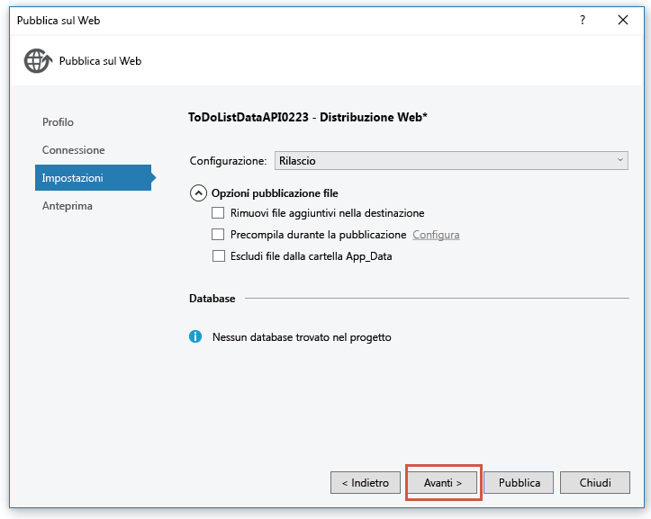

	La scheda **Anteprima** consente di visualizzare quali file verranno copiati dal progetto all'app per le API. Quando si distribuisce un progetto in un'app per le API che è già stato distribuito prima, vengono copiati solo i file modificati. Per visualizzare un elenco di quelli che verranno copiati, è possibile fare clic sul pulsante **Avvia anteprima**.

15. Fare clic su **Pubblica**.

	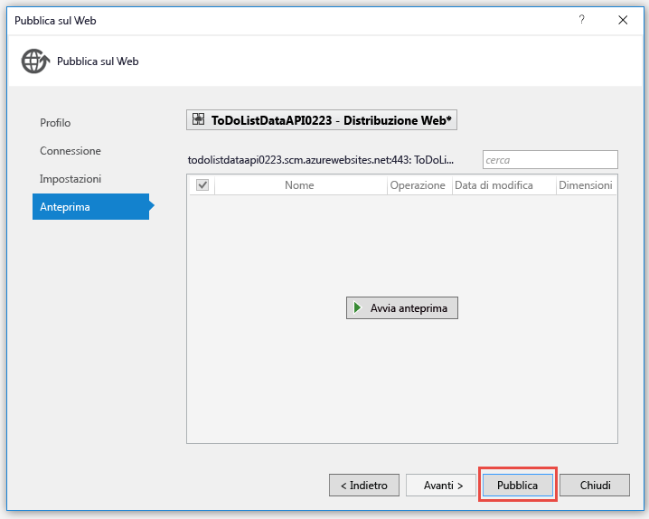

	Visual Studio distribuisce il progetto ToDoListDataAPI nella nuova app per le API. La finestra **Output** registra la distribuzione riuscita e una pagina indicante che la creazione è avvenuta correttamente viene visualizzata in una finestra del browser aperta nell'URL dell'app per le API.

	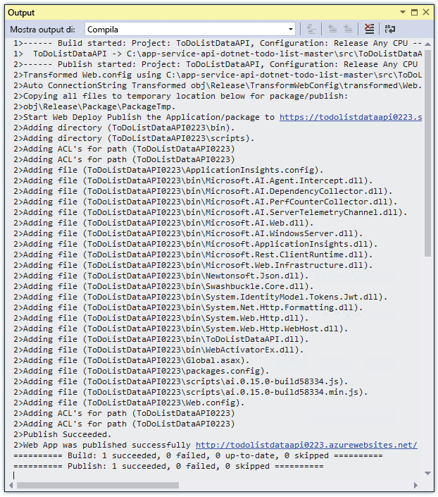

	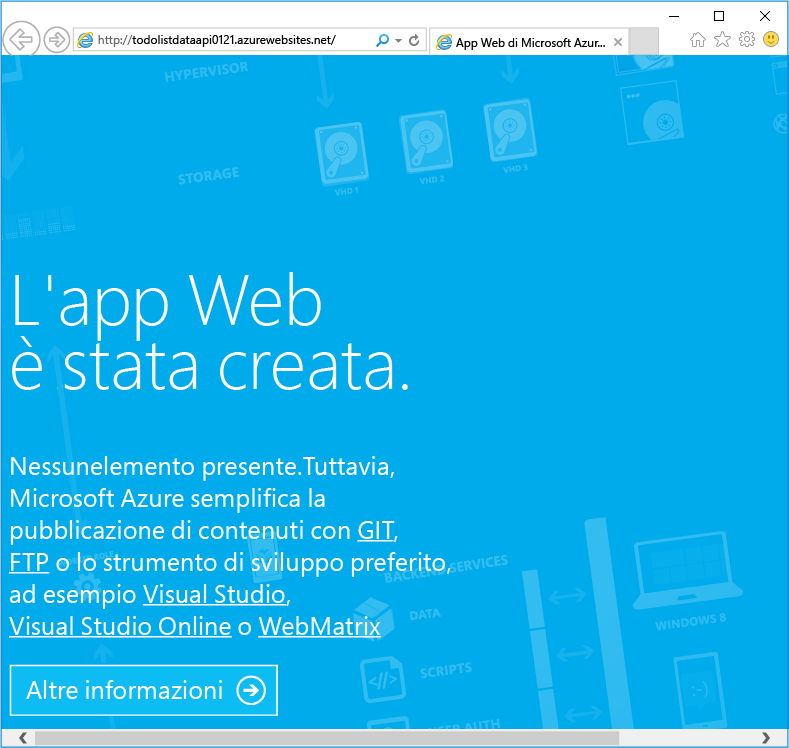

11. Nella barra degli indirizzi del browser aggiungere "swagger" all'URL e quindi premere INVIO. L'URL sarà `http://{apiappname}.azurewebsites.net/swagger`.

	Il browser visualizza la stessa interfaccia utente di Swagger mostrata in precedenza, ma ora viene eseguita nel cloud. Se si prova a usare il metodo Get si noterà che le due attività sono di nuovo quelle predefinite, perché le modifiche apportate in precedenza sono state salvate in memoria nel computer locale.

12. Aprire il [portale di Azure](https://portal.azure.com/).

	Il portale di Azure è un'interfaccia Web per la gestione delle risorse di Azure, ad esempio le app per le API.
 
14. Fare clic su **Sfoglia > Servizi app**.

	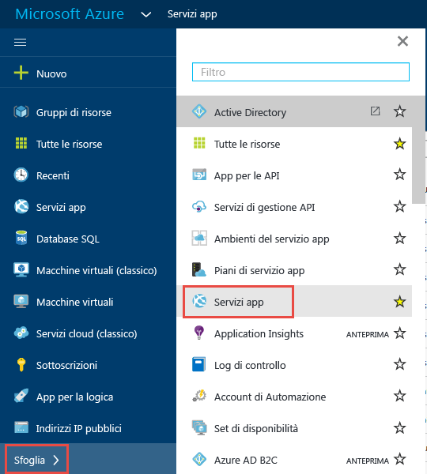

15. Nel pannello **Servizi app** trovare e fare clic sulla nuova app per le API. Nel portale di Azure le finestre che si aprono sulla destra vengono chiamate *pannelli*.

	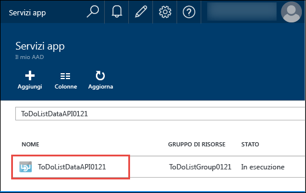

	Vengono aperti due pannelli, uno con una panoramica dell'app per le API e uno con un lungo elenco di impostazioni che è possibile visualizzare e modificare.

16. Nel pannello **Impostazioni** trovare la sezione **API** e fare clic su **Definizione API**.

	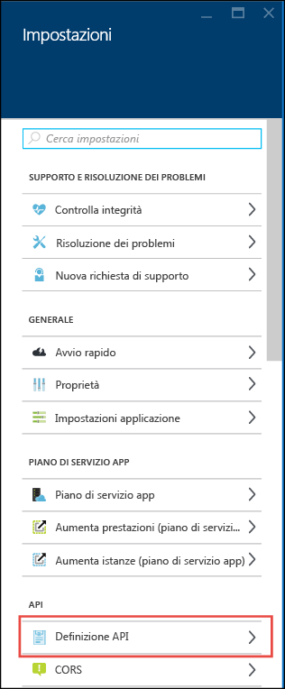

	Il pannello **Definizione API** consente di specificare l'URL che restituisce i metadati di Swagger 2.0 in formato JSON. Quando Visual Studio crea l'app per le API, imposta l'URL di definizione dell'API sul valore predefinito per i metadati generati da Swashbuckle visualizzati in precedenza, ovvero l'URL di base dell'app per le API più `/swagger/docs/v1`.

	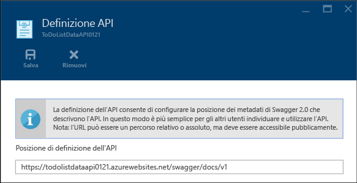

	Quando si seleziona un'app per le API per generare il relativo codice client, Visual Studio recupera i metadati dall'URL.

##  Utilizzare l'app per le API usando un codice client generato

Uno dei vantaggi dell'integrazione di Swagger nelle app per le API di Azure è la generazione automatica del codice. Le classi client generate semplificano la scrittura del codice che chiama un'app per le API.

Questa sezione illustra come utilizzare un'app per le API dal codice di un'API Web ASP.NET.

### Generare il codice client

È possibile generare il codice client per un'app per le API tramite Visual Studio o dalla riga di comando. Per questa esercitazione si userà Visual Studio. Per informazioni su come eseguire questa operazione dalla riga di comando, vedere il file Leggimi del repository [Azure/autorest](https://github.com/azure/autorest) in GitHub.com.

Il progetto ToDoListAPI include già il codice client generato, ma è necessario eliminarlo e rigenerarlo per sapere come è fatto.

1. In **Esplora soluzioni** di Visual Studio nel progetto ToDoListAPI eliminare la cartella *ToDoListDataAPI*.

	Questa cartella è stata creata con il processo di generazione di codice illustrato di seguito.

	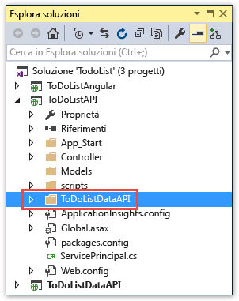

2. Fare clic con il pulsante destro del mouse sul progetto ToDoListAPI e quindi scegliere **Aggiungi > Client dell'API REST**.

	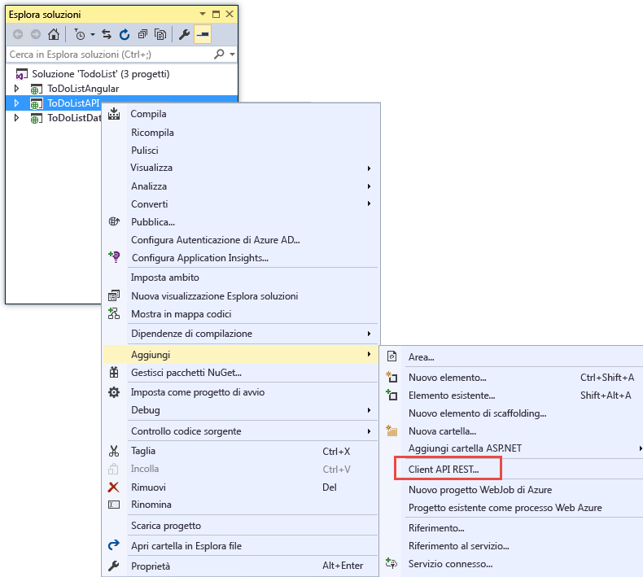

3. Nella finestra di dialogo **Aggiungi il client dell'API REST** fare clic su **URL Swagger** e quindi su **Seleziona asset di Azure**.

	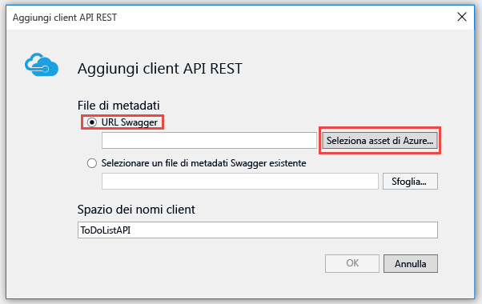

8. Nella finestra di dialogo **Servizio app** espandere il gruppo di risorse usato per questa esercitazione, selezionare l'app per le API e quindi fare clic su **OK**.

	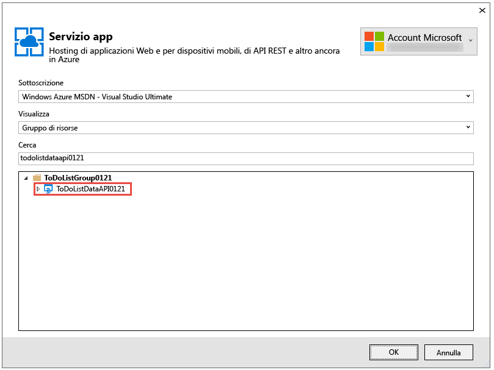

	Questa finestra di dialogo offre più modi per organizzare le app per le API nell'elenco, nel caso ne siano presenti troppe da scorrere. Consente anche di immettere una stringa di ricerca per filtrare le app per le API per nome.

	Quando si torna alla finestra di dialogo **Aggiungi client API REST**, la casella di testo risulta già compilata con il valore dell'URL di definizione dell'API visualizzato in precedenza nel portale.

	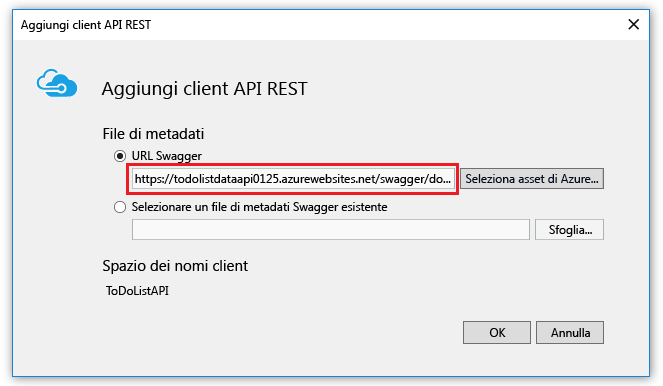

	Un modo alternativo per ottenere i metadati per la generazione del codice consiste nell'immettere l'URL direttamente invece che tramite la finestra di dialogo Sfoglia. Un'alternativa consiste nell'usare l'opzione **Selezionare un file di metadati Swagger esistente**. Ad esempio, per generare il codice client prima di distribuirlo in Azure, è possibile eseguire il progetto API Web in locale, andare all'URL che fornisce il file JSON per Swagger, salvare il file e selezionarlo qui.

9. Nella finestra di dialogo **Aggiungi client API REST** fare clic su **OK**.

	Visual Studio crea una cartella con il nome dell'app per le API e genera classi client.

	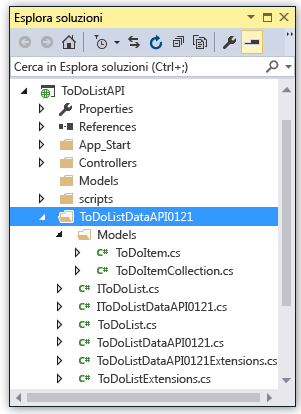

5. Nel progetto ToDoListAPI aprire *Controllers\\ToDoListController.cs* per visualizzare il codice che chiama l'API usando il client generato.

	Il frammento seguente illustra come il codice crea un'istanza dell'oggetto client e chiama il metodo Get.

		private ToDoListDataAPI db = new ToDoListDataAPI(new Uri(ConfigurationManager.AppSettings["toDoListDataAPIURL"]));
		
		public ActionResult Index()
		{
		    return View(db.Contacts.Get());
		}

	Il parametro del costruttore ottiene l'URL dell'endpoint dall'impostazione `toDoListDataAPIURL` dell'app. Nel file Web.config questo valore è impostato sull'URL di IIS Express locale del progetto API per consentire l'esecuzione dell'applicazione in locale. Se si omette il parametro del costruttore, l'endpoint predefinito sarà l'URL da cui è stato generato il codice.

6. La classe del client verrà generata con un nome diverso basato sul nome dell'app per le API. Modificare il codice in *Controllers\\ToDoListController.cs* in modo che il nome del tipo corrisponda a quanto generato nel progetto. Ad esempio, se l'app per le API è stata denominata ToDoListDataAPI0121, il codice sarà simile all'esempio seguente:

		private ToDoListDataAPI0121 db = new ToDoListDataAPI0121(new Uri(ConfigurationManager.AppSettings["toDoListDataAPIURL"]));
		
		public ActionResult Index()
		{
		    return View(db.Contacts.Get());
		}

### Creare un'app per le API per ospitare il livello intermedio

1. In **Esplora soluzioni** fare clic con il pulsante destro del mouse sul progetto ToDoListAPI (non su ToDoListDataAPI) e quindi scegliere **Pubblica**.

3.  Nella scheda **Profilo** della procedura guidata **Pubblica sito Web** fare clic su **Servizio app di Microsoft Azure**.

5. Nella finestra di dialogo **Servizio App** fare clic su **Nuovo**.

3. Nella scheda **Hosting** della finestra di dialogo **Crea servizio app** immettere un **Nome app per le API** che sia univoco nel dominio *azurewebsites.net*.

5. Scegliere la **Sottoscrizione** di Azure da usare.

6. Nell'elenco a discesa **Gruppo di risorse** selezionare il nome del gruppo di risorse creato in precedenza.

4. Nell'elenco a discesa **Piano di servizio app** scegliere lo stesso piano creato in precedenza. Tale valore sarà l'impostazione predefinita.

7. Fare clic su **Create**.

	Visual Studio crea l'app per le API, crea un profilo di pubblicazione per l'app e visualizza il passaggio **Connessione** della procedura guidata **Pubblica sito Web**.

3.  Nel passaggio **Connessione** della procedura guidata **Pubblica sito Web** fare clic su **Pubblica**.

	Visual Studio distribuisce il progetto ToDoListAPI nella nuova app per le API e apre una finestra del browser all'URL dell'app per le API. Viene visualizzata una pagina che informa che l'operazione è riuscita.

### Impostare l'URL dell'app per le API del livello dati nell'app per le API del livello intermedio

Se l'app per le API di livello intermedio venisse chiamata ora, cercherebbe di chiamare il livello dati usando l'URL localhost che si trova ancora nel file Web.config. In questa sezione si immette l'URL dell'app per le API del livello dati in un'impostazione dell'ambiente nell'app per le API del livello intermedio. Quando il codice nell'app per le API del livello intermedio recupera l'impostazione dell'URL del livello dati, l'impostazione dell'ambiente esegue l'override del contenuto del file Web.config.
 
1. Andare al [portale di Azure](https://portal.azure.com/) e passare al pannello **App per le API** per l'app per le API creata per ospitare il progetto TodoListAPI (livello intermedio).

2. Nel pannello **Impostazioni** dell'app per le API fare clic su **Impostazioni app**.
 
4. Nel pannello **Impostazioni applicazione** dell'app per le API scorrere verso il basso fino alla sezione **Impostazioni app** e aggiungere la chiave e il valore seguenti:

	| **Chiave** | toDoListDataAPIURL |
	|---|---|
	| **Valore** | https://{your nome dell'app per le API di livello dati}.azurewebsites.net |
	| **Esempio** | https://todolistdataapi0121.azurewebsites.net |

4. Fare clic su **Save**.

	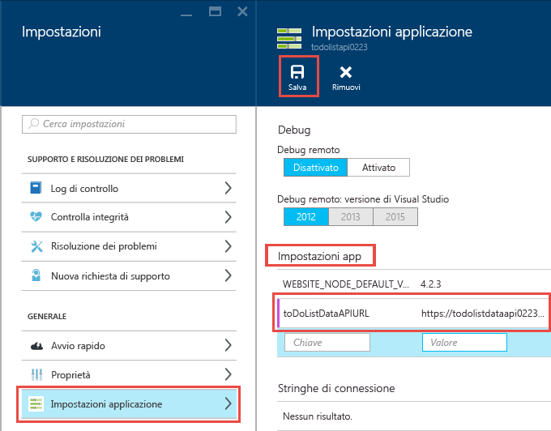

	Quando il codice è in esecuzione in Azure, questo valore sostituisce l'URL localhost contenuto nel file Web.config.

### Test per verificare la chiamata da ToDoListAPI a ToDoListDataAPI

11. In una finestra del browser passare all'URL della nuova app per le API del livello intermedio appena creata. Per accedervi, è possibile fare clic sull'URL nel pannello principale dell'app per le API nel portale.

13. Nella barra degli indirizzi del browser aggiungere "swagger" all'URL e quindi premere INVIO. L'URL sarà `http://{apiappname}.azurewebsites.net/swagger`.

	Il browser visualizza la stessa interfaccia utente di Swagger vista in precedenza per ToDoListDataAPI, ma `owner` non è un campo obbligatorio per l'operazione Get perché ora è l'app per le API di livello intermedio a inviare tale valore all'app per le API di livello dati. Quando si eseguiranno le esercitazioni sull'autenticazione, il livello intermedio invierà gli ID utente effettivi per il parametro `owner`. Per il momento imposta un asterisco come hardcoded.

12. Provare a usare il metodo Get e gli altri metodi per verificare che l'app per le API di livello intermedio chiami correttamente l'app per le API di livello dati.

	

Per altre informazioni sul client generato, vedere il [repository di GitHub AutoRest](https://github.com/azure/autorest). Per informazioni sui problemi relativi all'uso del client generato, aprire un [problema nel repository AutoRest](https://github.com/azure/autorest/issues).

##  Facoltativo: Creazione di un progetto app per le API da zero

In questa esercitazione si scaricano progetti API Web ASP.NET per la distribuzione nel servizio app, invece di creare nuovi progetti da zero. Per creare un progetto da distribuire in un'app per le API, è possibile creare un tipico progetto API Web e installare il pacchetto Swashbuckle oppure è possibile usare il modello di nuovo progetto **App per le API di Azure**. Per usare tale modello, fare clic su **File > Nuovo > Progetto > Applicazione Web ASP.NET > App per le API di Azure**.

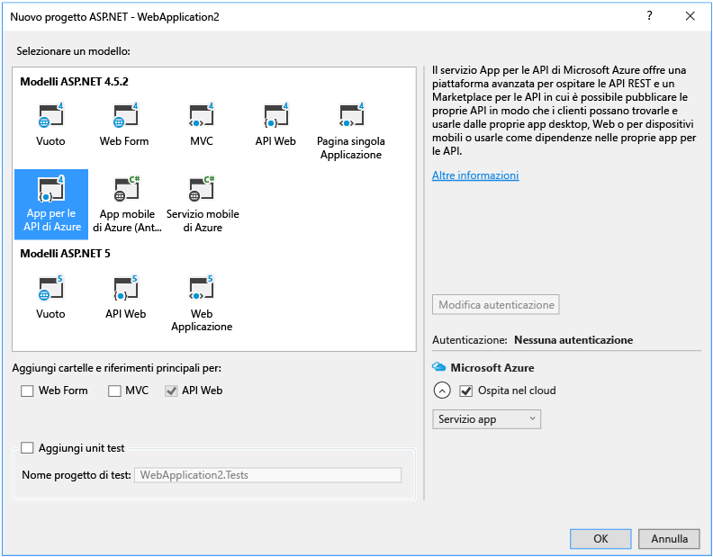

Scegliere il modello di progetto **App per le API di Azure** equivale a scegliere il modello di ASP.NET 4.5.2 **Vuoto**, fare clic sulla casella di controllo per aggiungere il supporto per l'API Web e installare il pacchetto Swashbuckle. Il modello aggiunge anche un codice di configurazione di Swashbuckle progettato per evitare la creazione di ID operazione di Swagger duplicati.

## Facoltativo: Modifica di un tipo di app

Come illustrato [prima](#apptype), la sola differenza tra le app per le API, le app Web e le app per dispositivi mobili è il modo in cui sono rappresentate nel portale. Poiché hanno tutte le stesse funzionalità, non è mai necessario modificare un tipo di app.

Se, tuttavia, si vuole modificare la rappresentazione nel portale, è possibile farlo facilmente. Ad esempio, per sostituire una delle app per le API appena create con un'app Web, eseguire questa procedura.

1. Aprire Esplora risorse.

2. Nel riquadro di spostamento sinistro espandere **subscriptions** e quindi espandere la sottoscrizione usata.

4. Espandere **resourceGroups** e quindi espandere il gruppo di risorse usato.

5. Espandere **Microsoft.Web**, espandere **sites** e quindi selezionare l'app per le API che si vuole modificare.

6. Fare clic su **Modifica**.

8. Trovare la proprietà `kind` e modificarla da "api" a "WebApp".

	

9. Fare clic su **Put**.

10. Andare al portale di Azure e verificare che l'icona sia stata modificata per riflettere il nuovo tipo di app.

## Facoltativo: URL di definizione dell'API nei modelli di Gestione risorse di Azure

In questa esercitazione è stato illustrato l'URL di definizione dell'API in Visual Studio e nel portale di Azure. È anche possibile configurare l'URL di definizione dell'API per un'app per le API usando [modelli di Azure Resource Manager](../resource-group-authoring-templates.md) in strumenti della riga di comando come [Azure PowerShell](../powershell-install-configure.md) e l'[interfaccia della riga di comando di Azure](../xplat-cli-install.md).

Per un esempio di modello di Azure Resource Manager che imposta la proprietà di definizione dell'API, aprire il [file azuredeploy.json nel repository dell'applicazione di esempio di questa esercitazione](https://github.com/azure-samples/app-service-api-dotnet-todo-list/blob/master/azuredeploy.json). Trovare la sezione del modello simile all'esempio seguente:

		"apiDefinition": {
		  "url": "https://todolistdataapi.azurewebsites.net/swagger/docs/v1"
		}

## Passaggi successivi

Questa esercitazione ha illustrato come creare app per le API, distribuire il codice in queste app, generare il relativo codice client e usarle dai client .NET. L'esercitazione successiva della serie di esercitazioni introduttive sulle app per le API mostra come [utilizzare app per le API da client JavaScript tramite CORS](app-service-api-cors-consume-javascript.md). Le esercitazioni successive della serie illustrano come implementare l'autenticazione e l'autorizzazione.

<!----HONumber=AcomDC_0323_2016-->