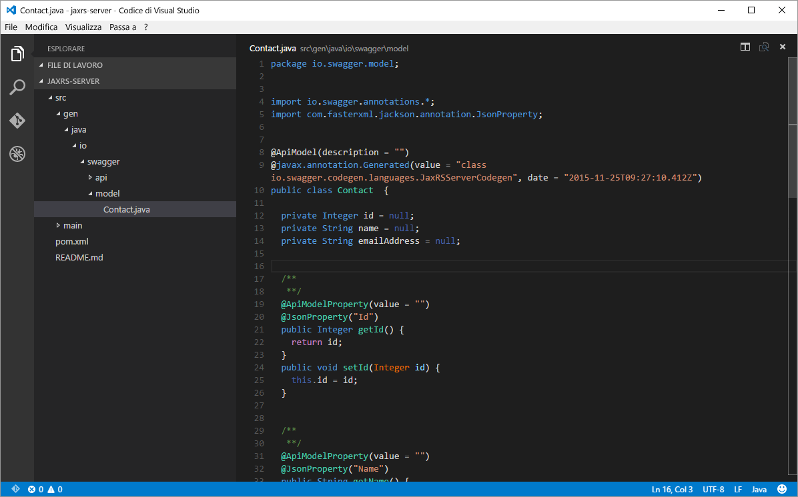
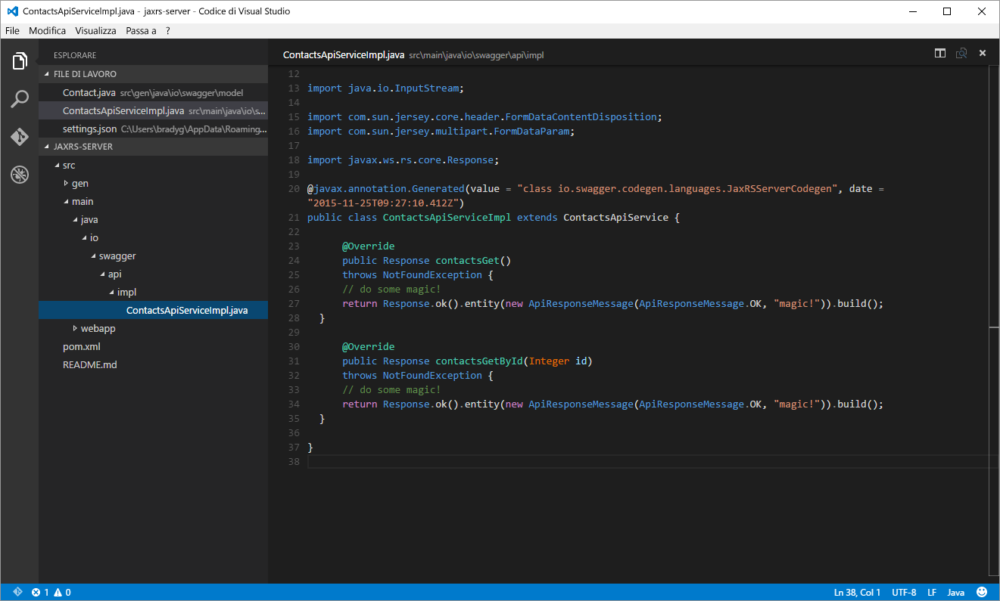
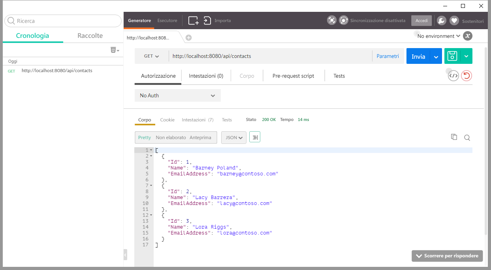
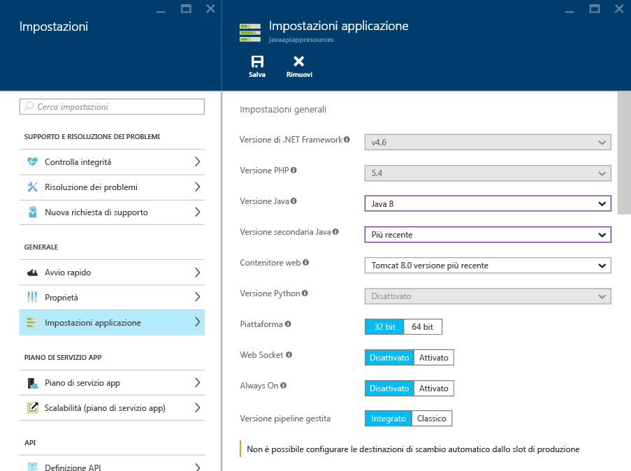
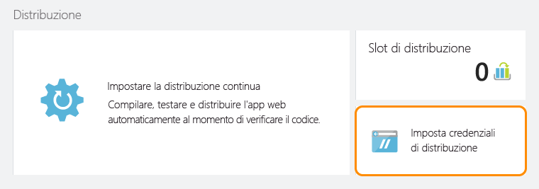
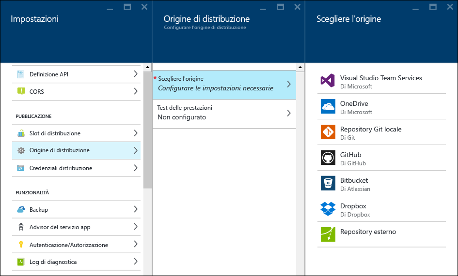
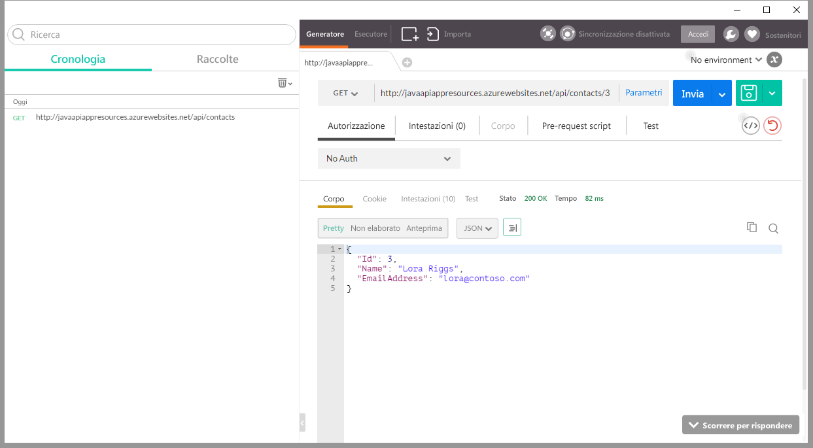

<properties
	pageTitle="Compilare e distribuire un'app per le API Java nel servizio app di Azure"
	description="Informazioni su come creare un pacchetto dell'app per le API Java e distribuirlo nel servizio app di Azure."
	services="app-service\api"
	documentationCenter="java"
	authors="bradygaster"
	manager="mohisri" 
	editor="tdykstra"/>

<tags
	ms.service="app-service-api"
	ms.workload="web"
	ms.tgt_pltfrm="na"
	ms.devlang="java"
	ms.topic="get-started-article"
	ms.date="02/22/2016"
	ms.author="bradygaster"/>

# Compilare e distribuire un'app per le API Java nel servizio app di Azure

[AZURE.INCLUDE [app-service-api-get-started-selector](../../includes/app-service-api-get-started-selector.md)]

Questa esercitazione illustra come creare un'applicazione Java e come distribuirla nelle app per le API del servizio app di Azure tramite [Git](http://git-scm.com). Le istruzioni di questa esercitazione possono essere eseguite in qualsiasi sistema operativo in grado di eseguire Java. Il codice in questa esercitazione viene compilato con [Maven](https://maven.apache.org/). [Jax-RS](https://jax-rs-spec.java.net/) consente invece di creare il servizio RESTful e viene generato in base alle specifiche dei metadati [Swagger](http://swagger.io) usando l'[editor Swagger](http://editor.swagger.io/).

## Prerequisiti

1. [Java Development Kit 8](http://www.oracle.com/technetwork/java/javase/downloads/jdk8-downloads-2133151.html) (o versioni successive)
1. Una sottoscrizione di [valutazione gratuita](https://azure.microsoft.com/pricing/free-trial/) o a pagamento a [Microsoft Azure](https://azure.microsoft.com/)
1. [Maven](https://maven.apache.org/) installato nel computer di sviluppo
1. Git installato nel computer di sviluppo. 

## Eseguire lo scaffolding dell'API con Swagger.IO
Nell'editor online swagger.io è possibile immettere il codice che rappresenta la struttura dell'API in formato JSON Swagger o YAML. Dopo aver progettato la superficie di attacco dell'API, è possibile esportare il codice in vari tipi di piattaforme e framework. Nella sezione successiva il codice su cui è stato eseguito lo scaffolding verrà modificato in modo da includere la funzionalità di implementazione fittizia.

In questa dimostrazione si incollerà in primo luogo un corpo JSON Swagger nell'editor swagger.io, che verrà quindi usato per generare il codice che sfrutta JAX-RS per accedere a un endpoint dell'API REST. Si modificherà quindi il codice con scaffolding in modo che restituisca dati fittizi, simulando un'API REST creata in base a un meccanismo di persistenza dei dati.

1. Copiare negli appunti il codice JSON Swagger seguente:

		{
			"swagger": "2.0",
			"info": {
				"version": "v1",
				"title": "Contact List",
				"description": "A Contact list API based on Swagger and built using Java"
			},
			"host": "localhost",
			"schemes": [
				"http",
				"https"
			],
			"basePath": "/api",
			"paths": {
				"/contacts": {
					"get": {
						"tags": [
							"Contact"
						],
						"operationId": "contacts_get",
						"consumes": [],
						"produces": [
							"application/json",
							"text/json"
						],
						"responses": {
							"200": {
								"description": "OK",
								"schema": {
									"type": "array",
									"items": {
										"$ref": "#/definitions/Contact"
									}
								}
							}
						},
						"deprecated": false
					}
				},
				"/contacts/{id}": {
					"get": {
						"tags": [
							"Contact"
						],
						"operationId": "contacts_getById",
						"consumes": [],
						"produces": [
							"application/json",
							"text/json"
						],
						"parameters": [
							{
								"name": "id",
								"in": "path",
								"required": true,
								"type": "integer",
								"format": "int32"
							}
						],
						"responses": {
							"200": {
								"description": "OK",
								"schema": {
									"type": "array",
									"items": {
										"$ref": "#/definitions/Contact"
									}
								}
							}
						},
						"deprecated": false
					}
				}
			},
			"definitions": {
				"Contact": {
					"type": "object",
					"properties": {
						"Id": {
							"format": "int32",
							"type": "integer"
						},
						"Name": {
							"type": "string"
						},
						"EmailAddress": {
							"type": "string"
						}
					}
				}
			}
		}
		
1. Accedere all'[editor online Swagger](http://editor.swagger.io/). Fare clic sulla voce di menu **File -> Paste JSON**.

    

1. Incollare il codice JSON Swagger relativo all'API dell'elenco dei contatti copiato in precedenza.

    

1. Visualizzare le pagine di documentazione e il riepilogo dell'API restituito nell'editor.

    

1. Selezionare l'opzione di menu **Generate Server -> JAX-RS** per eseguire lo scaffolding del codice lato server che dovrà essere modificato per aggiungere l'implementazione fittizia.

    
	
	Al termine della generazione del codice, verrà visualizzato un file ZIP per il download. Il file contiene il codice sottoposto a scaffolding dal generatore di codice Swagger e tutti gli script di compilazione associati. Decomprimere l'intera libreria in una directory della workstation di sviluppo.

## Modificare il codice per aggiungere l'implementazione dell'API
In questa sezione si sostituirà l'implementazione sul lato server del codice generato con il codice personalizzato. Il nuovo codice restituirà al client chiamante un'entità ArrayList of Contact.

1. Aprire il file di modello *Contact.java* incluso nella cartella *src/gen/java/io/swagger/model* usando [Visual Studio Code](https://code.visualstudio.com) o l'editor di testo preferito. 

    

1. Aggiungere il costruttore seguente alla classe **Contact**.

        public Contact(Integer id, String name, String email) 
		{
			this.id = id;
			this.name = name;
			this.emailAddress = email;
		}

1. Aprire il file di implementazione del servizio *ContactsApiServiceImpl.java* incluso nella cartella *src/main/java/io/swagger/api/impl* usando [Visual Studio Code](https://code.visualstudio.com) o l'editor di testo preferito.

    

1. Sovrascrivere il codice del file con questo nuovo codice per aggiungere un'implementazione fittizia al codice del servizio.

        package io.swagger.api.impl;

        import io.swagger.api.*;
        import io.swagger.model.*;
        import com.sun.jersey.multipart.FormDataParam;
        import io.swagger.model.Contact;
        import java.util.*;
        import io.swagger.api.NotFoundException;
        import java.io.InputStream;
        import com.sun.jersey.core.header.FormDataContentDisposition;
        import com.sun.jersey.multipart.FormDataParam;
        import javax.ws.rs.core.Response;

        @javax.annotation.Generated(value = "class io.swagger.codegen.languages.JaxRSServerCodegen", date = "2015-11-24T21:54:11.648Z")
        public class ContactsApiServiceImpl extends ContactsApiService {
  
            private ArrayList<Contact> loadContacts()
            {
                ArrayList<Contact> list = new ArrayList<Contact>();
                list.add(new Contact(1, "Barney Poland", "barney@contoso.com"));
                list.add(new Contact(2, "Lacy Barrera", "lacy@contoso.com"));
                list.add(new Contact(3, "Lora Riggs", "lora@contoso.com"));
                return list;
            }
  
            @Override
            public Response contactsGet(SecurityContext securityContext)
            throws NotFoundException {
                ArrayList<Contact> list = loadContacts();
                return Response.ok().entity(list).build();
                }
  
            @Override
            public Response contactsGetById(Integer id, SecurityContext securityContext)
            throws NotFoundException {
                ArrayList<Contact> list = loadContacts();
                Contact ret = null;
            
                for(int i=0; i<list.size(); i++)
                {
                    if(list.get(i).getId() == id)
                    {
                        ret = list.get(i);
                    }
                }
                return Response.ok().entity(ret).build();
            }
        }

1. Aprire un prompt dei comandi.

1. Eseguire il comando Maven seguente per compilare il codice ed eseguirlo in locale tramite il server di app Jetty.

		mvn package jetty:run
		
1. Dovrebbe essere visualizzata la finestra di comando in cui si specifica che Jetty ha avviato il codice sulla porta 8080.

	
	
1. Usare [Postman](https://www.getpostman.com/) per effettuare una richiesta al metodo API "ottieni tutti i contatti" disponibile in http://localhost:8080/api/contacts.

	
	
1. Usare [Postman](https://www.getpostman.com/) per effettuare una richiesta al metodo API "ottieni un contatto specifico" disponibile in http://localhost:8080/api/contacts/2.

	
	
1. Compilare infine il file Java WAR (Web ARchive) eseguendo il seguente comando Maven nella console.

		mvn package war:war
		
	Una volta creato, il file WAR verrà inserito nella cartella di **destinazione**. Accedere alla cartella di **destinazione** e rinominare il file WAR **ROOT.war** (accertandosi di rispettare le lettere maiuscole).
	
		rename swagger-jaxrs-server-1.0.0.war ROOT.war
		
	Eseguire infine i comandi seguenti per creare una cartella di **distribuzione** da usare per distribuire il file WAR in Azure.
	
		mkdir deploy
		mkdir deploy\webapps
		copy target\ROOT.war deploy\webapps
		cd deploy
	
## Pubblicare l'output nel servizio app di Azure
Questa sezione descrive come creare una nuova app per le API tramite il portale di Azure, preparare l'app per le API per l'hosting di applicazioni Java e distribuire il file WAR appena creato nel servizio app di Azure per eseguire la nuova app per le API.

1. Creare una nuova app per le API nel [portale di Azure](https://portal.azure.com/) facendo clic sulla voce di menu **Nuovo -> Web e dispositivi mobili -> App per le API**.
	
	

1. Nel pannello delle impostazioni dell'app per le API fare clic su **Impostazioni applicazione**. Selezionare la versione Java più recente dai menu delle versioni di Java e quindi selezionare la versione più recente di Tomcat dal menu dei contenitori Web.

	

1. Fare clic sulla voce di menu delle impostazioni **Credenziali per la distribuzione** e specificare il nome utente e la password da usare per la pubblicazione dei file nell'app per le API.

	

1. Fare clic sulla voce di menu delle impostazioni **Distribuzione continua**. Selezionare quindi il pulsante **Scegliere l'origine** e scegliere l'opzione **Archivio Git locale**. Verrà creato un repository Git in esecuzione in Azure, contenente un'associazione con l'app per le API. Ogni volta che si esegue il commit di un codice nel ramo *master* del repository Git, il codice verrà pubblicato nell'istanza dell'app per le API in esecuzione.

	

1. Copiare negli appunti l'URL del nuovo repository Git. Salvare il file, poiché risulterà di grande importanza più avanti.

	

1. Eseguire il push GIT del file WAR nel repository online. A tale scopo, passare alla cartella di **distribuzione** creata in precedenza, in modo da poter facilmente eseguire il commit del codice nel repository in cui è in esecuzione il servizio app. Dopo aver attivato la finestra della console ed essersi spostati nella directory in cui si trova la cartella webapps, inviare i comandi Git seguenti per avviare il processo e attivare una distribuzione.

		git init
		git add .
		git commit -m "initial commit"
		git remote add azure [YOUR GIT URL]		
		git push azure master
		
	Dopo aver emesso la richiesta di **push**, viene richiesta la password creata in precedenza per le credenziali di distribuzione. Se si immette la password, dovrebbe essere visualizzato il portale con l'aggiornamento correttamente distribuito.
		
1. Se si accede alla nuova app per le API in esecuzione nel servizio app di Azure con Postman, si noterà che il comportamento è coerente, che ora restituisce i dati dei contatti previsti e, tramite un semplice codice, si trasforma in codice Java sottoposto a scaffolding da Swagger.io.

	
	
## Passaggi successivi
Questo articolo è iniziato con un file JSON Swagger e il codice Java sottoposto a scaffolding ottenuto dall'editor Swagger.io. Con alcune modifiche e un processo di distribuzione di un repository Git è stata creata un'app per le API funzionale, scritta in Java. L'esercitazione successiva della serie di esercitazioni introduttive sulle app per le API mostra come [utilizzare app per le API da client JavaScript tramite CORS](app-service-api-cors-consume-javascript.md).

Per approfondire questo esempio, è possibile acquisire informazioni su [Storage SDK per Java](../storage/storage-java-how-to-use-blob-storage.md) per rendere permanenti i BLOB JSON. In alternativa, è possibile usare [DocumentDB Java SDK](../documentdb/documentdb-java-application.md) per salvare i dati dei contatti in Azure DocumentDB.

Per altre informazioni su come usare Java in Azure, vedere il [Centro per sviluppatori Java](/develop/java/).

<!---HONumber=AcomDC_0302_2016-->