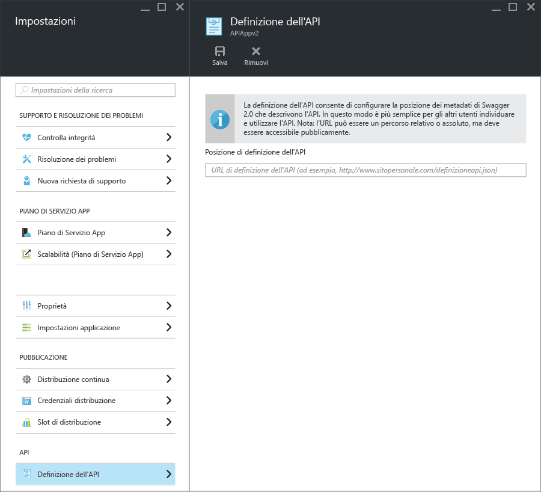

<properties
	pageTitle="Metadati delle app per le API del servizio app per l'individuazione di API e la generazione di codice | Microsoft Azure"
	description="Informazioni sulle modalità con cui le app per le API del servizio app di Azure usano i metadati di Swagger per facilitare l'individuazione di API e la generazione di codice."
	services="app-service\api"
	documentationCenter=".net"
	authors="tdykstra"
	manager="wpickett"
	editor=""/>

<tags
	ms.service="app-service-api"
	ms.workload="na"
	ms.tgt_pltfrm="na"
	ms.devlang="na"
	ms.topic="article"
	ms.date="08/30/2016"
	ms.author="rachelap"/>

# Metadati delle app per le API del servizio app per l'individuazione di API e la generazione di codice 

Il supporto per i metadati dell'API [Swagger 2.0](http://swagger.io/) è incorporato nelle app per le API del servizio app. Non è necessario usare Swagger, ma se lo si usa, è possibile sfruttare le funzionalità delle app per le API che semplificano le procedure di individuazione e utilizzo.

## Endpoint Swagger

È possibile specificare un endpoint che fornisca i metadati JSON di Swagger 2.0 per un'app per le API in una proprietà dell'app. L'endpoint può essere relativo all'URL di base dell'app per le API oppure un URL assoluto, che può indirizzare anche all'esterno dell'app per le API.

Per molti client downstream (ad esempio, la generazione di codice di Visual Studio e il flusso di aggiunta API di PowerApps) l'URL deve essere accessibile pubblicamente (non protetto da un'autenticazione utente o del servizio). Ciò significa che se si usa l'autenticazione del servizio app e si vuole esporre la definizione dell'API all'interno dell'app stessa, è necessario usare l'opzione di autenticazione che consente al traffico anonimo di raggiungere l'API. Per altre informazioni, vedere [Autenticazione e autorizzazione per le app per le API del servizio app](app-service-api-authentication.md).

### Pannello del portale

Nel [portale di Azure](https://portal.azure.com/) l'URL dell'endpoint può essere visualizzato e modificato nel pannello **Definizione API**.

### Proprietà Gestione risorse di Azure

È anche possibile configurare l'URL di definizione dell'API per un'app per le API usando [Esplora risorse](https://resources.azure.com/) o i [modelli di Azure Resource Manager](../resource-group-authoring-templates.md) in strumenti da riga di comando, ad esempio [Azure PowerShell](../powershell-install-configure.md) e l'[interfaccia della riga di comando di Azure](../xplat-cli-install.md).

In **Esplora risorse** passare a **Sottoscrizioni > {sottoscrizione} > Gruppi di risorse > {gruppo di risorse} > Provider > Microsoft.Web > Siti > {sito} > config > web** per visualizzare la proprietà `apiDefinition`:

		"apiDefinition": {
		  "url": "https://contactslistapi.azurewebsites.net/swagger/docs/v1"
		}

Per un esempio di un modello di distribuzione Azure Resource Manager che imposta la proprietà `apiDefinition`, aprire il [file azuredeploy.json nell'applicazione di esempio di elenco attività](https://github.com/azure-samples/app-service-api-dotnet-todo-list/blob/master/azuredeploy.json). Trovare la sezione del modello simile all'esempio JSON precedente:

### Valore predefinito

Quando si usa Visual Studio per creare un'app per le API, l'endpoint della definizione dell'API viene automaticamente impostato sull'URL di base dell'app per le API, più `/swagger/docs/v1`. Questo è l'URL predefinito che il pacchetto NuGet [Swashbuckle](https://www.nuget.org/packages/Swashbuckle) usa per gestire i metadati di Swagger generati dinamicamente per un progetto API Web ASP.NET.

## Generazione del codice

Uno dei vantaggi dell'integrazione di Swagger nelle app per le API di Azure è la generazione automatica del codice. Le classi client generate semplificano la scrittura del codice che chiama un'app per le API.

È possibile generare il codice client per un'app per le API tramite Visual Studio o dalla riga di comando. Per informazioni su come generare classi client in Visual Studio per un progetto API Web ASP.NET, vedere [Introduzione alle app per le API e ad ASP.NET](app-service-api-dotnet-get-started.md#codegen). Per informazioni su come eseguire questa operazione dalla riga di comando per tutte le lingue supportate, vedere il file Leggimi del repository [Azure/autorest](https://github.com/azure/autorest) in GitHub.com.
 
## Passaggi successivi

Per un'esercitazione dettagliata sulle procedure di creazione, distribuzione e utilizzo di un'app per le API, vedere [Introduzione alle app per le API nel servizio app di Azure](app-service-api-dotnet-get-started.md).

Se si usa Gestione API di Azure con app per le API, è possibile usare metadati di Swagger per importare l'API in Gestione API. Per altre informazioni, vedere [Come importare la definizione di un'API con le operazioni in Gestione API di Azure](../api-management/api-management-howto-import-api.md).

<!---HONumber=AcomDC_0831_2016-->