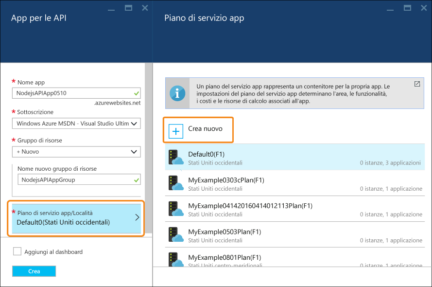
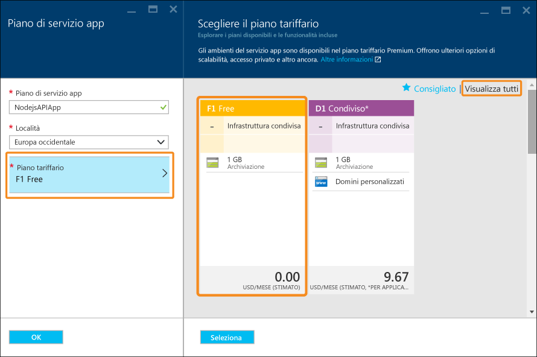

<properties
	pageTitle="App per le API Node.js nel servizio app di Azure | Microsoft Azure"
	description="Informazioni su come creare un'API RESTful Node.js e distribuirla in un'app per le API nel servizio app di Azure."
	services="app-service\api"
	documentationCenter="node"
	authors="bradygaster"
	manager="wpickett"
	editor=""/>

<tags
	ms.service="app-service-api"
	ms.workload="web"
	ms.tgt_pltfrm="na"
	ms.devlang="node"
	ms.topic="get-started-article"
	ms.date="05/06/2016"
	ms.author="bradygaster"/>

# Compilare un'API RESTful Node.js e distribuirla a un'app per le API in Azure

[AZURE.INCLUDE [app-service-api-get-started-selector](../../includes/app-service-api-get-started-selector.md)]

Questa esercitazione illustra come creare un'API [Node.js](http://nodejs.org) e distribuirla in un'[app per le API](app-service-api-apps-why-best-platform.md) nel [servizio app di Azure](../app-service/app-service-value-prop-what-is.md). È possibile usare qualsiasi sistema operativo che consente l'esecuzione di Node.js. Tutte le operazioni verranno eseguite usando strumenti da riga di comando, ad esempio cmd.exe o bash.

## Prerequisiti

1. [Node.js](http://nodejs.org) installato (questo esempio presuppone che sia installato Node.js versione 4.2.2)
2. [Git](https://git-scm.com/) installato
1. Un account [GitHub](https://github.com/)
1. Un [account di valutazione gratuita](https://azure.microsoft.com/pricing/free-trial/) di Microsoft Azure

## Scaricare il codice di esempio

1. Aprire un'interfaccia della riga di comando per eseguire Node.js e i comandi di Git.

1. Passare a una cartella che è possibile usare per un repository Git locale e clonare il [repository GitHub contenente il codice di esempio](https://github.com/Azure-Samples/app-service-api-node-contact-list).

		git clone https://github.com/Azure-Samples/app-service-api-node-contact-list.git

	L'API di esempio fornisce due endpoint: una richiesta Get a `/contacts` restituisce un elenco di nomi e indirizzi di posta elettronica in formato JSON, mentre `/contacts/{id}` restituisce solo il contatto selezionato.

## Eseguire lo scaffolding del codice Node.js in base ai metadati Swagger

[Swagger](http://swagger.io/) è un formato di file JSON per i metadati che descrivono un'API RESTful. Il servizio app di Azure ha il [supporto per i metadati Swagger](app-service-api-metadata.md). In questa parte dell'esercitazione si esegue lo scaffolding del codice server per un'API di esempio in base a un file di metadati Swagger.

>[AZURE.NOTE] Se non si è interessati allo scaffolding di un file Swagger, è possibile eseguire solo i passaggi dell'esercitazione per la distribuzione del codice di esempio in una nuova app per le API. Passare direttamente alla sezione [Creare un'app per le API in Azure](#createapiapp).

1. Eseguire questi comandi per installare a livello globale i moduli NPM **yo** e **generator-swaggerize**.

		npm install -g yo
		npm install -g generator-swaggerize

	Swaggerize è uno strumento che genera un codice server per un'API descritta da un file di metadati Swagger. Il file Swagger che si userà è denominato *api.json* e si trova nella cartella *start* del repository clonato.

2. Passare alla cartella *start* e quindi eseguire il comando `yo swaggerize`. Swaggerize formulerà una serie di domande. Per **what to call this project** immettere "contactlist", per **path to swagger document** immettere "api.json" e per **Express, Hapi, or Restify** immettere "express".

		yo swaggerize

	
    
	**Nota**: se si riscontra un errore in questo passaggio, il passaggio successivo illustra come correggerlo.

	Swaggerize crea una cartella dell'applicazione, esegue lo scaffolding dei gestori e dei file di configurazione e genera un file **package.json**. Il motore di visualizzazione express viene usato per generare la pagina della Guida di Swagger.

3. Se il comando `swaggerize` non riesce con un errore "unexpected token" o "invalid escape sequence", correggere la causa dell'errore modificando il file *package.json* generato. Nella riga `regenerate` sotto `scripts` sostituire la barra rovesciata che precede *api.json* con una barra, in modo che la riga sia come quella dell'esempio seguente:

 		"regenerate": "yo swaggerize --only=handlers,models,tests --framework express --apiPath config/api.json"

1. Passare alla cartella che contiene il codice sottoposto a scaffolding (in questo caso, la sottocartella *ContactList*).

1. Eseguire `npm install`.
	
		npm install
		
2. Installare il modulo NPM **jsonpath**.

		npm install --save jsonpath
        
    

1. Installare il modulo NPM **swaggerize-ui**.

		npm install --save swaggerize-ui
        
    

## Personalizzare il codice sottoposto a scaffolding

1. Copiare la cartella **lib** dalla cartella **start** alla cartella **ContactList** creata dal processo di scaffolding. 

1. Sostituire il codice nel file **handlers/contacts.js** con il codice seguente.

	Questo codice usa i dati JSON archiviati nel file **lib/contacts.json** servito da **lib/contactRepository.js**. Il nuovo codice contacts.js illustrato di seguito risponde alle richieste HTTP per ottenere tutti i contatti e restituirli come payload JSON.

        'use strict';
        
        var repository = require('../lib/contactRepository');
        
        module.exports = {
            get: function contacts_get(req, res) {
                res.json(repository.all())
            }
        };

1. Sostituire il codice nel file **handlers/contacts/{id}.js** con il codice seguente.

        'use strict';

        var repository = require('../../lib/contactRepository');
        
        module.exports = {
            get: function contacts_get(req, res) {
                res.json(repository.get(req.params['id']));
            }    
        };

1. Sostituire il codice nel file **server.js** con il codice seguente.

	Le modifiche apportate al file server.js vengono indicate usando i commenti per poter visualizzare le modifiche.

        'use strict';

        var port = process.env.PORT || 8000; // first change

        var http = require('http');
        var express = require('express');
        var bodyParser = require('body-parser');
        var swaggerize = require('swaggerize-express');
        var swaggerUi = require('swaggerize-ui'); // second change
        var path = require('path');

        var app = express();

        var server = http.createServer(app);

        app.use(bodyParser.json());

        app.use(swaggerize({
            api: path.resolve('./config/api.json'), // third change
            handlers: path.resolve('./handlers'),
            docspath: '/swagger' // fourth change
        }));

        // change four
        app.use('/docs', swaggerUi({
          docs: '/swagger'  
        }));

        server.listen(port, function () { // fifth and final change
        });

## Eseguire il test con l'API in esecuzione in locale

1. Attivare il server usando l'eseguibile della riga di comando di Node.js. 

        node server.js

1. Quando si passa a ****http://localhost:8000/contacts** viene visualizzato l'output JSON dell'elenco contatti (o viene richiesto di scaricarlo, a seconda del browser).

    

1. Quando si passa a ****http://localhost:8000/contacts/2** viene visualizzato il contatto rappresentato da quel valore ID.

    

1. I dati JSON di Swagger vengono gestiti attraverso l'endpoint **/swagger**:

    

1. L'interfaccia utente di Swagger viene gestita attraverso l'endpoint **/docs**. Nell'interfaccia utente di Swagger è possibile usare le funzionalità client HTML complete per testare l'API.

    

##  Creare una nuova app per le API nel portale di Azure

In questa sezione viene illustrato il processo di creazione di una nuova app per le API vuota in Azure. Nella sezione seguente l'app viene quindi collegata a un repository Git, per abilitare la distribuzione continua delle modifiche al codice.

1. Accedere al [portale di Azure](https://portal.azure.com/). 

1. Fare clic su **Nuovo > Web e dispositivi mobili > App per le API**.

    

4. Immettere un **Nome app** univoco nel dominio *azurewebsites.net*, ad esempio NodejsAPIApp aggiungendovi un numero per renderlo univoco.

	Se si immette un nome già usato da un altro utente, a destra, invece di un segno di spunta verde, viene visualizzato un punto esclamativo rosso ed è necessario specificare un nome diverso.

	Azure usa questo nome come prefisso per l'URL dell'API. L'URL completo è costituito da questo nome seguito da *.azurewebsites.net*. Ad esempio, se il nome è `NodejsAPIApp`, l'URL sarà `nodejsapiapp.azurewebsites.net`.

6. Nell'elenco a discesa **Gruppo di risorse** fare clic su **Nuovo** e quindi in **Nuovo nome gruppo di risorse** immettere "NodejsAPIAppGroup" o un altro nome, se si preferisce.

	Un [gruppo di risorse](../azure-portal/resource-group-portal.md) è una raccolta di risorse di Azure, ad esempio app per le API, database, VM e così via. Per questa esercitazione è consigliabile creare un nuovo gruppo di risorse, per eliminare facilmente tutte le risorse di Azure create per l'esercitazione in un unico passaggio.

4. Fare clic su **Piano di servizio app/Località** e quindi su **Crea nuovo**.

	

	Nei passaggi seguenti si crea un piano di servizio app per il nuovo gruppo di risorse. Un piano di servizio app specifica le risorse di calcolo in cui viene eseguita l'app per le API. Se, ad esempio, si sceglie il livello gratuito, l'app per le API viene eseguita in VM condivise, mentre con alcuni livelli a pagamento viene eseguita in VM dedicate. Per altre informazioni sui piani di servizio app, vedere [Panoramica approfondita dei piani del servizio app di Azure](../app-service/azure-web-sites-web-hosting-plans-in-depth-overview.md).

5. Nel pannello **Piano di servizio app** immettere "NodejsAPIAppPlan" o un altro nome, se si preferisce.

5. Nell'elenco a discesa **Località** scegliere la località più vicina.

	Questa impostazione specifica il data center di Azure in cui verrà eseguita l'app. Per questa esercitazione, è possibile selezionare qualsiasi area senza riscontrare differenze evidenti, ma per un'app di produzione è consigliabile che il server sia il più vicino possibile ai client che accedono al server per ridurre al minimo la [latenza](http://www.bing.com/search?q=web%20latency%20introduction&qs=n&form=QBRE&pq=web%20latency%20introduction&sc=1-24&sp=-1&sk=&cvid=eefff99dfc864d25a75a83740f1e0090).

5. Fare clic su **Piano tariffario > Visualizza tutto > F1 Gratuito**.

	Per questa esercitazione il piano tariffario Gratuito fornirà prestazioni sufficienti.

	

6. Nel pannello **Piano di servizio app** fare clic su **OK**.

7. Nel pannello **App per le API** fare clic su **Crea**.

## Configurare la nuova app per le API per la distribuzione Git

In questa sezione dell'esercitazione si creano le credenziali che si useranno per la distribuzione e un repository Git per l'app per le API nel servizio app di Azure. Per distribuire il codice nell'app per le API, sarà necessario effettuare il push dei commit in questo repository nel servizio app di Azure.

1. Dopo che l'API è stata creata, fare clic su **Servizi app > {app per le API}** nella home page del portale. 

	Il portale visualizza i pannelli **App per le API** e **Impostazioni**.

    

    

1. Nel pannello **Impostazioni** scorrere verso il basso fino alla sezione **Pubblicazione** e quindi fare clic su **Credenziali per la distribuzione**.
 
3. Nel pannello **Imposta credenziali di distribuzione** immettere un nome utente e una password e quindi fare clic su **Salva**.

	Queste credenziali verranno usate per pubblicare il codice Node.js nell'app per le API. Nel passaggio successivo si crea il repository Git di Azure associato all'app per le API.

    

1. Nel pannello **Impostazioni** fare clic su **Origine distribuzione > Scegliere l'origine > Repository Git locale**, quindi fare clic su **OK**.

    

1. Dopo aver creato l'archivio Git, il pannello mostra le distribuzioni attive. Poiché l'archivio è nuovo, non sono presenti distribuzioni attive nell'elenco.

    

1. Copiare l'URL del repository Git. A tale scopo, passare al pannello della nuova app per le API e osservare la sezione **Informazioni di base**. In questa sezione verrà visualizzato l'**URL clone GIT**. Quando si passa il puntatore su questo URL, a destra verrà visualizzata un'icona per copiare l'URL negli Appunti. Fare clic su questa icona per copiare l'URL.

    

    **Nota**: nel passaggio successivo è necessario l'URL clone Git, quindi assicurarsi di salvarlo.

Ora che è disponibile una nuova app per le API con un archivio Git come backup, è possibile eseguire il push del codice nell'archivio e sfruttare le funzionalità di distribuzione continua di Azure per distribuire automaticamente le modifiche.

## Distribuire il codice dell'API in Azure

In questa sezione vengono eseguiti i passaggi seguenti:

* Creare un repository Git locale che contiene il codice server per l'API.
* In tale repository crearne uno remoto che faccia riferimento al repository creato per l'app per le API in Azure.
* Effettuare il push del codice dal repository locale al repository remoto. 

Le funzionalità di recapito continuo predefinite del servizio app di Azure consentono di distribuire il codice semplicemente effettuando il push dei commit in un repository Git associato all'app per le API.

1. Se la prima parte dell'esercitazione è stata eseguita, copiare la cartella `start\ContactList` creata usando l'utilità di scaffolding swaggerize in un'altra cartella. In caso contrario, copiare la cartella `end\ContactList` in un'altra cartella.

1. Nello strumento da riga di comando passare alla nuova cartella, quindi eseguire il comando seguente per creare un nuovo repository Git locale.

        git init

     

1. Eseguire il comando seguente per aggiungere un repository Git remoto per il repository dell'app per le API.

        git remote add azure YOUR_GIT_CLONE_URL_HERE

    **Nota**: sostituire la stringa "YOUR\_GIT\_CLONE\_URL\_HERE" con il proprio URL clone Git copiato in precedenza.

1. Eseguire i due comandi sotto per creare un commit che contiene tutto il codice.

        git add .
        git commit -m "initial revision"

    

1. Eseguire il comando per effettuare il push del codice in Azure. Quando viene chiesta la password, immettere quella creata prima nel portale di Azure.

        git push azure master

	Verrà attivata una distribuzione nell'app per le API.

1. Nel browser passare nuovamente al pannello **Distribuzioni** dell'app per le API dove è possibile verificare che la distribuzione sia in corso.

    

    Contemporaneamente, l'interfaccia della riga di comando riflette lo stato della distribuzione in corso.

    

	Dopo aver completato la distribuzione, il pannello **Distribuzioni** riflette la corretta distribuzione delle modifiche al codice nell'app per le API.

## Eseguire il test con l'API in esecuzione in Azure
 
3. Copiare l'**URL** nella sezione **Informazioni di base** del pannello dell'app per le API. 

    

1. Usando un client di API REST, ad esempio Postman o Fiddler o il Web browser, fornire l'URL della chiamata all'API dei contatti, che è l'endpoint `/contacts` dell'app per le API.

    **Nota:** l'URL sarà `https://{your API app name}.azurewebsites.net/contacts`

    Quando si invia una richiesta GET a questo endpoint, si ottiene l'output JSON dell'app per le API.

    

2. In un browser andare all'endpoint `/docs` per provare l'interfaccia utente di Swagger mentre è in esecuzione in Azure.

Ora che il recapito continuo è stato associato, è possibile apportare modifiche al codice e distribuirle in Azure semplicemente effettuando il push dei commit nel repository Git di Azure.

## Passaggi successivi

A questo punto è stata creata e distribuita la prima app per le API usando Node.js. L'esercitazione successiva della serie di esercitazioni introduttive sulle app per le API mostra come [utilizzare app per le API da client JavaScript tramite CORS](app-service-api-cors-consume-javascript.md).

<!---HONumber=AcomDC_0511_2016-->