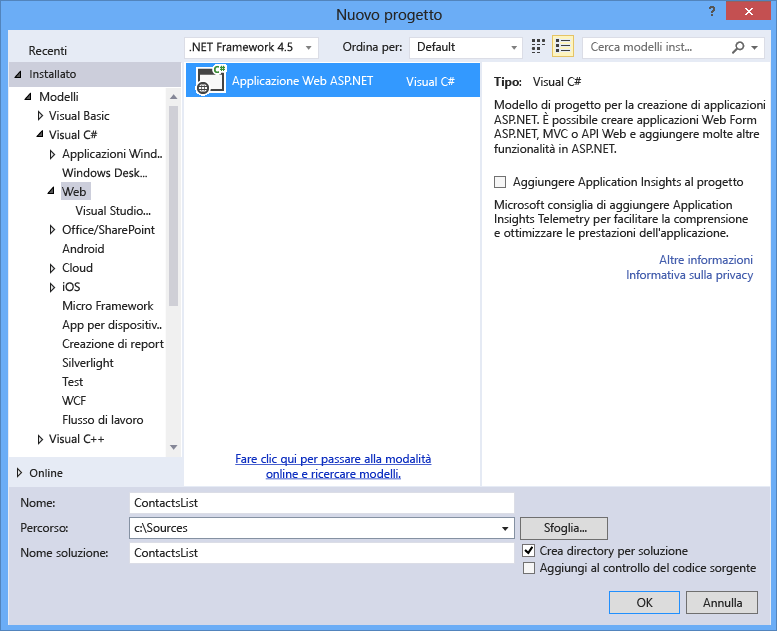
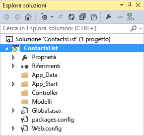
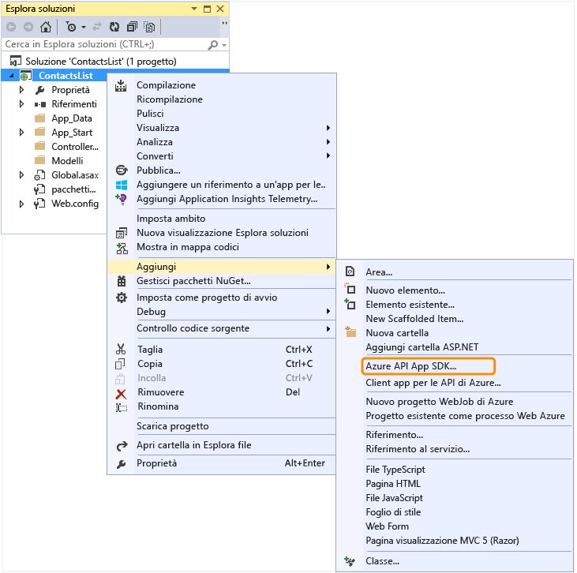
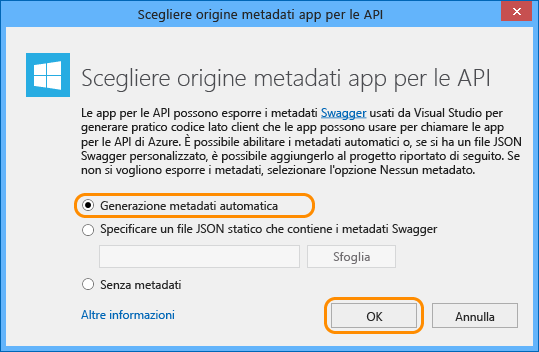

<properties 
	pageTitle="Configurare un progetto API Web come un'app per le API" 
	description="Informazioni su come configurare un progetto API Web come app per le API usando Visual Studio 2013" 
	services="app-service\api" 
	documentationCenter=".net" 
	authors="tdykstra" 
	manager="wpickett" 
	editor="jimbe"/>

<tags 
	ms.service="app-service-api" 
	ms.workload="web" 
	ms.tgt_pltfrm="dotnet" 
	ms.devlang="na" 
	ms.topic="article" 
	ms.date="05/19/2015" 
	ms.author="bradyg;tarcher"/>

# Configurare un progetto API Web come un'app per le API

## Panoramica

Questa esercitazione mostra come selezionare un progetto API Web esistente e configurarlo per la distribuzione come un'[app per le API](app-service-api-apps-why-best-platform.md) nel [servizio app di Azure](../app-service/app-service-value-prop-what-is.md). Le esercitazione successive della serie illustrano come [distribuire](app-service-dotnet-deploy-api-app.md) ed [eseguire il debug](../app-service-dotnet-remotely-debug-api-app.md) del progetto app per le API creato in questa esercitazione.

Per informazioni sulle app per le API, vedere [Informazioni sulle app per le API](app-service-api-apps-why-best-platform.md).

[AZURE.INCLUDE [install-sdk-2013-only](../../includes/install-sdk-2013-only.md)]

Per eseguire questa esercitazione, è necessario installare Azure SDK per .NET versione 2.5.1 o successive.

## Configurare un progetto API Web 

Questa sezione illustra come configurare un progetto API Web esistente come app per le API. Usare prima di tutto il modello di progetto API Web per creare un progetto API Web e quindi configurarlo come app per le API.

1. Aprire Visual Studio 2013.

2. Selezionare **File > nuovo progetto**.

3. Selezionare il modello **Applicazione Web ASP.NET**.

4. Assicurarsi che la casella di controllo **Aggiungi Application Insights al progetto** sia deselezionata.

4. Assegnare al progetto il nome *ContactsList*

	

5. Fare clic su **OK**.

6. Nella finestra di dialogo **Nuovo progetto ASP.NET** selezionare il modello di progetto **Vuoto**.

7. Selezionare la casella di controllo **API Web**.

8. Deselezionare l'opzione **Host nel cloud**.

	

9. Fare clic su **OK** per generare il progetto.

	

10. In **Esplora soluzioni** fare clic con il pulsante destro del mouse sul progetto (non sulla soluzione) e quindi scegliere **Aggiungi > Azure API App SDK**.

	

11. Nella finestra di dialogo **Scegli origine metadati app per le API** fare clic su **Generazione metadati automatica**.

	

	Questa scelta abilita l'interfaccia utente di Swagger dinamica, che verrà illustrata più avanti nell'esercitazione. Se si sceglie di caricare un file di metadati di Swagger, il file verrà salvato con nome file *apiDefinition.swagger.json*, come illustrato nella sezione seguente.

12. Fare clic su **OK**.
 
	A questo punto, Visual Studio installa i pacchetti NuGet di app per le API e aggiunge i metadati delle API al progetto API Web.

[AZURE.INCLUDE [app-service-api-review-metadata](../../includes/app-service-api-review-metadata.md)]

[AZURE.INCLUDE [app-service-api-define-api-app](../../includes/app-service-api-define-api-app.md)]

[AZURE.INCLUDE [app-service-api-direct-deploy-metadata](../../includes/app-service-api-direct-deploy-metadata.md)]

## Passaggi successivi

L'app per le API è ora pronta per essere distribuita e a questo scopo è possibile seguire l'esercitazione [Distribuire un'app per le API](app-service-dotnet-deploy-api-app.md).
 

<!---HONumber=July15_HO4-->