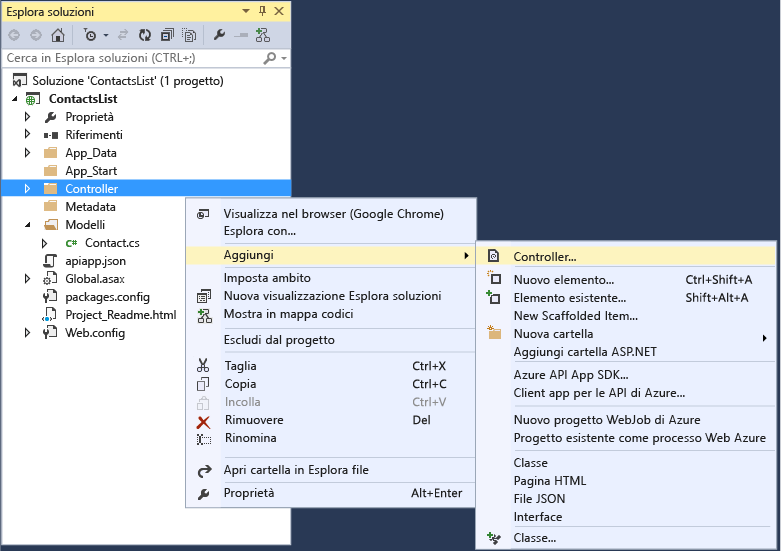
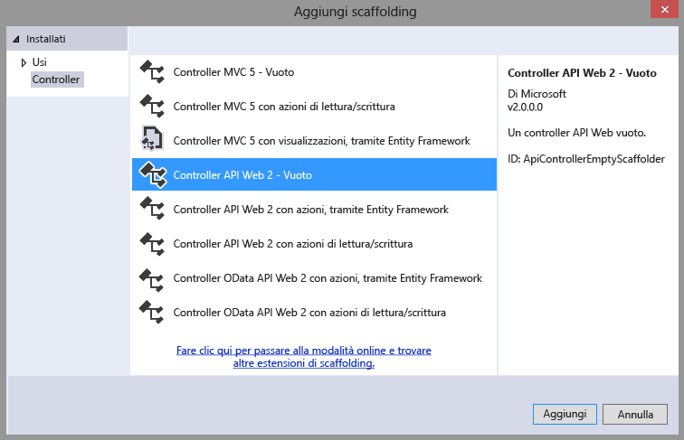
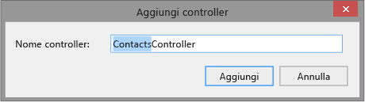
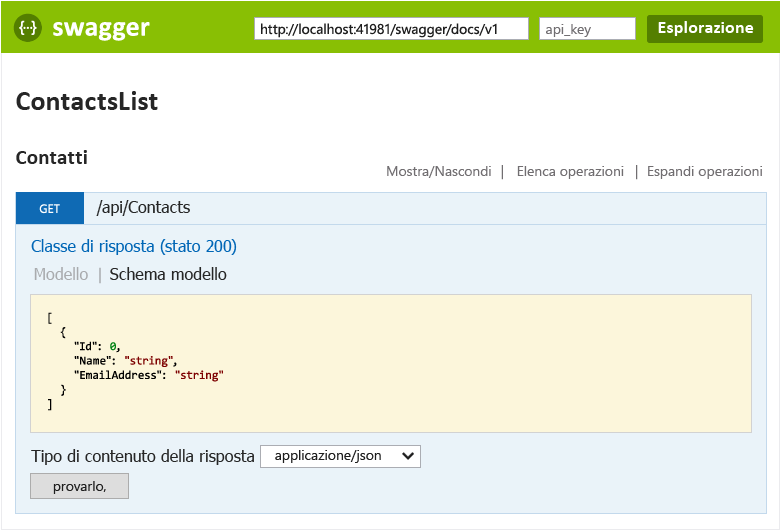
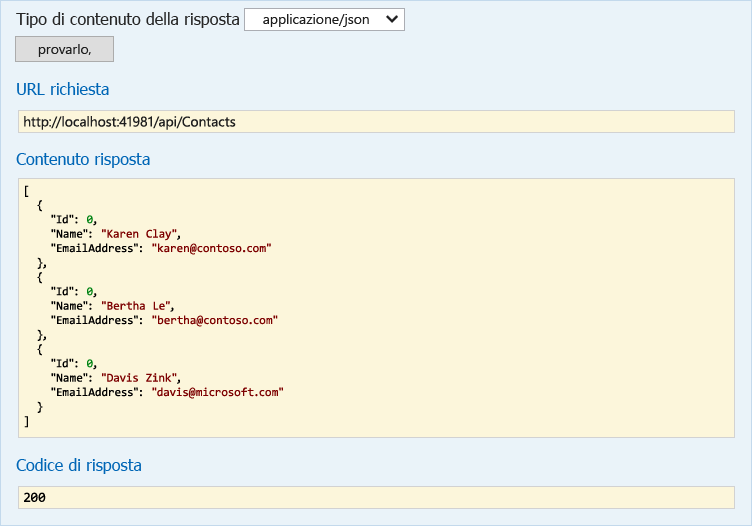

<properties 
	pageTitle="Creare un'app per le API ASP.NET nel servizio app di Azure usando Visual Studio 2015" 
	description="Informazioni su come creare un'app per le API ASP.NET nel servizio app di Azure usando Visual Studio 2015" 
	services="app-service\api" 
	documentationCenter=".net" 
	authors="tdykstra" 
	manager="wpickett" 
	editor="jimbe"/>

<tags 
	ms.service="app-service-api" 
	ms.workload="web" 
	ms.tgt_pltfrm="dotnet" 
	ms.devlang="na" 
	ms.topic="article" 
	ms.date="05/19/2015" 
	ms.author="tdykstra"/>

# Creare un'app per le API ASP.NET nel servizio app di Azure usando Visual Studio 2015

> [AZURE.SELECTOR]
- [Visual Studio 2013](app-service-dotnet-create-api-app.md)
- [Visual Studio 2015 RC](app-service-dotnet-create-api-app-vs2015.md)
- [Visual Studio Code](app-service-create-aspnet-api-app-using-vscode.md)

## Panoramica

Questa esercitazione mostra come creare un progetto API Web ASP.NET 2 usando [Visual Studio 2015 RC](https://www.visualstudio.com/it-it/downloads/visual-studio-2015-downloads-vs.aspx) e come configurarlo per la distribuzione nel cloud come [app per le API](app-service-api-apps-why-best-platform.md) nel [servizio app di Azure](../app-service/app-service-value-prop-what-is.md). Viene anche distribuito il progetto in Azure. Al termine dell'esercitazione sarà disponibile un'app per le API in esecuzione sul cloud di Azure.

L'esercitazione presuppone competenze nell'uso di file e cartelle in **Esplora soluzioni** di Visual Studio.

L'esercitazione usa la versione dell'API Web ASP.NET attualmente rilasciata. Per informazioni su come creare un'app per le API ASP.NET MVC 6, vedere questo post di blog: [https://alexanderzeitler.com/articles/Deploying-a-ASP-NET-MVC-6-API-as-Azure-API-App-in-Azure-App-Services/](https://alexanderzeitler.com/articles/Deploying-a-ASP-NET-MVC-6-API-as-Azure-API-App-in-Azure-App-Services/ "Distribuzione di un'API ASP.NET MVC 6 come app per le API di Azure nei servizi app di Azure").

[AZURE.INCLUDE [install-sdk-2015-only](../../includes/install-sdk-2015-only.md)]

Per eseguire questa esercitazione, è necessario installare Azure SDK per .NET versione 2.6 o successive.

## Creare un progetto app per le API 

Visual Studio 2015 RC non include ancora un modello di progetto di app per le API. Per creare un progetto di app per le API è quindi necessario partire dal modello di progetto di API Web.

1. Aprire Visual Studio 2015 RC.

2. Fare clic su **File > Nuovo progetto**.

3. In **Modelli** fare clic su **Web** e quindi selezionare il modello **Applicazione Web ASP.NET**.

4. Assegnare al progetto il nome *ContactsList*

5. Assicurarsi che la casella di controllo **Aggiungi Application Insights al progetto** sia deselezionata.

5. Fare clic su **OK**.

	

6. Nella finestra di dialogo **Nuovo progetto ASP.NET** in **Modelli ASP.NET 4.6** selezionare il modello di progetto **Vuoto**.

7. Selezionare la casella di controllo **API Web**.

8. Deselezionare la casella di controllo **Host nel cloud**.

7. Fare clic su **OK**.

	

## Aggiungere i pacchetti NuGet

Il runtime del servizio app per le app per le API fornito dal [pacchetto NuGet Microsoft.Azure.AppService.ApiApps.Service](http://www.nuget.org/packages/Microsoft.Azure.AppService.ApiApps.Service/) e la generazione dinamica di metadati dell'API [Swagger](http://swagger.io/ "Informazioni ufficiali su Swagger") viene fornito dal pacchetto NuGet [Swashbuckle](http://www.nuget.org/packages/Swashbuckle/).

> **Nota:** quando si installa un pacchetto Swashbuckle, per impostazione predefinita viene abilitata anche una pagina di test dell'API. Se si pubblica l'app per le API e si imposta il livello di accesso su **Pubblico (anonimo)**, chiunque trovi l'URL della pagina di test potrà usarlo per chiamare l'API. La pagina di test verrà usata più avanti in questa esercitazione.

1. Fare clic su **Strumenti > Gestione pacchetto NuGet > Console di gestione pacchetti**.

2. Immettere i comandi seguenti in **Console di Gestione pacchetti**.

		install-package Microsoft.Azure.AppService.ApiApps.Service
		install-package Swashbuckle

	Potrebbe essere necessario attendere alcuni minuti dopo la visualizzazione nella Console di Gestione pacchetti del messaggio che indica che è in corso la verifica delle dipendenze.

## Aggiungere i file dei metadati per le app per le API

I metadati che permettono la distribuzione del progetto di API Web come app per le API sono inclusi nel file *apiapp.json* e nella cartella *Metadata*, con le rispettive sottocartelle e i rispettivi file. I passaggi seguenti permettono di aggiungere questi file con i valori predefiniti.

La sezione [Metadati delle app per le API](#api-app-metadata) più avanti nell'esercitazione illustra come personalizzare i metadati.

1. Nella cartella del progetto creare un file con estensione *json* denominato apiapp.json, quindi sostituire i contenuti del nuovo file con il testo JSON seguente.

		{
		    "$schema": "http://json-schema.org/schemas/2014-11-01/apiapp.json#",
		    "id": "ContactsList",
		    "namespace": "microsoft.com",
		    "gateway": "2015-01-14",
		    "version": "1.0.0",
		    "title": "ContactsListTitle",
		    "summary": "Summary",
		    "author": "Author",
		    "endpoints": {
		        "apiDefinition": "/swagger/docs/v1",
		        "status": null
		    }
		}

3. Nella cartella del progetto creare una cartella denominata *Metadata*, e nella cartella *Metadata* creare una cartella denominata *deploymentTemplates*.

5. Nella cartella *deploymentTemplates* creare un file con estensione *json* denominato *apiappconfig.azureresource.json* e sostituire i contenuti del nuovo file con il testo JSON seguente.

		{
		  "$schema": "http://schemas.management.azure.com/schemas/2014-04-01-preview/deploymentTemplate.json#",
		  "contentVersion": "1.0.0.0",
		  "parameters": {
		    "$system": {
		      "type": "Object"
		    }
		  },
		  "resources": []
		}

## Aggiungere codice per l'API Web

Nei passaggi seguenti verrà aggiunto codice per un semplice metodo HTTP Get che restituisce un elenco hardcoded di contatti.

1. Creare una cartella *Models* nella cartella del progetto, se non esiste già.

2. Nella cartella *Models* aggiungere un file di classe denominato *Contact.cs* e sostituire il contenuto del file con il codice seguente. namespace ContactsList.Models { public class Contact { public int Id { get; set; } public string Name { get; set; } public string EmailAddress { get; set; } } }

5. Fare clic con il pulsante destro del mouse sulla cartella **Controller** e quindi scegliere **Aggiungi > Controller**.

	

6. Nella finestra di dialogo **Aggiungi scaffolding** selezionare l'opzione **Controller API Web 2 - Vuoto** e fare clic su **Aggiungi**.

	

7. Assegnare al controller il nome **ContactsController** e quindi fare clic su **Aggiungi**.

	

8. Dopo la creazione del file *ContactsController.cs*, sostituire i contenuti del file con il codice seguente.

		using ContactsList.Models;
		using System;
		using System.Collections.Generic;
		using System.Linq;
		using System.Net;
		using System.Net.Http;
		using System.Threading.Tasks;
		using System.Web.Http;
		
		namespace ContactsList.Controllers
		{
		    public class ContactsController : ApiController
		    {
		        [HttpGet]
		        public IEnumerable<Contact> Get()
		        {
		            return new Contact[]{
						new Contact { Id = 1, EmailAddress = "barney@contoso.com", Name = "Barney Poland"},
						new Contact { Id = 2, EmailAddress = "lacy@contoso.com", Name = "Lacy Barrera"},
	                	new Contact { Id = 3, EmailAddress = "lora@microsoft.com", Name = "Lora Riggs"}
		            };
		        }
		    }
		}

## Testare l'API Web

Per visualizzare la pagina di test dell'API, eseguire i passaggi seguenti.

1. Eseguire l'app in locale (CTRL+F5) e aggiungere `/swagger` alla fine dell'URL nella barra degli indirizzi del browser. 

	

2. Fare clic su **Contatti > Recupera > Provalo**. Come si può vedere, l'API funziona e restituisce il risultato previsto.

	

## Creare un'app per le API in Azure

1. Creare un'app per le API nel [portale di anteprima di Azure](https://portal.azure.com). 

	* Fare clic su **Nuovo > Web e dispositivi mobili > App per le API**.

		

	* In **Nome** immettere ContactsList.

	* In **Piano di servizio app** fare clic su **Crea nuovo** e immettere un nome, ad esempio **ContactsList**.

		Per altre informazioni sui piani di servizio app, vedere [Panoramica approfondita dei piani del servizio app di Azure](azure-web-sites-web-hosting-plans-in-depth-overview.md).

	* Fare clic su **Piano tariffario > Visualizza tutto > Gratuito > Seleziona** per selezionare il piano tariffario gratuito.

		È possibile usare un piano tariffario a pagamento, ma non è necessario per questa esercitazione.

	* In **Gruppo di risorse** fare clic su **Crea nuovo** e quindi immettere un nome, ad esempio ContactsList.

		Per altre informazioni sui gruppi di risorse, vedere [Uso dei gruppi di risorse per la gestione delle risorse di Azure](resource-group-overview.md).

	* Se sono disponibili più sottoscrizioni, selezionare la sottoscrizione da usare.

	* Scegliere una località vicina.

	* Fare clic su **Crea**.

		

2. Quando Azure completa la creazione dell'app per le API, impostare il livello di accesso dell'app per le API su **Pubblico (anonimo)**.

	* Fare clic su **Sfoglia > Gruppi di risorse > [il gruppo di risorse creato] > [l'app per le API creata]**.

	* Fare clic su **Impostazioni > Impostazioni applicazione**.

	* Impostare **Livello di accesso** su **Pubblico (anonimo)**.
	 
	* Fare clic su **Salva**.

		
	
2. Annotare il nome dell'app Web sottostante che ospita l'app per le API. Verrà usato durante la distribuzione del progetto di Visual Studio.

	* In **Host app API** fare clic su **ContactsList**.

		

	* Il nome è disponibile nel titolo del pannello **Host app API**.

		

## Distribuire il progetto di API Web nella nuova app per le API in Azure
 
Le app per le API sono essenzialmente app Web per cui Azure fornisce funzionalità aggiuntive per funzionalità del servizio Web. In Visual Studio 2015 RC si esegue la pubblicazione nell'app Web sottostante dell'app per le API, poiché la procedura guidata Pubblica sul Web non include una selezione specifica per le app per le API.

2. In **Esplora soluzioni** di Visual Studio fare clic con il pulsante destro del mouse sul progetto e quindi scegliere **Pubblica** dal menu contestuale.

3. Nel passaggio **Profilo** della procedura guidata **Pubblica sul Web** fare clic su **App Web di Microsoft Azure**.

	

4. Nell'elenco a discesa **App Web esistenti** selezionare la voce con il nome di app per le API annotato in precedenza.

	

5. Fare clic su **Pubblica**.

	Nel browser verrà aperto l'URL dell'app Web e verrà mostrata una pagina di tipo "App per le API creata".

6. Nella barra degli indirizzi del browser aggiungere "swagger/" alla fine dell'URL, ad esempio:

		https://microsoft-apiappb001b62a9033493a33748332233fca2.azurewebsites.net/swagger/

	Verrà visualizzata la stessa interfaccia utente di Swagger mostrata in precedenza durante l'esecuzione in locale, ma ora viene eseguita sul cloud.

2. Fare clic su **Contatti > Recupera > Provalo**. Come si può vedere, l'API funziona e restituisce il risultato previsto.

	

## Visualizzare la definizione dell'API nel portale di anteprima di Azure

In questa sezione, si passerà al portale per visualizzare la definizione di API per l'app per le API appena creata.

1. Nel [portale di anteprima di Azure](https://portal.azure.com) passare al pannello **App per le API** per l'app creata, fare clic su **Sfoglia > Gruppi di risorse > [il gruppo di risorse creato] > [l'app per le API creata]**.

4. Fare clic su **Definizione API**.

	Il pannello **Definizione API** mostra l'elenco di operazioni API definito al momento della creazione dell'app. Se è stato eseguita questa esercitazione verrà visualizzata solo un'operazione Get.

	

## Aggiungere un'operazione al codice dell'API Web

5. Tornare al progetto in Visual Studio e aggiungere il codice seguente al file **ContactsController.cs**. Questo codice aggiunge un metodo **Post** che consente di registrare nuove istanze `Contact` all'API.  

		[HttpPost]
		public HttpResponseMessage Post([FromBody] Contact contact)
		{
			// todo: save the contact somewhere
			return Request.CreateResponse(HttpStatusCode.Created);
		}

	

6. Pubblicare il progetto come indicato in precedenza. In **Esplora soluzioni** fare clic con il pulsante destro del mouse sul progetto, scegliere **Pubblica** e quindi fare clic su **Pubblica** nella procedura guidata **Pubblica sul Web**.

12. Al termine del processo di pubblicazione tornare al portale e riavviare il gateway come fatto in precedenza.

14. Nel portale tornare al pannello **Definizione dell'API**.

	Verrà visualizzato il nuovo endpoint API appena creato e distribuito nella sottoscrizione di Azure.

	

[AZURE.INCLUDE [app-service-api-direct-deploy-metadata](../../includes/app-service-api-direct-deploy-metadata.md)]

## Passaggi successivi

È stata creata e distribuita un'app per le API tramite Visual Studio 2015 RC. Per documentazione aggiuntiva sulle app per le API, vedere le voci del riquadro di spostamento visualizzato sul lato sinistro della pagina (per finestre del browser di grandi dimensioni) o nella parte superiore della pagina (per finestre del browser ridotte). La maggior parte della documentazione sulle app per le API è attualmente relativa a Visual Studio 2013, ma molte informazioni sono applicabili a VS 2015, poiché l'interfaccia utente è simile, il codice scritto è uguale e l'interfaccia utente del portale è la stessa.
 

<!---HONumber=August15_HO6-->