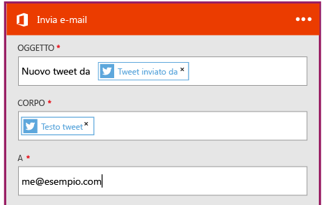

<properties
	pageTitle="Creare un'app per la logica | Microsoft Azure"
	description="Informazioni su come creare un'app per la logica che connette servizi SaaS"
	authors="jeffhollan"
	manager="dwrede"
	editor=""
	services="logic-apps"
	documentationCenter=""/>

<tags
	ms.service="logic-apps"
	ms.workload="na"
	ms.tgt_pltfrm="na"
	ms.devlang="na"
	ms.topic="get-started-article"
	ms.date="07/16/2016"
	ms.author="jehollan"/>

# Creare una nuova app per la logica che connette servizi SaaS

Questo argomento illustra come iniziare in pochi minuti a usare le [app per la logica di Azure](app-service-logic-what-are-logic-apps.md). Verrà descritto un semplice flusso di lavoro che consente di inviare i tweet di interesse al proprio indirizzo di posta elettronica.

Per usare questo scenario, sono necessari:

- Una sottoscrizione di Azure
- Un account Twitter
- Una cassetta postale ospitata in Office 365 oppure Outlook.com

## Creare una nuova app per la logica per inviare tramite posta elettronica i tweet

1. Nel [dashboard del portale di Azure](https://portal.azure.com) selezionare **Nuovo**.
2. Nella barra di ricerca cercare "app per la logica" e quindi selezionare **App per la logica**. È anche possibile selezionare **Nuovo**, **Web e dispositivi mobili** e quindi **App per la logica**.
3. Immettere un nome per l'app per la logica e selezionare una località, un gruppo di risorse e quindi **Crea**. Se si seleziona **Aggiungi al dashboard**, al termine della distribuzione l'app per la logica verrà aperta automaticamente.
4. Dopo aver aperto l'app per la logica per la prima volta, è possibile selezionare un modello come punto di partenza. Per ora fare clic su **Blank Logic App** (App per la logica vuota) per eseguire la creazione da zero.
1. Il primo elemento da creare è il trigger, ovvero l'evento che avvierà l'app per la logica. Cercare **twitter** nella casella di ricerca del trigger e selezionarlo.
7. Digitare ora un termine di ricerca da usare come trigger. **Frequenza** e **Intervallo** determineranno la frequenza con cui l'app per la logica verificherà la presenza di nuovi tweet, restituendo tutti i tweet di tale periodo di tempo. 

5. Selezionare il pulsante **Nuovo passaggio** e quindi scegliere **Aggiungi un'azione** o **Aggiungi una condizione**:
6. Selezionando **Aggiungi un'azione**, è possibile eseguire una ricerca nei [connettori disponibili](../connectors/apis-list.md) per scegliere un'azione. È ad esempio possibile selezionare **Outlook.com - Send Email** (Outlook.com - Invia messaggio di posta elettronica) per inviare un messaggio di posta elettronica da un indirizzo di Outlook.com: 

7. Ora è necessario inserire i parametri desiderati per il messaggio di posta elettronica: 

8. È infine possibile selezionare **Salva** per attivare l'app per la logica.

## Gestire l'app per la logica dopo la creazione

A questo punto l'app per la logica è operativa. L'app verificherà periodicamente la presenza di tweet con il termine di ricerca immesso. Quando troverà un tweet corrispondente, invierà un messaggio di posta elettronica. Infine, ecco come disabilitare l'applicazione e verificarne lo stato.

1. Accedere al [portale di Azure](https://portal.azure.com).

1. Fare clic su **Sfoglia** sul lato sinistro dello schermo e selezionare **App per la logica**.

2. Fare clic sulla nuova app per la logica appena creata per visualizzare informazioni generali e sullo stato corrente.

3. Per modificare la nuova app per la logica, fare clic su **Modifica**.

5. Per disattivare l'app, fare clic su **Disabilita** nella barra dei comandi.

1. Visualizzare le cronologie di esecuzione e trigger per monitorare quando l'app per la logica è in esecuzione. Per visualizzare i dati più recenti, fare clic su **Aggiorna**.

In meno di 5 minuti è stato possibile configurare una semplice app per la logica eseguita nel cloud. Per altre informazioni sull'uso delle funzionalità delle app per la logica, vedere [Usare le funzionalità delle app per la logica]. Per informazioni sulle definizioni stesse dell'app per la logica, vedere l'articolo relativo alla [creazione di definizioni di app per la logica](app-service-logic-author-definitions.md).

<!-- Shared links -->
[Azure portal]: https://portal.azure.com
[Usare le funzionalità delle app per la logica]: app-service-logic-create-a-logic-app.md

<!---HONumber=AcomDC_0803_2016-->