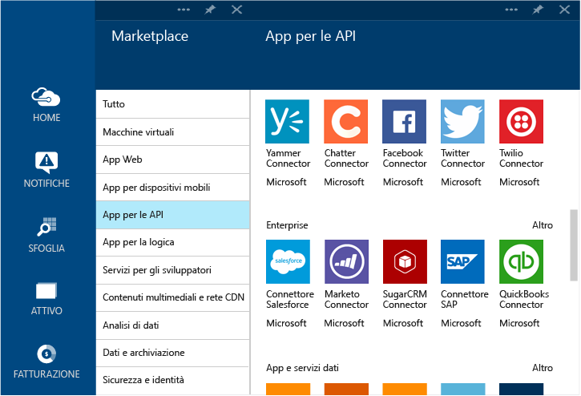

<properties 
	pageTitle="Cosa sono i connettori e le app per le API di BizTalk" 
	description="Informazioni sulle app per le API, sui connettori e sulle app per le API BizTalk" 
	services="app-service\logic" 
	documentationCenter="" 
	authors="MandiOhlinger" 
	manager="erikre" 
	editor=""/>

<tags 
	ms.service="app-service-logic" 
	ms.workload="integration" 
	ms.tgt_pltfrm="na" 
	ms.devlang="na" 
	ms.topic="get-started-article" 
	ms.date="04/20/2016" 
	ms.author="mandia"/>

# Cosa sono i connettori e le app per le API di BizTalk

[AZURE.INCLUDE [app-service-logic-version-message](../../includes/app-service-logic-version-message.md)]

I Servizi app di Azure sono creati in base a un principio di estendibilità e di connettività comune tramite le app per le API. Un *connettore* è un tipo di app per le API incentrato sulla connettività. I connettori, come qualsiasi altra app per le API, vengono usati dalle app Web, dalle app per dispositivi mobili e dalle app per la logica. I connettori facilitano la connessione ai servizi esistenti e aiutano a gestire l'autenticazione, a fornire il monitoraggio, l'analisi e molto altro.

Tutti gli sviluppatori possono creare le proprie app per le API e distribuirle privatamente. Successivamente, gli sviluppatori possono condividere le app per le API create, realizzando guadagni tramite il marketplace.

Per accelerare lo sviluppo di soluzioni con Azure App Service, il team di Azure ha aggiunto una serie di connettori al marketplace per soddisfare molti scenari comuni. Inoltre, per estendere la portata del servizio app a scenari di integrazione complessi e avanzati, sono disponibili anche numerose funzionalità Premium e BizTalk.

In Azure App Service sono previsti diversi "livelli" di servizio. Tutti i livelli includono tutti i connettori e le app per le API, nonché le relative funzionalità complete.

L'articolo relativo ai [prezzi del servizio app](https://azure.microsoft.com/pricing/details/app-service/) descrive questi livelli di servizio e ciò che è incluso in ognuno di essi. Le sezioni seguenti descrivono le diverse categorie di connettori e app per le API BizTalk.

## Connettori ibridi 
I connettori ibridi estendono ulteriormente la copertura dei Servizi app nell'organizzazione con connettività per [SAP](app-service-logic-connector-sap.md), [Oracle](app-service-logic-connector-oracle.md), [DB2](app-service-logic-connector-db2.md), [Informix](app-service-logic-connector-informix.md) e WebSphere MQ.

## Servizi EDI ed EAI
La creazione di app aziendali critiche richiede molto più della semplice connettività. Basandosi sulla creazione della piattaforma di integrazione leader del settore di Microsoft, BizTalk Server, le app per le API BizTalk offrono funzioni di integrazione avanzate che è possibile includere nelle app Web, mobili e per la logica senza alcuna difficoltà. Tra queste funzionalità di integrazione sono inclusi [convalida](app-service-logic-xml-validator.md), [estrazione](app-service-logic-xpath-extract.md), [trasformazione](app-service-logic-transform-xml-documents.md), [codificatori](app-service-logic-connector-jsonencoder.md), [gestione dei partner commerciali](app-service-logic-connector-tpm.md) e supporto per i formati EDI come [X12](app-service-logic-connector-x12.md), [EDIFACT](app-service-logic-connector-edifact.md) e [AS2](app-service-logic-connector-as2.md).

Risorse aggiuntive: [Connettori Business to Business e app per le API](app-service-logic-b2b-connectors.md) [Creare un processo B2B](app-service-logic-create-a-b2b-process.md) [Creare un accordo tra partner commerciali](app-service-logic-create-a-trading-partner-agreement.md) [Tenere traccia dei messaggi B2B](app-service-logic-track-b2b-messages.md)

## Regole
Le regole di business incapsulano i criteri e le decisioni che controllano i processi di business. In genere, le regole sono dinamiche e cambiano nel tempo per diversi motivi, inclusi piani aziendali, normative e numerosi altri motivi. Le [regole di BizTalk in Servizi app](app-service-logic-use-biztalk-rules.md) consentono di separare questi criteri dal codice dell'applicazione e rendere il processo di modifica più semplice e veloce.

## Elenco di connettori e app per le API
Per un elenco completo di connettori e app per le API inclusi in ogni categoria, tra cui connettori Standard, EAI BizTalk, connettori Premium e così via, vedere [Elenco di connettori e app per le API](app-service-logic-connectors-list.md).
 

<!---HONumber=AcomDC_0420_2016-->